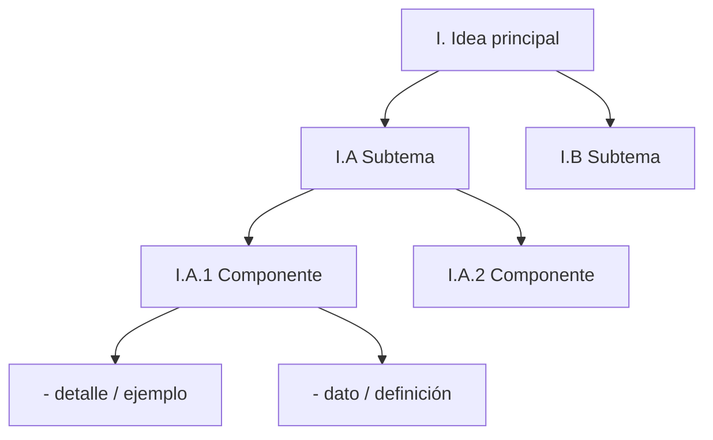
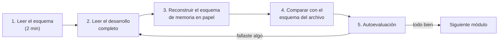
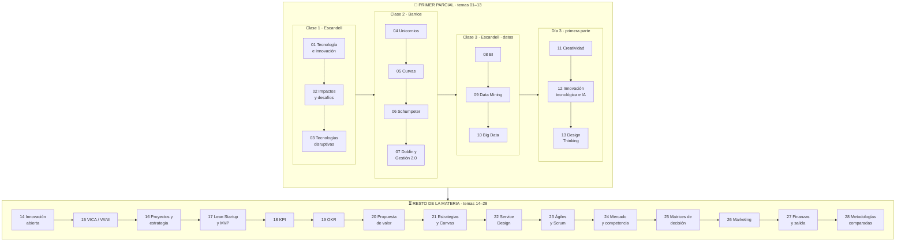

# 00 · Cómo estudiar con este material (The Outlining Method)

> **Para qué sirve este archivo:** antes de entrar a los temas, entendé cómo está construido cada módulo y cómo sacarle el máximo provecho. Son 10 minutos que te ahorran horas.

---

## 🗺️ Esquema de este archivo

- **I. Qué es el Outlining Method**
  - A. Idea central: la información se organiza en jerarquía
  - B. Niveles del esquema
  - C. Por qué funciona
- **II. Cómo está armado cada módulo del repo**
  - A. Bloques fijos de cada archivo
  - B. Convenciones visuales
- **III. Cómo estudiar un módulo (paso a paso)**
- **IV. Orden de los temas** (Primer Parcial / resto de la materia)

---

## I. Qué es el Outlining Method

### I.A Idea central

El *outlining method* (método del esquema) es una forma de tomar y estudiar apuntes que organiza el contenido **por jerarquía de importancia**: primero las ideas principales, debajo las ideas secundarias que las sostienen y, debajo de esas, los detalles, ejemplos y datos.

La clave no es "resumir": es **mostrar la relación** entre las ideas. Cuando ves que *"Big Data"* tiene como hijo a *"las 5 V"* y que *"Veracidad"* es una de ellas, ya no memorizás cinco palabras sueltas: entendés que son **cinco características de una misma cosa**.

### I.B Niveles del esquema

En este repo se usan siempre los mismos niveles:

| Nivel | Formato en el archivo | Qué contiene | Ejemplo |
|---|---|---|---|
| **I, II, III…** | `## I. Título` | Grandes ideas del tema | I. Big Data |
| **A, B, C…** | `### I.A Título` | Subtemas de la idea | I.A Las 5 V |
| **1, 2, 3…** | `#### I.A.1 Título` o lista numerada | Componentes del subtema | 1. Volumen |
| **viñetas** | `-` | Detalles, ejemplos, datos, definiciones | "Escala de exabytes" |

### I.C Por qué funciona

1. **Obliga a distinguir lo importante de lo accesorio.** Si algo está en el nivel I, es examen seguro.
2. **Da "ganchos" para la memoria.** Recordás la estructura y la estructura te trae los detalles.
3. **Sirve para escribir respuestas de parcial.** Una pregunta a desarrollar se responde recorriendo el esquema: definición → características → ejemplos → relación con otros temas.
4. **Permite estudiar en dos velocidades:** primero el esqueleto (vista de pájaro), después el desarrollo completo.

---

## II. Cómo está armado cada módulo del repo

### II.A Bloques fijos de cada archivo

Cada archivo `NN-tema.md` tiene siempre estos bloques, en este orden:

1. **Cabecera** – de qué presentación de clase sale el contenido, prerrequisitos y tiempo estimado.
2. **🎯 Objetivos de aprendizaje** – lo que tenés que poder hacer al terminar.
3. **🗺️ Esquema del tema** – el *outline* completo en forma de esqueleto. Es lo primero que leés y lo último que repasás.
4. **🧠 Mapa visual** – un diagrama (Mermaid o SVG) del tema.
5. **📖 Desarrollo** – el contenido completo, respetando exactamente la numeración del esquema (I, I.A, I.A.1…). Acá está la explicación de verdad: definiciones, por qué, ejemplos, casos.
6. **⚠️ Conceptos que se confunden** – trampas típicas de parcial.
7. **🔗 Conexiones** – con qué otros módulos se relaciona.
8. **✍️ Autoevaluación** – preguntas con la respuesta escondida (hacé clic para desplegarla). Intentá responder **antes** de abrirla.

### II.B Convenciones visuales

- > 📌 **Definición** — bloque con la definición tal como la da la cátedra. Sirve para **citarla**, pero nunca la dejes sola en una respuesta (ver 📝).
- > 📝 **Citar y explayarse** — párrafo modelo que **cita** la idea central de la cátedra y la **desarrolla** con palabras propias: qué significa, por qué importa y un ejemplo. Es el formato que pide el profesor: **no citar a secas, sino citar y explayarse**.
- > 💡 **Para entenderlo** — explicación intuitiva con palabras simples.
- > 🧩 **Ejemplo** — caso concreto.
- > ➕ **Contexto adicional** — información que **no está en las diapositivas** de la materia y que se agrega para entender mejor. Usala para comprender, pero en el parcial priorizá la versión de la cátedra.

- > 🔥 **Prioridad de parcial** — marcado como importante en clase (notas de cursada, `#importante`) o como "PONER EN PARCIAL" / resaltado en el apunte de cursada. El resumen de todas las marcas está en [Guía del Parcial 1](evaluacion/guia-del-parcial-1.md).
- **Negrita** = palabra clave que tiene que aparecer en tu respuesta.

---

## III. Cómo estudiar un módulo (paso a paso)

1. **Leé el esquema** sin detenerte en detalles: entendé qué partes tiene el tema.
2. **Leé el desarrollo** con calma. Cada vez que termines una sección de nivel I, pará y explicala en voz alta en 30 segundos.
3. **Cerrá el archivo y escribí el esquema de memoria** (solo niveles I, A y 1). Esto es lo que más fija.
4. **Compará** con el esquema real. Lo que te faltó es lo que no entendiste: volvé a esa sección.
5. **Hacé la autoevaluación.** Respondé por escrito, después desplegá la respuesta.

> 💡 **Tip de examen:** para una pregunta del tipo *"Defina X y explique sus características"*, usá la estructura del esquema: **definición (I) → características (I.A) → ejemplo (🧩) → relación con otro concepto (🔗)**. Es exactamente cómo está ordenado cada módulo. Y recordá la consigna del profesor: **no alcanza con citar**. Cada cita va seguida de qué significa, por qué importa y un ejemplo; los bloques 📝 de cada módulo te muestran cómo queda escrito.

---

## IV. Orden de los temas

Estudiá los temas **en orden** con el [índice](README.md). Los números siguen las clases. Del **01 al 13** es el **Primer Parcial**; del **14 en adelante** es el **resto de la materia**. Lo que es práctica (guía del parcial, parcial anterior resuelto, preguntas integradoras y casos) está aparte, en [evaluación](evaluacion/README.md).

---

[🏠 Índice](README.md) · [Empezar → 01 Tecnología e Innovación](parcial-1/01-tecnologia-e-innovacion-fundamentos.md)
