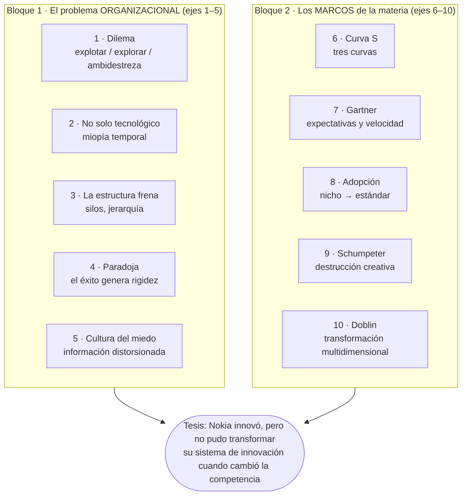
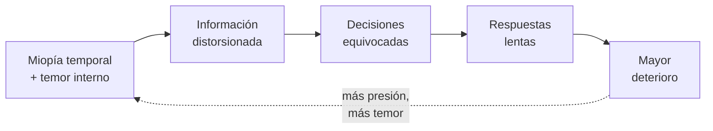
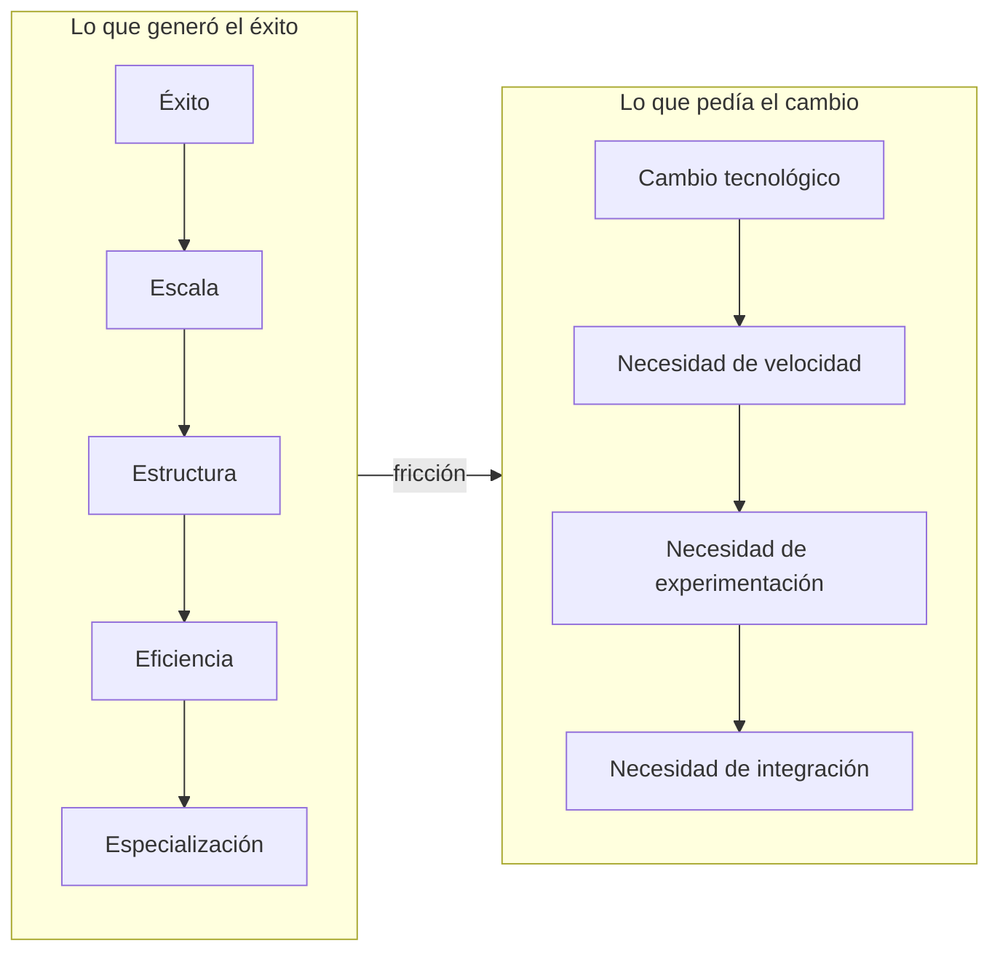
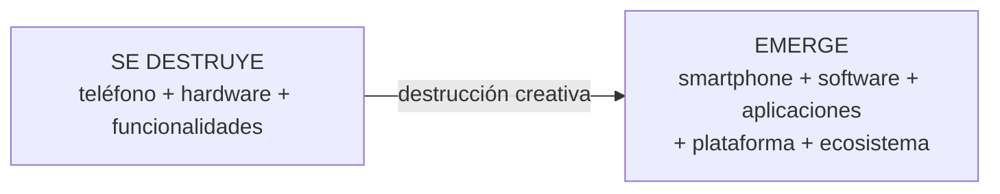

# Caso Nokia: los 10 ejes de la cátedra, resueltos

> **Fuente:** documento de la cátedra *"El dilema estratégico de Nokia – Preguntas"* (descargado el 2026-10-06, `TP/El dilema estratégico de Nokia Preguntas.docx`). El documento repite la introducción del caso y después lista **10 títulos sin desarrollo**. Esos 10 títulos son, uno por uno, las **secciones de la versión larga del caso** ([nokia-caso-catedra.md](casos/nokia-caso-catedra.md)). Que la cátedra los haya separado y llamado *"Preguntas"* es la **pista más fuerte** de lo que puede salir en la Parte B del parcial.
> **Cómo usarlo:** después del [parcial anterior resuelto](parcial-anterior-resuelto.md). Cada eje está escrito como **pregunta de examen** con respuesta modelo de **citar y explayarse**.
> **Tiempo estimado:** 90 min (leer + escribir de memoria 3 esqueletos).

---

## 🗺️ Esquema del tema

- **I. Qué es este documento y por qué importa**
- **II. Método para responder (C-E-C)**
- **III. Los 10 ejes**
  1. El dilema estratégico de Nokia
  2. El problema no era solamente tecnológico
  3. Cuando la estructura comienza a frenar la innovación
  4. La paradoja de Nokia
  5. La cultura del miedo
  6. Nokia y la curva S
  7. Nokia y Gartner
  8. Nokia y adopción tecnológica
  9. Nokia y Schumpeter
  10. Nokia y Doblin
- **IV. Lo que el documento no lista pero el caso sí trae** (Microsoft, resiliencia, la pregunta definitiva)
- **V. Tabla de esqueletos para memorizar**
- **VI. Conceptos que se confunden**

---

## 🧠 Mapa visual: los 10 ejes en dos bloques

---

## 📖 Desarrollo

## I. Qué es este documento y por qué importa

| Dato | Qué significa para el examen |
|---|---|
| Los 10 títulos coinciden **exactamente** con secciones de la versión larga del caso. | La cátedra ya tiene el desarrollo de cada uno: las respuestas se esperan **con las ideas y términos del caso largo**. |
| El parcial anterior usó un caso Nokia **corto** con 5 preguntas (curva S, Schumpeter, Gestión 2.0, opinión pública, MVP). | Si el caso se repite, es muy probable que cambie alguna pregunta por uno de estos ejes. Los ejes 6 y 9 ya salieron; **1–5, 7, 8 y 10 son los candidatos nuevos**. |
| Los ejes 1–5 no son "teoría de un módulo": son **gestión de la innovación aplicada**. | Se responden combinando **Gestión 2.0** (tema [07](../parcial-1/07-gestion-de-la-innovacion.md)), **problemas de innovar** (tema [12](../parcial-1/12-innovacion-tecnologica-e-ia.md)) y la evidencia del caso. |

> 💡 **Lectura de la pista:** el bloque 1 (ejes 1–5) es lo que **más cambia** respecto del parcial anterior. Si tenés poco tiempo, priorizá **1, 5 y 10** (las preguntas más "redondas") y repasá **6 y 9**, que ya tenés resueltas.

---

## II. Método para responder (C-E-C)

Igual que en el [parcial anterior](parcial-anterior-resuelto.md#iib-preguntas-de-caso-parte-b-c-e-c): **Concepto** (citado y explicado) → **Evidencia** (frases del caso) → **Conclusión** (qué explica / qué debió hacerse).

> 📝 **Plantilla:** *"Según la cátedra, [concepto] es [cita]. Esto significa que [explicación con tus palabras]. En el caso Nokia se ve cuando [evidencia]. Por lo tanto, [conclusión]."*

> ⚠️ **La frase que no tenés que escribir:** *"Nokia fracasó porque no innovó."* La cátedra lo dice explícitamente: es la conclusión que **no** quiere. La tesis correcta es: *"Nokia innovaba, pero tuvo dificultades para transformar su capacidad de innovación al ritmo que estaba cambiando el mercado."* Cerrá cualquier respuesta con esa idea.

---

## III. Los 10 ejes

### III.1 El dilema estratégico de Nokia

**Pregunta probable:** *¿Cuál era el dilema estratégico de Nokia en 2007–2008? Analice las alternativas y fundamente cuál habría elegido.*

**Lo que dice el caso:**
- Cuatro alternativas: **(1)** seguir mejorando Symbian; **(2)** desarrollar una nueva plataforma propia; **(3)** adoptar una plataforma externa; **(4)** desarrollar diferentes plataformas simultáneamente. *"Cada alternativa tenía ventajas y riesgos."*
- El problema: *"la empresa tenía un negocio enorme que todavía funcionaba"*. Abandonarlo rápido *"también implicaba enormes riesgos"*.
- El dilema clásico: 📌 *"¿Cómo abandonar parcialmente una tecnología que todavía genera dinero para invertir en otra cuyo éxito es incierto?"*
- La cátedra lo reduce a tres grandes caminos:

| Camino | Qué es | Ventaja | Problema |
|---|---|---|---|
| **Explotar** | Continuar mejorando el negocio actual. | Menor riesgo inmediato. | Aumenta la dependencia de una tecnología que pierde relevancia. |
| **Explorar** | Abandonar progresivamente el modelo actual y apostar por una nueva plataforma. | Permite posicionarse antes. | Alto riesgo e incertidumbre. |
| **Ambidestreza** | Mantener el negocio actual mientras se desarrolla agresivamente el negocio futuro. | Combina explotación y exploración. | Requiere recursos, liderazgo, estructura y capacidad para manejar conflictos. |

> 🔗 **Conexión con la clase preparcial (Barrios, "Uso de estrategia"):** el gráfico del **ciclo del producto/negocio** muestra las etapas *Concept Creation → Concept Development → Market Development → Business Optimization* y, en la madurez, una bifurcación: **Harvesting** (cosechar: la curva baja) o **Re-Inventing Business** (reinventar el negocio: arranca una curva nueva). El dilema de Nokia es exactamente esa bifurcación: **cosechar Symbian** (explotar) o **reinventarse** (explorar). Ver tema [21](../resto-de-la-materia/21-estrategias-oceano-azul-y-canvas.md).

> 📝 **Respuesta modelo:** El dilema de Nokia lo resume la propia cátedra en una pregunta: *"¿cómo abandonar parcialmente una tecnología que todavía genera dinero para invertir en otra cuyo éxito es incierto?"*. En 2007–2008 Nokia todavía era líder, Symbian tenía una enorme base instalada y sus teléfonos tradicionales seguían generando ingresos; pero el iPhone y Android estaban cambiando la lógica de competencia hacia el software y los ecosistemas. Tenía cuatro alternativas —seguir mejorando Symbian, crear una plataforma propia, adoptar una externa o desarrollar varias a la vez— que se pueden agrupar en tres caminos. **Explotar** (seguir mejorando lo actual) tenía el menor riesgo inmediato, pero aumentaba la dependencia de una tecnología que perdía relevancia. **Explorar** (abandonar progresivamente lo actual por una plataforma nueva) permitía posicionarse antes, pero con alto riesgo e incertidumbre. **La ambidestreza** (mantener el negocio actual mientras se desarrolla agresivamente el futuro) combinaba ambos, aunque exigía recursos, liderazgo, estructura y manejo de conflictos. Yo habría elegido la **ambidestreza**, por tres razones de la materia. Primero, la **curva S**: una tecnología madura todavía rinde, y ese ingreso es justamente lo que tiene que financiar el salto a la curva siguiente antes de que la saturación llegue a los resultados. Segundo, la **Gestión de la Innovación 2.0**: lo nuevo necesita una unidad interdisciplinaria y en red, protegida de las metas trimestrales, porque *"el corto plazo, los resultados inmediatos y la preponderancia de lo operativo sobre lo estratégico van en detrimento de la innovación"*. Tercero, el **MVP**: invertir por etapas, validando con usuarios reales, reduce el riesgo de explorar. Nokia, en los hechos, quedó del lado de explotar —relegó el software por *"no prioritario"*— y cuando cambió de rumbo (Windows Phone) iOS y Android ya ocupaban la nueva curva. Esa es la lección del dilema: no hace falta abandonar lo que funciona, pero tampoco se puede dejar de explorar mientras todavía funciona.

**🧠 Esqueleto:** cita del dilema · contexto 2007 (líder, base instalada, ingresos) · 4 alternativas → 3 caminos con ventaja/problema · elijo **ambidestreza** · 3 fundamentos (curva S, Gestión 2.0 con cita del corto plazo, MVP) · qué hizo Nokia (explotó, llegó tarde) · cierre.

> ⚠️ **Trampas:** (1) Decidí **con la información de 2007**, no con el diario del lunes: "debía abandonar Symbian ya" ignora que era rentable y tenía base instalada. (2) Si elegís "explorar", justificá cómo financiarlo; si elegís "explotar", explicá cómo evitar la dependencia. Cualquiera vale **si está fundamentada**, pero la ambidestreza es la que mejor dialoga con el caso. (3) No te olvides de las **desventajas** de la opción que elegís (recursos y conflictos internos).

---

### III.2 El problema no era solamente tecnológico

**Pregunta probable:** *"Nokia perdió porque Apple tenía un mejor teléfono." ¿Por qué esta explicación es insuficiente?*

**Lo que dice el caso:**
- *"Sería demasiado sencillo explicar el caso diciendo: 'Nokia perdió porque Apple tenía un mejor teléfono.'"*
- INSEAD (entrevistas con directivos) identificó **temporal myopia** (**miopía temporal**): *"una concentración excesiva en la innovación de corto plazo en detrimento de actividades de mayor beneficio futuro"*.
- Una **dinámica de temor**: los altos directivos temían a la competencia; los mandos medios temían a sus superiores; había resistencia a comunicar información negativa; la alta dirección recibía *"una imagen excesivamente optimista de las capacidades reales"*.
- La cadena: 📌 **Información distorsionada → decisiones equivocadas → respuestas lentas → mayor deterioro.**

> 📝 **Respuesta modelo:** Decir que Nokia perdió *"porque Apple tenía un mejor teléfono"* es, como advierte la cátedra, *"demasiado sencillo"*. El caso muestra que Nokia **tenía** la capacidad técnica —su propio equipo de software advertía las limitaciones de Symbian y existían prototipos táctiles—; lo que falló fue la forma en que la organización tomaba decisiones. Los estudios de INSEAD identificaron una **miopía temporal**: *"una concentración excesiva en la innovación de corto plazo en detrimento de actividades de mayor beneficio futuro"*, es decir, la empresa seguía innovando, pero en mejoras incrementales del negocio de hoy y no en lo que iba a definir el negocio de mañana. A eso se sumaba una **dinámica de temor**: la alta dirección temía a la competencia, los mandos medios temían a sus superiores y se resistían a comunicar malas noticias, así que arriba llegaba *"una imagen excesivamente optimista"* de las capacidades reales. El resultado es una cadena que se retroalimenta: **información distorsionada → decisiones equivocadas → respuestas lentas → mayor deterioro**. Esto conecta directamente con la Gestión de la Innovación 2.0: *"el corto plazo, los resultados inmediatos y la preponderancia de lo operativo sobre lo estratégico van en detrimento de la innovación"*, y si la dirección *"no brinda el ambiente favorable para la innovación, nunca podrá emerger"*. Por eso el problema de Nokia fue **de gestión, cultura y liderazgo**, no de falta de tecnología: una empresa puede tener los ingenieros y el presupuesto, y aun así no transformarse.

**🧠 Esqueleto:** cita "demasiado sencillo" · Nokia **tenía** la tecnología · **miopía temporal** (cita) · **dinámica de temor** (quién temía a quién) · cadena de 4 pasos · Gestión 2.0 (corto plazo + liderazgo) · conclusión: gestión, no tecnología.

> ⚠️ **Trampa:** miopía temporal **no** es "no innovar": es innovar **solo en el corto plazo**. Nokia seguía mejorando teléfonos; no invertía en lo que tenía *"mayor beneficio futuro"*.

---

### III.3 Cuando la estructura comienza a frenar la innovación

**Pregunta probable:** *¿Puede una estructura organizacional diseñada para administrar eficientemente un negocio maduro ser adecuada para enfrentar una disrupción tecnológica? Justifique con el caso.*

**Lo que dice el caso (versión larga):** con la escala aparecieron *"múltiples unidades; diferentes intereses; procesos; jerarquías; conflictos; competencia interna por recursos"*. INSEAD describe *"enfrentamiento interno y estancamiento estratégico que sucesivas reorganizaciones no lograron solucionar"*.

**Lo que dice el caso del parcial (versión corta):** *"El prolongado éxito transformó la agilidad de la empresa en una estructura corporativa burocrática y dividida en silos tradicionales"*: Hardware priorizaba costos y volumen; Software advertía que Symbian era *"lento, ineficiente e incapaz de soportar pantallas táctiles"*; la Alta Dirección, presionada por resultados trimestrales, relegó el software por *"no prioritario"*.

**Concepto de la materia (Gestión 2.0, tema [07](../parcial-1/07-gestion-de-la-innovacion.md)):**
- 📌 *"Los **modelos jerárquico-piramidales** son un **detractor/freno** de la innovación. La evolución a **modelos en 'Red'** operan y se adaptan a las dinámicas necesarias para innovar."*
- 📌 *"Los equipos poseen características **interdisciplinarias**. **No es realizar algo con varios sectores**, es la **capacidad de un diseño y trabajo colaborativo entre ellos**."*

| Lo que necesita un negocio maduro | Lo que necesita una disrupción |
|---|---|
| Eficiencia, control, especialización | Velocidad, experimentación, integración |
| Jerarquía y procesos estables | Red, equipos interdisciplinarios |
| Metas por área (costo, volumen) | Metas compartidas, aprendizaje |
| Evitar el error | Aceptar el error para aprender |

> 📝 **Respuesta modelo:** No, o al menos no sin cambios profundos. Una estructura pensada para administrar eficientemente un negocio maduro está optimizada para **controlar, especializar y reducir costos**; una disrupción exige lo contrario: **velocidad, experimentación e integración**. Nokia es el ejemplo: su crecimiento generó, como dice el caso, *"múltiples unidades; diferentes intereses; procesos; jerarquías; conflictos; competencia interna por recursos"*. En la práctica, Hardware perseguía la reducción de costos y el volumen, Software advertía que Symbian no soportaba pantallas táctiles y la Alta Dirección, presionada por los resultados trimestrales, consideró la modernización del software *"no prioritaria"*. Cada área defendía sus metas y nadie era dueño del problema común, y por eso, según INSEAD, hubo *"enfrentamiento interno y estancamiento estratégico que sucesivas reorganizaciones no lograron solucionar"*. La Gestión de la Innovación 2.0 explica por qué: *"los modelos jerárquico-piramidales son un detractor/freno de la innovación"* y hay que evolucionar hacia *"modelos en Red"*. Además, la interdisciplina *"no es realizar algo con varios sectores, es la capacidad de un diseño y trabajo colaborativo entre ellos"*: reorganizar o sentar a los jefes en una mesa no alcanza si cada uno sigue midiéndose por sus propias metas. Lo que hacía falta era un **equipo interdisciplinario** (hardware + software + negocio) con un **objetivo compartido** —por ejemplo, lanzar un teléfono táctil competitivo— y con autonomía respecto de la lógica trimestral. La conclusión del caso es que la estructura que produjo el éxito se convirtió en un freno cuando cambió la naturaleza de la competencia.

**🧠 Esqueleto:** No → maduro = eficiencia / disrupción = velocidad · lista del caso (unidades, intereses, jerarquías, conflictos) · los 3 bandos · cita INSEAD (reorganizaciones no alcanzaron) · Gestión 2.0: jerárquico = freno, red · interdisciplina (cita) · propuesta: equipo con objetivo común · cierre.

> ⚠️ **Trampa:** reorganizar ≠ cambiar la estructura. Nokia **reorganizó varias veces** y no funcionó, porque cambió el organigrama pero no la lógica (metas por silo, jerarquía, miedo).

---

### III.4 La paradoja de Nokia

**Pregunta probable:** *Explique la "paradoja de Nokia": ¿cómo puede el éxito convertirse en una barrera para innovar?*

**Lo que dice el caso:**
- *"Nokia no era una empresa que no innovaba. Por el contrario: Nokia había sido extraordinariamente innovadora."*
- *"Muchas de las capacidades que habían producido su éxito comenzaron a dificultar la adaptación."*

> 📝 **Respuesta modelo:** La paradoja de Nokia es que **las mismas capacidades que la llevaron al éxito terminaron dificultando su adaptación**. La cátedra lo aclara: Nokia *"no era una empresa que no innovaba"*; al contrario, *"había sido extraordinariamente innovadora"*: fue líder mundial con cerca del 40 % del mercado y fabricó el teléfono más vendido de la historia, el Nokia 1100. Ese éxito siguió una lógica: **éxito → escala → estructura → eficiencia → especialización**. Para producir cientos de millones de teléfonos baratos y durables, Nokia se volvió experta en hardware, manufactura y costos, y organizó todo alrededor de eso. Pero el cambio tecnológico pedía otra lógica: **velocidad, experimentación e integración** entre hardware, software y servicios. Lo que antes era una fortaleza (especialización en hardware, procesos eficientes, una plataforma propia como Symbian) empezó a generar fricción con lo nuevo. Por eso INSEAD estudia el caso para mostrar *"cómo una empresa exitosa puede ser perjudicada por las mismas decisiones que anteriormente la llevaron al éxito"*: las empresas líderes no necesariamente caen por ser complacientes o estar mal gestionadas, sino porque *"continúan profundizando el camino que originalmente las llevó al éxito"*. Esto se conecta con la **curva S**: cuanto mejor le va a una empresa en una curva, más incentivos tiene para seguir optimizándola, justo cuando debería empezar a invertir en la siguiente. La lección es que *"el éxito puede generar las condiciones organizacionales que posteriormente dificultan el cambio"*.

**🧠 Esqueleto:** definición de la paradoja · Nokia **sí** innovaba (40 %, Nokia 1100) · cadena del éxito (5 pasos) · cadena del cambio (velocidad, experimentación, integración) · fortaleza → fricción · cita INSEAD · conexión curva S · cita "el éxito puede generar…".

> 🧩 **Mismo patrón en Kodak:** *"Kodak había desarrollado y patentado componentes de la fotografía digital"*, pero su éxito estaba en el rollo y el revelado. Saber que la tecnología existe no alcanza: la pregunta de fondo del caso es *"¿Por qué una empresa puede saber que una tecnología nueva existe y aun así no lograr transformarse?"*.

---

### III.5 La cultura del miedo

**Pregunta probable:** *¿Qué papel jugó la cultura organizacional en la crisis de Nokia? ¿Qué dice esto sobre los factores de los que depende la innovación?*

**Lo que dice el caso:**
- Estudios de **Huy y Vuori**: *"el clima emocional de Nokia podía obstaculizar la coordinación"*.
- Los altos ejecutivos temían perder frente a los competidores; los mandos medios temían las consecuencias de comunicar malas noticias.
- Consecuencia: 📌 *"La información crítica no siempre llegaba adecuadamente a quienes debían tomar decisiones."*
- La innovación no depende solo de *"presupuesto; ingenieros; tecnología; laboratorios"*, sino de la capacidad de la organización para 📌 *"Escuchar, comunicar, cuestionar y aprender."*

**Conceptos de la materia:**
- Gestión 2.0 (tema [07](../parcial-1/07-gestion-de-la-innovacion.md)): 📌 *"**Está bien fracasar.** No hay posibilidad de lograr innovar si no se posee capacidad de aceptar los fracasos y mejorar sobre ellos. Iterar y resiliencia."*
- Problemas de innovar (tema [12](../parcial-1/12-innovacion-tecnologica-e-ia.md)): n.º 5 **falta de cultura innovadora** → empresas rígidas, **miedo al error**.
- **Cultura Fail** (clase preparcial, Barrios, tema [22](../resto-de-la-materia/22-service-design-y-cultura-fail.md)): (1) quitar la idea del fracaso como algo negativo; (2) no premiar **solamente** el éxito; (3) promover la toma de riesgos; (4) asegurar un contexto seguro para experimentar; (5) desarrollar la intuición y la habilidad; (6) compartir las experiencias fallidas con el resto de la organización.

> 📝 **Respuesta modelo:** La cultura fue una de las causas centrales de la crisis. Los estudios de Huy y Vuori citados en el caso muestran que *"el clima emocional de Nokia podía obstaculizar la coordinación"*: los altos ejecutivos temían perder frente a la competencia y los mandos medios temían las consecuencias de comunicar malas noticias. En ese clima, nadie quería ser el que dijera que Symbian no daba más o que los plazos no se iban a cumplir, y entonces *"la información crítica no siempre llegaba adecuadamente a quienes debían tomar decisiones"*. La dirección decidía con una imagen demasiado optimista, las decisiones eran equivocadas o tardías y la situación empeoraba, lo que generaba todavía más miedo. Esto demuestra, como plantea la cátedra, que la innovación no depende únicamente de *"presupuesto, ingenieros, tecnología, laboratorios"* —Nokia tenía todo eso— sino de la capacidad de una organización para *"escuchar, comunicar, cuestionar y aprender"*. La Gestión de la Innovación 2.0 lo plantea como pilar: *"está bien fracasar"*, porque *"no hay posibilidad de lograr innovar si no se posee capacidad de aceptar los fracasos y mejorar sobre ellos"*. Una cultura del miedo hace exactamente lo contrario: castiga el error y la mala noticia, y por eso esconde los problemas hasta que ya es tarde. Lo que Nokia necesitaba era una **cultura "fail"**: quitar la idea del fracaso como algo negativo, no premiar solamente el éxito, asegurar un contexto seguro para experimentar y compartir las experiencias fallidas con toda la organización. Es decir: que una mala noticia temprana valga más que una buena noticia falsa.

**🧠 Esqueleto:** Huy y Vuori (clima emocional) · quién temía qué · cita "la información crítica no llegaba" · círculo vicioso · cita "presupuesto, ingenieros…" vs. *"escuchar, comunicar, cuestionar y aprender"* · Gestión 2.0 "está bien fracasar" · Cultura Fail (2–3 puntos) · frase de cierre.

> ⚠️ **Trampa:** el miedo de Nokia **no** era "miedo a innovar": era miedo **a comunicar** (hacia arriba) y miedo **a la competencia** (arriba). El daño está en la **información**, no en la falta de ideas.

---

### III.6 Nokia y la curva S

**Pregunta probable:** *Analice el caso con la curva S. ¿En qué momento debería una empresa comenzar a invertir seriamente en la próxima curva?*

**Ya resuelta en detalle:** [parcial anterior, V.6](parcial-anterior-resuelto.md#v6-la-curva-s-por-qué-cuidar-solo-la-tecnología-que-deja-plata-hoy-sentenció-a-nokia). Lo que agrega este eje es la versión de **tres curvas** y la pregunta final.

| Curva | Tecnología / modelo | Quién domina |
|---|---|---|
| **1** | Teléfono móvil tradicional | **Nokia domina.** |
| **2** | Smartphone | **Apple / Android aceleran.** |
| **3** | Plataformas y ecosistemas | **El valor se desplaza del dispositivo al ecosistema.** |

> 📝 **Respuesta modelo (versión corta, para cuando la pregunta es la de la cátedra):** Las curvas de Christensen *"explican cómo las tecnologías evolucionan y cómo nuevas innovaciones pueden desplazar a las tecnologías existentes"*: cada tecnología tiene un despegue lento, un crecimiento acelerado y una saturación, y *"una nueva tecnología emerge antes de que la anterior se vuelva completamente obsoleta"*. En Nokia se ven tres curvas: el **teléfono móvil tradicional**, donde Nokia dominaba; el **smartphone**, donde Apple y Android aceleraban; y las **plataformas y ecosistemas**, donde el valor se desplaza del dispositivo a las aplicaciones, desarrolladores y servicios. El problema de Nokia fue que *"continuó obteniendo resultados de una tecnología y modelo de negocio que se acercaban a una nueva etapa competitiva mientras otra curva comenzaba a crecer"*: como la curva 1 seguía dando ingresos, no se percibió la urgencia. A la pregunta de la cátedra —*"¿En qué momento debería una empresa comenzar a invertir seriamente en la próxima curva?"*— la respuesta es: **cuando la curva actual todavía es rentable y muestra signos de saturación** (mejoras cada vez más chicas, como Symbian, *"lento, ineficiente e incapaz de soportar pantallas táctiles"*), no cuando la caída ya aparece en las ventas. Las ventas van detrás del desempeño: si se espera a verlas caer, la nueva curva ya tiene dueño. Y hay un agravante: Nokia no solo tenía que saltar de la curva 1 a la 2, sino entender que la competencia iba a pasar a la curva 3, de **ecosistema contra ecosistema**, donde un buen teléfono no alcanzaba sin aplicaciones ni desarrolladores.

**🧠 Esqueleto:** cita Christensen + 3 fases + "emerge antes" · 3 curvas con quién domina · cita "continuó obteniendo resultados…" · respuesta a la pregunta: invertir **mientras la vieja todavía rinde** y aparecen señales de saturación · ventas van detrás · curva 3 = ecosistemas.

---

### III.7 Nokia y Gartner

**Pregunta probable:** *Utilice el ciclo de expectativas de Gartner para analizar la aparición del smartphone desde la perspectiva de Nokia.*

**Lo que dice el caso:** la aparición del smartphone *"generó enormes expectativas"*, pero la pregunta para Nokia no era solo *"¿El smartphone funcionará?"* sino 📌 *"¿Qué velocidad de adopción tendrá y qué tan rápido cambiará las reglas de competencia?"*. Y: *"Una empresa dominante puede cometer un error al subestimar una tecnología emergente porque su mercado actual continúa siendo rentable."*

**Concepto (tema [05](../parcial-1/05-curvas-de-la-tecnologia.md)):** 📌 *"El Ciclo de Expectativas Tecnológicas de Gartner es un modelo que describe la evolución de una nueva tecnología desde su introducción hasta su adopción masiva."* Eje vertical = **expectativas** (no desempeño). Cinco fases: detonante de innovación → pico de expectativas infladas → abismo de desilusión → pendiente de iluminación → meseta de productividad.

| Fase | El smartphone visto por Nokia |
|---|---|
| Detonante | 2007: aparece el iPhone. |
| Pico | Enorme entusiasmo mediático. Riesgo para Nokia: descartarlo como "moda". |
| Abismo | Críticas: batería, fragilidad, precio, sin teclado. Riesgo: leerlas como fracaso definitivo. |
| Pendiente | Llegan Android, la tienda de apps, mejores generaciones. |
| Meseta | El smartphone se vuelve el estándar. Nokia ya llega tarde. |

> 📝 **Respuesta modelo:** El ciclo de Gartner *"describe la evolución de una nueva tecnología desde su introducción hasta su adopción masiva"*, pero lo que mide en el eje vertical son las **expectativas**, no el rendimiento real: tras el detonante, las expectativas suben a un pico inflado, caen a un abismo de desilusión cuando la tecnología no cumple tan rápido lo prometido, y después suben más moderadamente hasta una meseta de productividad. El smartphone siguió ese patrón: el iPhone *"generó enormes expectativas"* y enseguida aparecieron las críticas por su batería, su fragilidad, su precio y la falta de teclado. El riesgo para Nokia era doble: tomar el entusiasmo inicial como una moda pasajera y, después, tomar las críticas como prueba de que la tecnología fracasaría. Las dos lecturas confunden **expectativas** con **valor real**. Por eso la cátedra dice que la pregunta estratégica no era *"¿el smartphone funcionará?"* sino *"¿qué velocidad de adopción tendrá y qué tan rápido cambiará las reglas de competencia?"*. Nokia cometió el error que el caso describe: *"una empresa dominante puede cometer un error al subestimar una tecnología emergente porque su mercado actual continúa siendo rentable"*. Mientras sus ventas tradicionales seguían altas, el smartphone atravesaba el abismo y llegaba a la meseta, y cuando se convirtió en el estándar, Nokia no tenía una plataforma competitiva. La conclusión es que el Gartner no se usa para predecir si una tecnología "va a andar", sino para no sobrerreaccionar al pico ni al abismo y evaluar con evidencia de uso (por ejemplo, con un MVP).

**🧠 Esqueleto:** cita Gartner · eje = **expectativas** · 5 fases · smartphone en cada fase · doble riesgo (moda / críticas) · cita de la pregunta estratégica · cita "una empresa dominante…" · cierre: no sobrerreaccionar, evaluar con evidencia.

> ⚠️ **Trampa:** no confundas el **abismo de desilusión** (Gartner: caen las expectativas) con el **abismo entre early adopters y mayoría temprana** (curva de adopción). Son dos "abismos" distintos.

---

### III.8 Nokia y adopción tecnológica

**Pregunta probable:** *Analice el caso con la curva de adopción tecnológica. ¿Qué momento tenía que detectar Nokia?*

**Lo que dice el caso:** los primeros usuarios están dispuestos a experimentar con *"pantallas táctiles; navegación web; aplicaciones; nuevos sistemas operativos"*; después esas funciones pasan a segmentos más amplios. 📌 *"El desafío aparece cuando una tecnología deja de ser una innovación de nicho y comienza a convertirse en el nuevo estándar del mercado. Nokia tenía que detectar ese momento."*

**Concepto (tema [05](../parcial-1/05-curvas-de-la-tecnologia.md)):** cinco segmentos: **innovadores 2,5 %**, **adoptadores tempranos 13,5 %**, **mayoría temprana 34 %**, **mayoría tardía 34 %**, **rezagados 16 %**. A los primeros les preocupa **la tecnología y el rendimiento**; a las mayorías, **la comodidad, la experiencia de uso y la calidad**.

> 📝 **Respuesta modelo:** La curva de adopción *"explica cómo diferentes grupos adoptan una nueva tecnología con el tiempo"* en cinco segmentos: innovadores (2,5 %), adoptadores tempranos (13,5 %), mayoría temprana (34 %), mayoría tardía (34 %) y rezagados (16 %). En el smartphone, los **innovadores y adoptadores tempranos** fueron los primeros en aceptar *"pantallas táctiles, navegación web, aplicaciones, nuevos sistemas operativos"*, aunque la batería durara poco o el equipo fuera caro: a ellos les importan la tecnología y el rendimiento. El punto crítico, dice la cátedra, es *"cuando una tecnología deja de ser una innovación de nicho y comienza a convertirse en el nuevo estándar del mercado"*, es decir, el paso hacia la **mayoría temprana**, que adopta cuando ve que algo funciona y que otros lo usan, y que valora la comodidad y la experiencia de uso. Ese era el momento que *"Nokia tenía que detectar"*. El problema es que Nokia miraba a su base masiva —clientes de mayoría tardía y rezagados, fieles al teclado y a la durabilidad— y desde ahí el smartphone parecía un producto de nicho. Cuando la mayoría temprana se sumó, el smartphone pasó a ser el estándar y el criterio de compra cambió de "batería y resistencia" a "apps y experiencia": los atributos en los que Nokia era la mejor dejaron de ser los decisivos. La conclusión es que una empresa líder tiene que **observar a los early adopters**, no solo a sus clientes actuales, porque anticipan hacia dónde va la mayoría.

**🧠 Esqueleto:** cita + 5 segmentos con % · early adopters del smartphone (lista del caso) · qué les importa a unos y otros · cita "deja de ser nicho…" · Nokia miraba a su base (tardía/rezagados) · cambio del criterio de compra · conclusión: observar early adopters.

---

### III.9 Nokia y Schumpeter

**Pregunta probable:** *Explique la transformación del teléfono móvil como un proceso de destrucción creativa.*

**Ya resuelta con la pregunta del competidor disruptivo:** [parcial anterior, V.7](parcial-anterior-resuelto.md#v7-el-competidor-disruptivo-por-qué-lo-inferior-se-vuelve-destrucción-creativa). Lo propio de este eje es la fórmula de la cátedra:

> 📝 **Respuesta modelo:** Schumpeter define la destrucción creativa como *"el proceso de transformación que acompaña a la innovación"*, y la innovación como *"la introducción de una nueva función de producción"*: una nueva forma de combinar recursos que, al imponerse, **crea** valor nuevo y al mismo tiempo **destruye** las formas anteriores. La transformación del teléfono móvil es un caso claro. La cátedra lo resume así: se destruye progresivamente una forma de competir —**teléfono + hardware + funcionalidades**— y emerge otra —**smartphone + software + aplicaciones + plataforma + ecosistema**—. Y agrega lo más importante: *"No desaparece solamente un producto. Cambia la estructura completa de la industria."* Lo que se destruyó no fue solo el teléfono con teclado, sino la ventaja de Nokia basada en manufactura, escala y durabilidad; lo que se creó fue una economía de aplicaciones, desarrolladores y tiendas digitales. En términos de los cinco casos de Schumpeter, hubo un **nuevo bien** (el smartphone) pero, sobre todo, una **nueva organización de la industria**: la competencia pasó de *"fabricante vs. fabricante"* a *"ecosistema vs. ecosistema"*. Además se cumple la idea de que los emprendedores *"aparecen en grupos"*, porque *"la aparición de uno o unos pocos emprendedores facilita la aparición de otros"*: después de Apple vinieron Android, los fabricantes que lo adoptaron y miles de desarrolladores de apps, en oleada. La conclusión para Nokia es que no podía defenderse mejorando su teléfono, porque la destrucción creativa no cambia el producto ganador dentro de las reglas: cambia las reglas.

**🧠 Esqueleto:** 2 citas de Schumpeter · fórmula se destruye / emerge · cita "no desaparece solamente un producto" · qué se destruyó (ventaja de Nokia) y qué se creó (economía de apps) · tipos: nuevo bien + **nueva organización de la industria** · emprendedores en grupos · cierre: cambia las reglas.

---

### III.10 Nokia y Doblin

**Pregunta probable:** *Utilizando el modelo de los 10 tipos de innovación de Doblin, explique por qué el problema de Nokia no era solamente de hardware.*

**Lo que dice el caso:** la transformación afectaba a **producto** (nuevo tipo de dispositivo), **proceso** (nuevas formas de desarrollo de software), **servicio** (nuevos servicios digitales), **modelo de negocio** (nuevas formas de monetización), **ecosistema** (relaciones con desarrolladores y socios) y **experiencia** (nueva interacción entre usuario y dispositivo). 📌 *"Por eso, el problema de Nokia puede analizarse como una **transformación multidimensional**, no solamente como una cuestión de hardware."*

**Concepto (tema [07](../parcial-1/07-gestion-de-la-innovacion.md)):** 10 tipos en 3 categorías: **Configuración** (modelo de ingresos, red, estructura, procesos), **Oferta** (performance del producto, sistema de producto) y **Experiencia** (servicio, canal, marca, relación con el cliente).

| Dimensión del caso | Tipo de Doblin | Categoría | Qué cambió (Apple / Android) | Qué hacía Nokia |
|---|---|---|---|---|
| Modelo de negocio | **Modelo de ingresos** | Configuración | Comisión por apps y contenidos. | Ganaba por unidad vendida. |
| Ecosistema | **Red** | Configuración | Miles de desarrolladores y socios. | Plataforma cerrada, pocos desarrolladores. |
| (Estructura interna) | **Estructura** | Configuración | — | Silos (hardware vs. software). |
| Proceso | **Procesos** | Configuración | Desarrollo de software rápido e iterativo. | Procesos de manufactura y costos. |
| Producto | **Performance del producto** | Oferta | Pantalla multitáctil. | Teclado, batería, durabilidad. |
| Producto + ecosistema | **Sistema de producto** | Oferta | Teléfono + tienda + servicios. | Teléfono aislado. |
| Servicio | **Servicio** | Experiencia | Servicios digitales. | — |
| Experiencia | **Relación con el cliente** (y **marca**) | Experiencia | Nueva interacción usuario–dispositivo. | Experiencia "de teléfono". |

> 📝 **Respuesta modelo:** El modelo de Doblin muestra que se puede innovar en diez áreas agrupadas en tres categorías: **Configuración** (modelo de ingresos, red, estructura y procesos: lo interno y más alejado del cliente), **Oferta** (performance y sistema de producto: el producto principal) y **Experiencia** (servicio, canal, marca y relación con el cliente: lo más visible para el usuario). Desmiente la falsa creencia de que innovar es solo lanzar un producto nuevo o mejorar su tecnología. El caso Nokia es un buen ejemplo, porque, como dice la cátedra, su problema debe analizarse *"como una transformación multidimensional, no solamente como una cuestión de hardware"*. El cambio afectó al **producto** (un nuevo tipo de dispositivo táctil: performance), al **proceso** (nuevas formas de desarrollar software), al **servicio** (servicios digitales), al **modelo de negocio** (nuevas formas de monetizar, como la comisión por aplicaciones: modelo de ingresos), al **ecosistema** (relaciones con desarrolladores y socios: red y sistema de producto) y a la **experiencia** (una nueva interacción entre usuario y dispositivo: relación con el cliente). Nokia innovaba casi exclusivamente en la **Oferta**, mejorando performance del producto: durabilidad, batería, costo de fabricación. Apple y Google, en cambio, combinaron varios tipos a la vez: el iPhone no ganó por ser "un mejor teléfono" sino por ser un **sistema de producto** (teléfono + tienda + servicios) con un **modelo de ingresos** nuevo y una **red** de desarrolladores que lo hacía más valioso con cada app. Combinar varios tipos de innovación es mucho más difícil de copiar que una mejora de producto. Por eso Nokia no podía responder solo con mejor hardware: necesitaba innovar en Configuración y en Experiencia, y su estructura en silos (otro tipo de Doblin, **estructura**) se lo impedía.

**🧠 Esqueleto:** 3 categorías con sus tipos · falsa creencia · cita "transformación multidimensional" · las 6 dimensiones del caso → tipo de Doblin · Nokia solo en Oferta · Apple combinó (sistema de producto + modelo de ingresos + red) · difícil de copiar · estructura como freno.

> ⚠️ **Trampa:** "ecosistema" **no** es un tipo de Doblin: es la palabra del caso. Traducilo a **red** (desarrolladores y socios) y **sistema de producto** (productos y servicios que funcionan juntos).

---

## IV. Lo que el documento no lista pero el caso sí trae

| Sección del caso | Idea clave | Para qué pregunta sirve |
|---|---|---|
| **La decisión de Microsoft** | Nokia adoptó **Windows Phone**; el cambio llegó cuando iOS y Android ya tenían posición; vendió la división móvil a Microsoft en **2013**. | Evidencia de "llegar tarde" (ejes 1, 6). |
| **Resiliencia organizacional** | Desde 2013, transformación hacia **redes e infraestructura**. *"Una organización puede perder un negocio central y, aun así, utilizar sus capacidades restantes para construir una nueva posición competitiva."* Caso en dos partes: cómo pierde la posición y cómo se reinventa. | Cierre de cualquier respuesta; pregunta sobre fracaso (Gestión 2.0: *"iterar y resiliencia"*). |
| **La pregunta estratégica definitiva** | *"¿Por qué deberíamos poner en riesgo un negocio que funciona para apostar por un modelo cuyo éxito todavía no está demostrado?"* | Eje 1 (dilema). |
| **¿Qué haría usted?** | *"Si usted hubiera sido director de Nokia en 2007, ¿qué decisión habría tomado con la información disponible en ese momento?"* | Eje 1; ver también [parcial anterior, VI.1](parcial-anterior-resuelto.md#vi-si-cambian-las-preguntas-variantes-con-el-mismo-caso). |
| **El gran aprendizaje** | *"Nokia innovó, pero tuvo dificultades para transformar su sistema de innovación cuando cambió la naturaleza de la competencia."* *"El éxito puede generar las condiciones organizacionales que posteriormente dificultan el cambio."* | Frase de cierre para **todas**. |

---

## V. Tabla de esqueletos para memorizar

| Eje | Concepto + cita | Evidencia clave del caso | Conclusión |
|---|---|---|---|
| 1 Dilema | *"¿Cómo abandonar parcialmente una tecnología que todavía genera dinero…?"* | 4 alternativas; negocio enorme que funcionaba. | **Ambidestreza** + curva S + Gestión 2.0 + MVP. |
| 2 No solo tecnológico | **Miopía temporal** (cita). | Temor en todos los niveles; imagen optimista arriba. | Información distorsionada → decisiones equivocadas → respuestas lentas → deterioro. |
| 3 Estructura | *"Jerárquico-piramidales son freno… modelos en Red."* | Unidades, intereses, jerarquías, competencia por recursos; silos HW/SW/Dirección. | Maduro ≠ disruptivo; equipo interdisciplinario con objetivo común. |
| 4 Paradoja | *"Había sido extraordinariamente innovadora."* | Éxito → escala → estructura → eficiencia → especialización. | El éxito genera las condiciones que dificultan el cambio. |
| 5 Miedo | *"Escuchar, comunicar, cuestionar y aprender."* | Huy y Vuori; malas noticias no suben. | "Está bien fracasar" + Cultura Fail. |
| 6 Curva S | Christensen + *"emerge antes de que la anterior…"* | 3 curvas: tradicional → smartphone → ecosistemas. | Invertir mientras la vieja todavía rinde. |
| 7 Gartner | Eje = **expectativas**. | *"¿Qué velocidad de adopción tendrá…?"* | No sobrerreaccionar al pico ni al abismo. |
| 8 Adopción | 5 segmentos con %. | *"Deja de ser nicho… nuevo estándar."* | Mirar a los early adopters, no solo a la base. |
| 9 Schumpeter | *"Proceso de transformación que acompaña a la innovación."* | Teléfono + hardware → smartphone + software + apps + plataforma + ecosistema. | Cambia la estructura de la industria, no solo el producto. |
| 10 Doblin | 3 categorías / 10 tipos. | 6 dimensiones del caso. | Transformación **multidimensional**; Nokia solo en Oferta. |

---

## VI. ⚠️ Conceptos que se confunden

| Concepto | Se confunde con | Diferencia |
|---|---|---|
| Miopía temporal | No innovar | Es innovar **solo en el corto plazo**, descuidando lo de mayor beneficio futuro. |
| Reorganizar | Cambiar la estructura | Nokia reorganizó varias veces; no cambió la lógica jerárquica ni las metas por silo. |
| Cultura del miedo | Miedo a innovar | Es miedo a **comunicar malas noticias** (mandos medios) y a la competencia (dirección). |
| Explorar | Ambidestreza | Explorar = **abandonar progresivamente** lo actual. Ambidestreza = **mantener** lo actual **y** desarrollar lo futuro a la vez. |
| Ecosistema | Un tipo de Doblin | Se traduce a **red** + **sistema de producto**. |
| Abismo de Gartner | Abismo de la curva de adopción | Gartner: caen las **expectativas**. Adopción: salto entre **early adopters y mayoría temprana**. |
| Resiliencia | "Final feliz" | Usar las **capacidades restantes** para construir una nueva posición (Nokia → redes). |

---

## 🔗 Conexiones

- **← [Parcial anterior resuelto](parcial-anterior-resuelto.md):** preguntas 6–10 sobre el mismo caso.
- **← [Caso Nokia de la cátedra](casos/nokia-caso-catedra.md):** el texto completo de cada eje.
- **Temas:** [05 Curvas](../parcial-1/05-curvas-de-la-tecnologia.md) · [06 Schumpeter](../parcial-1/06-schumpeter-destruccion-creativa-y-ciclos.md) · [07 Gestión de la innovación](../parcial-1/07-gestion-de-la-innovacion.md) · [12 Innovación tecnológica (problemas de innovar)](../parcial-1/12-innovacion-tecnologica-e-ia.md) · [21 Estrategias](../resto-de-la-materia/21-estrategias-oceano-azul-y-canvas.md) · [22 Cultura Fail](../resto-de-la-materia/22-service-design-y-cultura-fail.md).
- **→ [Simulacros del Parcial 1](simulacros-parcial-1.md).**

---

## ✍️ Autoevaluación

**1. ¿Cuáles son las cuatro alternativas que tenía Nokia y cómo se agrupan en tres caminos?**

Ver respuesta

Seguir mejorando Symbian; desarrollar una nueva plataforma propia; adoptar una plataforma externa; desarrollar diferentes plataformas simultáneamente. Se agrupan en **explotar** (seguir mejorando lo actual), **explorar** (abandonar progresivamente lo actual por una nueva plataforma) y **ambidestreza** (mantener lo actual y desarrollar agresivamente lo futuro).

**2. ¿Qué es la miopía temporal?**

Ver respuesta

*"Una concentración excesiva en la innovación de corto plazo en detrimento de actividades de mayor beneficio futuro"* (INSEAD). Nokia seguía innovando, pero en lo incremental de hoy.

**3. Completá la cadena: información distorsionada → … → … → …**

Ver respuesta

Información distorsionada → **decisiones equivocadas** → **respuestas lentas** → **mayor deterioro**.

**4. ¿Cuál es la paradoja de Nokia en una frase?**

Ver respuesta

Las capacidades que produjeron su éxito (escala, estructura, eficiencia, especialización) terminaron dificultando su adaptación cuando el cambio pedía velocidad, experimentación e integración.

**5. Según la cátedra, ¿de qué depende la innovación además de presupuesto, ingenieros, tecnología y laboratorios?**

Ver respuesta

De la capacidad de la organización para **escuchar, comunicar, cuestionar y aprender**.

**6. ¿Cuáles son las tres curvas del caso?**

Ver respuesta

(1) Teléfono móvil tradicional → Nokia domina; (2) Smartphone → Apple / Android aceleran; (3) Plataformas y ecosistemas → el valor se desplaza del dispositivo al ecosistema.

**7. ¿Cuál era la pregunta estratégica para Nokia según el eje Gartner?**

Ver respuesta

No *"¿el smartphone funcionará?"* sino *"¿qué velocidad de adopción tendrá y qué tan rápido cambiará las reglas de competencia?"*.

**8. ¿Qué se destruye y qué emerge en la destrucción creativa del caso?**

Ver respuesta

Se destruye **teléfono + hardware + funcionalidades**; emerge **smartphone + software + aplicaciones + plataforma + ecosistema**. *"No desaparece solamente un producto. Cambia la estructura completa de la industria."*

**9. ¿Por qué Doblin muestra que el problema no era solo de hardware?**

Ver respuesta

Porque la transformación afectaba seis dimensiones (producto, proceso, servicio, modelo de negocio, ecosistema, experiencia), que cubren las tres categorías de Doblin. Nokia innovaba casi solo en la **Oferta**; Apple combinó sistema de producto, modelo de ingresos y red.

---

[← Parcial anterior resuelto](parcial-anterior-resuelto.md) · [📝 Evaluación](README.md) · [🏠 Índice](../README.md) · [Simulacros del Parcial 1 →](simulacros-parcial-1.md)
