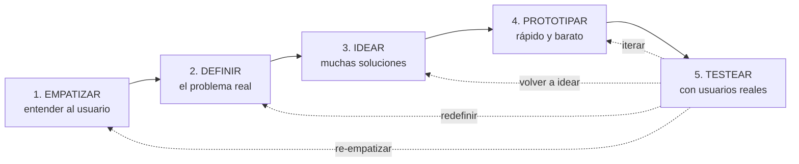
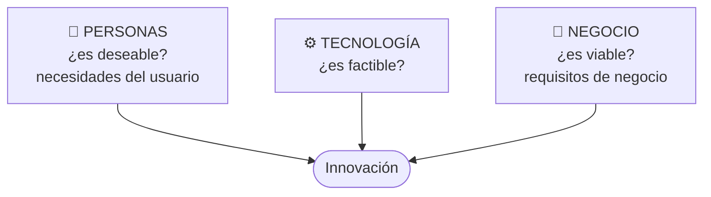
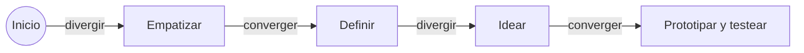
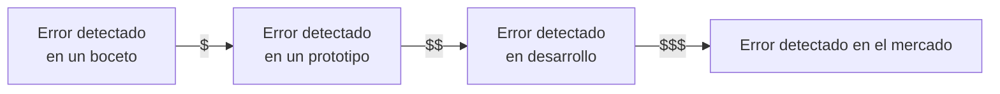
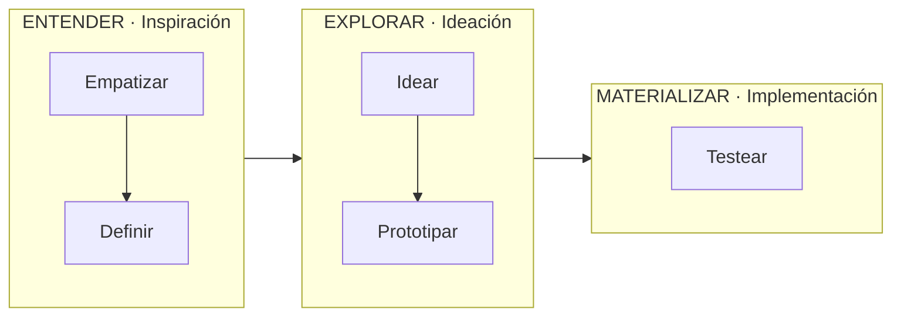

# 13 · Design Thinking

> **Fuente en el material:** *Día 3 – Innovación tecnológica, creatividad vs. innovación*, diapositivas 30–37 · *Clase 4 preparcial – Estrategias* (Ing. Mario Barrios), diapositivas 38–55 (sección IX).
> **Prerrequisitos:** [11 Creatividad](11-creatividad-y-proceso-creativo.md) y [12 Innovación tecnológica](12-innovacion-tecnologica-e-ia.md).
> **Tiempo estimado:** 50 min.
> **Primer Parcial · Tema 13 de 13** (Día 3). 🔥 Salió en el parcial anterior (pregunta [4](../evaluacion/parcial-anterior-resuelto.md#iii4-design-thinking-qué-es--al-menos-3-etapas)).

---

## 🎯 Objetivos de aprendizaje

1. Definir **Design Thinking** e identificar sus **tres dimensiones** (personas, tecnología, negocio).
2. Describir sus **cinco etapas** en orden, con técnicas de cada una.
3. Explicar sus **siete características**, su **importancia** y sus **beneficios**.
4. Analizar **casos de empresas** que lo usaron y **por qué**.
5. **Aplicar** Design Thinking a un problema concreto.
6. Explicar la **versión de Barrios**: seis principios, mentalidades/habilidades/pensamiento, fases agrupadas (entender–explorar–materializar) y las **tres restricciones** (factibilidad, viabilidad, deseabilidad).

---

## 🗺️ Esquema del tema

- **I. Definición**
- **II. Etapas**
  1. Empatizar
  2. Definir
  3. Idear
  4. Prototipar
  5. Evaluar / testear
- **III. Características** (7)
- **IV. Importancia** (5)
- **V. Beneficios** (6)
- **VI. Empresas que lo utilizan**
- **VII. Por qué lo utilizaron** (4 razones)
- **VIII. Caso aplicado paso a paso**
- **IX. La versión de la clase preparcial (Barrios)**
  1. Seis principios
  2. De centrado en el producto a centrado en las personas
  3. Mentalidades, habilidades y pensamiento
  4. Las fases, una por una, y sus agrupaciones
  5. Restricciones: factibilidad, viabilidad, deseabilidad

---

## 🧠 Mapa visual

---

## 📖 Desarrollo

## I. Definición

> 📌 *"El Design Thinking es una **metodología centrada en el ser humano** para **resolver problemas complejos** y **fomentar la innovación**, integrando **necesidades de los usuarios, tecnología y requisitos de negocio**."*

Las tres dimensiones que integra:

> ➕ **Contexto adicional:** IDEO (la consultora que popularizó el método) habla de **deseabilidad, factibilidad y viabilidad**: una buena innovación está en la intersección de las tres. El modelo de 5 etapas que usa la cátedra es el de la **d.school de Stanford**.

> 💡 **Para entenderlo:** la mayoría de los fracasos tecnológicos empiezan por la tecnología ("tenemos esta tecnología, ¿qué hacemos?"). Design Thinking **empieza por la persona** ("¿qué le pasa a esta persona?") y recién después busca la tecnología. Por eso es la respuesta directa al problema n.º 1 de innovar: **falta de comprensión del usuario** (módulo [12](12-innovacion-tecnologica-e-ia.md)).

> 📝 **Citar y explayarse:** La cátedra define el Design Thinking como *"una metodología centrada en el ser humano para resolver problemas complejos y fomentar la innovación"*, que integra *"necesidades de los usuarios, tecnología y requisitos de negocio"*. Que esté **centrada en el ser humano** significa que el punto de partida no es la tecnología disponible sino la persona y su problema: primero se empatiza y se define el reto, y recién después se idean, prototipan y testean soluciones. Integrar las tres dimensiones asegura que la solución sea **deseable** para el usuario, **factible** técnicamente y **viable** para el negocio. Además es iterativa: el testeo puede devolver al equipo a cualquier etapa anterior. Por ejemplo, una app de turnos médicos diseñada así empezaría observando a pacientes mayores pedir turno, y no por elegir la tecnología.

---

## II. Etapas

| # | Etapa | Qué se hace (cátedra) | Técnicas / productos |
|---|---|---|---|
| 1 | **Empatizar** (*Empathize*) | **Investigar y comprender** las necesidades, pensamientos, **emociones y motivaciones** del público objetivo. **Observar, escuchar y ponerse en la piel del usuario.** | **Entrevistas**, **inmersión**, **mapas de empatía**. |
| 2 | **Definir** (*Define*) | **Procesar y analizar** la información para **enfocar el problema real** y establecer un **punto de vista** claro. Se seleccionan los hallazgos más relevantes para un **enunciado del problema o "reto"**. | Enunciado del reto (*point of view*). |
| 3 | **Idear** (*Ideate*) | Generar **la mayor cantidad de soluciones posibles**, **sin restricciones ni juicios**. Pensamiento creativo y **lluvia de ideas**. | Brainstorming, SCAMPER, etc. (módulo [11](11-creatividad-y-proceso-creativo.md)). |
| 4 | **Prototipar** (*Prototype*) | Construir **versiones rápidas, económicas y tangibles** de las ideas para **evaluar su viabilidad**. | **Maquetas, dibujos, storyboards**, simulaciones. |
| 5 | **Evaluar / testear** (*Test*) | **Probar los prototipos con usuarios reales** para recibir **feedback** y validar si la solución funciona. **Es iterativa**: suele llevar a perfeccionar el prototipo **o volver a fases anteriores**. | Pruebas de usuario. |

> ⚠️ **No es lineal:** la cátedra subraya que el testeo **puede llevar a volver a cualquier etapa anterior**. Por eso en el diagrama hay flechas de retorno.

> 💡 **Divergir y converger otra vez:** Empatizar (divergir: juntar información) → Definir (converger: un reto) → Idear (divergir: muchas ideas) → Prototipar/Testear (converger: la que funciona). Es el mismo patrón de las reglas del proceso creativo.

---

## III. Características

| # | Característica | Explicación |
|---|---|---|
| 1 | **Centrado en el usuario (empatía)** | Comprender profundamente necesidades, emociones y motivaciones del usuario final. |
| 2 | **Colaborativo y multidisciplinario** | Trabajo en equipo con **perfiles diversos**. |
| 3 | **Iterativo** | **No lineal**: se avanza, se retrocede, se prueba y se mejora continuamente. |
| 4 | **Orientado a la acción (prototipado)** | Pasa **rápido de la idea a la acción** con prototipos tangibles. |
| 5 | **Pensamiento abierto y creativo** | Gran **volumen de ideas** sin restricciones iniciales. |
| 6 | **Visual y tangible** | Bocetos, modelos y herramientas visuales para hacer las ideas **comprensibles**. |
| 7 | **Validación constante** | Prototipos testeados con **usuarios reales** → feedback temprano. |

## IV. Importancia

1. **Enfoque centrado en el usuario** – comprender no solo **lo que dicen** los usuarios, sino **lo que necesitan, piensan y sienten**.
2. **Innovación efectiva** – resolver problemas complejos y **diferenciarse** de la competencia aportando valor real.
3. **Aprendizaje y validación rápida** – la iteración (prototipar y testear) **minimiza el riesgo de fracasos costosos** al **fallar rápido y barato**.
4. **Resolución colaborativa** – equipos diversos enriquecen las ideas.
5. **Adaptabilidad** – fomenta creatividad y adaptación ante un mercado cambiante.

## V. Beneficios

| Beneficio | Explicación |
|---|---|
| **Enfoque en el usuario (*customer centric*)** | Soluciones a **problemas verdaderos**. |
| **Innovación disruptiva y creativa** | Lluvia de ideas y **pensamiento divergente** → soluciones más allá de lo convencional. |
| **Reducción de riesgos y costos** | Prototipos rápidos y económicos (**"fail fast"**): errores detectados **temprano**, evitando grandes inversiones en productos fallidos. |
| **Colaboración multidisciplinaria** | **Rompe silos**: diseño + ingeniería + negocio; mejora cultura y eficiencia. |
| **Proceso flexible e iterativo** | Permite **volver atrás** y aprender del feedback constante. |
| **ROI mejorado** | Mayor eficiencia y resultados económicos. |

> 💡 **"Fail fast" (fallar rápido):** si una idea va a fallar, es mucho mejor descubrirlo con un dibujo en papel que con un producto terminado. El costo del error **crece** cuanto más tarde se detecta.

---

## VI. Empresas que utilizan esta metodología

| Empresa | Qué hizo con Design Thinking |
|---|---|
| **Apple** | **Pionera**: enfoca el desarrollo de productos en la **experiencia del usuario** y resuelve problemas de diseño creativamente. |
| **Netflix** | Reinventó su modelo **de alquiler de DVDs al streaming**, priorizando **contenido personalizado** y experiencias atractivas; ofrece contenido bajo demanda **anticipando los deseos** de sus usuarios. |
| **Airbnb** | Transformó la hotelería **empatizando con viajeros y anfitriones**; plataforma fácil de usar y experiencia personalizada. |
| **BBVA** | Rediseñó sus **cajeros automáticos** para hacerlos **más intuitivos, humanos y seguros**. |
| **IKEA** | Diseñó muebles pensando en el **transporte fácil por el consumidor** y la **reducción de costos**. |

## VII. Por qué utilizaron esta metodología

1. **Empatía con el usuario** – entienden necesidades reales **antes** de desarrollar.
2. **Innovación centrada en el humano** – soluciones originales que **la gente realmente desea**.
3. **Prototipado rápido** – probar ideas rápido y **fallar barato para aprender rápido**.
4. **Colaboración interdisciplinaria** – **romper silos** para resolver problemas complejos en conjunto.

---

## VIII. Caso aplicado paso a paso

> 🧩 **Reto:** los estudiantes de la facultad pierden mucho tiempo buscando aulas libres para estudiar en grupo.

| Etapa | Aplicación |
|---|---|
| **1. Empatizar** | Entrevistás a 10 estudiantes y observás los pasillos en hora pico. Hallazgos: recorren 3–4 pisos; los grupos se arman a último momento; se sienten frustrados y "echados" cuando llega un curso. Armás un **mapa de empatía** (qué piensa, siente, dice y hace). |
| **2. Definir** | Reto: *"¿Cómo podríamos ayudar a los grupos de estudio a encontrar un espacio libre y garantizado en menos de 5 minutos?"* |
| **3. Idear** | Lluvia de ideas sin juzgar: app con mapa en tiempo real, sensores de ocupación (IoT), reserva por QR en la puerta, bot de WhatsApp, cartel digital en cada piso, liberar aulas automáticamente… |
| **4. Prototipar** | Hacés un prototipo en Figma de "reserva por QR" + una planilla compartida simulando la disponibilidad (barato y rápido). |
| **5. Testear** | 15 estudiantes lo prueban una semana. Feedback: el QR funciona, pero no quieren instalar otra app → **volvés a idear**: bot de WhatsApp. Iterás. |

> 🔗 Fijate que el paso 5 de este caso se parece mucho a **Lean Startup** (MVP → medir → aprender → pivotar). Las diferencias se ven en el módulo [17](../resto-de-la-materia/17-lean-startup-y-mvp.md).

---

## IX. La versión de la clase preparcial (Barrios)

> 📍 **Fuente:** *Clase 4 preparcial – Estrategias* (Ing. Mario Barrios), diapositivas 38–55. Es la **misma metodología** que vimos en el Día 3, presentada con otro énfasis: principios, mentalidades y restricciones. Suma vocabulario útil para el parcial.

### IX.1 Seis principios

| # | Principio | Qué significa | 🔗 Se conecta con |
|---|---|---|---|
| 1 | **Centrado en las personas** | El punto de partida es la persona y su problema, no la tecnología. | Característica 1 (empatía); problema n.º 1 de innovar. |
| 2 | **Trabajo en equipo colaborativo** | Perfiles diversos que diseñan **juntos**, no áreas que se pasan tareas. | Gestión 2.0: trabajo interdisciplinario. |
| 3 | **Aprender haciendo** | Se entiende el problema construyendo, no solo analizando. | Prototipar. |
| 4 | **Abrazar la experimentación** | Probar, fallar y ajustar es parte del método. | "Está bien fracasar"; [Cultura Fail](../resto-de-la-materia/22-service-design-y-cultura-fail.md). |
| 5 | **Entender patrones, relaciones y sistemas** | Mirar el problema en su contexto completo, no como un hecho aislado. | Pensamiento sistémico. |
| 6 | **Visualizar y mostrar** | Bocetos, mapas y prototipos para que las ideas se entiendan y se discutan. | Característica 6 (visual y tangible). |

### IX.2 De centrado en el producto a centrado en las personas

La diapositiva resume el cambio de enfoque: **"De… centrada en producto → A… centrada en las personas"**.

> 💡 **Para entenderlo:** una empresa centrada en el producto pregunta *"¿cómo hacemos un teléfono mejor?"* (más batería, más resistencia). Una centrada en las personas pregunta *"¿qué quiere hacer la gente con el teléfono?"* (navegar, compartir fotos, usar apps). Es exactamente la diferencia entre Nokia y Apple en 2007.

### IX.3 Mentalidades, habilidades y pensamiento

Barrios lo presenta como tres círculos que se superponen:

| Círculo | Qué incluye |
|---|---|
| **Mentalidades y actitudes** | Empatía · adaptabilidad · coraje · mentalidad de principiante · resiliencia emocional · mente abierta. |
| **Habilidades: métodos y herramientas** | Reformulación · ideación · prototipado iterativo · creación de sentido · facilitación · co-creación · colaboración. |
| **Nuevas formas de pensar** | Pensamiento divergente · síntesis · pensamiento sistémico · inteligencia emocional · pensamiento visual · imaginación. |

> 💡 El mensaje: Design Thinking no es solo una secuencia de pasos, sino una **forma de trabajar** que combina **actitud** (cómo me paro frente al problema), **método** (qué herramientas uso) y **pensamiento** (cómo razono).

### IX.4 Las fases, una por una, y sus agrupaciones

Las cinco fases son las mismas del Día 3, con la descripción breve de Barrios:

| Fase | Descripción (Barrios) |
|---|---|
| **Empatizar** | *"Entender cómo piensan, sus necesidades y lo que es realmente importante para los usuarios."* |
| **Definir** | *"Sintetizar la información construyendo un punto de partida desde un dolor significativo para el usuario."* |
| **Idear** | *"Generar muchas ideas, siendo disruptivo e innovador y construyendo en equipo una propuesta."* |
| **Prototipar** | *"Desarrollar prototipos rápidos y sencillos que permitan recibir retroalimentación sobre la propuesta."* |
| **Testear** | *"Simulando un contexto real, comprender mejor al usuario y con su retroalimentación mejorar la propuesta."* |

Y las agrupa de dos maneras:

| Agrupación 1 | Agrupación 2 | Fases |
|---|---|---|
| **Entender** | **Inspiración** | Empatizar, definir |
| **Explorar** | **Ideación** | Idear, prototipar |
| **Materializar** | **Implementación** | Prototipar, testear |

> ⚠️ **Detalle del gráfico:** en la diapositiva, **prototipar** queda a caballo entre *explorar* y *materializar*. Si te preguntan, decí que prototipar es el **puente** entre la idea y su materialización.

> ➕ **Contexto adicional:** la agrupación *inspiración – ideación – implementación* es la de **IDEO**, la consultora que popularizó el método.

### IX.5 Restricciones: factibilidad, viabilidad, deseabilidad

> 📌 Toda solución debe equilibrar tres restricciones:
> - ***factibilidad***, *"lo que es posible funcionalmente en el futuro próximo"*;
> - ***viabilidad***, *"lo que es probable que pase a formar parte de un modelo de negocio sostenible"*;
> - ***deseabilidad***, *"lo que tiene sentido para las personas"*.

Son las mismas tres dimensiones de la definición (sección I): **tecnología → factible**, **negocio → viable**, **personas → deseable**. La innovación está en la intersección.

> 📝 **Citar y explayarse:** Barrios plantea que una solución de Design Thinking debe equilibrar tres restricciones: la **factibilidad**, *"lo que es posible funcionalmente en el futuro próximo"*; la **viabilidad**, *"lo que es probable que pase a formar parte de un modelo de negocio sostenible"*, y la **deseabilidad**, *"lo que tiene sentido para las personas"*. Una idea que solo cumple una o dos no es una innovación: si es deseable y factible pero no viable, el negocio pierde plata; si es factible y viable pero no deseable, nadie la usa; si es deseable y viable pero no factible, no se puede construir. El método empieza por la deseabilidad (empatizar), pero el prototipo y el testeo sirven para comprobar las tres a la vez. En el caso Nokia, el prototipo táctil era factible y cada vez más deseable; la dirección lo juzgó solo por la viabilidad de corto plazo (*"frágil"* y costoso), y por eso lo descartó.

---

## ⚠️ Conceptos que se confunden

| Se confunde… | …con | Diferencia |
|---|---|---|
| Empatizar | Definir | Empatizar = **recolectar** comprensión del usuario. Definir = **sintetizar** en un enunciado del problema. |
| Prototipar | Producto final | El prototipo es **rápido, barato y tangible**, hecho para **aprender**, no para vender. |
| Design Thinking | Proceso lineal | Es **iterativo**: desde testear se vuelve a cualquier etapa. |
| Design Thinking | "Diseño gráfico" | Es una **metodología de resolución de problemas**, no de estética. |
| Factibilidad | Viabilidad | Factible = **se puede construir** (técnica). Viable = **sostiene un modelo de negocio** (económica). |
| Design Thinking | Lean Startup | DT pone el foco en **entender el problema y al usuario**; Lean Startup en **validar un modelo de negocio con métricas** (ver tema 17). Se complementan. |

---

## 🔗 Conexiones

- **← [11 Creatividad](11-creatividad-y-proceso-creativo.md):** reglas (foco en usuario, iteración, interdisciplina).
- **← [12 Innovación tecnológica](12-innovacion-tecnologica-e-ia.md):** problema n.º 1 de innovar.
- **← [07 Gestión 2.0](07-gestion-de-la-innovacion.md):** fracaso aceptado, trabajo interdisciplinario.
- **→ [16 Proyectos](../resto-de-la-materia/16-proyectos-y-estrategia-de-innovacion.md):** DT es la metodología de "experimentación y validación".
- **→ [17 Lean Startup](../resto-de-la-materia/17-lean-startup-y-mvp.md)**.
- **→ [22 Service Design](../resto-de-la-materia/22-service-design-y-cultura-fail.md):** el mismo enfoque aplicado a servicios.

---

## ✍️ Autoevaluación

**1. Defina Design Thinking.**

Ver respuesta

Es una **metodología centrada en el ser humano** para **resolver problemas complejos y fomentar la innovación**, integrando **necesidades de los usuarios, tecnología y requisitos de negocio**.

**2. Describa las cinco etapas en orden.**

Ver respuesta

(1) **Empatizar**: comprender necesidades, pensamientos, emociones y motivaciones del usuario (entrevistas, inmersión, mapas de empatía). (2) **Definir**: analizar la información y enfocar el problema real en un enunciado o reto. (3) **Idear**: generar la mayor cantidad de soluciones sin restricciones ni juicios. (4) **Prototipar**: versiones rápidas, económicas y tangibles (maquetas, dibujos, storyboards). (5) **Testear**: probar con usuarios reales, recibir feedback y validar; es iterativa y puede llevar a volver a fases anteriores.

**3. ¿Por qué se dice que Design Thinking reduce riesgos y costos?**

Ver respuesta

Porque con **prototipos rápidos y económicos** ("fail fast") los errores se **detectan y corrigen tempranamente**, cuando cuesta poco cambiar, evitando grandes inversiones en productos que el mercado no quiere.

**4. Explique qué hizo BBVA con Design Thinking y qué etapa considera clave en ese caso.**

Ver respuesta

Rediseñó sus **cajeros automáticos** para hacerlos **más intuitivos, humanos y seguros**, mejorando la relación con sus clientes. La etapa clave es **empatizar** (entender las dificultades y miedos de los usuarios al usar un cajero), complementada por **testear** los nuevos diseños con usuarios reales.

**5. Mencione cuatro características de Design Thinking.**

Ver respuesta

Centrado en el usuario (empatía); colaborativo y multidisciplinario; iterativo (no lineal); orientado a la acción (prototipado); pensamiento abierto y creativo; visual y tangible; validación constante.

**6. Mencione los seis principios del Design Thinking según la clase de Barrios.**

Ver respuesta

Centrado en las personas · trabajo en equipo colaborativo · aprender haciendo · abrazar la experimentación · entender patrones, relaciones y sistemas · visualizar y mostrar.

**7. ¿Qué tres restricciones debe equilibrar una solución? Defina cada una.**

Ver respuesta

**Factibilidad** (lo que es posible funcionalmente en el futuro próximo), **viabilidad** (lo que es probable que forme parte de un modelo de negocio sostenible) y **deseabilidad** (lo que tiene sentido para las personas).

**8. ¿Cómo agrupa Barrios las cinco fases?**

Ver respuesta

**Entender** (empatizar, definir) → **explorar** (idear, prototipar) → **materializar** (testear). Equivale a **inspiración → ideación → implementación**.

---

[← 12 Innovación tecnológica e Inteligencia Artificial](12-innovacion-tecnologica-e-ia.md) · [🏠 Índice](../README.md) · [Terminaste los temas del Primer Parcial → Evaluación](../evaluacion/README.md) · [Resto de la materia → 14 Innovación abierta](../resto-de-la-materia/14-innovacion-abierta.md)
