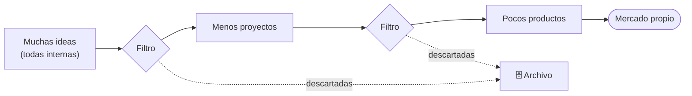
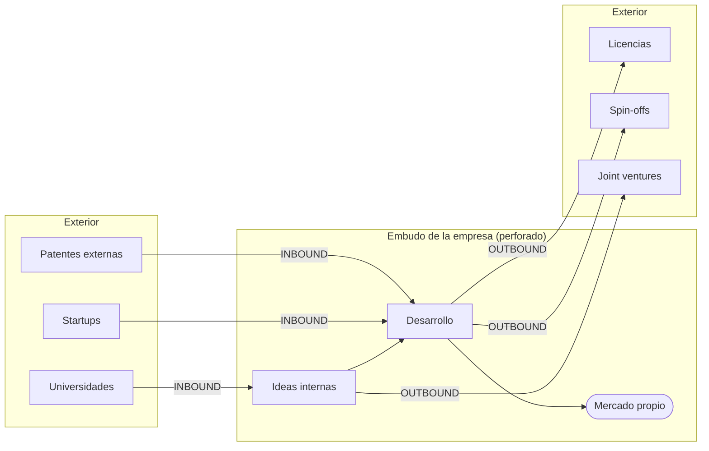

# 14 · Innovación abierta (Open Innovation)

> **Fuente en el material:** *Día 3 – Innovación Abierta* (basado en Henry Chesbrough), diapositivas 1–14 y 26–32.
> **Prerrequisitos:** [07 Gestión de la innovación](../parcial-1/07-gestion-de-la-innovacion.md) (tipo "Red" de Doblin).
> **Tiempo estimado:** 70 min.
> **Resto de la materia · Tema 14** (Día 3). No entra en el Primer Parcial.

---

## 🎯 Objetivos de aprendizaje

1. Explicar quién es **Henry Chesbrough** y qué propuso en *Open Innovation* (2003).
2. Describir el **embudo de desarrollo cerrado** de **Wheelwright & Clark** (1992) y por qué la innovación abierta lo "perfora".
3. Explicar los dos flujos: **inbound** (de afuera hacia adentro) y **outbound** (de adentro hacia afuera), con sus mecanismos e impactos.
4. Explicar las **tres verdades** del "nuevo imperativo".
5. Comparar el **paradigma cerrado** y el **abierto** en cuatro dimensiones.
6. Describir los **vehículos de implementación** (CVC, aceleradoras corporativas, ecosistemas de co-creación).
7. Analizar el caso **Google Ventures (GV)**.
8. Explicar el **pensamiento divergente y convergente**, el **Doble Diamante** y su relación con los flujos inbound y outbound.

---

## 🗺️ Esquema del tema

- **I. Henry Chesbrough y el origen del concepto**
- **II. El fundamento: del embudo cerrado al embudo perforado**
  - A. El embudo de desarrollo de Wheelwright & Clark (modelo cerrado)
  - B. La ruptura del modelo tradicional
    1. Premisa central
    2. Factores de cambio
    3. El mantra obsoleto
- **III. Dinámica de flujos: el embudo perforado**
  - A. Inbound (de afuera hacia adentro)
  - B. Outbound (de adentro hacia afuera)
- **IV. Las tres verdades del "nuevo imperativo"**
  1. La innovación ya no es un lujo, es una obligación
  2. No tenés que inventarlo todo para usarlo
  3. Si no te sirve, sacale dinero afuera
- **V. Cambio de mentalidad estratégica**
  - A. La mentalidad cerrada (secretismo, patentes defensivas, miedo a compartir)
  - B. El cambio: propiedad intelectual flexible
  - C. Paradigma cerrado vs. abierto (4 dimensiones)
- **VI. Vehículos prácticos de implementación**
  1. Corporate Venture Capital
  2. Aceleradoras corporativas
  3. Ecosistemas de co-creación
- **VII. Corporate Venture Capital en detalle**
- **VIII. Caso real: Google Ventures (GV)**
- **IX. Ideas fuerza**
- **X. Pensamiento divergente y convergente** (repaso MRI viernes)
  1. El ciclo de oscilación cognitiva
  2. El Doble Diamante
  3. Matriz comparativa

---

## 🧠 Mapa visual

---

## 📖 Desarrollo

## I. Henry Chesbrough y el origen del concepto

- **Henry Chesbrough** (n. 1956): teórico organizacional y economista estadounidense, reconocido como **"el padre" de la innovación abierta**.
- Acuñó y popularizó el término en su libro de **2003**: ***Open Innovation: The New Imperative for Creating and Profiting from Technology*** (*"Innovación Abierta: El nuevo imperativo para crear y beneficiarse de la tecnología"*).

> 💡 **Leé bien el título del libro**: tiene tres partes —"**nuevo imperativo**", "**crear**… tecnología", "**beneficiarse** de la tecnología"— que son exactamente las **tres verdades** de la sección IV.

> ➕ **Contexto adicional – definición formal:** Chesbrough define la innovación abierta como *el uso de flujos de conocimiento hacia adentro y hacia afuera para acelerar la innovación interna y expandir los mercados para el uso externo de la innovación*.

---

## II. El fundamento: del embudo cerrado al embudo perforado

### II.A El embudo de desarrollo de Wheelwright & Clark (modelo cerrado)

- Presentado por **Kim B. Clark y Steven C. Wheelwright** en ***Revolutionizing Product Development*** (**1992**).
- Es uno de los **pilares fundacionales** de la gestión de la innovación y del desarrollo de nuevos productos (**NPD**).
- Introdujo masivamente la **metáfora visual del embudo** para explicar cómo gestionar la **cartera de proyectos**.

> 📌 *"A diferencia del modelo poroso de Chesbrough, el esquema de Wheelwright & Clark describe un proceso **lineal, secuencial y cerrado**. La idea central: **una empresa siempre genera muchas más ideas de las que financieramente puede o debe ejecutar**. Por lo tanto, el proceso de desarrollo debe actuar como **un filtro que va descartando opciones** a medida que se avanza, asegurando que **solo los proyectos con mayor valor estratégico y viabilidad comercial lleguen al mercado**."*

> 📝 **Citar y explayarse:** Según la cátedra, el embudo de Wheelwright y Clark describe un proceso *"lineal, secuencial y cerrado"* basado en una idea: *"una empresa siempre genera muchas más ideas de las que financieramente puede o debe ejecutar"*. Por eso el desarrollo funciona como un **filtro** que descarta opciones en cada etapa hasta que solo las mejores llegan al mercado. El rasgo clave es que es **cerrado**: todas las ideas nacen adentro, todo se desarrolla adentro y lo descartado queda archivado sin aprovecharse. Ese es justamente el punto que critica Chesbrough: las ideas descartadas pueden tener valor para otros, y las ideas externas pueden ser mejores que las propias. Un laboratorio corporativo que patenta tecnologías que nunca usa es el ejemplo típico de este modelo.

### II.B La ruptura del modelo tradicional

#### II.B.1 Premisa central
> 📌 *"**El conocimiento útil está distribuido globalmente de forma fragmentada.** Ninguna corporación, sin importar su tamaño, puede **monopolizar eficazmente todo el talento** científico y tecnológico."*

#### II.B.2 Factores de cambio
1. **Alta movilidad laboral** de profesionales calificados (el talento se va a otras empresas o funda startups, llevándose el conocimiento).
2. **Auge del capital de riesgo** (*venture capital*): hay dinero disponible para que las ideas se desarrollen **fuera** de las grandes empresas.

> 📝 **Citar y explayarse:** La premisa central de la innovación abierta es que *"el conocimiento útil está distribuido globalmente de forma fragmentada"* y que ninguna empresa, *"sin importar su tamaño"*, puede *"monopolizar eficazmente todo el talento"*. Esto se volvió cierto por dos factores: la **alta movilidad laboral**, porque los profesionales cambian de empresa o fundan startups llevándose el conocimiento, y el **auge del capital de riesgo**, que financia ideas fuera de las grandes compañías. La consecuencia es que la vieja lógica de contratar a los mejores y desarrollar todo adentro deja de alcanzar: lo más valioso puede estar en una startup, una universidad o un proveedor. Por eso las grandes tecnológicas compran startups o se asocian con ellas en lugar de desarrollarlo todo por su cuenta.

#### II.B.3 El mantra obsoleto
> *"Si queremos que algo salga bien, debemos hacerlo nosotros mismos."*

Este mantra de la **innovación cerrada** quedó obsoleto. Las organizaciones modernas actúan como **arquitectas e integradoras de ecosistemas**, **no como islas aisladas**.

---

## III. Dinámica de flujos: el embudo perforado

En la innovación abierta, las paredes del embudo **tienen agujeros**: el conocimiento **entra** y **sale**.

| | **A. Inbound** (de fuera hacia dentro) | **B. Outbound** (de dentro hacia fuera) |
|---|---|---|
| **Qué es** | **Integración externa**: absorber conocimiento, patentes o tecnologías **desarrolladas fuera**. | **Monetización externa**: transferir al mercado tecnologías o ideas **internas infrautilizadas**. |
| **Mecanismos comunes** | **Hackathons**, **retos tecnológicos abiertos**, **fusiones y adquisiciones de startups**. | **Concesión de licencias** de patentes no estratégicas, **spin-offs** y **joint ventures**. |
| **Impacto operativo** | **Reduce drásticamente los costes fijos de I+D básica** y **mitiga el riesgo de fases tempranas**. | **Transforma costes hundidos y laboratorios inactivos en flujos de ingresos directos**. |

> 💡 **Glosario rápido:**
> - **Spin-off**: empresa nueva que nace de una existente para explotar una tecnología que no encaja en el negocio principal.
> - **Joint venture**: empresa o proyecto conjunto entre dos o más organizaciones que comparten inversión, riesgo y beneficios.
> - **Licencia**: permiso para que otro use tu patente a cambio de un pago (regalías).
> - **Costo hundido**: dinero ya gastado que no se recupera (ej. la investigación que terminó en un cajón).

> ➕ **Contexto adicional:** Chesbrough también describe un tercer modo, el **acoplado** (*coupled*), que combina inbound y outbound en alianzas de co-creación. Se corresponde con los "ecosistemas de co-creación" de la sección VI.

---

## IV. Las tres verdades del "nuevo imperativo"

> 📌 *"Las empresas ya no pueden sobrevivir siendo **islas tecnológicas**; hoy el éxito depende de **cooperar con el mundo exterior** para generar ingresos."*

### IV.1 La innovación ya no es un lujo, es una obligación ("el nuevo imperativo")
- Antes, una empresa lanzaba un producto y **vivía de esa renta una década**.
- Hoy la tecnología y la demanda cambian a una velocidad tal que **si desarrollás todo adentro, llegás tarde** al mercado.
- Abrirse al exterior **no es una moda: es una regla de supervivencia**.

> 📝 **Citar y explayarse:** La cátedra resume el nuevo imperativo diciendo que *"las empresas ya no pueden sobrevivir siendo islas tecnológicas"* y que *"el éxito depende de cooperar con el mundo exterior"*. La razón es la velocidad: antes un producto podía sostener a una empresa durante años, pero hoy la tecnología y la demanda cambian tan rápido que desarrollar todo internamente implica **llegar tarde** al mercado. Cooperar permite usar tecnologías ajenas sin inventarlas y, a la vez, obtener ingresos de las propias que no se usan, por ejemplo licenciándolas. No es una moda sino una **condición de supervivencia**, sobre todo en entornos inestables como los que describe el modelo VANI (módulo [15](15-entornos-vica-y-vani.md)).

### IV.2 No tenés que inventarlo todo para usarlo ("crear… tecnología")
- Las corporaciones sufrían el síndrome **"No fue inventado aquí"** (*Not Invented Here*): si sus ingenieros no lo habían creado, lo rechazaban.
- Chesbrough demostró que se pueden crear productos revolucionarios **integrando piezas del rompecabezas que otros ya armaron**.
- 🧩 **Ejemplo de la cátedra:** una empresa de alimentos que necesita un envase sustentable **no** debería gastar 5 años investigando polímeros; debería **asociarse con una startup de bioplásticos o una universidad** y lanzar en **6 meses**.

### IV.3 Si no te sirve a vos, sacale dinero afuera ("beneficiarse de la tecnología")
- *"El giro económico más brillante del concepto."*
- En el modelo viejo, si un laboratorio farmacéutico descubría por accidente un componente útil para limpiar pantallas, **se archivaba** ("vendemos medicinas, no tecnología de pantallas").
- Chesbrough: **licencialo, vendelo o creá una spin-off**. *"No dejes que el conocimiento muera en un cajón."*

| Verdad | Parte del título | Flujo |
|---|---|---|
| 1. Obligación | "El nuevo imperativo" | Ambos |
| 2. No inventar todo | "para **crear**… tecnología" | **Inbound** |
| 3. Monetizar afuera | "y **beneficiarse** de la tecnología" | **Outbound** |

---

## V. Cambio de mentalidad estratégica

### V.A La mentalidad cerrada

| Rasgo | Descripción |
|---|---|
| **Secretismo absoluto** | Ingenieros y científicos aislados, **sin colaborar con universidades ni expertos externos** por miedo a filtraciones. |
| **Patentes defensivas** | Se registraban miles de inventos **solo para bloquear a la competencia**, aunque nunca se fabricaran. |
| **Miedo a compartir** | Se creía que si otra empresa usaba una idea propia, era **pérdida de poder** en el mercado. |

### V.B El cambio: propiedad intelectual flexible

> 📌 *"Chesbrough explicó que esta protección extrema se volvió **un freno**. En lugar de gastar recursos en esconder todo, la innovación abierta propone que la **propiedad intelectual sea flexible**: si tenés una patente que no usás, **la licenciás o la vendés**; y si necesitás una tecnología externa, **pagás por ella o te asociás**."*

> 📝 **Citar y explayarse:** Chesbrough sostiene que la protección extrema de la propiedad intelectual *"se volvió un freno"*, y que la innovación abierta propone que sea **flexible**: *"si tenés una patente que no usás, la licenciás o la vendés; y si necesitás una tecnología externa, pagás por ella o te asociás"*. El cambio de mentalidad es pasar de ver la propiedad intelectual como un muro para **esconder** conocimiento a verla como un **activo que circula** y genera valor en ambas direcciones. Guardar una patente sin usarla tiene costo y no produce nada; licenciarla genera ingresos y puede abrir mercados nuevos. Por ejemplo, una farmacéutica puede licenciar a otra un compuesto que no va a desarrollar y, a la vez, comprarle a una startup una tecnología de diagnóstico que no tiene.

### V.C Paradigma cerrado vs. abierto

| Dimensión | **Paradigma cerrado** | **Paradigma abierto** |
|---|---|---|
| **Gestión del talento** | Búsqueda rigurosa para **contratar a los mejores en exclusividad**. | **El talento valioso es externo por naturaleza**; el objetivo es **colaborar activamente**. |
| **Propiedad intelectual** | **Protección extrema** para bloquear mercados. | Se **adquiere IP externa** estratégica; se **licencia la IP interna no utilizada**. |
| **Ventaja competitiva** | **Ser el primero en descubrir** la tecnología asegura el dominio. | **Construir modelos de negocio superiores** es más rentable que descubrir la tecnología. |
| **Filosofía de control** | **Control absoluto** del ciclo de vida del producto, de inicio a fin, interno. | **Orquestación de ecosistemas** abiertos, **distribuyendo riesgos y beneficios**. |

> 💡 **La fila más profunda es "ventaja competitiva":** en el paradigma abierto **no gana quien inventa, gana quien tiene el mejor modelo de negocio** para aprovechar la tecnología (propia o ajena). Conecta con Doblin: **modelo de ingresos** y **red** (módulo [07](../parcial-1/07-gestion-de-la-innovacion.md)).

---

## VI. Vehículos prácticos de implementación

| Vehículo | Qué es | Para qué |
|---|---|---|
| **1. Corporate Venture Capital (CVC)** | **Inversiones financieras directas en startups externas** de base tecnológica. | Ganar **acceso preferente y visibilidad estratégica** sobre innovaciones disruptivas. |
| **2. Aceleradoras corporativas** | **Estructuras internas de acompañamiento** que dan **mentoría, recursos e infraestructura** a emprendedores. | A cambio de **pilotar soluciones de forma ágil** con la corporación. |
| **3. Ecosistemas de co-creación** | **Alianzas tecnológicas formales a largo plazo** con **redes universitarias y consorcios** industriales públicos y privados. | **Diluir los costes de infraestructura masiva**. |

> 🧩 **Ejemplo de la cátedra (Proyectos de innovación):** **Procter & Gamble** con su programa **Connect + Develop** aceleró la creación de productos colaborando con socios externos en lugar de depender solo de su I+D interno.

---

## VII. Corporate Venture Capital en detalle

> 📌 *"Una cartera de **Corporate Venture Capital (CVC)** —o portafolio de Capital de Riesgo Corporativo— es el **conjunto de inversiones financieras y estratégicas** que realiza una gran empresa **en múltiples startups tecnológicas de forma simultánea**."*

- En lugar de poner todo el presupuesto de innovación en **un solo laboratorio interno** (modelo cerrado) o **una sola idea**, la corporación **distribuye su capital** comprando **pequeñas participaciones en 10, 20 o 30 startups**.
- *"Es, literalmente, **crear un fondo de inversión propio dentro de la compañía**."*

> 💡 **Por qué funciona:** es una **cartera de apuestas**. La mayoría de las startups fracasará, pero alcanza con que una o dos sean enormes. Además, la empresa **ve antes que nadie** qué tecnologías están despegando (las nuevas curvas S). Esto será clave en el entorno **No Lineal** del módulo [15](15-entornos-vica-y-vani.md).

> 📝 **Citar y explayarse:** La cátedra define una cartera de Corporate Venture Capital como *"el conjunto de inversiones financieras y estratégicas que realiza una gran empresa en múltiples startups tecnológicas de forma simultánea"*; es, literalmente, *"crear un fondo de inversión propio dentro de la compañía"*. Su lógica es la de una **cartera de apuestas**: en lugar de concentrar el presupuesto en un laboratorio interno o en una sola idea, la empresa reparte pequeñas participaciones entre muchas startups, sabiendo que la mayoría fracasará pero que alcanza con que una o dos tengan éxito. Además de la rentabilidad, le da una ventaja estratégica: ve antes que nadie qué tecnologías están despegando. Google Ventures, el brazo inversor de Alphabet, es el caso que analiza la cátedra.

---

## VIII. Caso real: Google Ventures (GV)

### VIII.A Qué es
- **Brazo de Capital de Riesgo Corporativo de Alphabet Inc.**, fundado en **2009**.
- Funciona como **un fondo de inversión independiente respaldado por el músculo financiero de Google**.
- **Objetivo doble**: invertir en startups en etapas iniciales o de crecimiento para obtener **rendimientos financieros masivos** y **posicionarse en la vanguardia de la innovación disruptiva**.

### VIII.B El modelo híbrido

| Pilar | Descripción |
|---|---|
| **Independencia operativa** | Busca retornos **de forma agnóstica**: invierte en proyectos con potencial de disrupción **aunque no estén alineados hoy con los productos de Google**. |
| **El "Google Edge"** | Más allá del capital, aporta **soporte humano y técnico**: acceso directo a **ingenieros, científicos de datos, diseñadores UX y expertos en marketing** de Google. |

### VIII.C Sectores clave de su cartera

| Sector | Foco |
|---|---|
| **Salud y ciencias de la vida** | Biotecnología, telemedicina, **edición genética**, desarrollo de fármacos con IA. |
| **IA y computación** | Infraestructura de software, **ciberseguridad avanzada**, **modelos de lenguaje masivos**. |
| **Consumo y finanzas** | E-commerce, apps móviles masivas, **fintech**. |
| **Clima y energía (CleanTech)** | **Descarbonización**, energías limpias, sostenibilidad. |

### VIII.D Casos de éxito históricos

| Startup | Sector | Rol de GV |
|---|---|---|
| **Uber** | Movilidad y logística | Capital crítico en etapas iniciales para su **escalabilidad global**. |
| **Slack** | Comunicación corporativa | Software colaborativo que **redefinió el flujo de trabajo** en las empresas. |
| **Nest Labs** | Domótica e IoT | Termostatos y seguridad inteligente; **adquirida por Google** años después para su ecosistema Hogar. |
| **Stripe** | Infraestructura fintech | La plataforma de pagos en línea más valorada y robusta del ecosistema digital. |

> 💡 **Nest es el ejemplo perfecto del ciclo completo:** GV invierte (inbound vía CVC) → la startup crece → Google la **adquiere** e integra (inbound vía adquisición). Y Uber y Stripe conectan con los **unicornios** del módulo [04](../parcial-1/04-empresas-unicornio.md).

---

## IX. Ideas fuerza

> *"La innovación ya no se mide por lo que creás, sino por **tu capacidad de conectar**."*

> *"En el pasado, la innovación consistía en encontrar una solución en un laboratorio cerrado. Hoy en día, la innovación se trata de **conectar nodos en una red**."*

> *"En la era de la Innovación Abierta, el líder **no intenta inventar todo dentro de sus oficinas**. Despliega un **radar de capital global** para adueñarse de las piezas del futuro antes que el resto."*

---

## X. Pensamiento divergente y convergente

> **Fuente:** repaso *"Pensamiento Divergente y Convergente"* (MRI viernes). ⚠️ Esta presentación **no está en tu carpeta** `material-de-clase/`: se transcribió del repo de un compañero ([Valenpl](https://github.com/Valenpl/tecnologia-e-innovacion-uade), tema 17, sección VI). Si conseguís el PPT, cotejalo.

### X.1 El ciclo de oscilación cognitiva

> 📌 *"El proceso creativo **no se gestiona de manera caótica**. Consiste en un **ritmo estructurado** que combina y alterna de forma controlada **dos modos fundamentales de pensamiento**."* Los líderes deben saber **cuándo abrir** la organización a la captura de ideas y **cuándo enfocar** los recursos en la viabilidad comercial.

| Modo | Qué es | Rasgos / criterios | Conexión con innovación abierta |
|---|---|---|---|
| **Pensamiento divergente** (apertura) | Capacidad de **generar múltiples opciones** a partir de un único estímulo, **sin juzgar su viabilidad**. | **Fluidez** (muchas ideas), **flexibilidad** (cambiar de perspectiva), **originalidad** (ideas disruptivas). | Flujo **inbound**: hackathons, convocatorias abiertas, scouting de startups, co-creación con universidades. |
| **Pensamiento convergente** (enfoque) | **Analizar, evaluar, filtrar y seleccionar** la mejor opción con lógica, datos y criterios de negocio. | **Viabilidad técnica**, **rentabilidad económica** (ROI), **encaje estratégico**. | **Comités de filtrado**, carteras de **CVC** y flujo **outbound** (licencias, spin-offs). |

> 💡 **En concreto:** en una hackathon primero se juntan 200 ideas sin descartar ninguna (divergir); después un comité las filtra con criterios de viabilidad, ROI y encaje hasta quedarse con 3 para pilotear (converger). Si solo se diverge, hay muchas ideas y ninguna se ejecuta; si solo se converge, se elige rápido entre opciones viejas y no aparece nada disruptivo.

### X.2 El Doble Diamante

Alterna los dos modos **dos veces**: primero para encontrar el problema correcto y después para encontrar la solución correcta.

| Diamante | Fase | Modo | En innovación abierta |
|---|---|---|---|
| **1. El problema** (*diseñar la cosa correcta*) | **Descubrir** | Divergencia | Captura masiva de ideas del ecosistema (inbound). |
| | **Definir** | Convergencia | Identificar el dolor real y el problema central. |
| **2. La solución** (*diseñar correctamente la cosa*) | **Desarrollar** | Divergencia | Explorar múltiples soluciones sin juzgar viabilidad (co-creación). |
| | **Entregar** | Convergencia | Ejecutar y monetizar: filtros, ROI, viabilidad, spin-offs (outbound). |

> 🔗 Es la misma lógica que las etapas de **Design Thinking** (tema [13](../parcial-1/13-design-thinking.md)): empatizar/definir = primer diamante; idear/prototipar/evaluar = segundo. Y que el **proceso creativo** del tema [11](../parcial-1/11-creatividad-y-proceso-creativo.md).

### X.3 Matriz comparativa

| Dimensión | **Divergente** | **Convergente** |
|---|---|---|
| **Objetivo** | Expandir alternativas (crear opciones) | Focalizar alternativas (tomar decisiones) |
| **Estado mental** | Abierto, creativo, sin juzgar | Analítico, crítico, enfocado en viabilidad |
| **Rol en innovación** | Flujo inbound | Flujo outbound |
| **Riesgo si se abusa** | Caos creativo sin ejecución | Rigidez corporativa, falta de disrupción |

> 📌 *"La innovación **no es un evento fortuito**, es un **proceso disciplinado**"* (Peter Drucker, 1985). La innovación abierta exitosa no depende solo de capturar ideas (divergencia), sino de **canalizarlas hacia soluciones de valor comercial** (convergencia).

> 🔗 Drucker y la comparación entre metodologías siguen en el tema [28](28-metodologias-de-innovacion-comparativa.md).

---

## ⚠️ Conceptos que se confunden

| Se confunde… | …con | Diferencia |
|---|---|---|
| Inbound | Outbound | **Absorber** conocimiento externo vs. **monetizar** conocimiento interno afuera. |
| Innovación abierta | Código abierto / regalar todo | No es regalar: la IP es **flexible** (se compra, se vende, se licencia). |
| Embudo de Wheelwright & Clark | Embudo de Chesbrough | **Cerrado, lineal, secuencial** (filtra y archiva) vs. **perforado/poroso** (entra y sale conocimiento). |
| CVC | Aceleradora corporativa | **Invertir capital** en startups vs. **acompañar** con mentoría e infraestructura a cambio de pilotos. |
| Spin-off | Joint venture | Empresa **nueva que se desprende** vs. emprendimiento **conjunto** entre organizaciones. |
| Pensamiento divergente | Pensamiento convergente | Divergente = **generar** muchas opciones sin juzgar (inbound). Convergente = **filtrar y elegir** con criterios de negocio (outbound). |

---

## 🔗 Conexiones

- **← [07 Doblin](../parcial-1/07-gestion-de-la-innovacion.md):** tipo "Red" y estructura en red.
- **← [04 Unicornios](../parcial-1/04-empresas-unicornio.md):** financiamiento por inversores.
- **← [05 Curvas S](../parcial-1/05-curvas-de-la-tecnologia.md):** el CVC permite detectar nuevas curvas a tiempo.
- **→ [15 VICA y VANI](15-entornos-vica-y-vani.md):** por qué la innovación abierta es la respuesta a un mundo caótico.

---

## ✍️ Autoevaluación

**1. ¿Qué es la innovación abierta y cuál es su premisa central?**

Ver respuesta

Es el paradigma, popularizado por **Henry Chesbrough en 2003**, según el cual las empresas deben **cooperar con el exterior**: absorber conocimiento externo (inbound) y monetizar afuera el conocimiento interno no utilizado (outbound). Su premisa: **el conocimiento útil está distribuido globalmente de forma fragmentada** y ninguna corporación puede monopolizar todo el talento.

**2. Compare el embudo de Wheelwright & Clark con el embudo perforado de Chesbrough.**

Ver respuesta

Wheelwright & Clark (1992): proceso **lineal, secuencial y cerrado**; la empresa genera más ideas de las que puede ejecutar y el embudo **filtra**, descartando opciones hasta que solo los proyectos de mayor valor llegan al mercado (las descartadas se archivan). Chesbrough: embudo **poroso/perforado**; entran ideas y tecnologías externas (inbound) y salen tecnologías internas infrautilizadas hacia otros mercados (outbound).

**3. Explique inbound y outbound con sus mecanismos e impacto.**

Ver respuesta

**Inbound**: integración externa (absorber conocimiento, patentes, tecnologías de afuera) mediante hackathons, retos abiertos, fusiones y adquisiciones de startups; reduce costes fijos de I+D básica y mitiga el riesgo de fases tempranas. **Outbound**: monetización externa de tecnologías internas infrautilizadas mediante licencias de patentes no estratégicas, spin-offs y joint ventures; transforma costes hundidos y laboratorios inactivos en ingresos.

**4. Un laboratorio tiene una patente que no encaja con su negocio. ¿Qué le recomienda la innovación abierta y por qué?**

Ver respuesta

**Licenciarla, venderla o crear una spin-off** (flujo outbound). Según la tercera verdad, "si no te sirve, sacale dinero afuera": así transforma un costo hundido en ingresos en lugar de dejar que el conocimiento "muera en un cajón".

**5. Compare el paradigma cerrado y el abierto en cuanto a la ventaja competitiva.**

Ver respuesta

Cerrado: **ser el primero en descubrir** la tecnología asegura el dominio de la industria. Abierto: **construir modelos de negocio superiores** es más rentable que descubrir la tecnología.

**6. ¿Qué es una cartera de CVC? Explique el modelo híbrido de Google Ventures.**

Ver respuesta

Es el conjunto de **inversiones financieras y estratégicas** que una gran empresa hace **simultáneamente en múltiples startups** (un fondo de inversión propio dentro de la compañía). GV combina **independencia operativa** (busca retornos de forma agnóstica, aun en proyectos no alineados con Google) con el **"Google Edge"** (acceso a ingenieros, científicos de datos, diseñadores UX y marketing de Google).

**7. Diferencie el pensamiento divergente del convergente y explique el Doble Diamante.**

Ver respuesta

**Divergente:** generar múltiples opciones a partir de un estímulo, sin juzgar su viabilidad (fluidez, flexibilidad, originalidad); se asocia al flujo inbound. **Convergente:** analizar, evaluar, filtrar y seleccionar con criterios de viabilidad técnica, ROI y encaje estratégico; se asocia a comités de filtrado, CVC y flujo outbound. El **Doble Diamante** los alterna dos veces: **descubrir** (divergir) y **definir** (converger) el problema; **desarrollar** (divergir) y **entregar** (converger) la solución.

---

[← 13 Design Thinking](../parcial-1/13-design-thinking.md) · [🏠 Índice](../README.md) · [Siguiente → 15 De VICA a VANI](15-entornos-vica-y-vani.md)
