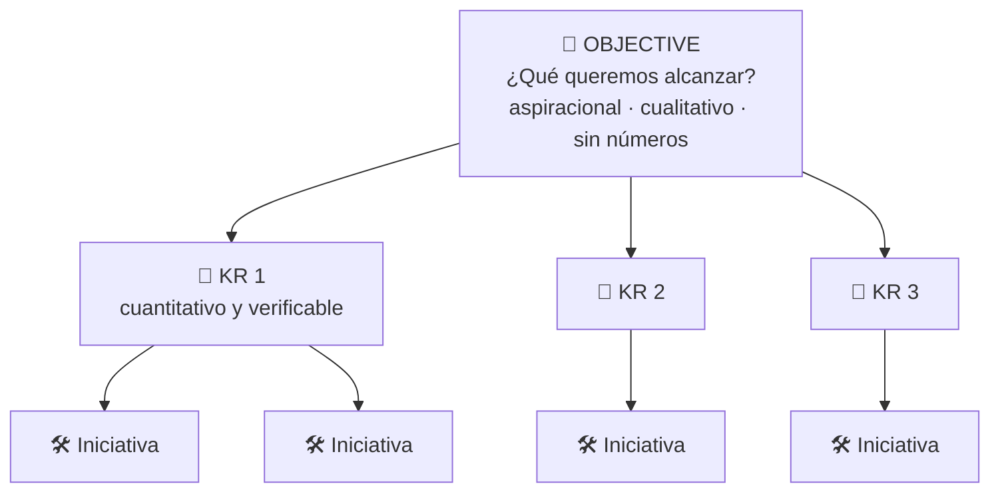
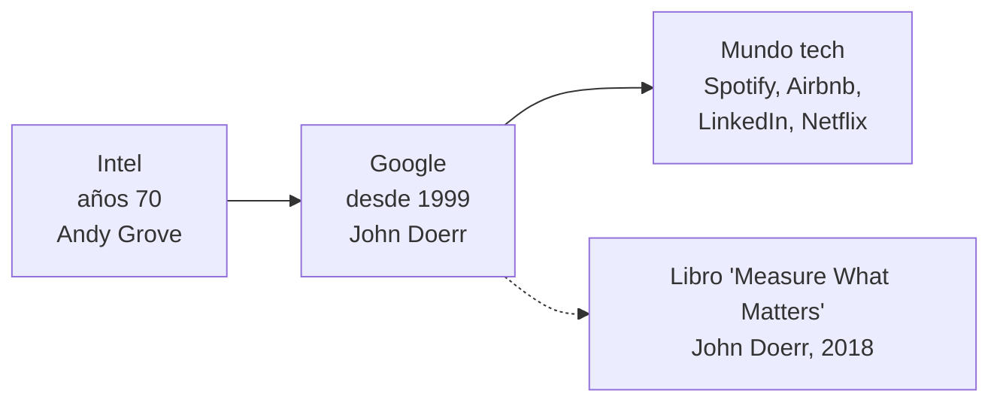
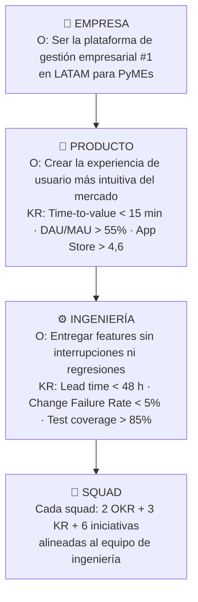
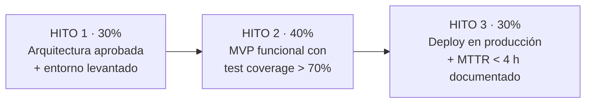
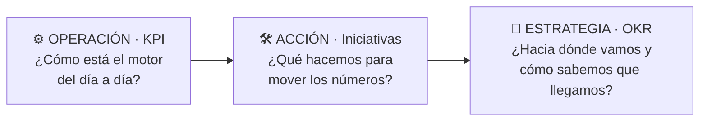

# 19 · OKR: Objectives and Key Results

> **Fuente en el material:** *KPI & OKR* (Ing. Mario Barrios), módulo 08, Ejercicio 02 y cierre.
> **Prerrequisitos:** [18 KPI](18-kpi.md).
> **Tiempo estimado:** 70 min.
> **Resto de la materia · Tema 19** (KPI & OKR · Barrios). No entra en el Primer Parcial.

---

## 🎯 Objetivos de aprendizaje

1. Definir **OKR** y conocer su **origen** (Intel → Google → mundo tech).
2. Explicar su **estructura**: Objective, Key Results e Iniciativas, y la **regla de oro**.
3. **Diferenciar KPI y OKR** y explicar por qué son **complementarios**.
4. **Escribir** buenos Objectives (test del lunes) y buenos Key Results (verificables por un tercero).
5. Explicar la **cascada de OKR** (empresa → producto → ingeniería → squad).
6. Identificar los **seis errores frecuentes**.
7. Aplicar OKR al **trabajo freelance** con **pago contra hitos**.
8. Integrar **KPI + OKR + Iniciativas** como un sistema de gestión por resultados.

---

## 🗺️ Esquema del tema

- **I. Qué son los OKR**
  - A. Definición
  - B. Origen y adopción
  - C. ¿Por qué OKR y no solo KPI?
- **II. Estructura de un OKR**
  1. Objective (O)
  2. Key Results (KR)
  3. Iniciativas
  - + Regla de oro
- **III. KPI vs. OKR**
- **IV. Cómo escribir un buen Objective**
- **V. Cómo definir Key Results efectivos**
- **VI. Ejemplos completos**
  - A. Equipo de ingeniería
  - B. Equipo comercial / freelancer
- **VII. La cascada de OKR**
- **VIII. Errores frecuentes** (6)
- **IX. OKR en el trabajo freelance y por proyectos**
- **X. El sistema completo: KPI + OKR + Iniciativas**
- **XI. Ejercicio: tu primer OKR completo**
- **XII. Cierre: preguntas para llevarse**

---

## 🧠 Mapa visual

---

## 📖 Desarrollo

## I. Qué son los OKR

### I.A Definición

> 📌 *"OKR (**Objectives and Key Results**) es un **sistema de gestión de objetivos** que **conecta metas aspiracionales con indicadores medibles de progreso**, para **alinear a toda la organización** en torno a lo que realmente importa."*

### I.B Origen y adopción

- **Desarrollado por Andy Grove en Intel (años 70)**.
- **Popularizado por Google desde 1999** de la mano de **John Doerr**.
- Doerr lo documentó en ***Measure What Matters*** (**2018**).
- **Larry Page** atribuyó parte del crecimiento de Google a implementar OKR en sus primeros años.
- Hoy lo usan **Spotify, Airbnb, LinkedIn, Netflix** y la mayoría de las tecnológicas a escala global.

### I.C ¿Por qué OKR y no solo KPI?

> 📌 *"Los KPI **miden el estado de un proceso**. Los OKR **establecen hacia dónde va la organización y cómo lo sabe**. Son **complementarios, no excluyentes**. Un OKR incluye KR que son, en esencia, **KPI de progreso con contexto estratégico**."*

---

## II. Estructura de un OKR

| Componente | Pregunta | Características | Ejemplo de la cátedra |
|---|---|---|---|
| **01 · Objective (O)** | **¿Qué queremos alcanzar?** | **Aspiracional, cualitativo e inspirador. No contiene números. Define dirección.** | *"Ser la plataforma de pagos más confiable del país."* |
| **02 · Key Results (KR)** | **¿Cómo sabemos que lo logramos?** | **Cuantitativos, medibles y verificables. Entre 2 y 5 por objetivo.** | *"Uptime > 99,95 % en Q3"*, *"MTTR < 2 h"*. |
| **03 · Iniciativas** | **¿Qué hacemos para moverlos?** | **Acciones concretas** que impactan los KR. **Se abandonan si no mueven el número.** | *"Implementar circuit breakers en servicios críticos."* |

> 📌 **Regla de oro:** *"**Si se cumplen todos los KR, el Objective debería estar logrado.** Si no, los KR están mal elegidos."*

> 💡 **Nota del docente sobre "Uptime > 99,95 % en Q3":** significa que **durante el tercer trimestre** el sistema debe estar **activo y funcionando correctamente al menos el 99,95 % del tiempo total**.
>
> ➕ *Contexto adicional – calculá cuánta caída permite:* un trimestre ≈ 92 días × 24 h × 60 min = 132.480 min. El 0,05 % de caída permitida = 132.480 × 0,0005 ≈ **66 minutos en todo el trimestre**.

> ⚠️ **Iniciativa ≠ KR:** la iniciativa es **lo que hacés** (actividad); el KR es **lo que lográs** (resultado). Si una iniciativa no mueve el KR, **se abandona** — el KR no.

---

## III. KPI vs. OKR

| **KPI** – Key Performance Indicator | **OKR** – Objectives & Key Results |
|---|---|
| **Mide el estado actual** de un proceso o área | Define **hacia dónde va** la organización **en 90 días** |
| **Monitoreo continuo** (siempre activo) | Es **temporal**: **se resetea cada trimestre** |
| Orienta la **operación cotidiana** | Orienta la **estrategia y priorización** |
| **Puede existir sin un objetivo aspiracional** | **Siempre parte de un objetivo aspiracional** |
| Ej: uptime mensual, NPS, churn rate | Ej: *"Ser el equipo más ágil de la empresa"* |

### Tabla comparativa de la cátedra: KPI vs. OKR 🔥

> 🔥 Según lo anotado en clase por otro grupo, **va a ser pregunta del final**. ⚠️ Esta tabla **no está en las diapositivas de tu carpeta**: se transcribió del repo de un compañero ([Valenpl](https://github.com/Valenpl/tecnologia-e-innovacion-uade), tema 22).

| Característica | **KPI** (*Key Performance Indicator*) | **OKR** (*Objectives and Key Results*) |
|---|---|---|
| **Definición** | Indicador cuantitativo que mide la **eficiencia y salud de un proceso** en marcha. | **Metodología de gestión ágil** para alinear equipos hacia **metas ambiciosas**. |
| **¿Qué responde?** | *¿Cómo lo estamos haciendo hoy? ¿A qué ritmo avanzamos?* | *¿Hacia dónde queremos ir (O) y cómo mediremos el éxito (KR)?* |
| **Enfoque principal** | **El Viaje (Monitoreo).** Controlar las variables críticas del día a día. | **La Estrategia (Crecimiento).** Impulsar la innovación y resolver problemas en equipo. |
| **Frecuencia de revisión** | **Alta** (diaria o semanal). | **Media** (trimestral, con *check-ins* semanales). |
| **Nivel de éxito exigido** | **100 % de cumplimiento.** Es el estándar mínimo operativo aceptable. | **60 % – 70 % de cumplimiento.** Al ser metas muy agresivas (*stretch goals*), el 100 % es raro. |
| **Flexibilidad** | **Baja.** La métrica es fija (ej.: "tasa de conversión") para poder comparar el histórico. | **Alta.** Se redefinen, cambian o eliminan por completo cada 90 días según el mercado. |

> ⚠️ **La fila que más se confunde:** un KPI al **100 %** es lo **mínimo** (si el uptime pactado no se cumple, hay un problema). Un OKR al **100 %** suele indicar que la meta **no era lo bastante ambiciosa**; lo esperable es **60–70 %**.

> 📌 *"**Los KPI te dicen cómo estás. Los OKR te dicen adónde querés ir.** Un KR bien definido dentro de un OKR es **un KPI con contexto estratégico**."*

> 💡 **Analogía:** los KPI son el **tablero del auto** (velocidad, temperatura, combustible: siempre encendido). El OKR es **el destino del viaje** de este trimestre y los hitos que te dicen si estás llegando.

> 📝 **Citar y explayarse:** La cátedra define OKR como *"un sistema de gestión de objetivos que conecta metas aspiracionales con indicadores medibles de progreso, para alinear a toda la organización en torno a lo que realmente importa"*. Se compone de un **Objective**, cualitativo e inspirador, y de **Key Results**, medibles, que prueban si se logró. Con los KPI se complementa: *"los KPI te dicen cómo estás; los OKR te dicen adónde querés ir"*, y un buen KR es *"un KPI con contexto estratégico"*. Es decir, los KPI son el tablero del auto, siempre encendido, y el OKR es el destino del viaje de este trimestre. Un objetivo como "ofrecer una plataforma en la que nuestros clientes confíen" puede medirse, por ejemplo, con el KR "uptime mayor al 99,95 % en el tercer trimestre".

---

## IV. Cómo escribir un buen Objective

> 📌 **El "test del lunes":** *"¿Al equipo **le da energía arrancar la semana** con ese objetivo en mente?"*

Un buen Objective:
1. **No contiene números** (eso va en los KR).
2. Es **aspiracional pero alcanzable en 90 días**.
3. Está escrito en **voz activa** e es **inequívoco**.
4. **Se desprende de la misión y visión**.
5. **Genera alineación**: todos saben qué significa.

| Área | ✅ Buen Objective (cátedra) |
|---|---|
| **Ingeniería** | *"Construir el sistema de entrega más confiable y rápido del equipo."* |
| **Producto** | *"Convertir la app en la herramienta favorita para gestionar el día laboral."* |
| **Comercial** | *"Demostrar que nuestro producto es la mejor inversión para una PyME tech."* |

> ❌ **Mal Objective:** *"Aumentar el uptime a 99,9 % y reducir bugs a menos de 5 por sprint."* → **Eso son KR, no un Objective** (tiene números y no inspira dirección).

---

## V. Cómo definir Key Results efectivos

> 📌 *"Los KR son **la evidencia del logro**. Si el KR no puede contestar **'¿cómo sabemos que lo logramos?'**, no es un KR válido."*

| Objetivo | ✅ KR válido | ❌ Error común | ¿Por qué falla? |
|---|---|---|---|
| Mejorar calidad del producto | **Defect Escape Rate < 3 %** | "Mejorar los procesos de QA" | **No es medible, es una iniciativa** |
| Aumentar adopción del cliente | **Adoption Rate > 80 % en 60 días** | "Capacitar al cliente" | **Es una acción, no un resultado** |
| Acelerar las entregas | **Lead time < 48 horas** | "Hacer más deploys" | **Sin número ni baseline** |
| Escalar comercialmente | **MRR de USD 50K al fin del Q** | "Conseguir más clientes" | **Ambiguo, no verificable** |

> 📌 **Regla práctica:** *"Si **alguien externo al equipo** puede verificar si el KR se cumplió o no, **sin necesidad de interpretación**, está bien definido."*

> 📝 **Citar y explayarse:** Para la cátedra, los KR son *"la evidencia del logro"*: si un KR no puede responder *"¿cómo sabemos que lo logramos?"*, no es válido. De ahí salen dos reglas. La **regla de oro**: *"si se cumplen todos los KR, el Objective debería estar logrado"*; si no, los KR están mal elegidos. Y la **regla práctica**: un KR está bien definido si *"alguien externo al equipo puede verificar si se cumplió o no, sin necesidad de interpretación"*. El error más común es confundir un KR con una iniciativa: "mejorar los procesos de QA" es algo que se hace; "Defect Escape Rate menor al 3 %" es un resultado que se verifica.

---

## VI. Ejemplos completos

### VI.A Equipo de ingeniería

> **Objective:** *"Convertirnos en el equipo de entrega más rápido y confiable de la empresa en Q3."*
> Q3 2025 (jul–sep) · **Responsable:** Engineering Manager · **Check-in semanal** · Revisión formal: último viernes de cada mes.

| Key Result | Definición | Línea de base | Iniciativas |
|---|---|---|---|
| **KR1: Lead Time < 24 h** | Desde merge aprobado hasta deploy en producción | **72 h** | Automatizar pipeline CI/CD · Reducir tamaño de PR a < 200 líneas |
| **KR2: Change Failure Rate < 4 %** | % de releases que requieren rollback o hotfix | **14 %** | Implementar staging environment · Code coverage > 80 % obligatorio |
| **KR3: MTTR < 2 h** | Tiempo promedio de recuperación ante incidente | **8,5 h** | Runbooks para top 5 incidentes · Alertas automáticas con Datadog |

> 💡 **Aplicá la regla de oro:** si el equipo entrega en < 24 h, con < 4 % de fallas y se recupera en < 2 h… ¿es "el más rápido y confiable"? Sí: **rápido** (KR1) y **confiable** (KR2 + KR3). Los KR cubren las dos palabras del Objective.

### VI.B Equipo comercial / freelancer

> **Objective:** *"Demostrar que nuestro servicio de desarrollo puede sostener un negocio rentable y escalable en 90 días."*

| Key Result | Definición | Línea de base | Iniciativas |
|---|---|---|---|
| **KR1: MRR ≥ USD 5.000** | Ingresos recurrentes mensuales al cierre del trimestre | **USD 1.200** | Convertir 2 proyectos en *retainer* · Lanzar plan de mantenimiento |
| **KR2: NPS de cliente ≥ +50** | Medido al finalizar cada proyecto; genera referidos | — | Encuesta post-entrega automática · Reunión de cierre con demo |
| **KR3: Gross Margin ≥ 60 %** | Margen bruto descontando horas y herramientas | — | Trackear horas reales por proyecto · **Precio por valor, no por hora** |

> 📌 *"El pago contra hitos se vincula directamente: **Hito 1 = KR1 cumplido = cobro del 30 %** del proyecto. Aplica para freelancers individuales y agencias tech."*

> 💡 **Regla de oro aplicada:** "rentable" → KR3 (margen); "escalable" → KR1 (ingresos recurrentes que no dependen de conseguir proyectos nuevos cada mes); "sostener" → KR2 (clientes satisfechos que renuevan y refieren).

---

## VII. La cascada de OKR

> 📌 *"Los OKR se definen **primero a nivel empresa**, luego **se cascadean a equipos**. Cada equipo elige los OKR donde **puede tener impacto real** y define sus propios KR e iniciativas."*

> 📌 **Clave:** *"Los OKR del equipo **no replican los de empresa palabra por palabra**. Son **la contribución real del equipo** a ese objetivo mayor."*

> ⚠️ **Error típico:** copiar el objetivo de la empresa en cada área. Ingeniería no puede "ser la plataforma #1 en LATAM" sola; **sí puede** "entregar features sin interrupciones", que **contribuye** a eso.

> 📝 **Citar y explayarse:** La cátedra explica que *"los OKR se definen primero a nivel empresa, luego se cascadean a equipos"*, y que cada equipo elige aquellos donde *"puede tener impacto real"*. La clave es que los OKR del equipo *"no replican los de empresa palabra por palabra"*: son *"la contribución real del equipo a ese objetivo mayor"*. Copiar el objetivo general en cada área no sirve, porque ningún equipo puede lograrlo solo; traducirlo a lo que cada uno controla, en cambio, alinea a toda la organización. Si la empresa quiere ser la plataforma número uno para PyMEs en LATAM, ingeniería no puede lograrlo sola, pero sí puede comprometerse a entregar funcionalidades sin interrupciones, que contribuye a ese objetivo.

---

## VIII. Errores frecuentes al implementar OKR

| # | Error | Explicación |
|---|---|---|
| 01 | **Demasiados OKR** | Más de **3–4 objetivos por trimestre** fragmenta el foco. *"Si todo es prioridad, nada lo es."* |
| 02 | **KR como lista de tareas** | *"Hacer 5 reuniones"* es una **iniciativa**, no un KR. **Un KR mide un resultado, no una actividad.** |
| 03 | **OKR sin check-in** | Definir en enero y revisar en diciembre es **planificación, no gestión**. **Sin revisión semanal, el OKR muere.** |
| 04 | **KR fáciles de alcanzar** | **Google recomienda alcanzar el 60–70 % de los KR.** Si siempre llegás al 100 %, **no son aspiracionales**. |
| 05 | **Objetivos sin dueño** | Cada OKR necesita **un responsable visible (un nombre, no un área)**. Sin responsable es *"un buen deseo colectivo"*. |
| 06 | **OKR desconectados de la estrategia** | Si no podés **trazar la línea desde tu OKR hasta la visión de la empresa**, algo está mal. *"El alineamiento es no negociable."* |

> 💡 **Error 04 explicado:** a diferencia de un KPI operativo (donde querés cumplir el 100 %, ej. uptime), los OKR son **aspiracionales**: si siempre cumplís todo, estás apuntando bajo. Lograr un 70 % de una meta ambiciosa suele valer más que un 100 % de una meta cómoda.

---

## IX. OKR en el trabajo freelance y por proyectos

> 📌 *"Los OKR **no son exclusivos de grandes empresas**. Para un freelancer o equipo pequeño son una **herramienta de negociación y transparencia con el cliente**."*

**Pago contra hitos basado en OKR:** el contrato define los KR del proyecto y **cada hito de pago se vincula al cumplimiento verificable de un KR**. *"Elimina la ambigüedad y protege a ambas partes."*

> 📝 **Citar y explayarse:** La cátedra destaca que *"los OKR no son exclusivos de grandes empresas"*: para un freelancer o un equipo pequeño son *"una herramienta de negociación y transparencia con el cliente"*. La aplicación concreta es el **pago contra hitos**: el contrato define los KR del proyecto y cada pago se vincula a un KR cumplido, por ejemplo *"Hito 1 = KR1 cumplido = cobro del 30 %"*. Como el KR es verificable sin interpretación, ambas partes saben qué se entrega y cuándo se cobra, lo que *"elimina la ambigüedad y protege a ambas partes"*. Un desarrollador web, por ejemplo, puede pactar cobrar una parte cuando el sitio esté publicado con un tiempo de carga menor a 2 segundos, en lugar de "cuando esté terminado".

| Beneficios para el **freelancer** | Beneficios para el **cliente** |
|---|---|
| **Claridad** sobre qué se paga y cuándo | **Alineación** desde el inicio sobre qué es éxito |
| **Evidencia objetiva** de la entrega de valor | **Reducción del riesgo** de pagar por baja calidad |
| **Protección ante *scope creep*** del cliente | **Visibilidad del progreso** sin micromanagement |
| **Portfolio con resultados medibles** | **Base objetiva para continuar o pivotar** |

> 💡 ***Scope creep*** = cuando el cliente va agregando pedidos fuera del alcance acordado sin ajustar precio ni plazos. Si los hitos están atados a KR verificables, cualquier pedido nuevo queda claramente "fuera" del contrato.

> 🧩 **Aplicación a un sitio web para un cliente de Fiverr:**
> - **O:** "Lanzar un sitio que convierta visitas en consultas para el negocio del cliente."
> - **KR1:** sitio en producción con Lighthouse Performance ≥ 90 (hito 1, 40 %).
> - **KR2:** formulario de contacto con tasa de envío exitoso del 100 % en pruebas y ≥ 2 % de conversión en el primer mes (hito 2, 40 %).
> - **KR3:** 0 bugs críticos reportados en 30 días post-lanzamiento (hito 3, 20 %).
> *(Ejemplo propio, no de la cátedra.)*

---

## X. El sistema completo: KPI + OKR + Iniciativas

> 📌 *Nota del docente:* *"Son **capas de un mismo sistema de gestión orientado a resultados**."*

| Ritmo | Qué se revisa |
|---|---|
| **Monitoreo continuo** | **KPI operativos** (uptime, errores) **24/7**, con **alertas automáticas** ante anomalías. |
| **Revisión semanal / sprint** | **KPI y estado de los KR** en el **check-in semanal**; el equipo **ajusta iniciativas** en tiempo real. |
| **Revisión trimestral** | Los **OKR se revisan y resetean cada 90 días**: momento de **recalibrar la estrategia**. |

### Síntesis de la cátedra ("Lo que vimos hoy")

1. **KPI es métrica con contexto estratégico** – fórmula, meta, responsable y frecuencia; sin esos cuatro, es solo un número.
2. **Los KPI cambian según la etapa** – desarrollo, implementación y comercialización tienen KPI distintos.
3. **No medir tiene un costo real** – retrabajo, incidentes sin MTTR y churn evitable.
4. **OKR le da sentido a los KPI** – el Objective define la dirección; los KR miden si nos acercamos; las iniciativas son lo que hacemos.
5. **OKR transforma el modelo de trabajo** – de "hacé esto" a "alcanzá este resultado": autonomía, transparencia y pago por resultados.
6. **Son herramientas complementarias** – **KPI para operar, OKR para estrategia, iniciativas para actuar.**

> 📌 *"Lo que no se mide, no se puede mejorar."* — Peter Drucker (frase de cierre de la clase)
>
> | KPI | OKR | Impacto |
> |---|---|---|
> | Lo que **medís** hoy | **Hacia dónde** vas | Lo que **generás** |

> 📝 **Citar y explayarse:** Como cierre, la cátedra plantea que KPI, iniciativas y OKR *"son capas de un mismo sistema de gestión orientado a resultados"*: los KPI muestran cómo funciona la operación, las iniciativas son lo que se hace para mover los números y los OKR marcan hacia dónde va la organización y cómo sabe que llegó. La frase de Peter Drucker que cierra la clase, *"lo que no se mide, no se puede mejorar"*, resume la lógica: sin medición no hay forma de saber si una innovación funciona, ni de aprender de ella. Por eso la medición conecta con toda la materia: con Lean Startup, que valida hipótesis con datos, y con la estrategia de innovación, que necesita indicadores para saber si cada proyecto aporta al objetivo.

---

## XI. Ejercicio: tu primer OKR completo

**Parte A – Individual (10 min):** escribí 1 Objective aspiracional (**sin números**), 2 KR medibles y verificables, 2 iniciativas concretas, y qué herramienta usarías para medir cada KR.

**Parte B – Grupal (12 min, grupos de 3):** cada uno presenta su OKR en 2 min; el grupo evalúa: *¿el Objective tiene números? ¿los KR son verificables?*; eligen el más sólido.

**Pregunta disparadora:** *¿Cómo cambiaría tu OKR si el pago del proyecto dependiera de que los KR se cumplan?*

**Resolución modelo (contexto: estudiante cursando la materia):**

| Componente | Contenido |
|---|---|
| **Objective** | *"Dominar Tecnología e Innovación al punto de poder explicarla sin apuntes."* |
| **KR1** | Nota ≥ 8 en el parcial. *(Herramienta: campus virtual.)* |
| **KR2** | Reconstruir de memoria el esquema de los 19 módulos con ≥ 80 % de los subtemas, antes del parcial. *(Herramienta: checklist propia comparando con este repo.)* |
| **Iniciativa 1** | Estudiar 2 módulos por semana con el método de outlining. |
| **Iniciativa 2** | Resolver todas las autoevaluaciones y el módulo de preguntas integradoras. |

> 💡 **Respuesta a la pregunta disparadora:** si el pago dependiera de los KR, los harías **todavía más verificables** (sin margen de interpretación), **acordarías la línea de base** con el cliente y evitarías KR que dependan de factores que no controlás.

---

## XII. Cierre: preguntas para llevarse

La cátedra deja tres preguntas *"que deberían generar incomodidad productiva"*:

1. **¿Cuál es el KPI más importante de tu proyecto actual y quién es su responsable?** → *Si no podés responder en 5 segundos, probablemente no esté definido.*
2. **¿Qué decisión de esta semana tomarías diferente si tuvieras los datos correctos frente a vos?** → *Los KPI no son para reportar, son para decidir.*
3. **Si tu siguiente cliente te pregunta "¿cómo vamos a medir el éxito?", ¿qué respondés?** → *La respuesta define si es un proyecto o una relación estratégica.*

**Próximos pasos sugeridos por la cátedra:**
1. Identificá **2 KPI** de tu proyecto o práctica profesional con **fórmula, meta, frecuencia y responsable** (*"si no podés completar esos cuatro campos, el KPI no existe todavía"*).
2. Escribí **1 OKR completo** para el próximo trimestre: **1 Objective + 3 KR + 3 iniciativas**.
3. Explorá una herramienta de medición (**Google Looker Studio** y **Weekdone** tienen planes gratuitos) y levantá un dashboard mínimo.

**Bibliografía citada por la cátedra:** Doerr (2018) *Measure What Matters*; Forsgren, Humble & Kim (2018) *Accelerate*; Doran (1981) *There's a S.M.A.R.T. way to write management's goals and objectives*; Kniberg & Ivarsson (2012) *Scaling Agile @ Spotify*. Recursos: whatmatters.com · dora.dev.

---

## ⚠️ Conceptos que se confunden

| Se confunde… | …con | Diferencia |
|---|---|---|
| Objective | Key Result | Cualitativo, **sin números**, inspira vs. cuantitativo, **verificable**. |
| Key Result | Iniciativa | **Resultado** medible vs. **actividad** (se abandona si no mueve el KR). |
| KPI | OKR | **Estado** continuo de un proceso vs. **dirección** temporal (90 días) y aspiracional. |
| Cumplir 100 % de los KR | Éxito | En OKR, **60–70 %** es lo recomendado; 100 % siempre = metas poco ambiciosas. |
| Cascada | Copiar el OKR de la empresa | Cada equipo define **su contribución real**, no replica el texto. |
| Cumplir un KPI al 100 % | Cumplir un OKR al 100 % | KPI: el 100 % es el **mínimo** operativo. OKR: lo esperable es **60–70 %** (*stretch goals*); el 100 % es raro. |

---

## 🔗 Conexiones

- **← [18 KPI](18-kpi.md).**
- **← [07 Gestión 2.0](../parcial-1/07-gestion-de-la-innovacion.md):** liderazgo visionario (Objective inspirador), autonomía.
- **← [16 Estrategia](16-proyectos-y-estrategia-de-innovacion.md):** "dirección clara" y alineación.

---

## ✍️ Autoevaluación

**1. Defina OKR, su origen y su estructura.**

Ver respuesta

**Sistema de gestión de objetivos** que conecta **metas aspiracionales con indicadores medibles de progreso** para alinear a la organización. Desarrollado por **Andy Grove en Intel (años 70)**, popularizado por **Google desde 1999** con **John Doerr** (*Measure What Matters*, 2018). Estructura: **Objective** (qué queremos alcanzar; aspiracional, cualitativo, sin números), **Key Results** (cómo sabemos que lo logramos; cuantitativos, verificables, 2 a 5 por objetivo) e **Iniciativas** (acciones concretas que mueven los KR; se abandonan si no los mueven). Regla de oro: si se cumplen todos los KR, el Objective debería estar logrado.

**2. Compare KPI y OKR en cuatro aspectos.**

Ver respuesta

KPI mide el **estado actual**; OKR define **hacia dónde** ir en 90 días. KPI es **continuo**; OKR es **temporal** (se resetea cada trimestre). KPI orienta la **operación**; OKR la **estrategia y priorización**. KPI **puede existir sin objetivo aspiracional**; OKR **siempre parte** de uno. Son complementarios: un KR es un KPI con contexto estratégico.

**3. Corrija este OKR: "O: Aumentar ventas un 20 %. KR1: Hacer 10 reuniones con clientes. KR2: Mejorar el sitio web."**

Ver respuesta

El **Objective tiene número** (debería ser cualitativo e inspirador). **KR1 es una iniciativa** (actividad, no resultado). **KR2 no es medible**. Versión corregida: **O:** "Convertirnos en la opción preferida de las pymes de la zona." **KR1:** Ingresos del trimestre ≥ USD 120.000 (base 100.000). **KR2:** Conversión del sitio ≥ 3 % (base 1,5 %). **Iniciativas:** 10 reuniones con clientes clave; rediseño de la landing.

**4. ¿Por qué Google recomienda alcanzar el 60–70 % de los KR?**

Ver respuesta

Porque los OKR deben ser **aspiracionales**: si siempre se llega al 100 %, las metas son demasiado fáciles y no empujan a la organización. Un 60–70 % de una meta ambiciosa indica que se apuntó alto.

**5. Explique la cascada de OKR con un ejemplo y su regla clave.**

Ver respuesta

Los OKR se definen primero a nivel **empresa** y se **cascadean** a equipos (producto → ingeniería → squad), donde cada equipo elige los OKR en los que puede tener **impacto real** y define sus KR e iniciativas. Regla: **no replicar palabra por palabra** el OKR de la empresa, sino definir la **contribución real** del equipo. Ej.: Empresa "ser la plataforma #1 para pymes en LATAM" → Ingeniería "entregar features sin interrupciones ni regresiones" (lead time < 48 h, CFR < 5 %, coverage > 85 %).

**6. Enumere los seis errores frecuentes al implementar OKR.**

Ver respuesta

(1) Demasiados OKR; (2) KR como lista de tareas; (3) OKR sin check-in; (4) KR fáciles de alcanzar; (5) objetivos sin dueño; (6) OKR desconectados de la estrategia.

**7. ¿Qué beneficios tiene el pago contra hitos basado en OKR para el freelancer y para el cliente?**

Ver respuesta

Freelancer: claridad sobre qué se paga y cuándo, evidencia objetiva de valor, protección ante *scope creep*, portfolio con resultados medibles. Cliente: alineación desde el inicio sobre qué es éxito, menor riesgo de pagar por baja calidad, visibilidad del progreso sin micromanagement, base objetiva para continuar o pivotar.

**8. Según la tabla comparativa de la cátedra, compare KPI y OKR en enfoque, frecuencia de revisión, nivel de éxito exigido y flexibilidad.** 🔥

Ver respuesta

**Enfoque:** KPI = el viaje (monitoreo de las variables críticas del día a día); OKR = la estrategia (crecimiento, innovación, resolver problemas en equipo). **Frecuencia:** KPI alta (diaria o semanal); OKR media (trimestral con check-ins semanales). **Éxito exigido:** KPI 100 % (estándar mínimo operativo); OKR 60–70 % (metas agresivas, el 100 % es raro). **Flexibilidad:** KPI baja (métrica fija para comparar el histórico); OKR alta (se redefinen cada 90 días según el mercado).

---

[← 18 KPI](18-kpi.md) · [🏠 Índice](../README.md) · [Siguiente → 20 Propuesta de valor, clientes y competencia](20-propuesta-de-valor-clientes-y-competencia.md)
