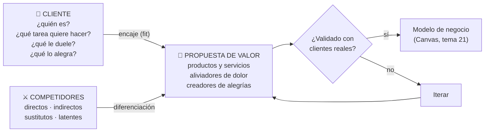
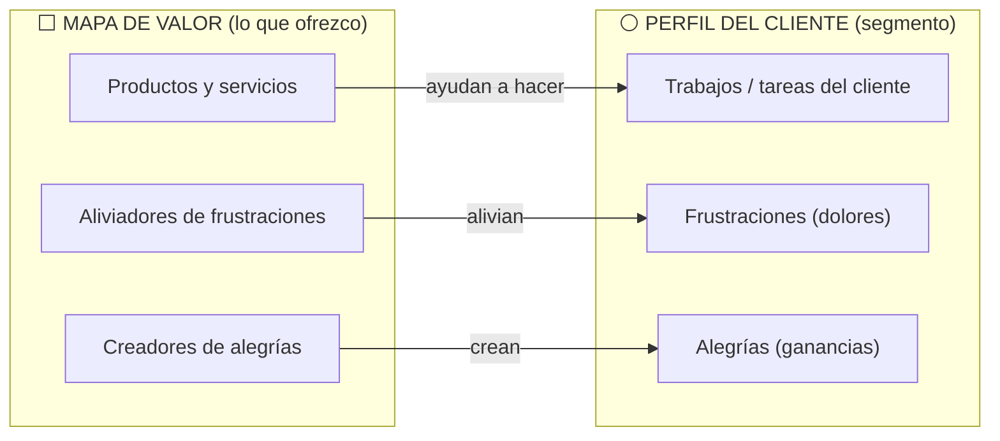

# 20 · Propuesta de valor, análisis de clientes y competencia

> **Fuente en el material:** *Tecnología e Innovación – Clase 4 – Propuesta de Valor, Segmentación y CANVAS 2026* (Ing. Mario Barrios), diapositivas 1–32. Videos de apoyo en *Videos Canvas.docx* (ver al final).
> **Prerrequisitos:** [13 Design Thinking](../parcial-1/13-design-thinking.md), [17 Lean Startup y MVP](17-lean-startup-y-mvp.md).
> **Tiempo estimado:** 60 min.
> **Resto de la materia · Tema 20** (Clase 4 · Barrios). Clase descargada el 2026-10-06. ⚠️ Confirmá con el profesor si entra en el Primer Parcial.

---

## 🎯 Objetivos de aprendizaje

1. Explicar la reflexión de apertura (*"o eres diferente o eres barato"*) y la lógica de **validar rápido**.
2. Definir **propuesta de valor**, cómo hacerla relevante y cómo comprobar que funciona.
3. Identificar **quiénes reciben el valor** (usuario/cliente, empresa, inversor) y diferenciar **B2C** de **B2B**.
4. Usar la **pirámide de Maslow** y la **pirámide de los 30 elementos de valor** para entender qué satisface una propuesta.
5. Armar un **canvas de propuesta de valor** (perfil del cliente + mapa de valor) y detectar **fit** o **misfit**.
6. **Perfilar** al cliente ideal (buyer persona) y **validarlo**.
7. Distinguir los **cuatro tipos de competidores** y construir una **matriz de competitividad**.
8. Nombrar los **11 elementos para crear valor** de Osterwalder.

---

## 🗺️ Esquema del tema

- **I. Reflexión de apertura**
  1. "O eres diferente o eres barato" (Guy Kawasaki)
  2. Hacer y probar rápido
  3. Tres preguntas clave antes de avanzar
- **II. La propuesta de valor**
  1. Qué es
  2. Cómo hacerla relevante
  3. Cómo comprobar que funciona
- **III. Quiénes deben recibir el valor**
  1. Usuario/cliente, empresa, inversor
  2. B2C vs. B2B
- **IV. Qué necesidad satisface: las pirámides**
  1. Pirámide de Maslow
  2. Pirámide de preferencias y de los 30 elementos de valor
  3. Atributos
  4. Los 11 elementos para crear valor (Osterwalder)
- **V. Canvas de propuesta de valor**
  1. Perfil del cliente y mapa de valor
  2. Fit y misfit (caso NEXA Vision)
  3. La fórmula de la propuesta de valor
- **VI. Análisis de clientes**
  1. Por qué es clave
  2. Cómo perfilar al cliente ideal
  3. Validación del cliente y errores comunes
- **VII. Competidores**
  1. Qué es un competidor
  2. Los cuatro tipos
  3. Por qué es clave conocerlos
  4. Matriz de competitividad

---

## 🧠 Mapa visual

---

## 📖 Desarrollo

## I. Reflexión de apertura

### I.1 "O eres diferente o eres barato"

> 📌 *"Al final, o eres diferente o eres barato."* — **Guy Kawasaki** (especialista en marketing y tecnología)

La cátedra lo desarrolla en tres ideas:
- **Competencia de precios:** si tu producto es igual al de los demás, no tenés un valor único; la única forma de atraer clientes es **cobrar menos**.
- **Guerra de precios:** competir solo por precio **destruye los márgenes** y desgasta el negocio.
- **El valor de la diferencia:** si ofrecés algo único o innovador, los clientes te valoran más y podés **cobrar precios justos** sin ser el más barato.

> 🔗 La misma idea aparece en la **Estrategia del Océano Azul** (tema [21](21-estrategias-oceano-azul-y-canvas.md)): *"En el mundo actual, sos distinto o sos barato"* (Chan Kim y Mauborgne).

### I.2 Hacer y probar rápido

> 📌 *"Hacer y probar rápido. Aprender y ajustar aún más rápido."*

- ✅ **No asumas, validá:** las ideas no valen nada sin feedback real.
- ✅ **MVP ≠ producto final:** es una versión mínima para testear y aprender.
- ✅ **El mercado es el juez:** una buena propuesta de valor es la que resuelve un problema real para un cliente real.
- ✅ **Iterar es obligatorio:** cada test es una mejora; sin cambios no hay evolución.
- ✅ **Velocidad sobre perfección:** mejor validar en 1 mes que gastar 1 año en algo que nadie quiere.

### I.3 Tres preguntas clave antes de avanzar

1. ¿El problema es **relevante** para el usuario?
2. ¿La solución **realmente mejora** su situación?
3. ¿Qué **evidencia** tenemos de que **pagarían** por esto?

---

## II. La propuesta de valor

### II.1 Qué es

> 📌 *"Es la **razón por la que los clientes eligen tu solución en lugar de la competencia**. Debe responder: ¿Qué problema resuelvo? ¿Por qué mi solución es mejor?"*

### II.2 Cómo hacerla relevante

| Condición | Qué significa |
|---|---|
| **Clara y específica** | Evitar frases genéricas como *"somos los mejores"*. |
| **Centrada en el cliente** | Explicar el **beneficio directo** que obtiene. |
| **Diferenciadora** | Destacar frente a la competencia. |

### II.3 Cómo comprobar que funciona

- **Validación real:** presentar la propuesta a clientes potenciales y **medir su interés**.
- **Test rápido:** ¿la audiencia entiende el valor **en segundos**?
- **Conversión:** si no genera ventas o interés, **hay que ajustarla**.

> 📝 **Citar y explayarse:** La cátedra define la propuesta de valor como *"la razón por la que los clientes eligen tu solución en lugar de la competencia"*, y le pide responder dos preguntas: *"¿Qué problema resuelvo? ¿Por qué mi solución es mejor?"*. Es decir, no es una descripción del producto sino del **beneficio** que el cliente obtiene y de por qué es distinto de las alternativas. Para ser relevante tiene que ser clara y específica (nada de *"somos los mejores"*), centrada en el cliente y diferenciadora; y como es una hipótesis, hay que comprobarla con clientes reales: si la audiencia no entiende el valor en segundos o no se convierte en ventas o interés, hay que ajustarla. Por ejemplo, *"turnos médicos online"* es una descripción; *"sacá turno con tu médico en 30 segundos, sin llamar y sin esperar"* es una propuesta de valor.

---

## III. Quiénes deben recibir el valor

### III.1 Usuario/cliente, empresa, inversor

| Destinatario | Rol (cátedra) |
|---|---|
| **Usuario / cliente** | Quienes **validan, aceptan, rechazan o usan** el producto. Son los **formadores del mercado en B2C**. |
| **Empresa** | Usuarios del producto; pueden ser **socios estratégicos** o **clientes en B2B**. |
| **Inversor** | Quienes poseen **capital de riesgo** y están dispuestos a invertir en la potencialidad de una startup. |

> 💡 Una startup tiene que convencer **a los tres**: al usuario (que lo use), a la empresa (que lo compre o se asocie) y al inversor (que lo financie). Cada uno valora cosas distintas.

### III.2 B2C vs. B2B

| | **B2C** (*Business-to-Consumer*) | **B2B** (*Business-to-Business*) |
|---|---|---|
| A quién vende | Al **consumidor final**, sin intermediarios. | A **otras empresas**. |
| Volumen | Muchas compras chicas. | **Compras al por mayor.** |
| Decisión | Rápida. | **Proceso lento**: lleva tiempo y requiere **contratos**. |
| Relación | Masiva. | **Relaciones largas**: socios por muchos años. |
| Otras características | **Influencia en precios** (por volumen fijan tendencias) · **omnicanalidad** (tiendas físicas + digitales). | — |

---

## IV. Qué necesidad satisface: las pirámides

### IV.1 Pirámide de Maslow

> 📌 *"Teoría de Maslow, teoría de las necesidades. **Debemos comprender qué satisface nuestra propuesta de valor.**"*

De la base a la cima: **fisiológicas** (alimentación, salud, respiración, descanso) → **seguridad** (vivienda, empleo) → **sociales** (afecto, asociación, aceptación) → **autoestima** (reconocimiento, confianza, respeto, éxito) → **autorrealización** (desarrollo del potencial).

> ➕ **Contexto adicional:** Abraham Maslow la presentó en 1943 en *"A Theory of Human Motivation"* (psicología humanista).

### IV.2 Pirámide de preferencias y de los 30 elementos de valor

La **pirámide de preferencias** traslada la idea a productos: *"oferta de atributos fundamentales en productos y servicios. + atributos + oportunidades de adoptarlos"*. Las necesidades del usuario se ordenan en **impacto funcional y emocional**, **cambio de vida** e **impacto social**.

La cátedra usa la **pirámide de los 30 elementos de valor** (Almquist, Senior y Bloch, Bain & Company, *Harvard Business Review*, 2016):

| Nivel (de abajo arriba) | Ejemplos de elementos |
|---|---|
| **Funcional** | Ahorrar tiempo · simplificar · hacer dinero · reducir riesgos · reducir costos · calidad · variedad · informar · organizar · evitar molestias. |
| **Emocional** | Bienestar · reducir la ansiedad · diseño y estética · nostalgia · diversión · recompensarme · valor terapéutico. |
| **Cambiar la vida** | Autoactualización · proveer esperanza · motivación · herencia/legado · afiliación y pertenencia. |
| **Impacto social** | Autotrascendencia. |

> 💡 **Para entenderlo:** cuanto más arriba en la pirámide llega una propuesta, más difícil es de copiar y más lealtad genera. Un banco que solo "reduce costos" compite por precio; uno que además "reduce la ansiedad" (te avisa antes de un gasto raro) se diferencia.

### IV.3 Atributos

Los atributos de la propuesta: **solucionan los problemas** de los clientes; **satisfacen sus necesidades**; **materializan la estrategia para el segmento objetivo**; combinan **precio, producto, servicio e imagen de marca**; y **comunican de manera diferenciada** el "valor" frente a la oferta de la competencia.

### IV.4 Los 11 elementos para crear valor (Osterwalder)

La diapositiva 14 de la clase (solo imagen) muestra una rueda con **"11 elementos para crear valor"**, adaptación de **Alexander Osterwalder** (creador del Business Model Canvas):

| Elemento | Cómo crea valor (cátedra) | 🧩 Ejemplo (➕) |
|---|---|---|
| **Novedad** | Cubrir una necesidad que antes no existía por falta de oferta. | El primer smartphone con tienda de apps. |
| **Rendimiento** | Aumentar el desempeño de un producto. | Una notebook con el doble de batería. |
| **Personalización** | Crear valor para segmentos específicos de clientes. | Zapatillas diseñadas a medida online. |
| **Hacer el trabajo** | Ayudar al cliente a realizar una tarea específica (ej.: contabilidad). | Un software que liquida sueldos solo. |
| **Diseño** | Crear valor a través de la superioridad estética del producto. | Muebles de diseño. |
| **Marca y estatus** | Valor basado en el reconocimiento y la posición social de la marca. | Un reloj de lujo. |
| **Precio** | Ofrecer un valor similar por un precio menor. | Aerolíneas low cost. |
| **Reducción de costos** | Reducir costos para el cliente final. | Un software que baja el consumo de energía de una fábrica. |
| **Reducción de riesgos** | Hacer más segura la adquisición de valor. | Garantía extendida, prueba gratis de 30 días. |
| **Accesibilidad** | Dar acceso a un producto a clientes que no podían comprarlo. | Alquilar autos por hora en lugar de comprarlos. |
| **Comodidad y usabilidad** | Facilitar el uso de un producto. | Pagar con el celular en lugar de con efectivo. |

> 💡 **Diferencia con la pirámide de los 30 elementos:** la pirámide de Bain ordena los elementos por **niveles de necesidad** (funcional → impacto social); la rueda de Osterwalder es una **lista de palancas** para construir la propuesta de valor, sin jerarquía. Varias coinciden (reducir costos, reducir riesgos, diseño).

> 🔗 Estos elementos son los que se escriben en el bloque **"Propuesta de valor"** del Business Model Canvas (tema [21](21-estrategias-oceano-azul-y-canvas.md#vii-business-model-canvas)).

---

## V. Canvas de propuesta de valor

### V.1 Perfil del cliente y mapa de valor

> 📌 *"Vinculamos la estructura central y lateral derecha con los dolores y formas de resolverlos. Debemos analizar el proceso del trabajo/tarea que realizan los usuarios y cómo mejorar su experiencia. **'Hacerlos felices'**."*

| Lado | Bloque | Pregunta |
|---|---|---|
| **Perfil del cliente** (círculo) | Trabajos del cliente | ¿Qué tarea intenta hacer? |
| | Frustraciones / dolores | ¿Qué le molesta, qué riesgo o costo sufre? |
| | Alegrías / ganancias | ¿Qué resultado o beneficio desea? |
| **Mapa de valor** (cuadrado) | Productos y servicios | ¿Qué ofrezco? |
| | Aliviadores de frustraciones | ¿Cómo elimino o reduzco cada dolor? |
| | Creadores de alegrías | ¿Cómo genero cada ganancia? |

> ➕ **Contexto adicional:** el canvas de propuesta de valor es de **Alexander Osterwalder** (*Value Proposition Design*, 2014), el mismo autor del Business Model Canvas.

### V.2 Fit y misfit: el caso NEXA Vision

La cátedra aplica el canvas al **caso NEXA** del TP (*"Lienzo de valor NEXA 2025: análisis de ajuste"*):

| | Lo que encaja (**fit técnico**) | Lo que no encaja (**misfit**) |
|---|---|---|
| **Mapa de valor (NEXA Vision)** | Predicción de demanda con IA; automatización de precios; soporte para escalar; plataforma integral "todo en uno". | **Falla crítica:** no alivia el **miedo social** a la filtración o al uso masivo de datos. |
| **Perfil del cliente (pymes)** | Quieren automatizar decisiones de stock, predecir la demanda exacta y reducir costos operativos. | **Nuevo dolor:** *temor al rechazo social por falta de privacidad de datos*. |

En la visualización *"Análisis de encaje de NEXA Vision: tecnología vs. mercado"*: el **fit teórico** (uso de IA en predicción, velocidad de ajuste de precios) es alto, pero el **misfit real** (frecuencia de predicciones fallidas, costo operativo de implementación, repulsión pública por privacidad) lo contradice.

> ➕ **Nota de la cátedra:** *misfit* = desajuste, incompatibilidad o falta de encaje.

> 💡 **La lección:** una propuesta puede tener **ajuste técnico** (la tecnología hace lo que promete) y aun así **no encajar con el mercado** porque crea un **dolor nuevo** que no estaba en el perfil del cliente. Por eso el canvas se **valida** con clientes reales y no se completa una sola vez.

> 🔗 Conexión con el TP NEXA: [casos/nexa-enunciado.md](../evaluacion/casos/nexa-enunciado.md). Y con el **problema ético** de innovar (privacidad de datos, tema [12](../parcial-1/12-innovacion-tecnologica-e-ia.md)) y la ética en Data Mining (tema [09](../parcial-1/09-data-mining.md)).

### V.3 La fórmula de la propuesta de valor

> *"Our [products and services] help(s) [customer segment] who want to [jobs to be done] by [verb (reducing, avoiding)] [a customer pain] and [verb (increasing, enabling)] [a customer gain] (unlike [competing value proposition])."*

| Parte | Qué va | Ejemplo de la cátedra |
|---|---|---|
| **Nuestro** [producto] | Nombre del producto o servicio. | Nuestro champú natural en barra |
| **ayuda a** [segmento] | El cliente ideal. | ayuda a personas con cuero cabelludo sensible |
| **que quieren** [tarea] | La tarea o meta del cliente. | que quieren lavar su cabello sin químicos fuertes |
| **reduciendo/evitando** [dolor] | Verbo de reducción + dolor. | al evitar la picazón y la resequedad |
| **y aumentando/permitiendo** [ganancia] | Verbo de aumento + beneficio. | y mejorar el brillo natural de su cabello |
| **a diferencia de** [competencia] | Qué hace la competencia y por qué sos distinto. | a diferencia de los champús comerciales con sulfatos agresivos |

> 🧩 **Practicalo con NEXA:** *"NEXA Vision ayuda a pymes que quieren controlar su inventario reduciendo el capital atrapado en stock que no rota y aumentando la precisión de sus pedidos, a diferencia de los sistemas complejos y caros de las grandes empresas."* ¿Qué le falta para resolver el misfit? Un aliviador del dolor de privacidad (por ejemplo, datos anonimizados y procesados localmente).

---

## VI. Análisis de clientes

### VI.1 Por qué es clave

> 📌 *"Un emprendimiento **no sobrevive por su idea**, sino por su **capacidad de resolver un problema real**."*

Preguntas clave: ¿Quién es mi cliente ideal? (**segmentación**) · ¿Qué problemas enfrenta en su día a día? · ¿Cómo toma decisiones de compra? · ¿Qué lo frustra de las soluciones actuales? · ¿Cuánto estaría dispuesto a pagar?

### VI.2 Cómo perfilar al cliente ideal (buyer persona)

| Dimensión | Preguntas |
|---|---|
| **01 · Datos demográficos** | Edad, género, ubicación, nivel socioeconómico; tipo de negocio (si es B2B). |
| **02 · Comportamiento y hábitos** | ¿Cómo busca información? ¿Qué criterios usa para comprar? ¿Dónde consume contenido (redes, eventos, boca a boca)? |
| **03 · Dolores y necesidades** | ¿Cuáles son sus mayores frustraciones? ¿Qué espera de una solución ideal? ¿Qué tan abierto está a cambiar su forma de hacer las cosas? |

> 💡 *Tip de la cátedra:* entender al cliente permite diseñar una propuesta de valor irresistible.

### VI.3 Validación del cliente y errores comunes

**Cómo validar ("prueba en el mundo real"):** entrevistas y encuestas · experimentos rápidos (**MVPs**, demos o versiones gratuitas) · métricas clave (tasa de respuesta, intención de compra, % de usuarios interesados).

**Errores comunes:**
- ❌ Suponer que **"todos"** son clientes (falta de segmentación).
- ❌ No hablar con clientes reales **antes** de desarrollar.
- ❌ Enfocarse en **características** del producto en lugar de **beneficios** reales.

> 📌 *"Tu idea es solo una **hipótesis**. Hay que validarla."* · *"La validación temprana ahorra tiempo, dinero y fracasos."*

---

## VII. Competidores

### VII.1 Qué es un competidor

> 📌 *"Un competidor es **cualquier empresa o solución que satisface la misma necesidad que tu negocio**."* Nadie opera solo: siempre hay otras opciones que el cliente puede elegir.

### VII.2 Los cuatro tipos

| Tipo | Definición (cátedra) | Ejemplo de la cátedra (agro) |
|---|---|---|
| **Directa** | Producto o servicio **muy similar**, dirigido al **mismo público**. | Dos plataformas SaaS para gestión de cultivos. |
| **Indirecta** | Resuelve **el mismo problema, pero de otra manera**. | El productor usa una **planilla de Excel**. |
| **Sustituta** | Alternativa que **puede reemplazar** tu solución, aunque **no sea idéntica**. | Un **asesor agrícola** con recomendaciones personalizadas. |
| **Latente** | **Aún no está** en tu mercado, pero **puede ingresar** y volverse una amenaza. | Un **gigante tecnológico global** lanzando una herramienta para el agro con IA y data mining. |

> ⚠️ **Indirecta vs. sustituta:** se parecen mucho. La indirecta **resuelve el mismo problema** de otra forma (Excel también gestiona cultivos); la sustituta **reemplaza la necesidad** de tu solución con algo distinto (un asesor humano en vez de software).

> 🔗 **En Nokia:** al principio, Apple parecía un competidor **latente** (no fabricaba teléfonos) y Android, un competidor de otra categoría (software). Ese es el riesgo de mirar solo a los competidores **directos**.

### VII.3 Por qué es clave conocer a la competencia

Ayuda a encontrar **ventajas competitivas**; permite **innovar donde otros fallan**; evita lanzar un producto **sin diferenciarlo**.

> 📌 *"Si no sabés con quién competís, tu cliente tampoco sabrá por qué elegirte a vos."*

### VII.4 Matriz de competitividad

Compara tu negocio con la competencia directa e indirecta en variables clave. **Cómo se construye:**
1. Seleccionar **de 3 a 5 competidores** (directos e indirectos).
2. Definir los **criterios clave** (precio, facilidad de uso, innovación, servicio postventa…).
3. Asignar una **escala** (ej.: 1–5) a cada criterio.
4. Identificar **fortalezas y debilidades** frente a la competencia.

Ejemplo de la cátedra:

| | Precio | Facilidad de uso | Innovación | Atención al cliente | Diferenciación | Alcance de mercado |
|---|---|---|---|---|---|---|
| **Nuestro SaaS** | 4 | 5 | 5 | 4 | 5 | 3 |
| Competidor A | 3 | 4 | 4 | 3 | 3 | 5 |
| Competidor B | 5 | 3 | 3 | 4 | 2 | 4 |
| Competidor C | 2 | 5 | 4 | 5 | 4 | 2 |

> 💡 **Lectura:** el SaaS propio es fuerte en facilidad de uso, innovación y diferenciación, pero débil en **alcance de mercado** (3 contra 5 del competidor A). La estrategia sugerida: apoyarse en la diferenciación y trabajar canales para crecer en alcance.

---

## 🎬 Videos de apoyo (cátedra)

- Modelo de propuesta de valor: [video 1](https://www.youtube.com/watch?v=kiWkRiynPAo) · [video 2](https://www.youtube.com/watch?v=ReM1uqmVfP0) · [video 3](https://youtu.be/kqH-6AfDvus)
- Modelo de negocios Canvas: [video](https://youtu.be/ZQgXyiozmYY)

---

## ⚠️ Conceptos que se confunden

| Se confunde… | …con | Diferencia |
|---|---|---|
| Propuesta de valor | Descripción del producto | La propuesta habla del **beneficio** y de **por qué elegirte**, no de las características. |
| Fit técnico | Fit de mercado | La tecnología puede funcionar (técnico) y aun así generar un dolor nuevo que el cliente rechaza (misfit de mercado). |
| Competencia indirecta | Sustituta | Indirecta = mismo problema, otra forma. Sustituta = otra cosa que reemplaza la necesidad. |
| B2C | B2B | B2C: consumidor final, decisión rápida. B2B: empresas, compras al por mayor, proceso lento, relaciones largas. |
| Canvas de propuesta de valor | Business Model Canvas | El primero hace zoom en **cliente + propuesta**; el segundo muestra **todo el negocio** en 9 bloques (tema [21](21-estrategias-oceano-azul-y-canvas.md)). |
| 30 elementos de valor (Bain) | 11 elementos para crear valor (Osterwalder) | Bain: **pirámide** por niveles de necesidad. Osterwalder: **rueda** de palancas para diseñar la propuesta (novedad, rendimiento, personalización, precio…). |

---

## 🔗 Conexiones

- **← [13 Design Thinking](../parcial-1/13-design-thinking.md):** empatizar = perfil del cliente; deseabilidad.
- **← [17 Lean Startup y MVP](17-lean-startup-y-mvp.md):** la propuesta es una hipótesis que se valida con MVP.
- **← [07 Doblin](../parcial-1/07-gestion-de-la-innovacion.md):** diferenciarse en varios tipos de innovación.
- **→ [21 Estrategias y Canvas](21-estrategias-oceano-azul-y-canvas.md):** la propuesta de valor es el bloque central del Business Model Canvas.
- **→ TP NEXA:** [casos/nexa-enunciado.md](../evaluacion/casos/nexa-enunciado.md).

---

## ✍️ Autoevaluación

**1. Defina propuesta de valor y explique cómo hacerla relevante.**

Ver respuesta

Es *"la razón por la que los clientes eligen tu solución en lugar de la competencia"*; responde *¿qué problema resuelvo?* y *¿por qué mi solución es mejor?*. Para ser relevante debe ser **clara y específica**, **centrada en el cliente** (beneficio directo) y **diferenciadora**. Se comprueba con validación real, test rápido (¿se entiende en segundos?) y conversión.

**2. ¿Qué bloques tiene el canvas de propuesta de valor y cuándo hay fit?**

Ver respuesta

**Perfil del cliente:** trabajos del cliente, frustraciones (dolores), alegrías (ganancias). **Mapa de valor:** productos y servicios, aliviadores de frustraciones, creadores de alegrías. Hay **fit** cuando los aliviadores responden a los dolores relevantes y los creadores a las ganancias deseadas; si no, hay **misfit**.

**3. ¿Cuál fue el misfit de NEXA Vision según la cátedra?**

Ver respuesta

Tenía **ajuste técnico** (predicción de demanda con IA, ajuste de precios), pero generó un **nuevo dolor**: el temor de las pymes al rechazo social por falta de privacidad de los datos, que la propuesta no aliviaba (falla crítica → misfit reputacional).

**4. Explique los cuatro tipos de competidores con un ejemplo.**

Ver respuesta

**Directa** (producto muy similar, mismo público: dos SaaS agrícolas) · **indirecta** (mismo problema, otra forma: Excel) · **sustituta** (reemplaza la solución sin ser idéntica: asesor agrícola) · **latente** (no está en el mercado pero puede entrar: gigante tecnológico con IA).

**5. Diferencie B2C y B2B.**

Ver respuesta

**B2C:** venta directa al consumidor final, influencia en precios por volumen, omnicanalidad. **B2B:** venta entre empresas, compras al por mayor, proceso de decisión lento con contratos, relaciones largas.

**6. ¿Para qué sirve la pirámide de Maslow en este tema?**

Ver respuesta

Para **comprender qué necesidad satisface** la propuesta de valor (fisiológicas, seguridad, sociales, autoestima, autorrealización). La pirámide de los 30 elementos de valor la traslada a productos: funcional, emocional, cambio de vida e impacto social.

**7. Mencione tres errores comunes en el análisis del cliente.**

Ver respuesta

Suponer que "todos" son clientes (falta de segmentación); no hablar con clientes reales antes de desarrollar; enfocarse en características del producto en lugar de beneficios reales.

**8. Nombre los 11 elementos para crear valor de Osterwalder.**

Ver respuesta

Novedad, rendimiento, personalización, hacer el trabajo, diseño, marca y estatus, precio, reducción de costos, reducción de riesgos, accesibilidad, comodidad y usabilidad.

---

[← 19 OKR](19-okr.md) · [🏠 Índice](../README.md) · [Siguiente → 21 Estrategias, Océano Azul y Canvas](21-estrategias-oceano-azul-y-canvas.md)
