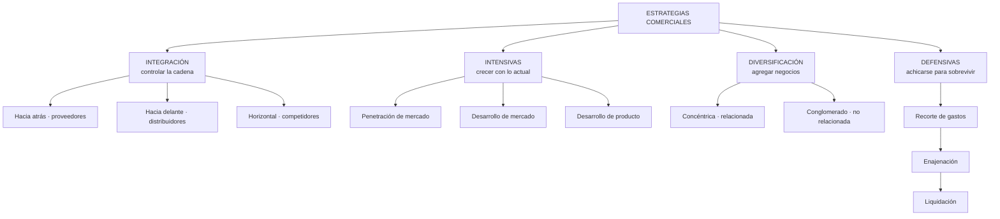
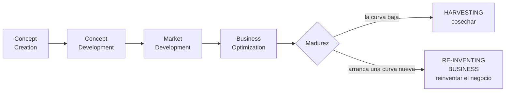
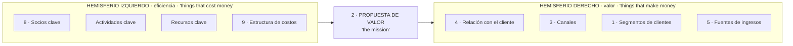

# 21 · Estrategias, Matriz de Ansoff, Océano Azul y Business Model Canvas

> **Fuente en el material:** *Tecnología e Innovación – Clase 4 preparcial – Estrategias 2026* (Ing. Mario Barrios; la portada dice "Clase 5"), diapositivas 1–33 · *Clase 4 – Propuesta de Valor, Segmentación y CANVAS*, diapositivas 33–37 (Business Model Canvas).
> **Prerrequisitos:** [20 Propuesta de valor](20-propuesta-de-valor-clientes-y-competencia.md), [05 Curvas de la tecnología](../parcial-1/05-curvas-de-la-tecnologia.md).
> **Tiempo estimado:** 75 min.
> **Resto de la materia · Tema 21** (Clase preparcial · Barrios). Clase descargada el 2026-10-06. ⚠️ El nombre del archivo dice **"preparcial"**: confirmá con el profesor si entra en el Primer Parcial. Las partes de MVP y Design Thinking de esta clase ya están integradas en los temas [17](17-lean-startup-y-mvp.md) y [13](../parcial-1/13-design-thinking.md).

---

## 🎯 Objetivos de aprendizaje

1. Clasificar las **estrategias comerciales** en cuatro familias (integración, intensivas, diversificación, defensivas) y saber **cuándo** conviene cada una.
2. Leer el **ciclo del producto/negocio** ("Uso de estrategia") y su bifurcación final: **cosechar o reinventar**.
3. Interpretar los **casos financieros** de la clase (ingresos, margen bruto, EBITDA, CAGR).
4. Usar la **Matriz de Ansoff**.
5. Describir el **Design Sprint** de cinco días.
6. Explicar la **Estrategia del Océano Azul**, la **innovación en valor** y la **matriz de las cuatro acciones**.
7. Explicar el **Business Model Canvas** y sus **nueve bloques**.

---

## 🗺️ Esquema del tema

- **I. Estrategias comerciales**
  1. Integración: hacia atrás, hacia delante, horizontal
  2. Intensivas: penetración de mercado, desarrollo de mercado, desarrollo de producto
  3. Diversificación: concéntrica, por conglomerado
  4. Defensivas: recorte de gastos, enajenación, liquidación
- **II. Uso de estrategia: el ciclo del producto/negocio**
- **III. Casos: seis empresas en números**
- **IV. Matriz de Ansoff**
- **V. Design Sprint**
- **VI. Estrategia del Océano Azul**
  1. "Sos distinto o sos barato"
  2. Océano rojo vs. océano azul
  3. Innovación en valor
  4. Matriz de las cuatro acciones
- **VII. Business Model Canvas**
  1. Concepto
  2. Los nueve bloques y sus preguntas
  3. Hemisferio derecho e izquierdo

---

## 🧠 Mapa visual

---

## 📖 Desarrollo

## I. Estrategias comerciales

La clase agrupa las estrategias en **cuatro familias**. Para cada una, la cátedra da la **definición** y los **casos en que conviene** usarla.

> ➕ **Contexto adicional:** esta clasificación y sus "cuándo usar" son los del libro de **Fred R. David**, *Conceptos de administración estratégica*. Una diapositiva lleva la firma de **Mg. Ezequiel Pietracupa**.

### I.1 Estrategias de integración

| Estrategia | Definición (cátedra) | Cuándo conviene (cátedra, resumido) |
|---|---|---|
| **Hacia atrás** | *"Búsqueda de la propiedad o del aumento del control sobre los **proveedores**."* | Proveedores **costosos, poco confiables o incapaces**; **pocos proveedores y muchos competidores**; industria que **crece rápido**; hay **capital y recursos humanos** para dirigir la nueva empresa proveedora. |
| **Hacia delante** | *"Obtención de la propiedad o aumento del control sobre **distribuidores o vendedores minoristas**."* | Distribuidores **costosos, poco confiables o incapaces**; distribuidores de calidad **muy limitados**; industria en **crecimiento**; hay **capital y recursos humanos** para dirigir la distribución propia. |
| **Horizontal** | *"Búsqueda de la propiedad o del aumento del control sobre los **competidores**."* | Se pueden adquirir características de monopolio en una región **sin que el gobierno lo cuestione**; industria en **crecimiento**; las **economías de escala** dan más ventaja; los competidores **titubean** por falta de gestión o recursos (no sirve si el rendimiento de los competidores es deficiente). |

> ⚠️ **Detalle de la cátedra:** las tres integraciones **disminuyen la capacidad de diversificarse** si la industria básica entra en declinación. Por eso se recomiendan en industrias que **crecen**.

> 🧩 **Ejemplos:** hacia atrás → Tesla fabricando sus propias baterías; hacia delante → Apple abriendo sus propias tiendas; horizontal → Facebook comprando Instagram y WhatsApp.

### I.2 Estrategias intensivas

| Estrategia | Definición (cátedra) | Cuándo conviene (cátedra, resumido) |
|---|---|---|
| **Penetración de mercado** | *"Aumento de la participación en el mercado de los productos o servicios **actuales** a través de importantes esfuerzos de **mercadotecnia**."* | Mercados **no saturados**; se puede aumentar la **tasa de uso** de los clientes actuales; los competidores principales **pierden participación** mientras la industria crece; alta correlación entre **ventas y gasto en marketing**; economías de escala. |
| **Desarrollo de mercado** | *"Introducción de los productos o servicios **actuales** en **nuevas áreas geográficas**."* | Hay **nuevos canales** confiables, baratos y de calidad; la empresa tiene **mucho éxito** con lo que hace; hay **mercados inexplorados** o poco saturados; hay capital y recursos humanos; **exceso de capacidad de producción**; la industria se vuelve **global**. |
| **Desarrollo de producto** | *"Incremento de las ventas por medio del **mejoramiento** de los productos actuales o del **desarrollo de nuevos** productos."* | Productos exitosos en **madurez** del ciclo de vida (atraer clientes satisfechos a productos mejorados); industria con **avances tecnológicos rápidos**; competidores con **mejor calidad a precios similares**; industria de crecimiento rápido; **fuertes capacidades de I+D**. |

> 🔗 **Conexión con la curva S:** el desarrollo de producto es la estrategia típica para una tecnología en **madurez**. Pero si la madurez es la **saturación** de la curva y ya hay una curva nueva, mejorar el producto viejo no alcanza (caso Nokia: mejorar teléfonos con teclado).

### I.3 Estrategias de diversificación

| Estrategia | Definición (cátedra) | Cuándo conviene (cátedra, resumido) |
|---|---|---|
| **Concéntrica** | *"Adición de productos o servicios **nuevos, pero relacionados**."* | Industria **sin crecimiento o de crecimiento lento**; los nuevos productos **mejoran las ventas** de los actuales; se pueden ofrecer a **precios competitivos**; tienen **estacionalidad** que compensa los picos y valles actuales. |
| **Por conglomerado** | *"Adición de productos o servicios **nuevos pero no relacionados**."* | Industria básica en **declinación**; oportunidad de adquirir una empresa no relacionada **atractiva como inversión**; **sinergia financiera**; mercados actuales **saturados**; amenaza **antimonopolio** sobre una empresa concentrada en una sola industria. |

> ⚠️ **La diferencia clave, según la cátedra:** la concéntrica *"se basa en la **semejanza** de los mercados, productos o tecnología"*; la de conglomerado *"se basa más en consideraciones sobre las **utilidades**"*.

### I.4 Estrategias defensivas

Van en **escalera**: si una no funciona, se pasa a la siguiente.

| Estrategia | Definición (cátedra) | Cuándo conviene (cátedra, resumido) |
|---|---|---|
| **Recorte de gastos** | *"Reagrupación por medio de la **reducción de costos y activos** para revertir la disminución de ventas y utilidades."* | Capacidad distintiva definida pero objetivos **no logrados** en el tiempo; competidor **débil**; ineficiencias, baja rentabilidad, baja moral, presión de accionistas; los gerentes **fracasaron** en aprovechar oportunidades y fortalezas; crecimiento tan rápido que requiere **reorganización**. |
| **Enajenación** | *"**Venta de una división** o parte de una empresa."* | El recorte de gastos **no alcanzó**; una división necesita **más recursos** de los que la empresa puede darle; una división es responsable del **mal rendimiento** general o **no se adapta** al resto; se necesita **efectivo rápido**; amenaza antimonopolio. |
| **Liquidación** | *"**Venta de los activos** de una empresa, en partes, por su valor tangible."* | Ya se probaron recorte de gastos **y** enajenación sin éxito; la única alternativa es la **bancarrota** (la liquidación es un medio ordenado para obtener el mayor efectivo posible); los accionistas pueden **minimizar pérdidas**. |

> 🧩 **En Nokia:** después de intentar recortes y reorganizaciones, Nokia **enajenó** su división de teléfonos (venta a Microsoft, 2013) y se reinventó en redes. En Kodak: quiebra en 2012 y venta de patentes.

---

## II. Uso de estrategia: el ciclo del producto/negocio

La diapositiva *"Uso de estrategia"* muestra el crecimiento de un producto o negocio en el tiempo, con etapas encadenadas:

| Etapa | Qué pasa | Estrategias que encajan |
|---|---|---|
| **Concept creation / development** | Se crea y desarrolla la idea. | Design Thinking, Design Sprint, MVP. |
| **Market development** | Se lleva al mercado y crece. | Penetración y desarrollo de mercado. |
| **Business optimization** | Se optimiza en la madurez. | Desarrollo de producto, integración, eficiencia. |
| **Harvesting** | Se cosecha lo que queda; la curva cae. | Defensivas (recorte, enajenación). |
| **Re-inventing business** | Se empieza una curva nueva. | Diversificación, océano azul, nueva curva S. |

> 💡 **Para entenderlo:** es la **curva S** vista desde la estrategia. En la madurez, la empresa tiene que elegir: exprimir lo que tiene (**cosechar**) o empezar algo nuevo (**reinventarse**). Es el **dilema de Nokia**: explotar Symbian o explorar una plataforma nueva ([10 ejes, III.1](../evaluacion/nokia-10-ejes-resuelto.md#iii1-el-dilema-estratégico-de-nokia)).

---

## III. Casos: seis empresas en números

La clase muestra los estados de resultados resumidos (en millones de USD, 2016–2021) de seis empresas. Las diapositivas solo muestran las cifras; la **lectura** de la columna derecha es propia (➕ contexto adicional), para practicar.

| Empresa | Ingresos 2016 → 2021 | CAGR ingresos | Margen bruto 2021 | EBITDA 2021 (% ingresos) | ➕ Lectura posible |
|---|---|---|---|---|---|
| **Nike** | 32.376 → 44.538 | 7 % | 45 % | 6.937 (16 %) | Crecimiento sostenido de marca: desarrollo de mercado y de producto; integración hacia delante (venta directa). |
| **Verizon** | 125.980 → 133.613 | 1 % | 58 % | 48.654 (36 %) | Negocio maduro y muy rentable que casi no crece: penetración de mercado; está en *optimization/harvesting*. |
| **Ford** | 151.800 → 136.341 | −2 % | 16 % | 4.523 (3 %); 2020: −4.408 | Ingresos en baja y márgenes finos: candidata a defensivas (recorte de gastos) y a reinventarse (vehículos eléctricos). |
| **Tesla** | 7.000 → 46.848 | 46 % | 23 % | 4.458 (10 %); 2016: −646 | Hipercrecimiento en una curva S nueva; pasó de EBITDA negativo a positivo. Integración hacia atrás (baterías). |
| **Amazon** | 135.987 → 469.822 | 28 % | 42 % | 24.879 (5 %) | Crecimiento enorme con margen EBITDA bajo: penetración y desarrollo de mercado, diversificación concéntrica (AWS). |
| **Apple** | 215.639 → 365.817 | 11 % | 42 % | 108.949 (30 %) | Crecimiento y alta rentabilidad: desarrollo de producto y **sistema de producto** (Doblin). |

> 💡 **Vocabulario:** **CAGR** = tasa de crecimiento anual compuesta. **Margen bruto** = ingresos − costo de ventas. **EBITDA** = resultado operativo antes de intereses, impuestos, depreciaciones y amortizaciones (aproxima la caja que genera la operación).

> ⚠️ **Ojo con el CAGR de Tesla:** la diapositiva muestra un CAGR del EBITDA de **−247 %**: no significa que haya caído, sino que la fórmula no tiene sentido cuando el valor inicial es **negativo** (−646). Bien leído, Tesla pasó de perder a ganar.

---

## IV. Matriz de Ansoff

| Mercado ↓ / Producto → | **Presente** | **Nuevo** |
|---|---|---|
| **Presente** | **Penetración de mercado** | **Desarrollo de producto** |
| **Nuevo** | **Desarrollo de mercado** | **Diversificación** |

> 💡 **Para entenderlo:** son las tres **intensivas** más la **diversificación** de la sección I, ordenadas en una grilla. Cuanto más te alejás de la esquina "presente/presente", **mayor es el riesgo** (diversificación = producto y mercado desconocidos a la vez).

> ➕ **Contexto adicional:** la matriz es de **Igor Ansoff** (1957).

> 🧩 **Ejemplo (Spotify):** penetración = más campañas para sumar suscriptores en Argentina; desarrollo de producto = podcasts y audiolibros para los mismos usuarios; desarrollo de mercado = lanzar en nuevos países; diversificación = un servicio para empresas (música para locales).

---

## V. Design Sprint

Método de innovación de **cinco días** que va de un **desafío** a **aprendizajes**:

| Día | Fase | Qué se hace (cátedra) |
|---|---|---|
| Lunes | **Map** | Presentación del desafío; crear un **mapa del proceso** a recorrer; establecer una **meta**. |
| Martes | **Sketch** | Seleccionar y usar las herramientas necesarias de **facilitación** para esbozar en equipo **posibles soluciones**. |
| Miércoles | **Decide** | Valorizar entre las distintas opciones y **seleccionar una**. |
| Jueves | **Prototype** | Crear un **prototipo realista** de la solución. |
| Viernes | **Test** | Probar con **usuarios reales** la solución creada y **medir las respuestas**. |

> ➕ **Contexto adicional:** el Design Sprint fue creado por **Jake Knapp en Google Ventures** (libro *Sprint*, 2016).

> 🔗 Es un **Design Thinking comprimido** en una semana (tema [13](../parcial-1/13-design-thinking.md)) que termina en algo muy parecido a un **MVP** testeado (tema [17](17-lean-startup-y-mvp.md)).

---

## VI. Estrategia del Océano Azul

### VI.1 "Sos distinto o sos barato"

> 📌 *"En el mundo actual, sos distinto o sos barato."* — **Chan Kim y Renée Mauborgne**

### VI.2 Océano rojo vs. océano azul

| Estrategia del **océano rojo** | Estrategia del **océano azul** |
|---|---|
| Competir en el **espacio existente** del mercado. | Crear un **espacio sin competencia** en el mercado. |
| **Vencer** a la competencia. | Hacer que la competencia **pierda toda importancia**. |
| **Explotar** la demanda existente. | **Crear y capturar** nueva demanda. |
| **Elegir** entre la disyuntiva de valor o costo. | **Romper** la disyuntiva de valor o costo. |
| Alinear todo el sistema de actividades con la decisión estratégica de la **diferenciación o** del **bajo costo**. | Alinear todo el sistema de actividades con el propósito de lograr **diferenciación y bajo costo**. |

> 💡 **La imagen de la cátedra:** el océano rojo está lleno de peces (competidores) peleando por lo mismo; el azul tiene pocos, con espacio para crecer.

### VI.3 Innovación en valor

El centro del océano azul es la **innovación en valor**, que mueve dos variables a la vez:
- ⬇️ **Costos:** *"el ahorro en costos se da al **eliminar o reducir** los factores en los que la industria compite"*.
- ⬆️ **Valor para el cliente:** *"el valor al cliente se aumenta al **elevar y crear** elementos que la industria nunca ha ofrecido"*.

### VI.4 Matriz de las cuatro acciones

| Acción | Pregunta (cátedra) |
|---|---|
| **Eliminar** | ¿Qué esfuerzos de la compañía no están siendo debidamente rentables? |
| **Reducir** | ¿Qué productos o servicios ya no tienen los mismos márgenes de ventas que tenían en el pasado? |
| **Incrementar** | ¿Qué línea de productos o servicios debería aumentar los recursos? |
| **Crear** | ¿Qué nuevas iniciativas tienen posibilidades de desarrollarse en el futuro? |

> 🧩 **Ejemplo clásico (➕ contexto adicional): Cirque du Soleil.** Eliminó los animales y las estrellas de circo (caros); redujo el peligro y el humor de payaso; incrementó la calidad artística del espectáculo; creó un tema y una música propios, como en el teatro. Resultado: un espectáculo nuevo que no compite con los circos tradicionales.

> 📝 **Citar y explayarse:** La Estrategia del Océano Azul, de Chan Kim y Renée Mauborgne, parte de una idea simple: *"en el mundo actual, sos distinto o sos barato"*. En un **océano rojo** las empresas compiten en el espacio existente, intentan vencer a la competencia y se ven obligadas a elegir entre ofrecer más valor o tener menor costo. El **océano azul** propone lo contrario: crear un espacio sin competencia, que la vuelve irrelevante, y **romper la disyuntiva** entre valor y costo mediante la **innovación en valor**: se ahorran costos al eliminar o reducir los factores en los que la industria compite y se aumenta el valor al elevar y crear elementos que la industria nunca ofreció. Para hacerlo, la matriz de las cuatro acciones pregunta qué **eliminar**, qué **reducir**, qué **incrementar** y qué **crear**. El iPhone + App Store es un ejemplo: eliminó el teclado físico, redujo la importancia de la duración extrema de la batería, incrementó la pantalla y la experiencia de uso y creó una tienda de aplicaciones; Nokia, mientras tanto, seguía en el océano rojo de los fabricantes de teléfonos.

---

## VII. Business Model Canvas

### VII.1 Concepto

> 📌 *"Muestra cómo genera valor el negocio, en una sola imagen. El CBM permite **elaborar hipótesis** acerca de cómo va a funcionar el negocio, haciendo interactuar cada una de sus componentes. A medida que la startup **valida con datos y hechos** esas hipótesis, estos componentes van conformando el diseño final del negocio a implementar."*

Autor: **Alexander Osterwalder**.

> 💡 La palabra clave es **hipótesis**: el canvas no es un plan cerrado, sino un conjunto de supuestos que se validan (con MVP, entrevistas, métricas). Por eso se conecta directamente con Lean Startup.

### VII.2 Los nueve bloques y sus preguntas

Numerados en el orden de llenado del lienzo de la *Clase 4*:

| # | Bloque | Qué es (cátedra) | Preguntas guía (cátedra) |
|---|---|---|---|
| 1 | **Segmentos de clientes** | Uno o varios segmentos de clientes. | ¿Para quién estamos creando valor? ¿Quiénes son nuestros clientes más importantes? ¿Cuáles son sus arquetipos? |
| 2 | **Propuesta de valor** | Orientada a resolver las preocupaciones de los clientes y satisfacer sus necesidades. | ¿Qué valor entregamos al cliente? ¿Cuál de sus problemas ayudamos a resolver? ¿Qué paquetes de productos y servicios ofrecemos a cada segmento? ¿Qué necesidades satisfacemos? **¿Qué es el producto mínimo viable?** |
| 3 | **Canales** (distribución y comunicaciones) | Las propuestas de valor llegan a los clientes por la comunicación, la distribución y los canales de venta. | ¿Por qué canales quieren ser alcanzados los segmentos? ¿Cómo los alcanzan hoy otras empresas? ¿Cuáles funcionan mejor? ¿Cuáles son más rentables? ¿Cómo se integran con las rutinas de los clientes? |
| 4 | **Relación con el cliente** | Se establece y mantiene con cada segmento. | ¿Cómo conseguimos, mantenemos y aumentamos clientes? ¿Qué relaciones establecimos? ¿Cómo se integran con el resto del modelo? ¿Qué tan costosas son? |
| 5 | **Fuentes (flujos) de ingresos** | Resultado de las propuestas de valor ofrecidas a los clientes. | ¿Por qué valor están dispuestos a pagar? ¿Qué pagan actualmente? ¿Cuál es el modelo de ingresos? ¿Cuáles son las tácticas de fijación de precios? |
| 6–7 | **Recursos clave** | Medios necesarios para ofrecer y entregar los elementos anteriores. | ¿Qué recursos clave requieren nuestra propuesta de valor, canales, relaciones e ingresos? |
| 6–7 | **Actividades clave** | Actividades críticas para crear el valor ofrecido. | ¿Qué actividades clave requieren nuestra propuesta de valor, canales, relaciones e ingresos? |
| 8 | **Socios / alianzas clave** (red de socios) | Algunas actividades se externalizan y algunos recursos se adquieren fuera de la empresa. | ¿Quiénes son nuestros socios y proveedores clave? ¿Qué recursos adquirimos de ellos? ¿Qué actividades realizan? |
| 9 | **Estructura de costos** | Los elementos del modelo dan como resultado una estructura de costos. | ¿Cuáles son los costos más importantes? ¿Qué recursos y actividades clave son más caros? |

> ⚠️ **Numeración:** las dos diapositivas de la cátedra numeran **recursos** y **actividades** clave como 6 y 7 en distinto orden. Lo que importa es en qué hemisferio está cada bloque.

### VII.3 Hemisferio derecho e izquierdo

> 💡 **Para entenderlo:** el lado **derecho** es el del **cliente** (a quién le sirvo, cómo llego, cómo me relaciono, cuánto me paga): genera ingresos. El lado **izquierdo** es el de la **operación** (qué necesito, qué hago, con quién, cuánto me cuesta): genera costos. La propuesta de valor está en el medio porque une los dos.

> 🧩 **Ejemplo breve (Spotify):** segmentos = oyentes free y premium, artistas; propuesta = toda la música, personalizada, en cualquier dispositivo; canales = app y web; relación = recomendaciones automáticas, playlists; ingresos = suscripción + publicidad; recursos = catálogo licenciado, algoritmos, datos; actividades = desarrollo de la app, licenciamiento; socios = discográficas, fabricantes de dispositivos; costos = regalías, infraestructura.

---

## ⚠️ Conceptos que se confunden

| Se confunde… | …con | Diferencia |
|---|---|---|
| Integración horizontal | Diversificación concéntrica | Horizontal = controlar **competidores** (mismo negocio). Concéntrica = agregar productos **relacionados** nuevos. |
| Integración hacia atrás | Hacia delante | Atrás = **proveedores**. Delante = **distribuidores/minoristas**. |
| Desarrollo de mercado | Penetración de mercado | Desarrollo = **mercados nuevos** (geografías). Penetración = **más participación** en el mercado actual. |
| Diversificación concéntrica | Conglomerado | Concéntrica: **semejanza** de mercado, producto o tecnología. Conglomerado: **utilidades**, negocios no relacionados. |
| Enajenación | Liquidación | Enajenación = vender **una división**. Liquidación = vender **todos los activos** en partes. |
| Océano azul | Bajo costo | El océano azul **rompe** la disyuntiva: diferenciación **y** bajo costo a la vez. |
| Harvesting | Fracaso | Cosechar es una **elección estratégica** válida para un negocio en declive; el problema es cosechar **sin** reinventarse. |
| Business Model Canvas | Canvas de propuesta de valor | El BMC muestra **todo el negocio** (9 bloques); el de propuesta de valor hace zoom en **cliente + propuesta** (tema [20](20-propuesta-de-valor-clientes-y-competencia.md)). |

---

## 🔗 Conexiones

- **← [05 Curvas](../parcial-1/05-curvas-de-la-tecnologia.md):** el ciclo "uso de estrategia" es la curva S vista desde la estrategia.
- **← [07 Doblin](../parcial-1/07-gestion-de-la-innovacion.md):** el BMC traduce la "configuración" (socios, procesos, modelo de ingresos) a bloques concretos.
- **← [20 Propuesta de valor](20-propuesta-de-valor-clientes-y-competencia.md):** bloque central del BMC.
- **← [17 Lean Startup](17-lean-startup-y-mvp.md):** el BMC es un conjunto de **hipótesis** a validar; el MVP aparece como pregunta del bloque "propuesta de valor".
- **→ [Caso Nokia](../evaluacion/nokia-10-ejes-resuelto.md):** cosechar vs. reinventar; enajenación de la división móvil.

---

## ✍️ Autoevaluación

**1. Nombre las cuatro familias de estrategias comerciales y sus variantes.**

Ver respuesta

**Integración:** hacia atrás, hacia delante, horizontal. **Intensivas:** penetración de mercado, desarrollo de mercado, desarrollo de producto. **Diversificación:** concéntrica, por conglomerado. **Defensivas:** recorte de gastos, enajenación, liquidación.

**2. ¿Cuándo conviene una integración hacia atrás?**

Ver respuesta

Cuando los proveedores son costosos, poco confiables o incapaces de satisfacer las necesidades; cuando hay pocos proveedores y muchos competidores; cuando la industria crece rápido; y cuando la empresa tiene capital y recursos humanos para dirigir la nueva empresa proveedora.

**3. ¿Qué diferencia hay entre diversificación concéntrica y por conglomerado?**

Ver respuesta

La concéntrica agrega productos **nuevos pero relacionados** y se basa en la **semejanza** de mercados, productos o tecnología; la de conglomerado agrega productos **no relacionados** y se basa en consideraciones sobre las **utilidades**.

**4. Dibuje la Matriz de Ansoff.**

Ver respuesta

Mercado presente + producto presente = **penetración de mercado**; mercado presente + producto nuevo = **desarrollo de producto**; mercado nuevo + producto presente = **desarrollo de mercado**; mercado nuevo + producto nuevo = **diversificación**.

**5. Compare océano rojo y océano azul (al menos tres diferencias).**

Ver respuesta

Rojo: competir en el espacio existente, vencer a la competencia, explotar la demanda existente, elegir entre valor o costo. Azul: crear un espacio sin competencia, hacer que la competencia pierda importancia, crear y capturar nueva demanda, romper la disyuntiva valor/costo (diferenciación **y** bajo costo).

**6. ¿Qué preguntas hace la matriz de las cuatro acciones?**

Ver respuesta

**Eliminar:** ¿qué esfuerzos no son debidamente rentables? **Reducir:** ¿qué productos ya no tienen los márgenes de antes? **Incrementar:** ¿qué línea debería aumentar los recursos? **Crear:** ¿qué nuevas iniciativas pueden desarrollarse en el futuro?

**7. ¿Qué es el Business Model Canvas y cuáles son sus nueve bloques?**

Ver respuesta

Una herramienta que *"muestra cómo genera valor el negocio, en una sola imagen"* y permite elaborar **hipótesis** que se validan con datos. Bloques: segmentos de clientes, propuesta de valor, canales, relación con el cliente, fuentes de ingresos (derecha); recursos clave, actividades clave, socios clave, estructura de costos (izquierda).

**8. Explique las etapas del Design Sprint.**

Ver respuesta

Cinco días: **Map** (lunes: desafío, mapa del proceso, meta) → **Sketch** (martes: esbozar soluciones en equipo) → **Decide** (miércoles: elegir una) → **Prototype** (jueves: prototipo realista) → **Test** (viernes: probar con usuarios reales y medir).

**9. En el gráfico "Uso de estrategia", ¿qué dos caminos hay en la madurez y cómo se relaciona con Nokia?**

Ver respuesta

**Harvesting** (cosechar: la curva baja) o **re-inventing business** (reinventar el negocio: empieza una curva nueva). Nokia quedó cosechando Symbian demasiado tiempo; después de enajenar su división móvil, se reinventó en redes.

---

[← 20 Propuesta de valor, clientes y competencia](20-propuesta-de-valor-clientes-y-competencia.md) · [🏠 Índice](../README.md) · [Siguiente → 22 Service Design y Cultura Fail](22-service-design-y-cultura-fail.md)
