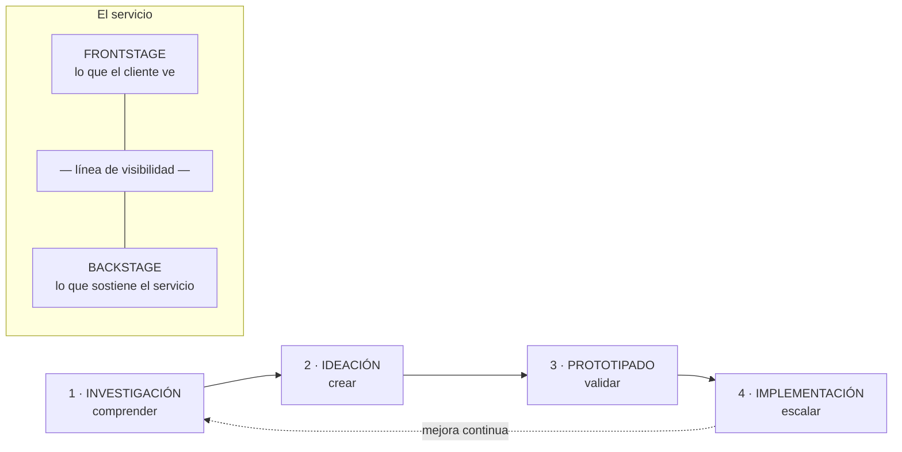

# 22 · Service Design y Cultura Fail

> **Fuente en el material:** *Tecnología e Innovación – Clase 4 preparcial – Estrategias 2026* (Ing. Mario Barrios), diapositivas 56–83.
> **Prerrequisitos:** [13 Design Thinking](../parcial-1/13-design-thinking.md), [07 Gestión de la innovación](../parcial-1/07-gestion-de-la-innovacion.md).
> **Tiempo estimado:** 50 min.
> **Resto de la materia · Tema 22** (Clase preparcial · Barrios). Clase descargada el 2026-10-06. ⚠️ Confirmá con el profesor si entra en el Primer Parcial. La **Cultura Fail** sirve igual para el eje *"La cultura del miedo"* del [caso Nokia](../evaluacion/nokia-10-ejes-resuelto.md#iii5-la-cultura-del-miedo).

---

## 🎯 Objetivos de aprendizaje

1. Definir **Service Design** con las citas de la cátedra (Moritz, Mager) y explicar qué aporta.
2. Explicar **por qué falla la experiencia del cliente** (operación fragmentada).
3. Describir los **tres pilares** (personas, procesos, artefactos) y la diferencia **frontstage / backstage**.
4. Comparar los **principios** de 2010 y 2017.
5. Explicar las **cuatro etapas** del proceso y las herramientas **Customer Journey Map** y **Service Blueprint**.
6. Explicar la **Cultura Fail** y sus **seis puntos**, y aplicarla a un caso.

---

## 🗺️ Esquema del tema

- **I. Qué es Service Design**
  1. Definiciones (Moritz, Mager, cátedra)
  2. Qué aporta (cuatro ideas)
- **II. Por qué falla la experiencia del cliente**
- **III. Pilares y ecosistema del servicio**
  1. Personas, procesos, artefactos
  2. Frontstage, línea de visibilidad, backstage
- **IV. Principios: de 2010 a 2017**
- **V. El proceso: cuatro etapas**
  1. Investigación
  2. Ideación
  3. Prototipado
  4. Implementación
- **VI. Herramientas**
  1. Customer Journey Map
  2. Service Blueprint
  3. Co-creación y prototipado de servicios
- **VII. Beneficios**
- **VIII. Cultura Fail**
  1. Debemos aprender al fallar
  2. Los seis puntos de una cultura organizacional fail
  3. Las dos frases

---

## 🧠 Mapa visual

---

## 📖 Desarrollo

## I. Qué es Service Design

### I.1 Definiciones

> 📌 *"El diseño de servicios ayuda a **innovar (crear nuevos) o mejorar los servicios (existentes)** para hacerlos **más útiles, usables, deseables para los clientes** y **eficientes y efectivos para las organizaciones**. Es un nuevo campo **holístico, multidisciplinario e integrador**."* — **Stefan Moritz**, *Service Design: Practical Access to an Evolving Field*

> 📌 *"El diseño de servicios **coreografía procesos, tecnologías e interacciones** dentro de sistemas complejos para **cocrear valor** para las partes interesadas relevantes."* — **Birgit Mager**, presidenta de la Service Design Network

> 📌 *"El diseño de servicios ayuda a las organizaciones a **ver sus servicios desde la perspectiva del cliente**. Es un enfoque que **equilibra las necesidades del cliente con las necesidades del negocio**, con el objetivo de crear experiencias de servicio fluidas y de calidad. Tiene sus raíces en el **pensamiento de diseño** y aporta un **proceso creativo y centrado en el ser humano** (…). A través de métodos colaborativos que involucran tanto a los clientes como a los equipos de prestación de servicios, ayuda a las organizaciones a obtener una **comprensión real e integral** de sus servicios."*

### I.2 Qué aporta (cuatro ideas)

1. Ayuda a ver los servicios **desde la perspectiva del cliente**.
2. **Equilibra** las necesidades del cliente con las del negocio.
3. Aporta un proceso **creativo y centrado en el ser humano**.
4. Da una **comprensión real e integral** de los servicios.

> 💡 **Para entenderlo:** el Design Thinking diseña **soluciones**; el Service Design aplica esa misma mirada a **servicios completos**, que no son un objeto sino una secuencia de interacciones (pedir, esperar, recibir, reclamar…) donde intervienen personas, sistemas y procesos internos. La cita de los principios lo resume: *"cuando las personas intentan describir un objeto, lo hacen a través de los servicios percibidos que proporciona"*.

> 📝 **Citar y explayarse:** Según Stefan Moritz, el diseño de servicios *"ayuda a innovar (crear nuevos) o mejorar los servicios (existentes) para hacerlos más útiles, usables, deseables para los clientes y eficientes y efectivos para las organizaciones"*. La definición tiene dos destinatarios: el **cliente**, para quien el servicio debe ser útil, usable y deseable, y la **organización**, para la cual debe ser eficiente y efectivo; por eso la cátedra dice que equilibra las necesidades del cliente con las del negocio. Birgit Mager agrega que *"coreografía procesos, tecnologías e interacciones"*: un servicio no se arregla mejorando una pantalla, sino coordinando todo lo que pasa detrás. Por ejemplo, un banco puede tener una app impecable, pero si el reclamo que se hace en la app no llega al área que lo resuelve, la experiencia falla igual.

---

## II. Por qué falla la experiencia del cliente

> 📌 **El síndrome de la operación fragmentada**
> - Las empresas suelen diseñar pensando en sus **silos internos**, no en el usuario.
> - Existe una **desconexión crítica entre canales físicos y digitales**.
> - **Procesos invisibles rotos (backstage)** arruinan la experiencia final (**frontstage**).
> - **El cliente no experimenta departamentos aislados; experimenta una sola marca.**

> 📌 *"Si el empleado se frustra en el backstage, el cliente lo sufrirá inevitablemente en el frontstage."*

> 🔗 **Conexión con Nokia y con la Gestión 2.0:** es el mismo problema de los **silos** (hardware vs. software vs. dirección), visto desde la experiencia del cliente. La Gestión 2.0 lo ataca desde la estructura (*modelos en red*, *trabajo interdisciplinario*); el Service Design, desde el diseño del servicio.

---

## III. Pilares y ecosistema del servicio

### III.1 Personas, procesos, artefactos

| Pilar | Qué incluye (cátedra) |
|---|---|
| **1 · Personas** | Diseño centrado **tanto en el cliente final como en los empleados** que operan y dan vida al servicio diariamente. |
| **2 · Procesos** | Flujos de trabajo estructurados, **flujos de información integrados** y metodologías que aseguran la eficiencia operativa **sin fricciones**. |
| **3 · Artefactos** | Toda la **infraestructura física y digital**: plataformas tecnológicas, herramientas, entornos, espacios y materiales tangibles. |

### III.2 Frontstage, línea de visibilidad, backstage

| Capa | Qué es | Ejemplos (cátedra) |
|---|---|---|
| **Frontstage** | Lo que el cliente **ve y experimenta**. | Canales de atención, interfaces web/mobile, tiendas físicas, interacciones con el personal de primera línea. |
| — **Línea de visibilidad** — | El límite entre lo que el cliente ve y lo que no. | — |
| **Backstage** | Lo que está **oculto pero sostiene** el servicio. | Sistemas tecnológicos de soporte, infraestructura de datos, logística interna, procesos administrativos, políticas de la organización. |

> 🧩 **Ejemplo (delivery de comida):** frontstage = la app, el seguimiento del pedido, el repartidor. Backstage = el sistema que asigna repartidores, la cocina del local, la liquidación de pagos. Si el sistema asigna mal (backstage), el cliente ve un pedido frío (frontstage).

---

## IV. Principios: de 2010 a 2017

La cátedra compara los principios del libro *This is Service Design Thinking* (2010) con los de *This is Service Design Doing* (2017) ➕:

| 2010 | → | 2017 |
|---|---|---|
| **1. Centrado en el usuario:** los servicios deben experimentarse a través de los ojos del cliente. | → | **1. Centrado en el ser humano:** considerar la experiencia de **todas las personas afectadas** por el servicio. |
| **2. Co-creativo:** todas las partes interesadas deben estar incluidas en el proceso de diseño. | → | **2. Colaborativo:** partes interesadas de diversos orígenes y funciones deben participar activamente. |
| — | → | **3. Iterativo** (nuevo): enfoque exploratorio, adaptativo y experimental, iterando hacia la implementación. |
| **3. Secuencial:** el servicio debe visualizarse como una secuencia de acciones interrelacionadas. | → | **4. Secuencial:** visualizarlo y organizarlo como una secuencia de acciones interrelacionadas. |
| **4. Evidencial:** los servicios intangibles deben visualizarse en términos de artefactos físicos. | → | **5. Real:** las necesidades deben investigarse en la realidad, las ideas prototiparse en la realidad y los valores intangibles evidenciarse como realidad física o digital. |
| **5. Holístico:** todo el entorno de un servicio debe ser considerado. | → | **6. Holístico:** abordar de manera sostenible las necesidades de todas las partes interesadas a través de todo el servicio y en toda la empresa. |

> 💡 **Qué cambió:** de pensar solo en el **usuario** se pasó a pensar en **todas las personas** (incluidos los empleados); se agregó la **iteración**; y "evidencial" se convirtió en "**real**": no alcanza con mostrar el servicio, hay que investigarlo y probarlo en la realidad.

---

## V. El proceso: cuatro etapas

| # | Etapa | Verbo | Qué se hace (cátedra) |
|---|---|---|---|
| 1 | **Investigación** (*Research*) | **Comprender** | Investigación **cualitativa** profunda; entrevistas en profundidad y **observación directa**; mapeo de necesidades, dolores y expectativas; hallazgo de **insights ocultos**. *"Ayuda a un equipo de diseño a ir más allá de las suposiciones"*; los conocimientos cualitativos *"a menudo son más prácticos que los simples datos cuantitativos, ya que brindan respuestas a las preguntas de 'por qué'"*. |
| 2 | **Ideación** (*Ideation*) | **Crear** | Talleres de **co-creación** multidisciplinarios; lluvia de ideas sin restricciones iniciales; alineación entre **viabilidad de negocio y diseño**; mapeo conceptual. *"No estamos tratando de elegir la idea perfecta, la bala de plata"*; *"aprender a dejar ir las ideas para dar paso a otras nuevas es una habilidad crucial"*. |
| 3 | **Prototipado** (*Prototyping*) | **Validar** | Construcción **rápida y de bajo costo**; simulaciones de servicio y maquetas digitales; **pruebas con usuarios reales y personal**; iteración basada en feedback. Permite identificar rápido aspectos importantes, evaluar qué soluciones funcionarían, crear una **comprensión compartida**, producir un trabajo **basado en la realidad, no en suposiciones y opiniones**; es *"una investigación centrada en situaciones de servicios futuras"*. |
| 4 | **Implementación** (*Implementation*) | **Escalar** | Planificación e hitos de lanzamiento; **pilotos controlados**; **capacitación** de equipos (back y front); métricas de éxito (**KPIs**). Es *"el punto final del diseño de servicios"* y puede requerir gestión del cambio, desarrollo de software o ingeniería. |

**El triángulo del prototipado** (cátedra): se empieza por el **valor** (*¿cómo creamos valor? ¿qué necesidades y puntos débiles abordamos?*), y se equilibra con la **factibilidad** (*¿cómo hacemos que funcione? ¿es factible técnica, financiera y legalmente?*) y el **look & feel** (*¿cómo se ve y se siente?*). En el centro, la **integración**: *¿cómo funciona todo junto?*

> 🔗 Las cuatro etapas son el **Design Thinking** aplicado a servicios: investigación ≈ empatizar + definir; ideación ≈ idear; prototipado ≈ prototipar + testear; implementación es la etapa que el DT deja más implícita.

---

## VI. Herramientas

### VI.1 Customer Journey Map

> 📌 **"La radiografía de la experiencia del cliente."**

- Mapea **secuencialmente** todas las etapas del usuario: **antes** (descubrimiento), **durante** (uso del servicio) y **después** (fidelización).
- Registra **acciones, pensamientos y emociones** del cliente en cada **punto de contacto**.
- Identifica los **puntos de dolor** (*pain points*): fricciones críticas que destruyen el valor.
- Revela **oportunidades de mejora** basadas en **evidencia real** y no en suposiciones.

### VI.2 Service Blueprint

> 📌 *"El Service Blueprint es la **partitura operativa**: conecta de forma síncrona el viaje del cliente con todo el motor interno."*

| Carril | Qué muestra |
|---|---|
| **Acciones del cliente** | Puntos de contacto e interacciones directas del viaje del usuario. |
| **Frontstage** (personal de contacto) | Empleados, interfaces o dispositivos con los que interactúa el cliente. |
| **Backstage** (procesos internos) | Acciones operativas requeridas tras bambalinas. |
| **Procesos de soporte** (sistemas/tecnología) | Infraestructura, bases de datos y software de soporte. |

> ⚠️ **Journey Map vs. Blueprint:** el **Journey Map** mira **solo al cliente** (qué hace, piensa y siente). El **Blueprint** agrega **todo lo que la organización hace** para que eso pase (front, back y soporte).

### VI.3 Co-creación y prototipado de servicios

**Métodos rápidos de prototipado:** **roleplaying** (simular físicamente los flujos de atención y diálogos) · **storyboards** (guiones gráficos para evaluar el ritmo del servicio) · **prototipos digitales** (mockups de apps o tótems) · **pilotos de baja fidelidad** (probar en un entorno controlado con usuarios reales).

**Co-creación: diseñar CON la gente.** Involucra a clientes finales, personal de primera línea y directivos en la mesa de diseño; garantiza que las soluciones resuelvan problemas reales de forma viable.

---

## VII. Beneficios

| Para el cliente | Para el empleado | Para la organización |
|---|---|---|
| Experiencias fluidas **omnicanal**. | **Claridad** total en roles y flujos. | **Reducción de costos** duplicados. |
| Eliminación de **re-procesos**. | Herramientas internas diseñadas para sus necesidades. | Eliminación efectiva de **silos**. |
| Mayor **confianza y lealtad** con la marca. | Disminución de la **frustración** diaria. | Mayor **agilidad e innovación** comercial. |

> 📌 *"Optimizar el backstage para deleitar en el frontstage."* El Service Design *"no es un proyecto aislado con un final establecido, sino una **cultura y mentalidad organizativa** de mejora e innovación continua orientada al valor"*.

---

## VIII. Cultura Fail

### VIII.1 Debemos aprender al fallar

La clase cierra con **FAILCulture** (*"fallar y aprender para innovar y liderar"*, Demian Sterman ➕): una organización que innova tiene que **aprender de sus fallas** en lugar de castigarlas.

### VIII.2 Los seis puntos de una cultura organizacional fail

| # | Punto (cátedra) | Qué significa |
|---|---|---|
| 1 | Quitar la idea del fracaso como algo **negativo**. | El fracaso es información, no una vergüenza. |
| 2 | No premiar **solamente** el éxito. | Reconocer también los intentos bien diseñados que fallaron y lo aprendido. |
| 3 | Promover la **toma de riesgos**. | Sin riesgo no hay innovación (la innovación tiene **incertidumbre y riesgo**, tema [12](../parcial-1/12-innovacion-tecnologica-e-ia.md)). |
| 4 | Asegurar un **contexto seguro** para experimentar. | Que equivocarse en un experimento no cueste el puesto. |
| 5 | **Desarrollar** la intuición y la habilidad. | Cada falla mejora el criterio para la próxima. |
| 6 | **Compartir** las experiencias fallidas con el resto de la organización. | Que el aprendizaje no quede en un equipo: nadie repite el mismo error. |

### VIII.3 Las dos frases

> 📌 *"Si algo puede fallar, **fallará**."*
> 📌 *"Probar y fallar es el primer eslabón de una cadena que termina en probar y **NO** fallar."*

> 💡 **Para entenderlo:** la primera frase (ley de Murphy) dice que el error es **inevitable**; la segunda, que por eso conviene **provocarlo temprano y barato**, en experimentos, para que no aparezca tarde y caro en el mercado. Es la misma lógica del **"fail fast"** del Design Thinking y del **MVP**.

> 📝 **Citar y explayarse:** La cátedra plantea que *"debemos aprender al fallar"* y propone una cultura organizacional *fail* basada en seis puntos: quitar la idea del fracaso como algo negativo, no premiar solamente el éxito, promover la toma de riesgos, asegurar un contexto seguro para experimentar, desarrollar la intuición y la habilidad, y compartir las experiencias fallidas con toda la organización. La idea de fondo es que *"probar y fallar es el primer eslabón de una cadena que termina en probar y no fallar"*: como la innovación siempre tiene incertidumbre, los errores van a aparecer, y la diferencia está en si aparecen temprano, en un experimento barato del que se aprende, o tarde, cuando ya se invirtió todo. Esto coincide con el pilar de la Gestión 2.0: *"está bien fracasar"*. Nokia es el contraejemplo: su **cultura del miedo** castigaba las malas noticias, así que los fracasos no se compartían y la información crítica no llegaba a quienes decidían.

---

## ⚠️ Conceptos que se confunden

| Se confunde… | …con | Diferencia |
|---|---|---|
| Service Design | Design Thinking | El DT es la metodología general centrada en las personas; el Service Design la aplica a **servicios completos** (front + back, clientes + empleados). |
| Frontstage | Backstage | Front = lo que el cliente **ve**. Back = lo que **sostiene** el servicio sin que se vea. |
| Customer Journey Map | Service Blueprint | Journey = solo el **cliente** (acciones, pensamientos, emociones). Blueprint = cliente **+ toda la operación**. |
| Cultura Fail | Tolerar la mala gestión | Fail = fallar **rápido, barato y aprendiendo**, y compartirlo. No es aceptar errores repetidos ni falta de planificación. |
| Co-creativo (2010) | Colaborativo (2017) | 2017 amplía: no solo incluir a las partes, sino que participen **activamente** desde diversos orígenes y funciones. |

---

## 🔗 Conexiones

- **← [13 Design Thinking](../parcial-1/13-design-thinking.md):** raíz del Service Design; fail fast; deseable/factible/viable (triángulo del prototipado).
- **← [07 Gestión 2.0](../parcial-1/07-gestion-de-la-innovacion.md):** silos, trabajo interdisciplinario, "está bien fracasar".
- **← [17 MVP](17-lean-startup-y-mvp.md):** prototipos de baja fidelidad y pilotos.
- **← [18 KPI](18-kpi.md):** métricas de éxito en la implementación.
- **→ [Caso Nokia, cultura del miedo](../evaluacion/nokia-10-ejes-resuelto.md#iii5-la-cultura-del-miedo).**

---

## ✍️ Autoevaluación

**1. Defina Service Design (cite a un autor de la cátedra).**

Ver respuesta

Moritz: *"ayuda a innovar (crear nuevos) o mejorar los servicios (existentes) para hacerlos más útiles, usables, deseables para los clientes y eficientes y efectivos para las organizaciones"*; es un campo holístico, multidisciplinario e integrador. Mager: *"coreografía procesos, tecnologías e interacciones dentro de sistemas complejos para cocrear valor"*.

**2. ¿Qué es el síndrome de la operación fragmentada?**

Ver respuesta

Las empresas diseñan pensando en sus **silos** y no en el usuario; hay desconexión entre canales físicos y digitales; procesos invisibles rotos (backstage) arruinan la experiencia (frontstage). Pero el cliente no experimenta departamentos, *"experimenta una sola marca"*.

**3. Explique frontstage y backstage con un ejemplo.**

Ver respuesta

Frontstage: lo que el cliente ve y experimenta (canales, interfaces, tiendas, personal de primera línea). Backstage: lo oculto que sostiene el servicio (sistemas, datos, logística, procesos administrativos, políticas). Los separa la **línea de visibilidad**. Ej.: en un banco, el cajero y la app (front) y el sistema de validación de transferencias (back).

**4. ¿Cuáles son las cuatro etapas del Service Design?**

Ver respuesta

**Investigación** (comprender) → **ideación** (crear) → **prototipado** (validar) → **implementación** (escalar).

**5. ¿Qué diferencia hay entre Customer Journey Map y Service Blueprint?**

Ver respuesta

El Journey Map mapea la experiencia del **cliente** (antes, durante, después; acciones, pensamientos, emociones, pain points). El Blueprint es la *"partitura operativa"*: conecta ese viaje con frontstage, backstage y procesos de soporte.

**6. Mencione los seis puntos de una cultura organizacional fail.**

Ver respuesta

(1) Quitar la idea del fracaso como algo negativo; (2) no premiar solamente el éxito; (3) promover la toma de riesgos; (4) asegurar un contexto seguro para experimentar; (5) desarrollar la intuición y la habilidad; (6) compartir las experiencias fallidas con el resto de la organización.

**7. ¿Qué principio nuevo aparece en 2017 que no estaba en 2010?**

Ver respuesta

**Iterativo**: el diseño de servicios es un enfoque exploratorio, adaptativo y experimental, que itera hacia la implementación. (Además, "evidencial" pasa a "real" y "centrado en el usuario" a "centrado en el ser humano".)

---

[← 21 Estrategias, Océano Azul y Canvas](21-estrategias-oceano-azul-y-canvas.md) · [🏠 Índice](../README.md) · [Siguiente → 23 Metodologías ágiles y Scrum](23-metodologias-agiles-y-scrum.md)
