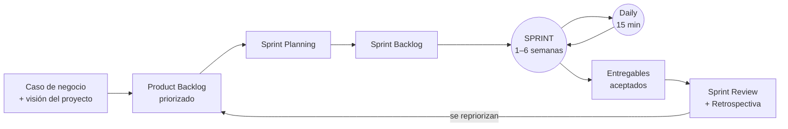
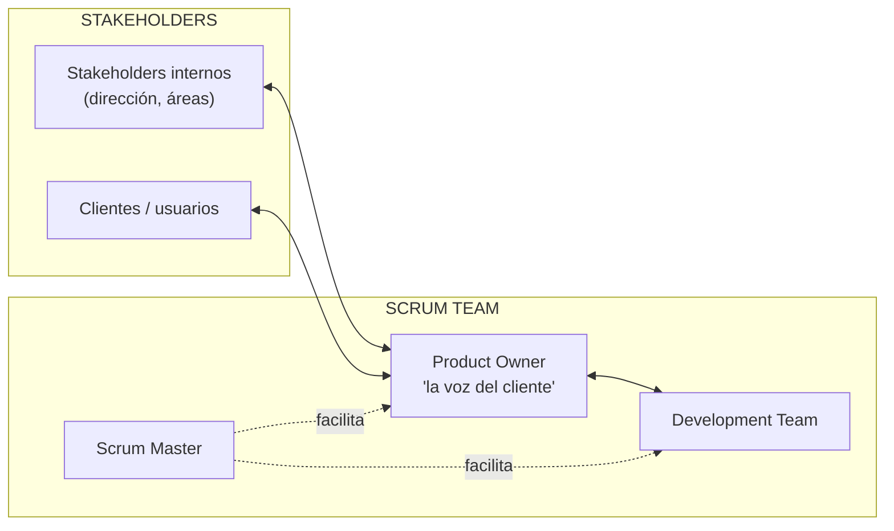

# 23 · Metodologías ágiles y Scrum

> **Fuente en el material:** *Tecnología e Innovación – jueves MRI – Metodologías Ágiles* (Ing. Mario Barrios), diapositivas 1–39. Muchas diapositivas son solo imagen y se leyeron desde el PDF (`material-de-clase-pdf/`).
> **Prerrequisitos:** [17 Lean Startup y MVP](17-lean-startup-y-mvp.md).
> **Tiempo estimado:** 60 min.
> **Resto de la materia · Tema 23** (Jueves MRI · Barrios). Clase descargada el 2026-10-09.

---

## 🎯 Objetivos de aprendizaje

1. Explicar **por qué** surgen las metodologías ágiles (el problema del desarrollo "en cascada") y el mantra *"agilidad no es velocidad"*.
2. Enunciar los **4 valores** del Manifiesto Ágil y explicar **qué significa "sobre"**.
3. Recordar los **12 principios** del Manifiesto (al menos por su palabra clave).
4. Explicar los **3 pilares** de Scrum y sus **6 principios**.
5. Describir el **flujo de trabajo** de Scrum: backlog → sprint → daily → entregable → revisión y retrospectiva.
6. Describir los **roles** (Product Owner, Scrum Master, Development Team) y su vínculo con los stakeholders.

---

## 🗺️ Esquema del tema

- **I. Por qué metodologías ágiles**
  1. El problema: "lo que el cliente pidió" vs. "lo que realmente necesitaba"
  2. Cascada vs. ágil
  3. Mantra: agilidad es adaptación al cambio
  4. Jack Welch y el cambio cultural
  5. Modelos ágiles (lista)
- **II. El Manifiesto Ágil**
  1. Los 4 valores
  2. Los 12 principios
- **III. Scrum: fundamentos**
  1. Pilares: transparencia, inspección, adaptación
  2. Seis principios: proceso empírico, auto-organización, colaboración, priorización basada en valor, tiempo asignado (time-boxing), desarrollo iterativo
- **IV. Scrum: cómo funciona**
  1. Flujo de trabajo (caso de negocio → backlog → sprint → entregables)
  2. Fases y procesos (inicio, planificación y estimación, implementación, revisión y retrospectiva, lanzamiento)
  3. La reunión diaria y el ciclo del sprint
  4. Trabajo acumulado en el tiempo
  5. Conclusión: cómo (no) construir un MVP
- **V. Roles en Scrum**
  1. Scrum team y stakeholders
  2. Product Owner
  3. Scrum Master
  4. Development Team

---

## 🧠 Mapa visual

---

## 📖 Desarrollo

## I. Por qué metodologías ágiles

### I.1 El problema: "lo que el cliente pidió" vs. "lo que realmente necesitaba"

La clase abre con la tira cómica clásica del **columpio en el árbol** (*"The problematics of software development"*, Brittan 1980; y su versión *"How Projects Really Work"*). Cada viñeta muestra el mismo columpio tal como lo ve cada actor:

- **Lo que el cliente pidió** → **cómo lo entendió el jefe de proyecto** → **cómo lo diseñó el analista** → **cómo se programó** → **qué decidió el consultor** → **cómo se documentó** → **qué instaló operaciones** → **cómo se le cobró al cliente** → **cómo se pagó** → … y al final **lo que el cliente realmente necesitaba**: un neumático colgado de una soga.

> 💡 **Qué está mostrando de verdad:** en un proyecto donde cada área recibe un documento de la anterior, **cada traspaso agrega una interpretación**. Si el cliente recién ve el resultado al final, todos esos errores de interpretación se acumulan y se descubren cuando ya está todo construido. El costo de corregir es máximo justo en el momento en que se detecta.

### I.2 Cascada vs. ágil

La diapositiva compara dos caminos para llegar al mismo columpio:

| | **Cascada** (*waterfall design → waterfall deliver*) | **Ágil** (*agile iteration 1, 2, … n, n+1 → agile deliver*) |
|---|---|---|
| Cómo avanza | Se diseña todo, después se construye todo y se entrega **una sola vez al final**. | Se construye en **iteraciones cortas**; cada una entrega algo que el cliente puede ver. |
| Cuándo opina el cliente | Al principio (requisitos) y al final (entrega). | **En cada iteración.** |
| Qué pasa si el cliente quería otra cosa | Se descubre al final: se rehace o se entrega algo inútil. | Se descubre en la iteración siguiente y se **corrige el rumbo**. |
| En el dibujo | Se entrega un columpio que no era lo que se necesitaba. | Las versiones intermedias son distintas, pero la última es la correcta. |

> 💡 **Para entenderlo:** cascada apuesta a que los requisitos del principio están bien y no van a cambiar. Ágil asume que **van a cambiar** (porque el cliente aprende al ver el producto) y organiza el trabajo para que el cambio sea barato.

### I.3 Mantra: agilidad es adaptación al cambio

> 📌 *"Agilidad no es velocidad. Agilidad es adaptación al cambio."*

> ⚠️ **Trampa de parcial:** "ágil" **no** significa "hacer las cosas más rápido" ni "trabajar sin planificar". Significa organizarse para **cambiar de dirección con bajo costo** cuando aparece información nueva. Un equipo puede entregar rápido y no ser ágil (si nunca cambia lo que entrega).

### I.4 Jack Welch y el cambio cultural

> 📌 *"Cuando la tasa de cambio dentro de una institución se vuelve más lenta que la tasa de cambio afuera, el final está a la vista. La única pregunta es cuándo."* — **Jack Welch**

Las notas de la diapositiva lo presentan como uno de los CEOs más influyentes de la historia: durante su liderazgo en **General Electric (1981–2001)** llevó el valor de mercado de la empresa de **12 mil millones a más de 400 mil millones de dólares**.

La diapositiva siguiente afirma: *"Las transformaciones ágiles son un **cambio cultural** importante"*, con la viñeta de un orador que pregunta *"Who wants change?"* (todos levantan la mano) y luego *"Who wants **to** change?"* (nadie la levanta).

> 💡 **Qué significa:** todos quieren que **la organización** cambie, pero pocos quieren cambiar **su propia forma de trabajar**. Adoptar ágil no es instalar una herramienta: cambia quién decide, cómo se planifica y cómo se mide el avance.

> 🔗 Es la misma idea que la **Gestión de la Innovación 2.0** y las habilidades blandas del tema [07](../parcial-1/07-gestion-de-la-innovacion.md), y que la cultura del caso Nokia: una empresa que cambia más lento que su entorno.

### I.5 Modelos ágiles

La cátedra lista los modelos ágiles con sus autores:

| Modelo | Autores (cátedra) |
|---|---|
| Programación Extrema (**XP**) | Kent Beck, Erich Gamma y otros |
| Desarrollo adaptativo de software (DAS) | Jim Highsmith |
| Método de desarrollo de sistemas dinámicos (MDSD / DSDM) | Dane Faulkner y otros |
| Crystal Clear (familia de métodos) | Alistair Cockburn |
| Desarrollo impulsado por las características (DIC) / **Feature-Driven Development** | Peter Coad y Jeff DeLuca |
| **Lean Software Development** (desarrollo esbelto) | Mary y Tom Poppendieck |
| Modelado Ágil (MA) | — |
| Proceso Unificado Ágil (PUA / **AUP**) | Scott Ambler |
| **Scrum** | Ken Schwaber, Jeff Sutherland, Mike Beedle |
| The Incremental Commitment Spiral Model (ICSM) | Barry Boehm y Jo Ann Lane |
| SEMAT | Ivar Jacobson, Pan-Wei Ng |

> 💡 No hace falta memorizar la tabla entera: lo importante es saber que **Scrum es uno de varios** modelos ágiles (el más difundido) y que todos comparten los valores del Manifiesto.

---

## II. El Manifiesto Ágil

### II.1 Los 4 valores

> 📌 *"Estamos descubriendo formas mejores de desarrollar software con nuestra propia experiencia y ayudando a terceros. A través de este trabajo hemos aprendido a valorar:"*

| Valoramos más… (izquierda) | **sobre** | …que esto (derecha) |
|---|---|---|
| **Individuos e interacciones** | sobre | procesos y herramientas |
| **Software funcionando** | sobre | documentación extensiva |
| **Colaboración con el cliente** | sobre | negociación contractual |
| **Respuesta ante el cambio** | sobre | seguir un plan |

> 📌 *"Esto es, aunque valoramos los elementos de la derecha, valoramos más los de la izquierda."*

> ⚠️ **La trampa más común:** el Manifiesto **no** dice que la documentación, los contratos, los procesos o los planes no sirvan. Dice que, **cuando hay que elegir**, pesa más lo de la izquierda. Un equipo ágil sigue documentando y planificando; lo que no hace es priorizar el documento por encima de que el software funcione.

> ➕ **Contexto adicional:** el Manifiesto fue firmado en **febrero de 2001** por 17 desarrolladores reunidos en Snowbird (Utah, EE. UU.), entre ellos Kent Beck, Ken Schwaber y Jeff Sutherland.

> 📝 **Citar y explayarse:** El Manifiesto Ágil sostiene que se valoran más *"los individuos e interacciones sobre procesos y herramientas, el software funcionando sobre documentación extensiva, la colaboración con el cliente sobre negociación contractual y la respuesta ante el cambio sobre seguir un plan"*, y aclara que, *"aunque valoramos los elementos de la derecha, valoramos más los de la izquierda"*. Es decir, no se descartan los planes ni los contratos: se establece una **prioridad** para cuando entran en conflicto. Si a mitad de un proyecto el cliente descubre que necesita otra funcionalidad, el enfoque ágil prefiere conversar con él y cambiar el plan antes que defender lo firmado y entregar algo que ya no le sirve. Por eso la cátedra resume la idea en el mantra *"agilidad no es velocidad, es adaptación al cambio"*.

### II.2 Los 12 principios

| # | Palabra clave (cátedra) | Principio (cátedra) |
|---|---|---|
| 1 | **Cliente satisfecho** | Nuestra mayor prioridad es **satisfacer al cliente** mediante la **entrega temprana y continua** de software con valor. |
| 2 | **El cambio es bienvenido** | Aceptamos que los **requisitos cambien**, incluso en etapas tardías del desarrollo. Los procesos ágiles aprovechan el cambio para proporcionar **ventaja competitiva** al cliente. |
| 3 | **Entrega continua** | Entregamos **software funcional frecuentemente**, entre **dos semanas y dos meses**, con preferencia al período más corto posible. |
| 4 | **Trabajo conjunto** | Los responsables de **negocio** y los **desarrolladores** trabajamos juntos de forma **cotidiana** durante todo el proyecto. |
| 5 | **Equipo motivado** | Los proyectos se desarrollan en torno a **individuos motivados**. Hay que darles el entorno y el apoyo que necesitan, y **confiarles** la ejecución del trabajo. |
| 6 | **Cara a cara** | El método más eficiente y efectivo de comunicar información al equipo y entre sus miembros es la conversación **cara a cara**. |
| 7 | **Software funcionando** | El software funcionando es la **medida principal de progreso**. |
| 8 | **Ritmo constante** | Los procesos ágiles promueven el **desarrollo sostenible**. Promotores, desarrolladores y usuarios debemos poder mantener un **ritmo constante** de forma indefinida. |
| 9 | **Innovación** (excelencia técnica) | La **atención continua a la excelencia técnica** y al buen diseño mejora la agilidad. |
| 10 | **Simplicidad** | La simplicidad, o el arte de **maximizar la cantidad de trabajo no realizado**, es esencial. |
| 11 | **Auto-organización** | Las mejores arquitecturas, requisitos y diseños emergen de **equipos auto-organizados**. |
| 12 | **Reflexión y ajuste** | A intervalos regulares el equipo **reflexiona** sobre cómo ser más efectivo y **ajusta** su comportamiento en consecuencia. |

> 💡 **Cómo recordarlos:** la cátedra los resume en 12 íconos con una palabra cada uno (cliente satisfecho, el cambio es bienvenido, entrega continua, trabajo conjunto, equipo motivado, cara a cara, software funcionando, ritmo constante, innovación, simplicidad, auto-organización, reflexión y ajuste). Aprendé las 12 palabras y reconstruí la frase.

> ⚠️ **Principio 10 ("maximizar el trabajo no realizado"):** no es hacer poco. Es **no construir lo que no aporta valor**: cada funcionalidad que no se programa porque nadie la necesitaba es tiempo y costo ahorrado. Es la misma lógica del **MVP** ([17](17-lean-startup-y-mvp.md)).

> ⚠️ **Principio 7:** el avance no se mide por documentos entregados ni por horas trabajadas, sino por **software que funciona**. Es la contracara de "cómo se documentó" en la tira del columpio.

---

## III. Scrum: fundamentos

### III.1 Pilares de Scrum

Scrum se apoya en **tres pilares** (la diapositiva los dibuja como tres columnas):

| Pilar | Qué significa |
|---|---|
| **Transparencia** | Todo el equipo y los interesados ven el mismo estado real del trabajo (qué está hecho, qué falta, qué está trabado). |
| **Inspección** | Se revisa con frecuencia lo producido y el avance hacia el objetivo, para detectar desvíos a tiempo. |
| **Adaptación** | Si la inspección muestra un desvío, se ajusta el producto o el proceso lo antes posible. |

> 💡 **Por qué van en ese orden:** no se puede inspeccionar lo que no se ve (transparencia) y no tiene sentido inspeccionar si después no se cambia nada (adaptación). Los tres juntos son el **control empírico del proceso** (III.2.1).

### III.2 Los seis principios de Scrum

| # | Principio | Qué dice la cátedra |
|---|---|---|
| 1 | **Control del proceso empírico** | Tres ideas principales: **transparencia, inspección y adaptación**. *"El conocimiento empírico es el saber que se adquiere con el uso de los sentidos, a partir de la **observación o de la experimentación**."* Ejemplo de la cátedra: el científico que toma datos de un experimento. |
| 2 | **Auto-organización** | Equipos con un gran sentimiento de **compromiso y responsabilidad**. |
| 3 | **Colaboración** | Tres dimensiones del trabajo colaborativo: **conciencia, articulación y apropiación**. La gestión de proyectos es un proceso de **creación de valor compartido** con los equipos. |
| 4 | **Priorización basada en valor** | Ofrecer el **máximo valor de negocio** desde el principio del proyecto hasta su conclusión. |
| 5 | **Tiempo asignado** (*time-boxing*) | El tiempo es *"sumamente limitante e importante"*; su uso adecuado contribuye a planificar y ejecutar eficazmente. Bloques de tiempo: **sprints** (ciclos cortos), **daily standup**, **sprint planning**, **sprint review**. |
| 6 | **Desarrollo iterativo** | Manejar mejor los **cambios** y crear productos que **satisfagan las necesidades del cliente**. |

> 💡 **"Proceso empírico", en concreto:** en lugar de planificar todo de antemano y suponer que el plan se va a cumplir, Scrum trabaja como un experimento: hace un sprint, **mira el resultado real** (qué se terminó, qué opinó el cliente) y decide el próximo paso con esa información. El plan se corrige con datos, no con suposiciones.

> 💡 **Time-boxing, en concreto:** cada evento tiene una **duración máxima fija** (el sprint dura X semanas, la daily dura 15 minutos). Si el trabajo no entra en la caja, se recorta el **alcance**, no se estira el **tiempo**. Eso obliga a priorizar (principio 4).

> ➕ **Contexto adicional:** estos seis principios son los de la guía **SBOK** (*Scrum Body of Knowledge*, SCRUMstudy). La *Scrum Guide* de Schwaber y Sutherland, en cambio, habla de los tres pilares y de cinco valores (compromiso, foco, apertura, respeto, coraje). En el parcial usá la versión de la cátedra.

---

## IV. Scrum: cómo funciona

### IV.1 Flujo de trabajo

La diapositiva *"Flujo de trabajo"* encadena:

1. **Caso de negocio del proyecto** y **declaración de la visión del proyecto** → en la *reunión de visión del proyecto*.
2. **Backlog priorizado del producto** (*Product Backlog*): la lista ordenada de todo lo que el producto debería tener, de lo más valioso a lo menos. De ahí sale el **cronograma de lanzamiento** (*sesión de planificación de lanzamiento*).
3. **Sprint Backlog**: la parte del backlog que el equipo se compromete a hacer en este sprint → en la *reunión de planificación del sprint*.
4. **Sprint de 1 a 6 semanas**, con una reunión **diaria** (*daily standup*) donde se crean entregables.
5. **Entregables aceptados** → en la *reunión de revisión del sprint* y la *reunión de retrospectiva*.
6. La flecha vuelve al **backlog**: lo aprendido se usa para repriorizar y empieza otro sprint.

> ⚠️ **Duración del sprint:** la cátedra dice **1–6 semanas** (y una de las diapositivas muestra un ciclo de **30 días**). ➕ La *Scrum Guide* oficial fija un máximo de **un mes**. Si te preguntan, usá la cifra de la cátedra y aclarás que es un período corto y fijo.

### IV.2 Fases y procesos

| **Inicio** | **Planificación y estimación** | **Implementación** | **Revisión y retrospectiva** | **Lanzamiento** |
|---|---|---|---|---|
| Crear la visión del proyecto | Crear historias de usuario | Crear entregables | Demostrar y validar el sprint | Enviar entregables |
| Identificar al Scrum Master y stakeholder(s) | Estimar historias de usuario | Realizar el Daily Standup | Retrospectiva del sprint | Retrospectiva del proyecto |
| Formar el equipo Scrum | Comprometer historias de usuario | Refinar el backlog priorizado del producto | | |
| Desarrollar épicas | Identificar tareas | | | |
| Crear el backlog priorizado del producto | Estimar tareas | | | |
| Realizar la planificación del lanzamiento | Crear el Sprint Backlog | | | |

> 💡 **Vocabulario:** una **historia de usuario** es un requisito escrito desde el punto de vista de quien lo usa (*"como vendedor, quiero ver el stock en el celular para no prometer productos que no hay"*). Una **épica** es una historia grande que todavía hay que partir en varias más chicas.

### IV.3 La reunión diaria y el ciclo del sprint

La diapositiva con el ciclo de **30 días** (sprint) y el ciclo de **24 horas** (daily) describe:

- **Retraso del producto** (*product backlog*): características del producto que desea el cliente, con prioridad.
- **Retraso del sprint** (*sprint backlog*): características asignadas al sprint, con los aspectos ampliados por el equipo.
- **Scrum diario:** reunión de **15 minutos** en la que cada miembro responde **tres preguntas**:
  1. ¿Qué hiciste desde la última reunión Scrum?
  2. ¿Tenés algún obstáculo?
  3. ¿Qué harás antes de la próxima reunión?
- **Al final del sprint se demuestra la nueva funcionalidad.**

El ciclo de cada sprint tiene cuatro momentos: **valoración → selección → desarrollo → revisión**, entre una **planeación del bosquejo y diseño arquitectónico** inicial y el **cierre del proyecto**.

> ⚠️ **"Retraso" = backlog.** Es una traducción literal (*backlog* = trabajo acumulado pendiente). No significa que el proyecto esté atrasado.

### IV.4 Trabajo acumulado en el tiempo

Otra diapositiva grafica los sprints como escalones sobre una recta: en el eje horizontal el **tiempo**, en el vertical el **trabajo acumulado**. Cada ciclo de sprint (valoración, selección, desarrollo, revisión) suma un incremento de producto terminado.

> 💡 La idea es que el valor se entrega **de a pedazos y de forma creciente**, no todo junto al final como en cascada.

### IV.5 Conclusión del trabajo: cómo (no) construir un MVP

La diapositiva de cierre usa el dibujo clásico:

| | Iteración 1 | 2 | 3 | 4 |
|---|---|---|---|---|
| **Cómo NO construir un MVP** | una rueda | un chasis con ruedas | la carrocería | el auto |
| **Tampoco** (otro "cómo no") | monopatín | bicicleta | moto | auto |
| **Cómo SÍ construir un MVP** | un auto muy básico | un auto un poco mejor | un auto mejor | el auto final |

> 💡 **Qué está diciendo:**
> - En la **primera fila**, las iteraciones 1–3 **no sirven para nada** al usuario (una rueda no transporta a nadie): es cascada disfrazada de iteraciones.
> - La **segunda fila** entrega algo usable en cada paso, pero cada versión es **otro producto** (se tira y se empieza de nuevo).
> - La **tercera fila** es la correcta según la cátedra: desde el primer día el usuario tiene **un auto** (una versión mínima del producto que resuelve su problema) y cada iteración lo **mejora**.

> ➕ **Contexto adicional:** el dibujo es de **Henrik Kniberg** (2016). En su versión original, la fila "monopatín → bicicleta → moto → auto" es el ejemplo **correcto**; la cátedra lo presenta distinto. En el parcial respetá la versión de la diapositiva.

> 🔗 Conecta Scrum con el **MVP** y el ciclo construir–medir–aprender del tema [17](17-lean-startup-y-mvp.md): cada sprint es una vuelta de ese ciclo.

---

## V. Roles en Scrum

### V.1 Scrum team y stakeholders

La diapositiva *"Organización"* describe el flujo:
- **El cliente** le proporciona sus requisitos al **Product Owner**.
- **El Product Owner** (*"la voz del cliente"*) le comunica los requisitos de negocio priorizados al **equipo Scrum**, crea la **lista priorizada de pendientes del producto** y define los **criterios de aceptación**.
- **El Scrum Master** asegura un **ambiente de trabajo adecuado** para el equipo.
- **El equipo Scrum** le muestra el incremento de producto al Product Owner durante la **revisión del sprint**, y crea los **entregables** del proyecto.
- **El Product Owner** le entrega **valor de negocio** al cliente.

> 💡 **El punto clave:** los stakeholders **no** le hablan directamente al equipo de desarrollo para pedirle cosas. Todo pasa por el **Product Owner**, que decide la prioridad. Así el equipo no recibe pedidos contradictorios de cinco personas distintas.

### V.2 Product Owner

**Responsabilidades** (cátedra):
- Gestionar la **economía** del producto (*manage economics*).
- Participar en la **planificación**.
- Mantener y ordenar el **product backlog** (*groom the product backlog*).
- Definir los **criterios de aceptación** y verificar que se cumplan.
- Colaborar con el **equipo de desarrollo**.
- Colaborar con los **stakeholders**.

**Características**, agrupadas en cuatro familias:

| Familia | Características |
|---|---|
| **Conocimiento del dominio** | Es visionario; sabe que no todo se puede anticipar; tiene experiencia en el negocio y el dominio. |
| **Habilidades con personas** | Tiene buena relación con los stakeholders; es negociador y constructor de consensos; es buen comunicador; es un gran motivador. |
| **Toma de decisiones** | Tiene poder para decidir; está dispuesto a tomar decisiones difíciles; es decidido; tiene una visión económica para balancear temas de negocio y técnicos. |
| **Responsabilidad** (*accountability*) | Acepta la responsabilidad por el producto; está comprometido y disponible; actúa como un miembro más del equipo Scrum. |

### V.3 Scrum Master

**Responsabilidades** (cátedra):
- **Coach** (entrenador del equipo en Scrum).
- **Líder servidor** (*servant leader*): lidera sirviendo, no mandando.
- **Autoridad del proceso**: cuida que se respete Scrum.
- **Escudo ante interferencias**: protege al equipo de interrupciones externas durante el sprint.
- **Removedor de impedimentos**: resuelve los obstáculos que aparecen en la daily.
- **Agente de cambio**.

> ⚠️ **Trampa:** el Scrum Master **no es el jefe** del equipo ni el que asigna tareas. No decide **qué** se construye (eso es del Product Owner) ni **cómo** (eso es del equipo). Su trabajo es que el **proceso** funcione.

### V.4 Development Team

**Características** (cátedra):
- **Auto-organizado.**
- **Multifuncional**, diverso y suficiente (*cross-functionally diverse and sufficient*): tiene todas las habilidades para terminar el trabajo sin depender de otros.
- Habilidades en **"T"** (*T-shaped skills*): profundidad en una especialidad y amplitud para ayudar en otras.
- **Actitud de mosquetero** (*"todos para uno"*): el éxito o fracaso es del equipo, no de una persona.
- Comunicación de **gran ancho de banda** (frecuente, directa) y **transparente**.
- **Tamaño adecuado** (*right-sized*).
- **Enfocado y comprometido.**
- Trabaja a un **ritmo sostenible** (principio 8 del Manifiesto).
- **Estable en el tiempo** (*long-lived*).

> ➕ **Contexto adicional:** la *Scrum Guide* (versión 2020) ya no habla de "Development Team" sino de **Developers**, y sugiere equipos de **10 personas o menos**.

---

## ⚠️ Conceptos que se confunden

| Se confunde… | …con | Diferencia |
|---|---|---|
| Agilidad | Velocidad | *"Agilidad no es velocidad. Agilidad es adaptación al cambio."* |
| "Sobre" en el Manifiesto | "En lugar de" | Se valora **más** lo de la izquierda; lo de la derecha **también** se valora. |
| Pilares de Scrum | Principios de Scrum | **3 pilares**: transparencia, inspección, adaptación. **6 principios**: proceso empírico, auto-organización, colaboración, priorización por valor, tiempo asignado, desarrollo iterativo. El primer principio **contiene** a los tres pilares. |
| Product Backlog | Sprint Backlog | Product = **todo** lo que el producto podría tener, priorizado. Sprint = la parte que el equipo se compromete a hacer **en este sprint**. |
| Sprint Review | Retrospectiva | Review = se revisa el **producto** (qué se construyó) con el Product Owner. Retrospectiva = se revisa el **proceso** (cómo trabajamos). |
| Scrum Master | Jefe de proyecto | El Scrum Master es **líder servidor** y autoridad del **proceso**; no asigna tareas ni decide el producto. |
| Product Owner | Cliente | El PO es **"la voz del cliente"** dentro del equipo: recibe los requisitos, los prioriza y define criterios de aceptación. |
| Scrum | Metodologías ágiles | Scrum es **uno** de los modelos ágiles (XP, Lean, Crystal, FDD…). |
| Iterar | Hacer partes sueltas | Cada iteración entrega algo **usable** (el auto básico), no una pieza (la rueda). |

---

## 🔗 Conexiones

- **← [17 Lean Startup y MVP](17-lean-startup-y-mvp.md):** cada sprint es una vuelta de construir–medir–aprender; la diapositiva de cierre es sobre cómo construir un MVP.
- **← [13 Design Thinking](../parcial-1/13-design-thinking.md):** ambos ponen al usuario en el centro y prototipan rápido; Design Thinking ayuda a descubrir **qué** construir y Scrum organiza **cómo** construirlo por etapas.
- **← [07 Gestión de la innovación 2.0](../parcial-1/07-gestion-de-la-innovacion.md):** el "cambio cultural" que requiere ágil.
- **← [18 KPI](18-kpi.md):** las métricas DORA y el modelo *squad* de Spotify son prácticas de equipos ágiles.
- **→ [21 Design Sprint](21-estrategias-oceano-azul-y-canvas.md#v-design-sprint):** el Design Sprint usa la palabra "sprint" con la misma idea de caja de tiempo fija.

---

## ✍️ Autoevaluación

**1. ¿Qué problema muestra la tira del columpio y cómo lo resuelve el enfoque ágil?**

Ver respuesta

Muestra que, cuando un proyecto pasa por muchos traspasos (cliente → jefe de proyecto → analista → programador…), cada uno interpreta distinto y el resultado final no es lo que el cliente necesitaba; en cascada eso se descubre recién al final. El enfoque ágil trabaja en **iteraciones cortas** que el cliente ve y valida, de modo que los errores de interpretación se corrigen en la iteración siguiente.

**2. Explique el mantra "agilidad no es velocidad".**

Ver respuesta

Ser ágil no es entregar más rápido, sino **adaptarse al cambio**: organizar el trabajo para poder cambiar de dirección con bajo costo cuando aparece información nueva (por ejemplo, cuando el cliente ve una versión y descubre que necesita otra cosa).

**3. Enuncie los cuatro valores del Manifiesto Ágil. ¿Significa que la documentación no importa?**

Ver respuesta

Individuos e interacciones **sobre** procesos y herramientas; software funcionando **sobre** documentación extensiva; colaboración con el cliente **sobre** negociación contractual; respuesta ante el cambio **sobre** seguir un plan. No: el Manifiesto aclara que *"aunque valoramos los elementos de la derecha, valoramos más los de la izquierda"*. La documentación se sigue haciendo; solo pesa menos cuando hay que elegir.

**4. Nombre al menos ocho de los doce principios del Manifiesto por su palabra clave.**

Ver respuesta

Cliente satisfecho, el cambio es bienvenido, entrega continua, trabajo conjunto, equipo motivado, cara a cara, software funcionando (medida de progreso), ritmo constante, excelencia técnica/innovación, simplicidad, auto-organización, reflexión y ajuste.

**5. ¿Qué significa "la simplicidad, o el arte de maximizar la cantidad de trabajo no realizado"?**

Ver respuesta

No construir lo que no aporta valor. Cada funcionalidad que no se desarrolla porque nadie la necesitaba es costo y tiempo que se ahorran. Es la misma lógica del MVP.

**6. ¿Cuáles son los pilares de Scrum y cómo se relacionan con el proceso empírico?**

Ver respuesta

**Transparencia, inspección y adaptación.** Son las tres ideas del **control del proceso empírico**, primer principio de Scrum: el conocimiento se obtiene de la observación y la experimentación, así que hay que ver el estado real (transparencia), revisarlo con frecuencia (inspección) y corregir el rumbo (adaptación).

**7. Nombre los seis principios de Scrum.**

Ver respuesta

Control del proceso empírico, auto-organización, colaboración, priorización basada en valor, tiempo asignado (*time-boxing*) y desarrollo iterativo.

**8. Describa el flujo de trabajo de Scrum, desde el caso de negocio hasta los entregables.**

Ver respuesta

Caso de negocio y visión del proyecto → **Product Backlog priorizado** (y cronograma de lanzamiento) → **Sprint Planning** → **Sprint Backlog** → **sprint** de 1–6 semanas con **daily** → **entregables aceptados** en la **revisión del sprint** → **retrospectiva** → se vuelve al backlog para repriorizar.

**9. ¿Qué tres preguntas se responden en la reunión diaria y cuánto dura?**

Ver respuesta

Dura **15 minutos**. ¿Qué hiciste desde la última reunión? ¿Tenés algún obstáculo? ¿Qué harás antes de la próxima reunión?

**10. Diferencie Product Owner, Scrum Master y Development Team.**

Ver respuesta

**Product Owner:** "la voz del cliente"; gestiona la economía del producto, ordena el backlog, define criterios de aceptación y colabora con stakeholders y equipo. **Scrum Master:** coach y líder servidor; autoridad del proceso, escudo ante interferencias, removedor de impedimentos y agente de cambio. **Development Team:** auto-organizado, multifuncional, con habilidades en T, actitud de mosquetero, ritmo sostenible; construye los entregables.

**11. Según la diapositiva de cierre, ¿cuál es la forma correcta de construir un MVP y por qué la de "rueda → chasis → carrocería → auto" no lo es?**

Ver respuesta

La correcta entrega desde la primera iteración **un auto básico** que ya cumple la función y lo mejora en cada iteración. La de la rueda no sirve porque las primeras iteraciones **no le resuelven nada al usuario** (una rueda no transporta): es cascada partida en pedazos, sin aprendizaje del cliente hasta el final.

---

[← 22 Service Design y Cultura Fail](22-service-design-y-cultura-fail.md) · [🏠 Índice](../README.md) · [Siguiente → 24 Análisis de mercado y competencia](24-analisis-de-mercado-y-competencia.md)
