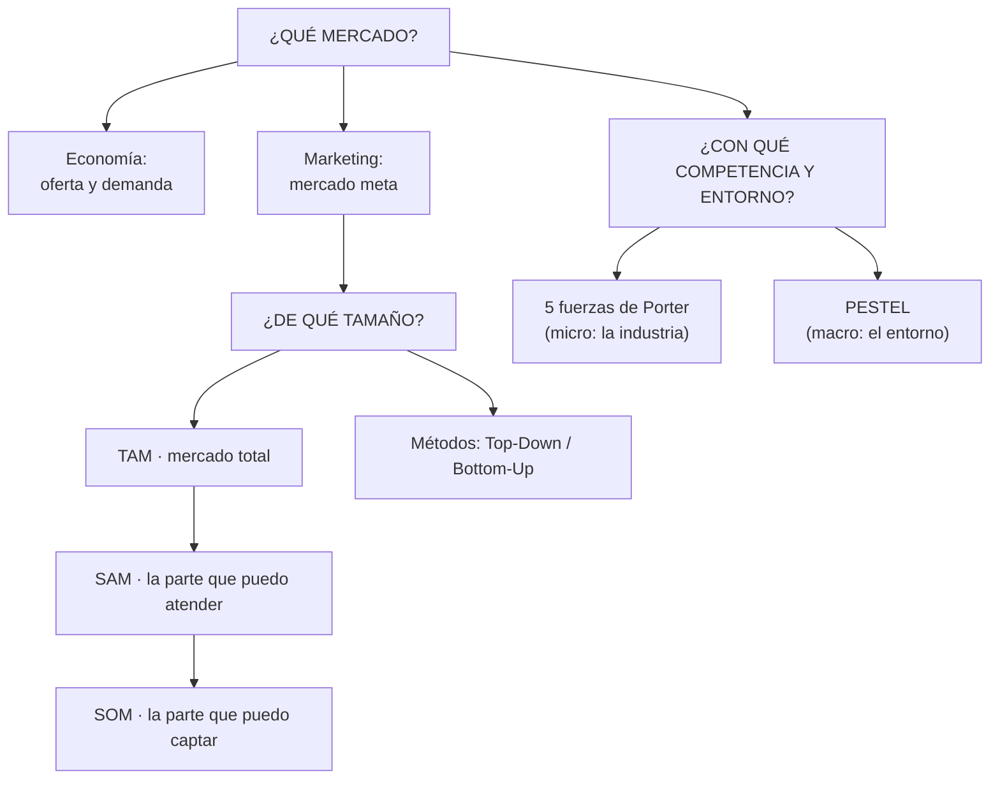
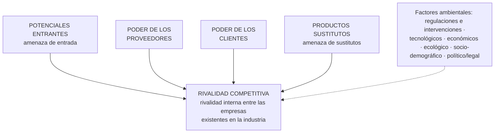

# 24 · Análisis de mercado y competencia: TAM, SAM, SOM, Porter y PESTEL

> **Fuente en el material:** *Tecnología e Innovación – Tamaño de mercado (TAM, SAM, SOM)*, título interno *"Análisis de Mercado y Competencia"* (Ing. Mario Barrios 2026; cierre firmado por Ignacio Sartori y Ezequiel Pietracupa, mayo 2026), diapositivas 1–45. Varias diapositivas son solo imagen y se leyeron desde el PDF.
> **Prerrequisitos:** [20 Propuesta de valor, clientes y competencia](20-propuesta-de-valor-clientes-y-competencia.md).
> **Tiempo estimado:** 90 min (incluye dos ejercicios con cálculo).
> **Resto de la materia · Tema 24** (Barrios). Clase descargada el 2026-10-09.

---

## 🎯 Objetivos de aprendizaje

1. Definir **mercado** desde la **economía** (oferta y demanda) y desde el **marketing** (mercado meta).
2. Leer las curvas de **oferta y demanda** y sus ecuaciones (*Qd = a − bP*, *Qo = c + dP*).
3. Distinguir **competencia perfecta, oligopolio y monopolio**.
4. Ubicar un producto en el **ciclo de vida** (5 etapas) para tomar decisiones.
5. Definir **TAM, SAM y SOM**, calcularlos y explicar para qué sirven.
6. Diferenciar los métodos **Top-Down** y **Bottom-Up** y calcular **volumen, valor, per cápita, precio promedio y market share**.
7. Aplicar las **5 fuerzas de Porter** con la herramienta de **intensidad competitiva**.
8. Aplicar el **análisis PESTEL** con sus 6 preguntas y su versión en el tiempo.

---

## 🗺️ Esquema del tema

- **I. Qué es un mercado**
  1. Visto desde la economía
  2. Curvas de oferta y demanda
  3. Estructuras de mercado: competencia perfecta, oligopolio, monopolio
  4. Visto desde el marketing: mercado meta
  5. Síntesis y la frase de Woody Allen
- **II. Ciclo de vida del producto**
- **III. TAM, SAM, SOM**
  1. Definiciones
  2. Importancia
  3. Métodos: Top-Down y Bottom-Up
  4. Cómo calcular (Top-Down) y ejemplos en biotecnología
  5. Aplicación en el crecimiento empresarial
- **IV. Dimensionar un mercado (Bottom-Up)**
  1. Las cinco medidas
  2. Market share y ganancia de share
  3. Ejercicio 1: camisas
  4. Ejercicio 2: vinos
- **V. Modelo de las 5 fuerzas de Porter** 🚫
  1. Para qué sirve
  2. Las cinco fuerzas, sus preguntas y factores
  3. Herramienta de intensidad competitiva
- **VI. Análisis PESTEL** 🚫
  1. Las 6 preguntas
  2. PESTEL en el tiempo

---

## 🧠 Mapa visual



---

## 📖 Desarrollo

## I. Qué es un mercado

La clase abre con una pregunta: *"¿Qué entienden por mercado?"*. La respuesta depende de desde dónde se mire.

### I.1 Visto desde la economía

> 📌 *"El mercado es el **espacio** en el cual confluyen las fuerzas de la **demanda** y la **oferta** para intercambiar, vender y comprar bienes y servicios a un **precio determinado**."*

### I.2 Curvas de oferta y demanda

| Curva | Ecuación | Pendiente | Qué muestra |
|---|---|---|---|
| **Demanda** | **Qd = a − bP** | Negativa | A mayor precio, la cantidad demandada **disminuye**. |
| **Oferta** | **Qo = c + dP** | Positiva | Cuando el precio sube, la producción u oferta de stock **aumenta**. |
| **Equilibrio** | **Qd = Qo** | — | Donde se cruzan: **precio de equilibrio (Pe o P0)** en el eje vertical y **cantidad de equilibrio (Qe o Q0)** en el horizontal. |

Significado de cada término de la demanda (cátedra):
- **Qd (cantidad demandada):** volumen total de productos que los consumidores están dispuestos a adquirir a un precio determinado.
- **a (intersección autónoma):** la **demanda potencial máxima** cuando el precio es cero (P = 0). Reúne los factores externos al precio que estimulan el consumo: modas, gustos, nivel de ingresos, población.
- **b (pendiente):** mide la **sensibilidad** de la demanda al precio: cuántas unidades cae la cantidad demandada por cada peso o dólar que sube el precio. Su signo es siempre negativo por la **Ley de la Demanda**: a mayor precio, menor consumo.
- **P (precio):** el valor monetario asignado al bien o servicio.

> 🧩 **Ejemplo resuelto (➕ números propios):** demanda *Qd = 1.000 − 20P*; oferta *Qo = 100 + 10P*.
> 1. Igualo: 1.000 − 20P = 100 + 10P.
> 2. Paso términos: 900 = 30P → **Pe = 30**.
> 3. Reemplazo en cualquiera de las dos: Qd = 1.000 − 20 × 30 = **400 = Qe** (control: Qo = 100 + 10 × 30 = 400 ✓).
> 4. Lectura de *a* = 1.000: si el producto fuera gratis, se demandarían 1.000 unidades. Lectura de *b* = 20: cada $1 de aumento le quita 20 unidades a la demanda.

### I.3 Estructuras de mercado

La cátedra define el **ambiente competitivo** del mercado en que se desenvolverá el futuro negocio; puede tomar tres formas:

| Característica | **Competencia perfecta** | **Oligopolio** | **Monopolio** |
|---|---|---|---|
| Número de productores | **Muchísimos** (mercado atomizado) | **Pocos** productores grandes | **Uno solo** (único proveedor) |
| Tipo de producto | **Homogéneo** (idéntico, sin diferencias) | Homogéneo o diferenciado | **Único** (sin sustitutos cercanos) |
| Control sobre el precio | **Nulo** (son precio-aceptantes) | **Alto**, pero dependiente de la competencia | **Total** (fija el precio o la cantidad) |
| Barreras de entrada | **Ninguna** (libertad absoluta de entrada y salida) | **Fuertes** (legales, económicas o tecnológicas) | **Infranqueables** (bloqueo total al mercado) |
| Información del mercado | **Perfecta** (transparente para todos) | Imperfecta y estratégica | Imperfecta (controlada por la empresa) |
| Ejemplo común | Mercados agrícolas (trigo, leche), materias primas | Telefonía móvil, aerolíneas, industria automotriz | Servicios públicos (agua, electricidad local) |

> 💡 **Para qué le sirve a un emprendedor:** la estructura define cuánto margen de maniobra tenés. En competencia perfecta no podés subir el precio (te compran a otro idéntico); en un oligopolio cada movimiento tuyo provoca una reacción de los grandes; en un monopolio, el problema es entrar.

### I.4 Visto desde el marketing: mercado meta

| Autor | Definición (cátedra) |
|---|---|
| **Kotler / Armstrong** | *"Consiste en un conjunto de **compradores** que tienen **necesidades y/o características comunes** a los que la empresa u organización **decide servir**."* |
| **Stanton / Walker** | *"El **segmento** de mercado al que una empresa dirige su programa de marketing."* · *"Un segmento de mercado (personas u organizaciones) para el que el vendedor diseña una mezcla de mercadotecnia es un **mercado meta**."* |
| **Kotler**, *Dirección de Mercadotecnia* | *"La parte del **mercado disponible calificado** que la empresa **decide captar**."* |
| **American Marketing Association (AMA)** | *"El segmento particular de una población total en el que el detallista enfoca su pericia de comercialización para satisfacer ese submercado, con la finalidad de lograr una determinada **utilidad**."* |
| **Diccionario de Marketing** (Cultural S.A.) | *"La parte del mercado disponible cualificado al que la empresa decide aspirar."* |

### I.5 Síntesis

> 📌 **En síntesis (visto desde el marketing):** *"aquel **segmento** de mercado que la empresa **decide captar, satisfacer y/o servir**, dirigiendo hacia él su **programa de marketing**; con la finalidad de obtener una determinada **utilidad o beneficio**."*

> 📌 *"No conozco la clave del éxito, pero sé que la clave del fracaso es tratar de complacer a todo el mundo."* — **Woody Allen**

> 💡 **Qué quiere decir la frase en este tema:** elegir un mercado meta implica **dejar afuera** a otros. Si querés venderle a todos, el mensaje, el precio y el canal no le sirven bien a nadie. Por eso después se achica el mercado de TAM a SAM a SOM.

> 📝 **Citar y explayarse:** Desde el marketing, el mercado no es "toda la gente": es *"aquel segmento de mercado que la empresa decide captar, satisfacer y/o servir, dirigiendo hacia él su programa de marketing, con la finalidad de obtener una determinada utilidad"*. La palabra clave es **decide**: el mercado meta es una elección. Una app de gestión de stock no apunta a "todos los comercios", sino, por ejemplo, a comercios minoristas de indumentaria con una o dos sucursales en el AMBA, porque para ellos puede diseñar un precio, un canal y un mensaje concretos. Como dice la frase de Woody Allen que cita la cátedra, la clave del fracaso es tratar de complacer a todo el mundo.

---

## II. Ciclo de vida del producto

> 📌 *"La clave es **predecir la evolución del ciclo de vida** para la toma de decisiones."*

El gráfico de la cátedra muestra dos curvas en el tiempo: **ventas** (azul) y **utilidades** (roja), en cinco etapas:

| # | Etapa | Ventas | Utilidades |
|---|---|---|---|
| 1 | **Etapa de desarrollo** | No hay | **Negativas**: pérdidas por inversión |
| 2 | **Introducción** | Empiezan, crecen lento | Siguen negativas (se gasta en lanzar) |
| 3 | **Crecimiento** | Suben rápido | Pasan a positivas y crecen |
| 4 | **Madurez** | Máximo | Máximas y empiezan a bajar (más competencia) |
| 5 | **Declinación** | Caen | Caen |

> 💡 **Por qué "predecir":** las decisiones correctas cambian según la etapa (en introducción se invierte en dar a conocer; en madurez se defiende participación; en declinación se cosecha o se reinventa). Si creés que estás en crecimiento y en realidad entraste en madurez, invertís como si el mercado fuera a seguir subiendo.

> 🔗 Mismo gráfico que usa la *Matriz BCG + ciclo de vida* del tema [25](25-matrices-para-la-toma-de-decisiones.md#iii6-bcg-y-ciclo-de-vida-del-producto), y misma lógica que la **curva S** ([05](../parcial-1/05-curvas-de-la-tecnologia.md)) y el ciclo "cosechar o reinventar" ([21](21-estrategias-oceano-azul-y-canvas.md#ii-uso-de-estrategia-el-ciclo-del-productonegocio)).

---

## III. TAM, SAM, SOM

### III.1 Definiciones

| Sigla | Nombre | Definición (cátedra) |
|---|---|---|
| **TAM** | *Total Addressable Market* | **Tamaño total** del mercado disponible. |
| **SAM** | *Serviceable Available Market* | Parte del TAM **accesible y relevante** para el negocio. |
| **SOM** | *Serviceable Obtainable Market* | Parte del SAM que el negocio puede **captar razonablemente**. |

Se dibujan como **círculos concéntricos**: SOM ⊂ SAM ⊂ TAM.

> 💡 **Cómo pensarlo sin metáforas:**
> - **TAM** = si **todos** los que tienen el problema te compraran, ¿cuánto facturarías? Es el techo teórico.
> - **SAM** = sacás a los que **no podés atender** con tu modelo actual (otro país, otra regulación, otro idioma, otro canal, otro segmento).
> - **SOM** = de los que sí podés atender, ¿cuántos vas a **ganar de verdad** en un plazo dado, con tu capacidad y frente a tu competencia?

> 🧩 **Ejemplo (➕ números propios):** software de turnos para peluquerías.
> - TAM: 500.000 peluquerías en Latinoamérica × USD 240/año = **USD 120 M/año**.
> - SAM: solo Argentina y en español con integración a medios de pago locales: 60.000 × 240 = **USD 14,4 M/año**.
> - SOM: con 2 vendedores y frente a 3 competidores, se estima captar el 3 % del SAM en 3 años: 1.800 × 240 = **USD 432.000/año**.

### III.2 Importancia

| 1. **Entendimiento del mercado** | 2. **Planificación y crecimiento empresarial** |
|---|---|
| Herramientas para evaluar el **potencial de mercado**. | Identificación de **oportunidades de crecimiento**. |
| Establecimiento de **metas realistas** y toma de decisiones estratégicas. | **Optimización de recursos.** |
| | **Atracción de inversores.** |

### III.3 Métodos para estimar el tamaño del mercado

| Enfoque | Dirección del análisis | Niveles o pasos |
|---|---|---|
| **Top-Down** | De lo **macro** a lo **micro** | 1. Mercado total → 2. División por segmentos (%) → 3. Divisiones regionales → 4. Divisiones por país |
| **Bottom-Up** | De lo **micro** a lo **macro** | 1. Ingresos de la empresa en el mercado → 2. Ingresos de los principales competidores → 3. Cuota de mercado del vendedor → 4. Tamaño total del mercado |

La cátedra lo dibuja como dos triángulos enfrentados: el **Top-Down** es un embudo que empieza en el *Total Market* y se va partiendo; el **Bottom-Up** es una pirámide que empieza en el *Revenue of Firm in the Market* y va sumando hasta el *Market Size*.

Una diapositiva compara tres métodos (la imagen está parcialmente ilegible en el archivo; se transcribe lo que se lee):

| | **1. Top-Down** | **2. (Bottom-Up)** | **3.** |
|---|---|---|---|
| Para quién | El método **más fácil y rápido** | El mejor método para **PyMEs / empresas** (*SMBs/enterprise*) | El mejor método para **startups / scaleups** |
| De dónde salen los datos | De **terceros** (*third-party*) | (ilegible) | (ilegible) |
| Cálculo basado en | **Datos demográficos** | (ilegible) | (ilegible) |
| Precisión | (ilegible) | **Mejor precisión** | **Precisión limitada** |

> ➕ **Contexto adicional:** el gráfico original (de uso habitual en startups) es **Top-Down / Bottom-Up / Value Theory**. En el Bottom-Up los datos salen de **tus propias ventas y precios**; en el *Value Theory* (teoría del valor) el cálculo se basa en **cuánto valor le genera la solución al cliente** y cuánto estaría dispuesto a pagar, útil cuando el producto es nuevo y no hay mercado previo con qué comparar. Top-Down suele tener **precisión limitada** porque parte de estadísticas generales.

> ⚠️ **Trampa:** Top-Down **no** es "más preciso porque usa el mercado total". Es más **rápido**, pero suele **inflar** el resultado (es fácil decir "si capto el 1 % de un mercado gigante…"). Bottom-Up parte de datos reales (clientes, precios, ventas) y por eso es más **creíble** ante un inversor.

### III.4 Cómo calcular (Top-Down) y ejemplos

**Pasos (cátedra):**
1. **Identificar** el mercado y los segmentos de audiencia.
2. **Estimar el TAM:** multiplicar **clientes potenciales × ingresos promedio**.
3. **Filtrar** para calcular el **SAM**.
4. **Filtrar adicionalmente** para calcular el **SOM**.

**Ejemplo de cálculo (cátedra):** startup de biotecnología que desarrolla una **terapia génica para una enfermedad rara**.
- **TAM:** todos los pacientes diagnosticados con la enfermedad a nivel global × costo estimado de **USD 500.000 por tratamiento**.
- **SAM y SOM:** ajuste basado en la **accesibilidad** del tratamiento en distintos países, la **competencia** existente y las **regulaciones** locales.

**Ejemplos de éxito en biotecnología (cátedra):**

| | **Terapia de células CAR-T** (tratamiento del linfoma) | **Dispositivo portátil de diagnóstico de ADN** (enfermedades genéticas) |
|---|---|---|
| TAM | Todos los pacientes con linfoma a nivel global. | Todos los hospitales y clínicas del mundo interesados en diagnóstico genético. |
| SAM | Pacientes en **mercados desarrollados** donde el tratamiento está **aprobado y accesible**. | Instituciones en mercados desarrollados con **capacidad de pagar y adoptar** nuevas tecnologías. |
| SOM | Pacientes tratados **por la empresa**, considerando **competencia y capacidad de producción**. | Centros médicos que **eligen este dispositivo**, considerando las alternativas disponibles. |

> 💡 **El patrón que se repite:** TAM = todos los que tienen el problema; SAM = filtro de **acceso** (aprobación, capacidad de pago, geografía); SOM = filtro de **competencia y capacidad propia**.

> ➕ Las notas de la diapositiva explican que la terapia CAR-T consiste en **modificar genéticamente las células** del paciente para que reconozcan y destruyan células tumorales.

### III.5 Aplicación en el crecimiento empresarial

| Uso | Qué dice la cátedra |
|---|---|
| **Estrategia Go-to-Market** | Planificar la entrada al mercado con objetivos basados en TAM, SAM, SOM. |
| **Atraer inversores** | Usar estas métricas para **demostrar potencial**. |
| **Estrategias de crecimiento** | Expansión geográfica y entrada a nuevos mercados; identificar nuevas industrias o segmentos de clientes. |
| **Validar ideas de negocio** | Confirmar oportunidades de mercado **antes de la inversión**. |

> 📌 **Conclusión de la cátedra:** TAM, SAM y SOM son esenciales para entender el mercado y son herramientas cruciales para la **estrategia de crecimiento**, la **asignación de recursos** y la **atracción de inversión**. Recomendación: usarlas para guiar decisiones clave de la estrategia de negocio.

> 🔗 El crecimiento "del SOM hacia el SAM" con productos actuales es **penetración** o **desarrollo de mercado**; agrandar el SAM con nuevos segmentos es **desarrollo de mercado** o **diversificación** (Ansoff, tema [21](21-estrategias-oceano-azul-y-canvas.md#iv-matriz-de-ansoff)).

---

## IV. Dimensionar un mercado (Bottom-Up)

### IV.1 Las cinco medidas

La diapositiva *"¿Cómo se dimensiona un mercado? Bottom-Up"* usa un ejemplo de comprimidos:

| Medida | Ejemplo de la cátedra |
|---|---|
| Unidades consumidas o **volumen** | 1 millón de comprimidos |
| **Ventas o facturación** | 500 millones de pesos |
| **Consumidores** reales y potenciales | 250.000 personas |
| **Consumo per cápita** | 4 comprimidos |
| **Precio** ("por litro", dice la diapositiva) | $ 0,50 / comprimido |

> ⚠️ **Los números de la diapositiva no cierran entre sí** (analizalos con criterio):
> - Volumen = consumidores × per cápita = 250.000 × 4 = **1.000.000** ✓.
> - Facturación = volumen × precio = 1.000.000 × $0,50 = **$500.000**, no 500 millones. Para que dé 500 millones, el precio tendría que ser **$500** por comprimido.
> - Dice "precio **por litro**" pero el ejemplo es de comprimidos (quedó de otro ejemplo).
> Lo que importa es la **relación** entre las medidas, que sí es correcta.

**Definiciones (cátedra):**
- **Mercado en volumen:** la totalidad de litros, kilos, unidades, etc.
- **Mercado en valores:** la facturación total del mercado; se calcula multiplicando el **volumen por el precio promedio** de cada uno de los *players*.
- **Per cápita:** el total de **volumen dividido la población**.
- **Precio por unidad:** resulta de dividir la **facturación total** del mercado por el **volumen total** del mercado.

```
Volumen (u)      = Consumidores × Consumo per cápita
Valor ($)        = Σ (Volumen de cada player × su precio)
Per cápita       = Volumen total ÷ Población
Precio promedio  = Valor total ÷ Volumen total
```

### IV.2 Market share y ganancia de share

- **Share en volumen:** el volumen de una marca, producto o compañía **vs. el total** del mercado.
- **Share en valores:** la facturación de una marca, producto o compañía **vs. la facturación** de esa industria.
- **Ganancia de share:** *"una marca o compañía gana share cuando el **crecimiento de sus ventas en %** es **mayor** al crecimiento de la **industria** en %"*.
- **Market share:** *"es un **mejor indicador de performance** que el volumen interno porque me **compara vs. el mercado**"*.

> 💡 **Por qué el share es mejor indicador:** si tus ventas crecieron 10 % pero el mercado creció 20 %, en realidad **perdiste terreno** frente a la competencia, aunque tu número interno se vea bien.

> ⚠️ **Share en volumen ≠ share en valores.** Una marca barata puede liderar en unidades y quedar última en facturación (lo vas a ver en el ejercicio 1 con la marca B).

### IV.3 Ejercicio 1: mercado de camisas

**Enunciado (cátedra).** Mercado de camisas en el año 1: **Marca A** 580.000 unidades a $100; **Marca B** 750.000 unidades a $58; **Marca C** 474.000 unidades a $165. Calcular:
1. Volumen de mercado en unidades y en ventas en el año 1.
2. Share de mercado en unidades y en ventas en el año 1.
3. Si en el año 2 A crece 10 %, B crece 2 %, C no crece y todas suben precios 5 %: nuevo tamaño de mercado en volumen y facturación y nuevos market share en volumen.

<details><summary>Ver resolución paso a paso</summary>

**Paso 1 · Facturación por marca (volumen × precio):**

| Marca | Unidades | Precio | Facturación |
|---|---:|---:|---:|
| A | 580.000 | $100 | $58.000.000 |
| B | 750.000 | $58 | $43.500.000 |
| C | 474.000 | $165 | $78.210.000 |
| **Total** | **1.804.000** | | **$179.710.000** |

**Paso 2 · Shares año 1 (cada marca ÷ total):**

| Marca | Share en unidades | Share en ventas ($) |
|---|---:|---:|
| A | 580.000 / 1.804.000 = **32,2 %** | 58,0 M / 179,71 M = **32,3 %** |
| B | 750.000 / 1.804.000 = **41,6 %** | 43,5 M / 179,71 M = **24,2 %** |
| C | 474.000 / 1.804.000 = **26,3 %** | 78,21 M / 179,71 M = **43,5 %** |

👉 **Lectura:** B lidera en **volumen** (41,6 %) pero es la más chica en **valor** (24,2 %) porque es la más barata; C es la más chica en unidades pero la que más factura.

**Paso 3 · Año 2:**

| Marca | Unidades año 2 | Precio año 2 (+5 %) | Facturación año 2 |
|---|---:|---:|---:|
| A | 580.000 × 1,10 = 638.000 | $105,00 | $66.990.000 |
| B | 750.000 × 1,02 = 765.000 | $60,90 | $46.588.500 |
| C | 474.000 × 1,00 = 474.000 | $173,25 | $82.120.500 |
| **Total** | **1.877.000** (+4,0 %) | | **$195.699.000** (+8,9 %) |

**Shares en volumen año 2:** A = 638.000 / 1.877.000 = **34,0 %** · B = 765.000 / 1.877.000 = **40,8 %** · C = 474.000 / 1.877.000 = **25,3 %**.

👉 **Lectura con el criterio de la cátedra:** el mercado creció 4,0 % en volumen. **A** creció 10 % > 4 % → **gana share** (32,2 % → 34,0 %). **B** creció 2 % < 4 % → **pierde share** (41,6 % → 40,8 %) aunque vendió más camisas. **C** no creció → pierde share (26,3 % → 25,3 %).

> ⚠️ La facturación total crece 8,9 %, más que el volumen, porque se suma la suba de precios (1,040 × 1,05 ≈ 1,089).
</details>

### IV.4 Ejercicio 2: mercado de vinos

**Enunciado (cátedra).** **Empresa A** vende 1.500.000 lts al año: marca **x** a $50/lt, 800.000 lts; marca **xx** a $140/lt, 700.000 lts. **Empresa B** vende 2.300.000 lts al año: marca **Y** a $35/lt, 950.000 lts; marca **YY** a $100/lt, 650.000 lts; marca **YYY** a $160/lt, 700.000 lts. Calcular: volumen de mercado en litros y en ventas; precio promedio del litro por empresa; share de mercado en litros y en ventas, por empresa y por vino.

<details><summary>Ver resolución paso a paso</summary>

**Paso 1 · Facturación por vino:**

| Empresa | Vino | Litros | $/lt | Facturación | Share litros | Share ventas |
|---|---|---:|---:|---:|---:|---:|
| A | x | 800.000 | 50 | $40.000.000 | 21,1 % | 11,5 % |
| A | xx | 700.000 | 140 | $98.000.000 | 18,4 % | 28,1 % |
| B | Y | 950.000 | 35 | $33.250.000 | 25,0 % | 9,5 % |
| B | YY | 650.000 | 100 | $65.000.000 | 17,1 % | 18,7 % |
| B | YYY | 700.000 | 160 | $112.000.000 | 18,4 % | 32,2 % |
| | **Total mercado** | **3.800.000** | | **$348.250.000** | 100 % | 100 % |

**Paso 2 · Por empresa:**

| Empresa | Litros | Facturación | Precio promedio (valor ÷ litros) | Share litros | Share ventas |
|---|---:|---:|---:|---:|---:|
| A | 1.500.000 | $138.000.000 | 138.000.000 / 1.500.000 = **$92,00** | **39,5 %** | **39,6 %** |
| B | 2.300.000 | $210.250.000 | 210.250.000 / 2.300.000 = **$91,41** | **60,5 %** | **60,4 %** |

Precio promedio del mercado = 348.250.000 / 3.800.000 = **$91,64/lt**.

👉 **Lectura:** las dos empresas tienen precios promedio casi iguales, por eso su share en litros y en ventas casi coincide. Pero **por vino** las diferencias son enormes: **Y** es el más vendido en litros (25 %) y el que menos factura (9,5 %); **YYY** es el que más factura (32,2 %).

> ⚠️ **Precio promedio ≠ promedio de precios.** El de A **no** es (50 + 140) / 2 = 95: hay que **ponderar por volumen** (facturación total ÷ litros totales), como dice la definición de la cátedra.
</details>

---

## V. Modelo de las 5 fuerzas de Porter

> 🚫 **No sale** según lo anotado en clase por otro grupo (Porter y PESTEL no entran). Queda como referencia.

### V.1 Para qué sirve

> 📌 *"El Modelo de Fuerzas de Porter nos permite analizar la **intensidad competitiva** de una industria. Es fundamental analizar la **estructura** de una cierta industria en donde se desea ser parte, entendiendo el **balance de fuerzas**."*

> 📌 *"La utilización del Modelo nos servirá para comprender la **dinámica del mercado**, su **rentabilidad**, y desarrollar **estrategia y políticas** acordes al mismo, en función de las fuerzas relativas."*



> 💡 **La regla para leerlo:** cuanto **más fuerte** es cada fuerza, **menos rentable** es la industria para los que están adentro (más gente peleando por la misma plata, o alguien con poder para quedarse con una parte del margen).

### V.2 Las cinco fuerzas, sus preguntas y factores

| # | Fuerza | Pregunta (cátedra) | Factores que **aumentan** la intensidad competitiva (cátedra) |
|---|---|---|---|
| 1 | **Rivalidad competitiva** | ¿Cómo reaccionaría un competidor ante una iniciativa de algún participante de aumentar las ventas? | Muchos competidores de igual tamaño · bajo crecimiento de la industria · productos no diferenciados (*commodities*) · altos costos fijos · productos perecederos · sobrecapacidad en la industria. |
| 2 | **Potenciales entrantes** | ¿Cuán fácil es para un nuevo jugador entrar a la industria y tomar participación del mercado? | Pocas economías de escala · poco capital necesario para competir · fácil acceso a canales de distribución. |
| 3 | **Clientes** | ¿Cuán fácil es para los clientes cambiar de proveedores? | Productos no diferenciados · producto no importante en el proceso productivo del cliente · los clientes pueden **"integrarse hacia atrás"**. |
| 4 | **Proveedores** | ¿Cuán dependiente es la organización de sus proveedores? | Pocos proveedores dominan la industria · los productos son únicos, muy diferenciados o tienen un alto **costo de cambio**. |
| 5 | **Productos sustitutos** | ¿Se pueden reemplazar los productos por otros similares? | Sustitutos similares que se hacen a **menor costo** o son **más convenientes**. |

> 🧩 **Ejemplo aplicado (➕):** delivery de comida por app en una ciudad.
> 1. **Rivalidad alta:** pocas apps grandes que pelean con descuentos; altos costos fijos de tecnología.
> 2. **Entrantes: amenaza media-baja:** hace falta mucho capital y una red de repartidores y comercios para que la app sirva (efecto red).
> 3. **Clientes con poder alto:** cambiar de app cuesta cero; comparan precio en segundos.
> 4. **Proveedores (restaurantes y repartidores): poder medio:** los grandes restaurantes negocian comisiones; los repartidores pueden irse a otra app.
> 5. **Sustitutos: altos:** pedir por teléfono o WhatsApp al local, retirar en persona, cocinar.
> → **Conclusión:** industria de baja rentabilidad, salvo que se construya diferenciación (exclusividades, suscripción, velocidad).

> 🔗 La **integración hacia atrás** (tema [21](21-estrategias-oceano-azul-y-canvas.md#i1-estrategias-de-integración)) es justamente la respuesta de una empresa ante **proveedores** con mucho poder; cuando la hace el **cliente**, aumenta su poder sobre vos.

### V.3 Herramienta de intensidad competitiva

La cátedra propone una **tabla para trabajar** cada fuerza:

| Fuerza | Importancia relativa | Fuerza baja · moderada · alta | Tendencia futura | Comentarios |
|---|---|---|---|---|
| Rivalidad interna | | | | |
| Potenciales entrantes | | | | |
| Poder de proveedores | | | | |
| Poder de los clientes | | | | |
| Poder de sustitutos | | | | |
| **Resumen** | | | | |

Las columnas de fuerza se leen hacia la derecha como **"aumento de rentabilidad"**: cuanto más a la izquierda (fuerza **baja**), mejor para la rentabilidad de la industria.

Para puntuar cada fuerza, las diapositivas siguientes dan una **escala de 1 a 9** (LOW 1–3 · MID 3–5 · HIGH 5–9) con los factores detallados de Porter, por ejemplo:
- **Poder de compradores:** importancia de un solo comprador para la industria, concentración de compradores, importancia del producto para la calidad del comprador, amenaza de integración hacia atrás, costo de cambio del comprador, rentabilidad de los compradores.
- **Rivalidad interna:** número y tamaño de competidores, barreras de salida, tamaño de los incrementos de capacidad, costos fijos sobre costos totales, diversidad de las empresas, madurez de la industria, diferenciación del producto.
- **Barreras de entrada:** economías de escala, diferenciación del producto, requisitos de capital, desventajas de costo independientes del tamaño, acceso a canales de distribución, política gubernamental, comportamiento pasado de los incumbentes, madurez.
- **Poder de proveedores:** importancia de un solo proveedor, concentración de proveedores, importancia de la industria como comprador, amenaza de integración hacia delante o hacia atrás, costo de cambio de proveedor, disponibilidad de materias primas sustitutas, rentabilidad de los proveedores.

> 💡 **Cómo se usa en un trabajo práctico:** para cada fuerza ponés un puntaje (baja/moderada/alta), cuánto pesa en tu industria (importancia relativa), si va a crecer o bajar (tendencia futura) y por qué (comentarios). La fila **Resumen** te dice si la industria es atractiva.

---

## VI. Análisis PESTEL

> 🚫 **No sale** según lo anotado en clase por otro grupo (Porter y PESTEL no entran). Queda como referencia.

### VI.1 Las 6 preguntas

| Letra | Factor | Pregunta clave (cátedra) |
|---|---|---|
| **P** | **Político** | ¿Cuáles son los factores políticos que probablemente afectarán el negocio? |
| **E** | **Económico** | ¿Cuáles son los factores económicos que afectarán el negocio? |
| **S** | **Sociológico** | ¿Qué aspectos culturales pueden afectar el negocio? |
| **T** | **Tecnológico** | ¿Qué cambios tecnológicos pueden afectar el negocio? |
| **E** | **Ecológico / Ambiental** | ¿Cuáles son las consideraciones ambientales que pueden afectar el negocio? |
| **L** | **Legal** | ¿Qué legislación actual e inminente afectará el negocio? |

> ⚠️ **En la diapositiva las letras de Legal y Ambiental están invertidas** (Legal aparece con "E" y Ambiental con "L"). Lo correcto es **E = Ecológico/Ambiental** y **L = Legal**. La diapositiva lo titula *"PESTLE"*: es el mismo análisis con otro orden de letras.

> 💡 **PESTEL vs. Porter:** PESTEL mira el **macroentorno** (fuerzas que la empresa no controla y que afectan a toda la economía); Porter mira la **industria** (competidores, clientes, proveedores, entrantes, sustitutos). Porter incluye los *"factores ambientales"* como un marco alrededor de las cinco fuerzas: ahí entra el PESTEL.

> 🧩 **Ejemplo aplicado (➕):** una fintech de pagos en Argentina. **P:** cambios de gobierno en la política de bancarización. **E:** inflación y tipo de cambio. **S:** mayor uso del celular para pagar. **T:** pagos con QR, transferencias inmediatas. **E:** bajo impacto directo (servidores y consumo energético). **L:** regulación del BCRA para proveedores de servicios de pago.

### VI.2 PESTEL en el tiempo

La última diapositiva (*"PESTEL en el tiempo"*, fuente: Aguilera-Luque, 2011) muestra una tabla más avanzada:
- **Filas:** factores concretos agrupados por **político-legales, económicos, socio-culturales, tecnológicos y medioambientales**.
- **Influencia/relación con otros factores:** cada factor se cruza con los demás grupos (P-L, ECO, S-C, TEC, MA) con una escala de muy fuerte negativa a muy fuerte positiva.
- **Evolución futura del impacto** en tres horizontes: **12 meses, 1–3 años y 3–5 años**, con una escala de **−2** (muy desfavorable) a **+2** (muy favorable).

> 💡 **Qué agrega:** el PESTEL básico es una foto. Esta versión obliga a pensar **cómo va a cambiar** cada factor y **cómo se afectan entre sí** (por ejemplo, una ley de protección de datos —legal— impacta en lo tecnológico y en lo social).

---

## ⚠️ Conceptos que se confunden

| Se confunde… | …con | Diferencia |
|---|---|---|
| TAM | SAM | TAM = **todo** el mercado. SAM = la parte **accesible y relevante** para tu modelo. |
| SAM | SOM | SAM = lo que **podrías** atender. SOM = lo que **razonablemente vas a captar** (competencia y capacidad). |
| Top-Down | Bottom-Up | Top-Down: de lo **macro a lo micro** (rápido, datos de terceros). Bottom-Up: de lo **micro a lo macro** (ventas propias y de competidores; más preciso). |
| Share en volumen | Share en valores | Volumen = unidades; valores = facturación. Una marca barata puede liderar en uno y no en el otro. |
| Crecer en ventas | Ganar share | Se gana share solo si tus ventas crecen **más que la industria** (en %). |
| Precio promedio | Promedio de precios | Precio promedio = facturación total ÷ volumen total (**ponderado**). |
| Mercado (economía) | Mercado meta (marketing) | Economía: espacio donde se cruzan oferta y demanda. Marketing: el **segmento que la empresa decide** servir. |
| Porter | PESTEL | Porter = **industria** (micro). PESTEL = **macroentorno**. |
| Poder de clientes | Rivalidad | El poder de clientes mide cuánto pueden **imponer condiciones** (cambiar de proveedor, integrarse hacia atrás); la rivalidad mide cuánto **pelean entre sí** los competidores. |
| Oligopolio | Monopolio | Oligopolio = **pocos** grandes, barreras fuertes. Monopolio = **uno solo**, barreras infranqueables. |

---

## 🔗 Conexiones

- **← [20 Propuesta de valor, clientes y competencia](20-propuesta-de-valor-clientes-y-competencia.md):** el buyer persona y los tipos de competidores son el insumo cualitativo; acá se agrega el **tamaño** y la **estructura** del mercado.
- **← [05 Curvas](../parcial-1/05-curvas-de-la-tecnologia.md):** ciclo de vida del producto y curva S.
- **→ [25 Matrices para la toma de decisiones](25-matrices-para-la-toma-de-decisiones.md):** Porter, PESTEL, análisis del entorno y oferta–demanda aparecen resumidos como herramientas de decisión.
- **→ [26 Marketing](26-marketing-en-accion.md):** una vez elegido el mercado meta, el marketing define cómo llegar a él.
- **→ [27 Análisis financiero y estrategias de salida](27-analisis-financiero-y-estrategias-de-salida.md):** el TAM/SAM/SOM es lo que un inversor mira para valuar el potencial del proyecto.

---

## ✍️ Autoevaluación

**1. Defina mercado desde la economía y desde el marketing.**
<details><summary>Ver respuesta</summary>

**Economía:** *"el espacio en el cual confluyen las fuerzas de la demanda y la oferta para intercambiar, vender y comprar bienes y servicios a un precio determinado"*. **Marketing (síntesis de la cátedra):** *"aquel segmento de mercado que la empresa decide captar, satisfacer y/o servir, dirigiendo hacia él su programa de marketing, con la finalidad de obtener una determinada utilidad o beneficio"*.
</details>

**2. En *Qd = a − bP*, ¿qué representan *a* y *b*? ¿Por qué *b* lleva signo negativo?**
<details><summary>Ver respuesta</summary>

*a* es la **demanda potencial máxima** con precio cero; reúne los factores ajenos al precio (gustos, ingresos, población). *b* es la **pendiente**: cuántas unidades cae la demanda por cada unidad que sube el precio. Es negativa por la **Ley de la Demanda**: a mayor precio, menor consumo.
</details>

**3. Compare competencia perfecta, oligopolio y monopolio en número de productores, control del precio y barreras de entrada.**
<details><summary>Ver respuesta</summary>

Competencia perfecta: muchísimos productores, control nulo (precio-aceptantes), sin barreras. Oligopolio: pocos productores grandes, control alto pero dependiente de la competencia, barreras fuertes. Monopolio: uno solo, control total, barreras infranqueables.
</details>

**4. Defina TAM, SAM y SOM y dé un ejemplo.**
<details><summary>Ver respuesta</summary>

**TAM:** tamaño total del mercado disponible. **SAM:** parte del TAM accesible y relevante para el negocio. **SOM:** parte del SAM que el negocio puede captar razonablemente. Ejemplo CAR-T: TAM = todos los pacientes con linfoma del mundo; SAM = los de mercados desarrollados donde el tratamiento está aprobado y accesible; SOM = los que la empresa puede tratar considerando competencia y capacidad de producción.
</details>

**5. ¿Qué diferencia hay entre Top-Down y Bottom-Up? ¿Cuál es más preciso?**
<details><summary>Ver respuesta</summary>

Top-Down va de lo macro a lo micro: mercado total → segmentos → regiones → países; es el más fácil y rápido, con datos de terceros. Bottom-Up va de lo micro a lo macro: ingresos propios → ingresos de los competidores → cuota del vendedor → tamaño total; tiene mejor precisión porque parte de datos reales de ventas.
</details>

**6. ¿Para qué sirven TAM, SAM y SOM según la cátedra?**
<details><summary>Ver respuesta</summary>

Para entender el mercado (evaluar potencial, fijar metas realistas) y para planificar el crecimiento (identificar oportunidades, optimizar recursos, atraer inversores). Se aplican en la estrategia go-to-market, para atraer inversores, para estrategias de crecimiento y para validar ideas antes de invertir.
</details>

**7. Una marca creció 6 % en ventas y el mercado creció 9 %. ¿Ganó o perdió share? Justifique.**
<details><summary>Ver respuesta</summary>

**Perdió share.** Según la cátedra, se gana share cuando el crecimiento de las ventas en % es mayor al de la industria; acá 6 % < 9 %. Aunque vende más, la competencia creció más rápido.
</details>

**8. Calcule el precio promedio por litro de una empresa que vende 800.000 lts a $50 y 700.000 lts a $140.**
<details><summary>Ver respuesta</summary>

Facturación = 800.000 × 50 + 700.000 × 140 = 40.000.000 + 98.000.000 = $138.000.000. Litros = 1.500.000. Precio promedio = 138.000.000 / 1.500.000 = **$92/lt** (no $95, que sería el promedio simple sin ponderar).
</details>

**9. Nombre las 5 fuerzas de Porter y, para cada una, un factor que aumente la intensidad competitiva.**
<details><summary>Ver respuesta</summary>

Rivalidad competitiva (muchos competidores de igual tamaño, bajo crecimiento, commodities, altos costos fijos); potenciales entrantes (pocas economías de escala, poco capital necesario); poder de clientes (productos no diferenciados, pueden integrarse hacia atrás); poder de proveedores (pocos proveedores dominan, alto costo de cambio); sustitutos (similares, más baratos o más convenientes).
</details>

**10. ¿Qué preguntas hace el PESTEL y en qué se diferencia de Porter?**
<details><summary>Ver respuesta</summary>

Político: ¿qué factores políticos afectarán el negocio? Económico: ¿qué factores económicos? Sociológico: ¿qué aspectos culturales? Tecnológico: ¿qué cambios tecnológicos? Ecológico/ambiental: ¿qué consideraciones ambientales? Legal: ¿qué legislación actual e inminente? PESTEL analiza el **macroentorno**; Porter analiza la **estructura de la industria**.
</details>

---

[← 23 Metodologías ágiles y Scrum](23-metodologias-agiles-y-scrum.md) · [🏠 Índice](../README.md) · [Siguiente → 25 Matrices para la toma de decisiones](25-matrices-para-la-toma-de-decisiones.md)
