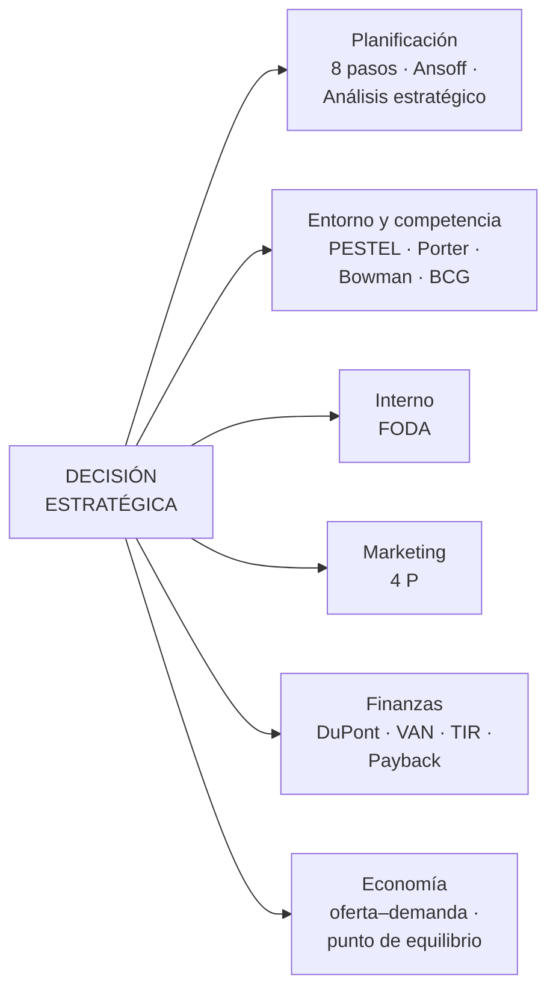
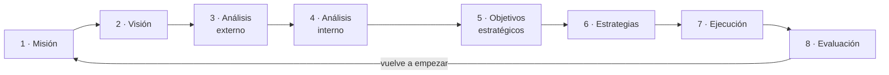

# 25 · Matrices para la toma de decisiones

> **Fuente en el material:** *Tecnología e Innovación – Jueves – Matrices para la toma de decisiones* (Ing. Mario Barrios), diapositivas 1–34. Casi todos los gráficos son imágenes y se leyeron desde el PDF.
> **Prerrequisitos:** [21 Estrategias y Ansoff](21-estrategias-oceano-azul-y-canvas.md), [24 Análisis de mercado y competencia](24-analisis-de-mercado-y-competencia.md).
> **Tiempo estimado:** 75 min.
> **Resto de la materia · Tema 25** (Jueves MRI · Barrios). Clase descargada el 2026-10-09.
> 🚫 **Qué sale en el examen, según lo anotado en clase por otro grupo:** de esta clase **solo salen los 8 pasos de la planificación estratégica (II.1) y la Matriz de Ansoff (II.2)**. Todo lo demás (Matriz de Análisis Estratégico, PESTEL, análisis del entorno, Porter, Bowman, BCG, FODA, 4 P, DuPont, VAN/TIR, Payback, punto de equilibrio) **no sale**: se deja como referencia y está marcado con 🚫 en cada sección.
> ⚠️ **Alcance marcado por la cátedra:** varias diapositivas dicen **"NO SE EVALÚA EN EXÁMENES"** o **"No entra en examen"**. Están listadas en la sección [IX](#ix-lo-que-no-entra-en-examen) y no se desarrollan.

---

## 🎯 Objetivos de aprendizaje

1. Explicar **qué son** las matrices de negocios y para qué se usan.
2. Recorrer los **8 pasos de la planificación estratégica** y la **Matriz de Análisis Estratégico** (qué, quién, cómo, cuándo, dónde, cuánto).
3. Usar las herramientas de **entorno y competitividad**: análisis del entorno, PESTEL, 5 fuerzas de Porter, **Reloj de Bowman**, **Matriz BCG** y BCG + ciclo de vida.
4. Armar un **FODA**.
5. Calcular e interpretar **DuPont**, **VAN**, **TIR**, **Payback** y el **punto de equilibrio**.
6. Saber **qué herramientas no entran** en el examen.

---

## 🗺️ Esquema del tema

- **I. Qué son las matrices de negocios**
- **II. Planificación y estrategia**
  1. Los 8 pasos de la planificación estratégica ✅ sale
  2. Matriz de Ansoff ✅ sale
  3. Matriz de Análisis Estratégico 🚫: qué, quién, cómo, cuándo, dónde, cuánto
- **III. Análisis del entorno y competitividad** 🚫
  1. PESTEL
  2. Análisis del entorno (macro y micro)
  3. 5 fuerzas de Porter
  4. Reloj de Bowman
  5. Matriz BCG
  6. BCG y ciclo de vida del producto
- **IV. Evaluación interna: FODA** 🚫
- **V. Marketing: las 4 P** 🚫
- **VI. Evaluación financiera y de inversiones** 🚫
  1. Fórmula de Pares y DuPont
  2. VAN y TIR
  3. Payback y EBITDA
- **VII. Economía y mercado: oferta, demanda y punto de equilibrio** 🚫
- **VIII. Cómo elegir la herramienta**
- **IX. Lo que no entra en examen**

---

## 🧠 Mapa visual



---

## 📖 Desarrollo

## I. Qué son las matrices de negocios

> 📌 *"Las matrices de negocios son una **herramienta de análisis estratégico** utilizada para **tomar decisiones** empresariales. Son una forma de **representar gráficamente** diferentes factores relacionados con el negocio, como el crecimiento del mercado, la posición competitiva de la empresa, las fortalezas y debilidades internas, y las oportunidades y amenazas externas."*

> 💡 **Qué tienen en común todas:** toman **dos o más variables** (crecimiento y participación, precio y valor, producto y mercado, interno y externo) y las cruzan en una grilla o gráfico. La posición en la grilla **sugiere una decisión** (invertir, proteger, cosechar, diversificar…). No deciden por vos: ordenan la información para que la decisión sea discutible con datos.

---

## II. Planificación y estrategia

### II.1 Los 8 pasos de la planificación estratégica

El gráfico de la cátedra es un **ciclo** de ocho pasos:



| Paso | Qué se hace | Herramientas de este tema |
|---|---|---|
| 1 · Misión | Para qué existe la organización hoy. | — |
| 2 · Visión | Qué quiere llegar a ser. | — |
| 3 · Análisis externo | Oportunidades y amenazas del entorno. | PESTEL, Porter, análisis del entorno |
| 4 · Análisis interno | Fortalezas y debilidades propias. | FODA |
| 5 · Objetivos estratégicos | Qué se quiere lograr y cuándo. | (OKR/KPI, temas [18](18-kpi.md)–[19](19-okr.md)) |
| 6 · Estrategias | Cómo se va a lograr. | Ansoff, BCG, Bowman |
| 7 · Ejecución | Poner en marcha el plan. | Matriz de Análisis Estratégico (6 preguntas) |
| 8 · Evaluación | Medir resultados y corregir. | VAN, TIR, Payback, DuPont |

> ⚠️ **La diapositiva mezcla dos modelos** (analizala con criterio): el texto dice *"Secuencia propuesta por **Kotter** que incluye: establecer un sentido de urgencia, formar una coalición poderosa, crear una visión, comunicar la visión, empoderar a otros para actuar sobre la visión, planificar y generar victorias a corto plazo, consolidar mejoras y producir aún más cambio y, finalmente, institucionalizar nuevos enfoques"*. Pero el **gráfico** muestra los 8 pasos de la **planificación estratégica** (misión → evaluación).
> - Los **8 pasos de Kotter** son de **gestión del cambio** organizacional: cómo lograr que la gente adopte un cambio.
> - Los **8 pasos del gráfico** son de **planificación estratégica**: cómo decidir hacia dónde va la empresa.
> Si te preguntan "los 8 pasos de la planificación estratégica", respondé con el gráfico; si te preguntan por **Kotter**, con la secuencia del cambio. Las dos listas tienen 8 pasos; por eso es fácil mezclarlas.

> 🔗 Los pasos de Kotter conectan con el "cambio cultural" de las transformaciones ágiles (tema [23](23-metodologias-agiles-y-scrum.md#i4-jack-welch-y-el-cambio-cultural)).

### II.2 Matriz de Ansoff

> 📌 *"Herramienta que analiza estrategias de **crecimiento** basadas en **productos y mercados nuevos o existentes**."*

| Mercados ↓ / Producto → | **Actuales** | **Nuevos** |
|---|---|---|
| **Actuales** | Penetración del mercado | Desarrollo de productos |
| **Nuevos** | Desarrollo de mercados | Diversificación |

> 🔗 Desarrollada en el tema [21, sección IV](21-estrategias-oceano-azul-y-canvas.md#iv-matriz-de-ansoff), con ejemplo y conexión con las estrategias intensivas.

### II.3 Matriz de Análisis Estratégico

> 🚫 **No sale** (según lo anotado en clase). Queda como referencia.

> 📌 *"La Matriz de Análisis Estratégico es una herramienta esencial para **estructurar la planificación** y tomar las decisiones en una organización. Al utilizar preguntas básicas —**Qué, Quién, Cómo, Cuándo, Dónde y Cuánto**— se puede esbozar un plan claro y coherente que aborde todas las facetas de una estrategia."*

| # | Pregunta | Qué define | Preguntas de aplicación (cátedra) |
|---|---|---|---|
| 1 | **¿Qué?** | La estrategia o acción a implementar. | ¿Qué objetivos queremos alcanzar? ¿Qué problemas estamos tratando de resolver? ¿Qué oportunidades queremos aprovechar? |
| 2 | **¿Quién?** | Los actores o stakeholders. | ¿Quién es el responsable de la implementación? ¿Quién se beneficiará? ¿Quiénes son los principales interesados? |
| 3 | **¿Cómo?** | El proceso o metodología. | ¿Cómo se llevará a cabo? ¿Qué recursos y herramientas se necesitarán? ¿Cómo se medirá el éxito? |
| 4 | **¿Cuándo?** | El marco temporal. | ¿Cuándo comenzará y terminará? ¿Cuáles son los plazos intermedios importantes? |
| 5 | **¿Dónde?** | La ubicación geográfica o contexto. | ¿Dónde se implementará? ¿En qué departamentos, regiones o áreas? |
| 6 | **¿Cuánto?** | Costos y recursos. | ¿Cuánto costará implementar y mantener? ¿Cuánto tiempo y esfuerzo? ¿Cuántos recursos humanos, materiales y financieros? |

El gráfico de la diapositiva ubica en el centro **¿Por qué? ¿Para qué?** y termina en una flecha de **"Toma de decisiones"**.

> 📌 *"Es esencial ser lo más **detallado** posible y **revisar periódicamente** las respuestas para asegurar que la estrategia siga siendo relevante y efectiva."*

> 🧩 **Ejemplo (➕):** lanzar ventas online en una cadena de librerías. **Qué:** abrir un e-commerce para recuperar ventas perdidas frente a Mercado Libre. **Quién:** responsable, la gerenta comercial; beneficiados, clientes del interior. **Cómo:** tienda en una plataforma existente + stock sincronizado; éxito = 15 % de las ventas online en un año. **Cuándo:** de marzo a junio, con piloto en abril. **Dónde:** primero AMBA, después todo el país. **Cuánto:** USD 20.000 de implementación + 2 personas.

---

## III. Análisis del entorno y competitividad

> 🚫 **No sale** (según lo anotado en clase). Queda como referencia.

### III.1 PESTEL

> 📌 *"Herramienta que examina factores **Políticos, Económicos, Sociales, Tecnológicos, Ambientales y Legales** en el entorno **macro** de una organización."*

> 🔗 Las 6 preguntas y la versión "en el tiempo" están en el tema [24, sección VI](24-analisis-de-mercado-y-competencia.md#vi-análisis-pestel).

### III.2 Análisis del entorno

> 📌 *"Estudio de los factores **internos y externos** que pueden afectar el desempeño de una organización."*

El gráfico de la cátedra dibuja tres niveles alrededor de la **empresa**:

| Nivel | Qué incluye (gráfico de la cátedra) |
|---|---|
| **Empresa** | El centro. |
| **Micro-entorno** | Proveedores, clientes, mercado, banco, competidores, comunidad, gobierno. |
| **Macro-entorno** | Factores tecnológicos, económicos, políticos, sociales e internacionales. |

> 💡 **La diferencia práctica:** sobre el **micro-entorno** la empresa tiene algo de influencia (negocia con proveedores, compite con rivales, elige clientes). Sobre el **macro-entorno** no: solo puede anticiparse y adaptarse. El micro se analiza con **Porter**; el macro, con **PESTEL**.

### III.3 5 fuerzas de Porter

> 📌 *"Marco que analiza la **competitividad de una industria** considerando: rivalidad entre competidores, amenaza de nuevos entrantes, poder de negociación de los proveedores, poder de negociación de los clientes y amenaza de productos sustitutos."*

En el gráfico, la **competencia en el mercado** (rivalidad entre las empresas) está en el centro, rodeada por las otras cuatro: nuevos entrantes, proveedores, sustitutos y clientes.

> 🔗 Preguntas, factores y herramienta de intensidad competitiva en el tema [24, sección V](24-analisis-de-mercado-y-competencia.md#v-modelo-de-las-5-fuerzas-de-porter).

### III.4 Reloj de Bowman

> 📌 *"Modelo que presenta **estrategias competitivas** basadas en la relación **precio – valor percibido**."*

**Ejes:** horizontal = **precio percibido** (bajo → alto); vertical = **valor percibido por el cliente** (bajo → alto). En el centro está el punto de **valor medio / precio medio**, y alrededor, como las horas de un reloj, ocho posiciones.

Numeración y agrupación **según el gráfico de la cátedra**:

| # | Posición | Precio | Valor | Familia (leyenda de la cátedra) |
|---|---|---|---|---|
| 1 | **Híbrida** | Bajo-medio | Alto | Basada en **valor** |
| 2 | **Diferenciación** | Medio | Alto | Basada en **valor** |
| 3 | **Diferenciación focalizada** | Alto | Alto | Basada en **valor** |
| 4 | **Altos márgenes** | Alto | Medio | **No competitiva** |
| 5 | **Monopolio** | Alto | Bajo-medio | **No competitiva** |
| 6 | **Pérdida de mercado** | Medio | Bajo | **No competitiva** |
| 7 | **Bajo valor / bajo precio** | Bajo | Bajo | Basada en **precio** |
| 8 | **Bajo precio** | Bajo | Medio | Basada en **precio** |

> 💡 **Cómo leerlo:** el cliente compara **lo que paga** con **lo que recibe**. Las posiciones donde el valor sube sin que suba en igual medida el precio (1, 2, 3) son sostenibles si se puede justificar el valor; las que bajan el precio (7, 8) exigen costos bajos; las de la zona "no competitiva" (4, 5, 6) cobran más de lo que entregan y solo duran si el cliente **no tiene alternativa** (monopolio) o hasta que se va.

> ➕ **Contexto adicional:** en la versión original de **Cliff Bowman** (y Faulkner, 1996) la numeración empieza en "bajo precio/bajo valor" (1) y va en otro orden; por ejemplo, la **híbrida** es la posición 3. En el examen usá los **nombres** y la **familia**, que no cambian.

> 🧩 **Ejemplos (➕):** bajo precio = marcas propias de supermercado; híbrida = IKEA (diseño aceptable a precio bajo); diferenciación = Apple; diferenciación focalizada = Rolex; altos márgenes / pérdida de mercado = una marca que sube precios sin mejorar el producto.

### III.5 Matriz BCG

> 📌 *"Herramienta del **Boston Consulting Group** que evalúa **unidades de negocio** en función de su **tasa de crecimiento** y **participación de mercado**."*

| | **Cuota de mercado alta** | **Cuota de mercado baja** |
|---|---|---|
| **Tasa de crecimiento alta** | ⭐ **Estrella** | ❓ **Interrogante** |
| **Tasa de crecimiento baja** | 🐄 **Vaca** | 🐕 **Perro** |

| Cuadrante | Definición (leyenda de la cátedra) | Decisión típica (➕) |
|---|---|---|
| ⭐ Estrella | Alta tasa de crecimiento, alta cuota de mercado | **Invertir** para mantener el liderazgo mientras el mercado crece. |
| ❓ Interrogante | Alta tasa de crecimiento, baja cuota de mercado | **Decidir**: invertir fuerte para convertirlo en estrella o abandonarlo. |
| 🐄 Vaca (lechera) | Baja tasa de crecimiento, alta cuota de mercado | **Ordeñar**: genera caja con poca inversión; esa caja financia estrellas e interrogantes. |
| 🐕 Perro | Baja tasa de crecimiento, baja cuota de mercado | **Desinvertir** o mantener solo si es rentable. |

> ⚠️ **Cuidado con el dibujo de la diapositiva:** la ubicación de los íconos en la grilla puede confundir según hacia dónde crezca el eje de cuota de mercado (en la BCG original el eje de cuota va de **alta a baja** de izquierda a derecha). Memorizá cada cuadrante **por sus dos criterios** (crecimiento y cuota), no por su posición en el dibujo.

> 💡 **La lógica de fondo:** la BCG es una matriz de **cartera**: sirve para una empresa con **varios** negocios o productos y para decidir **adónde mover la plata**. La caja sale de las vacas y va a las estrellas y a los interrogantes elegidos.

### III.6 BCG y ciclo de vida del producto

> 📌 *"Combina la matriz BCG con las **fases del ciclo de vida del producto**: introducción, crecimiento, madurez y declinación."*

| Etapa del ciclo | 0 · Desarrollo del producto | 1 · Introducción | 2 · Crecimiento | 3 · Madurez | 4 · Declive |
|---|---|---|---|---|---|
| Cuadrante BCG | — | ❓ Interrogante | ⭐ Estrella | 🐄 Vaca | 🐕 Perro |
| Estrategia (cátedra) | — | **Expandir** el mercado | **Penetrar** el mercado | **Defender** la participación | **Productividad** |
| Foco del marketing (cátedra) | — | Producto y publicidad | Publicidad y producto | Precio y publicidad | Servicio y publicidad |

Debajo, la cátedra repite el gráfico de **ventas y utilidades** con las cinco etapas (desarrollo con pérdidas por inversión → introducción → crecimiento → madurez → declinación).

> 💡 **Por qué se combinan:** un producto **se mueve** por la matriz a medida que envejece: nace como interrogante, si gana se vuelve estrella, cuando el mercado deja de crecer pasa a vaca y al final termina como perro. Saber en qué etapa está te dice qué estrategia corresponde.

> 🔗 Gráfico de ventas/utilidades en el tema [24, sección II](24-analisis-de-mercado-y-competencia.md#ii-ciclo-de-vida-del-producto); ciclo "cosechar o reinventar" en el tema [21](21-estrategias-oceano-azul-y-canvas.md#ii-uso-de-estrategia-el-ciclo-del-productonegocio).

---

## IV. Evaluación interna de la organización: FODA

> 🚫 **No sale** (según lo anotado en clase). Queda como referencia.

> 📌 *"Identificación de **Fortalezas, Oportunidades, Debilidades y Amenazas** de una organización."*

| | **Positivo** | **Negativo** |
|---|---|---|
| **Interno** (la empresa lo controla) | **Fortalezas:** capacidades especiales y recursos con que cuenta la empresa. *Ej.: buen ambiente laboral, proactividad en la gestión, conocimiento del mercado.* | **Debilidades:** factores que provocan una posición desfavorable frente a la competencia. *Ej.: salarios bajos, equipamiento viejo, falta de capacitación.* |
| **Externo** (del entorno) | **Oportunidades:** factores positivos y favorables en el entorno de la empresa. *Ej.: regulación a favor, competencia débil, mercado mal atendido.* | **Amenazas:** situaciones que provienen del entorno y atentan contra la estabilidad de la organización. *Ej.: conflictos gremiales, regulación desfavorable, cambios en la legislación.* |

*(Definiciones y ejemplos del gráfico de la cátedra.)*

> ⚠️ **El error más común:** poner como "oportunidad" algo interno ("tenemos un equipo de I+D fuerte" es una **fortaleza**) o como "fortaleza" algo externo ("el mercado está creciendo" es una **oportunidad**). La pregunta para clasificar es: **¿depende de la empresa o del entorno?**

> ➕ **Contexto adicional:** el FODA se vuelve una herramienta de decisión cuando se **cruza** (FODA cruzado o matriz FO-DO-FA-DA): usar fortalezas para aprovechar oportunidades (FO), corregir debilidades para aprovechar oportunidades (DO), usar fortalezas para enfrentar amenazas (FA) y minimizar debilidades frente a amenazas (DA).

> 🔗 Las **O** y **A** salen del análisis externo (PESTEL y Porter); las **F** y **D**, del análisis interno. Es el paso 3 + 4 de la planificación estratégica (II.1).

---

## V. Marketing: las 4 P

> 🚫 **No sale** (según lo anotado en clase). Queda como referencia.

> 📌 *"Elementos del **mix de marketing**: Producto, Precio, Plaza y Promoción."*

| P | Qué es (gráfico de la cátedra) |
|---|---|
| **Producto** | Lo que una empresa ofrece al mercado, ya sea un producto o servicio, y así poder satisfacer las necesidades del cliente o los usuarios. |
| **Precio** | El valor que se le da al producto, considerando que el precio sea accesible para el cliente. |
| **Plaza** | El mercado al que se va a dirigir el producto o servicio, hasta hacerlo llegar a las manos del consumidor. |
| **Promoción** | Las estrategias para dar a conocer el producto y con ellas incrementar las ventas. |

> 🔗 Desarrollo completo (4P, 7P, funnel, canales) en el tema [26](26-marketing-en-accion.md).

---

## VI. Evaluación financiera y de inversiones

> 🚫 **No sale** (según lo anotado en clase). Queda como referencia.

### VI.1 Fórmula de Pares y DuPont

> 📌 *"La fórmula **DuPont** descompone el **ROE** (retorno sobre el patrimonio) en tres componentes: **margen de beneficio, rotación de activos y apalancamiento financiero**."*

```
ROE = Utilidad neta / Patrimonio
    = (Utilidad neta / Ventas) × (Ventas / Activo) × (Activo / Patrimonio)
    =   margen de beneficio    ×  rotación de activos × apalancamiento financiero
```

> 💡 **Por qué sirve descomponerlo:** dos empresas pueden tener el mismo ROE por caminos opuestos. Un supermercado gana poco por cada venta (margen bajo) pero vende muchísimo con los mismos activos (rotación alta); una joyería gana mucho por venta pero rota poco. DuPont te dice **de dónde viene** la rentabilidad y, por lo tanto, qué palanca mover.

> 🧩 **Ejemplo (➕ números propios):** ventas $1.000.000; utilidad neta $80.000; activo $500.000; patrimonio $250.000.
> - Margen = 80.000 / 1.000.000 = **8 %**.
> - Rotación = 1.000.000 / 500.000 = **2 veces**.
> - Apalancamiento = 500.000 / 250.000 = **2 veces**.
> - ROE = 8 % × 2 × 2 = **32 %** (control: 80.000 / 250.000 = 32 % ✓).

La diapositiva muestra además la versión de la **fórmula de Pares** (de uso en análisis de balances en Argentina):
- **RPN** (rentabilidad del patrimonio neto) = RIT × apalancamiento financiero × efecto fiscal = **resultado neto × 100 / patrimonio neto promedio** [(PN₀ + PN₁) / 2].
- **RIT** (rentabilidad de la inversión total) = margen sobre ventas × rotación de la inversión × efectos de tenencia, de resultados financieros y de inversiones permanentes = **resultado del activo × 100 / activo promedio** [(Act₀ + Act₁) / 2].

> 💡 **Lo que tenés que retener de Pares:** es la misma idea que DuPont, más desagregada: la rentabilidad del dueño (RPN) sale de la rentabilidad del negocio (RIT) **multiplicada** por el efecto de endeudarse (apalancamiento) y por el efecto de los impuestos. Se usa el **promedio** entre el inicio y el cierre del ejercicio porque el patrimonio y el activo cambian durante el año.

### VI.2 VAN y TIR

> 📌 *"**VAN** (Valor Actual Neto) evalúa la **rentabilidad de un proyecto**. **TIR** (Tasa Interna de Retorno) es la **tasa de descuento que hace que el VAN sea cero**."*

```
VAN = −CF₀ + CF₁/(1+r)¹ + CF₂/(1+r)² + … + CFₜ/(1+r)ᵗ
```
*Siendo: CF₀ la inversión inicial (con signo negativo); t el tiempo; CF el flujo de dinero; r la tasa de descuento.*

El gráfico de la cátedra muestra el **perfil del VAN**: al subir la tasa de descuento, el VAN baja; en el ejemplo, con tasa 14 % (marcada como **CPK**, el costo del capital) el VAN es **6.383**, en **31,2 %** el VAN es **0** (esa es la **TIR**) y con 35 % el VAN ya es negativo (−0,16).

> 💡 **Regla de decisión:** VAN > 0 → el proyecto rinde más que la alternativa (la tasa *r*): conviene. TIR > tasa exigida → conviene. Son dos formas de mirar lo mismo.

> 🔗 Desarrollo completo, ejemplos numéricos y CAPM (de dónde sale la tasa) en el tema [27](27-analisis-financiero-y-estrategias-de-salida.md#i-valor-actual-neto-van).

### VI.3 Payback y EBITDA

> 📌 **Payback:** *"tiempo que se tarda en **recuperar la inversión inicial** de un proyecto."*

La diapositiva arma la proyección así:

```
  Ventas
- CNV (costo de la mercadería vendida; costos variables)
─────────────
= Margen bruto
- Gastos comerciales
- Gastos operativos
- Gastos administrativos
─────────────
= RESULTADO OPERATIVO (EBITDA)
```

Y da estas indicaciones:
- Proyectar **mes a mes**: *"Mes 1 al 12: sumar todos los meses = Año 1; mes 13 al 24 = Año 2; … mes 60"*. **Recomendación: 60 meses** (5 años).
- Ejemplo de EBITDA por año: **−5 · −10 · −5 · 2 · 30** (años 1 a 5).
- *"Máx. necesidad de fondos $ −15 = 16 meses"* · *"Punto de equilibrio EBITDA: $ 0 = 46 meses"*.

El gráfico (*discounted cash*, flujo acumulado en el tiempo) marca:

| Punto del gráfico | Qué es |
|---|---|
| **Investment period** | Período en que el flujo acumulado baja: se pone plata. |
| **Max cash consumed** | El punto más bajo de la curva acumulada: la **máxima necesidad de fondos** (cuánto capital hay que conseguir). |
| **Self-funding point** | Donde la curva deja de bajar: el negocio ya genera caja por sí mismo cada mes (EBITDA mensual ≥ 0). |
| **Payback period** | Desde el punto mínimo hasta recuperar todo lo invertido. |
| **Break-even point** | Donde el acumulado vuelve a **cero**: se recuperó la inversión. |
| **Profit period** | Desde ahí, ganancia neta acumulada. |

> 💡 **Cómo se usa en un plan de negocios:** la **máxima necesidad de fondos** dice cuánta plata pedir a inversores; el **break-even** dice en cuánto tiempo la recuperan. Por eso se proyecta a 60 meses: muchas startups no recuperan la inversión antes del año 3 o 4.

> ⚠️ **Los números del ejemplo son ilustrativos:** con los EBITDA anuales de la diapositiva, el acumulado da −5, −15, −20, −18 y +12, así que el mínimo (−20) caería al final del año 3 y el acumulado volvería a cero durante el año 5. Las cifras "−15 a los 16 meses" y "46 meses" no surgen de esa tabla anual. Quedate con los **conceptos** (máxima necesidad de fondos, punto de equilibrio, payback) y con el método (sumar mes a mes y acumular).

---

## VII. Economía y mercado: oferta, demanda y punto de equilibrio

> 🚫 **No sale** (según lo anotado en clase). Queda como referencia.

> 📌 *"Las **fuerzas** que determinan el **precio** de un bien en el mercado. El **punto de equilibrio** es cuando la **oferta iguala a la demanda**."*

El gráfico muestra la curva de **demanda** (decreciente) y la de **oferta** (creciente) que se cruzan en el **precio de equilibrio**. Y abajo, la fórmula:

```
                  Costos fijos (CF)
PQE (unidades) = ───────────────────
                     PV − CVU
```
*PV = precio de venta unitario; CVU = costo variable unitario; PV − CVU = contribución marginal unitaria.*

> ⚠️ **En la misma diapositiva hay dos "puntos de equilibrio" distintos:**
> 1. **Equilibrio de mercado** (economía): el precio donde oferta = demanda. Es del **mercado**.
> 2. **Punto de equilibrio de la empresa** (PQE): la cantidad que tiene que vender **una empresa** para no ganar ni perder (ingresos = costos totales). Es de **tu negocio**.
> Usá el que corresponda a la pregunta.

> 🧩 **Ejemplo (➕):** una cafetería con costos fijos de $1.200.000 por mes (alquiler, sueldos), precio del café $2.500 y costo variable $900 por café.
> - Contribución por café = 2.500 − 900 = $1.600.
> - PQE = 1.200.000 / 1.600 = **750 cafés por mes** (25 por día en 30 días).
> - Vendiendo 1.000 cafés: ganancia = 1.000 × 1.600 − 1.200.000 = **$400.000**.

> 🔗 Curvas de oferta y demanda con sus ecuaciones en el tema [24, sección I.2](24-analisis-de-mercado-y-competencia.md#i2-curvas-de-oferta-y-demanda).

---

## VIII. Cómo elegir la herramienta

| Si la pregunta es… | Usá |
|---|---|
| ¿Hacia dónde crecemos: más de lo mismo, otro producto, otro mercado? | **Ansoff** |
| ¿Cómo bajamos una estrategia a un plan concreto? | **Matriz de Análisis Estratégico** (6 preguntas) |
| ¿Qué pasa afuera, en la economía y la sociedad? | **PESTEL** / análisis del entorno |
| ¿Qué tan atractiva es la industria? | **5 fuerzas de Porter** |
| ¿Competimos por precio o por valor? | **Reloj de Bowman** |
| ¿En qué negocios invertimos y de cuáles salimos? | **BCG** (+ ciclo de vida) |
| ¿Qué tenemos a favor y en contra? | **FODA** |
| ¿Cómo llevamos el producto al cliente? | **4 P** |
| ¿De dónde viene la rentabilidad? | **DuPont / Pares** |
| ¿Conviene invertir? ¿Cuándo recupero? | **VAN, TIR, Payback** |
| ¿Cuánto tengo que vender para no perder? | **Punto de equilibrio** |

---

## IX. Lo que no entra en examen

La cátedra marcó estas diapositivas con **"NO SE EVALÚA EN EXÁMENES"** o **"No entra en examen"**. Se listan solo para que las reconozcas:

| Herramienta | Qué es (cátedra, una línea) |
|---|---|
| Matriz de **McKinsey** (GE) | Analiza el atractivo del mercado y la posición competitiva de una unidad de negocio (invertir / proteger / cosechar / desmantelar). |
| **Plan de continuidad del negocio** | Procedimientos para reanudar los procesos de negocio tras un incidente, en un plazo y con un costo limitados. |
| Matriz **PEYEA** ("Payea") | Fuerzas financieras, ventaja competitiva, estabilidad del ambiente y fuerza de la industria → estrategia agresiva, conservadora, defensiva o competitiva. |
| **7 S de McKinsey** | Estructura, sistemas, estilo, personal, habilidades, estrategia y valores compartidos. |
| **Cadena de valor** de Porter | Actividades primarias y de apoyo que agregan valor. |
| **Fases de Greiner** | Crisis y fases de crecimiento de una organización. |
| **Ciclo operativo y ciclo de efectivo** | Tiempo de convertir materias primas en ventas / tiempo entre pagar a proveedores y cobrar a clientes. |
| **Matriz de riesgo** | Evalúa riesgos por probabilidad de ocurrencia e impacto. |

---

## ⚠️ Conceptos que se confunden

| Se confunde… | …con | Diferencia |
|---|---|---|
| 8 pasos de Kotter | 8 pasos de la planificación estratégica | Kotter = **gestión del cambio** (urgencia → institucionalizar). Planificación = **misión → evaluación**. La diapositiva los mezcla. |
| Fortaleza | Oportunidad | Fortaleza = **interna**. Oportunidad = **externa**. |
| Debilidad | Amenaza | Debilidad = **interna**. Amenaza = **externa**. |
| Estrella | Vaca | Las dos tienen **alta cuota**; la estrella está en un mercado de **alto crecimiento** (consume caja), la vaca en uno de **bajo crecimiento** (genera caja). |
| Interrogante | Perro | Los dos tienen **baja cuota**; el interrogante está en un mercado que **crece**, el perro en uno que **no**. |
| Bowman "diferenciación" | Bowman "altos márgenes" | Diferenciación sube el **valor** percibido; altos márgenes sube el **precio** sin subir el valor (no competitiva). |
| Equilibrio de mercado | Punto de equilibrio de la empresa | Mercado: oferta = demanda. Empresa: ingresos = costos (PQE = CF / (PV − CVU)). |
| VAN | TIR | VAN = **monto** de valor creado a una tasa dada. TIR = la **tasa** que hace VAN = 0. |
| Payback | Break-even | Payback = **tiempo** hasta recuperar la inversión. Break-even (en el gráfico) = el **punto** donde el acumulado vuelve a cero. |
| PESTEL | Análisis del entorno | El análisis del entorno incluye **micro** (proveedores, clientes, competidores…) y **macro**; PESTEL es solo el **macro**. |

---

## 🔗 Conexiones

- **← [21 Estrategias y Ansoff](21-estrategias-oceano-azul-y-canvas.md):** Ansoff y las estrategias intensivas, de integración, diversificación y defensivas.
- **← [24 Análisis de mercado y competencia](24-analisis-de-mercado-y-competencia.md):** Porter, PESTEL, oferta y demanda y ciclo de vida en detalle.
- **→ [26 Marketing](26-marketing-en-accion.md):** las 4 P desarrolladas.
- **→ [27 Análisis financiero](27-analisis-financiero-y-estrategias-de-salida.md):** VAN, TIR y CAPM en detalle.
- **← [18 KPI](18-kpi.md) / [19 OKR](19-okr.md):** los objetivos estratégicos (paso 5) se miden con KPI y OKR.
- **← [05 Curvas](../parcial-1/05-curvas-de-la-tecnologia.md):** el ciclo de vida del producto es la versión comercial de la curva S.

---

## ✍️ Autoevaluación

**1. ¿Qué son las matrices de negocios según la cátedra?**
<details><summary>Ver respuesta</summary>

Una **herramienta de análisis estratégico** para **tomar decisiones** empresariales, que **representa gráficamente** factores del negocio como el crecimiento del mercado, la posición competitiva, las fortalezas y debilidades internas y las oportunidades y amenazas externas.
</details>

**2. Enumere los 8 pasos de la planificación estratégica. ¿Por qué no hay que confundirlos con los de Kotter?**
<details><summary>Ver respuesta</summary>

Misión → visión → análisis externo → análisis interno → objetivos estratégicos → estrategias → ejecución → evaluación (y vuelve a empezar). Los 8 pasos de Kotter son de **gestión del cambio** (sentido de urgencia, coalición, visión, comunicarla, empoderar, victorias a corto plazo, consolidar, institucionalizar); la diapositiva pone el texto de Kotter junto al gráfico de planificación.
</details>

**3. ¿Qué seis preguntas forman la Matriz de Análisis Estratégico? Dé una pregunta de aplicación de cada una.**
<details><summary>Ver respuesta</summary>

**Qué** (¿qué objetivos queremos alcanzar?), **Quién** (¿quién es el responsable?), **Cómo** (¿qué recursos necesitamos y cómo mediremos el éxito?), **Cuándo** (¿cuándo empieza y termina, con qué plazos intermedios?), **Dónde** (¿en qué regiones o áreas?), **Cuánto** (¿cuánto costará implementar y mantener?).
</details>

**4. Explique el Reloj de Bowman y nombre las tres familias de estrategias.**
<details><summary>Ver respuesta</summary>

Presenta estrategias competitivas según la relación entre **precio percibido** y **valor percibido** por el cliente. Familias: **basadas en precio** (bajo precio; bajo valor/bajo precio), **basadas en valor** (híbrida, diferenciación, diferenciación focalizada) y **no competitivas** (altos márgenes, monopolio, pérdida de mercado).
</details>

**5. Describa los cuatro cuadrantes de la BCG y qué se hace con cada uno.**
<details><summary>Ver respuesta</summary>

**Estrella:** alto crecimiento, alta cuota → invertir. **Interrogante:** alto crecimiento, baja cuota → invertir para convertirlo en estrella o abandonar. **Vaca:** bajo crecimiento, alta cuota → genera caja para financiar a los demás. **Perro:** bajo crecimiento, baja cuota → desinvertir.
</details>

**6. Relacione cada etapa del ciclo de vida con un cuadrante BCG y su estrategia según la cátedra.**
<details><summary>Ver respuesta</summary>

Introducción = interrogante → expandir el mercado (producto y publicidad). Crecimiento = estrella → penetrar el mercado (publicidad y producto). Madurez = vaca → defender la participación (precio y publicidad). Declive = perro → productividad (servicio y publicidad).
</details>

**7. Clasifique en el FODA: (a) el mercado de pagos digitales crece 20 % anual; (b) el equipo no tiene experiencia en ventas B2B; (c) se discute una ley que limita el uso de datos personales; (d) la empresa tiene una patente propia.**
<details><summary>Ver respuesta</summary>

(a) **Oportunidad** (externa, positiva). (b) **Debilidad** (interna, negativa). (c) **Amenaza** (externa, negativa). (d) **Fortaleza** (interna, positiva).
</details>

**8. Una empresa tiene margen neto 5 %, rotación de activos 3 y apalancamiento 1,5. Calcule el ROE con DuPont.**
<details><summary>Ver respuesta</summary>

ROE = 5 % × 3 × 1,5 = **22,5 %**.
</details>

**9. ¿Qué es la TIR y cómo se lee en el gráfico del perfil del VAN?**
<details><summary>Ver respuesta</summary>

Es la **tasa de descuento que hace que el VAN sea cero**. En el gráfico es el punto donde la curva del VAN corta el eje horizontal (en el ejemplo de la cátedra, **31,2 %**).
</details>

**10. Un producto tiene costos fijos de $300.000, precio de $1.000 y costo variable unitario de $400. ¿Cuál es su punto de equilibrio en unidades? ¿En qué se diferencia del equilibrio de mercado?**
<details><summary>Ver respuesta</summary>

PQE = 300.000 / (1.000 − 400) = 300.000 / 600 = **500 unidades**. Es el punto donde **la empresa** no gana ni pierde. El equilibrio de mercado, en cambio, es el **precio** donde la oferta de todo el mercado iguala a la demanda.
</details>

**11. ¿Qué es la "máxima necesidad de fondos" en una proyección de EBITDA y para qué sirve?**
<details><summary>Ver respuesta</summary>

Es el punto más bajo del flujo **acumulado**: la mayor cantidad de dinero que el proyecto consume antes de empezar a generar caja. Sirve para saber **cuánto capital hay que conseguir** para llegar al punto en que el negocio se autofinancia.
</details>

---

[← 24 Análisis de mercado y competencia](24-analisis-de-mercado-y-competencia.md) · [🏠 Índice](../README.md) · [Siguiente → 26 Marketing en acción](26-marketing-en-accion.md)
