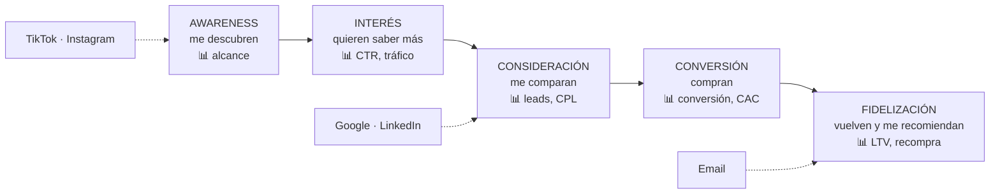
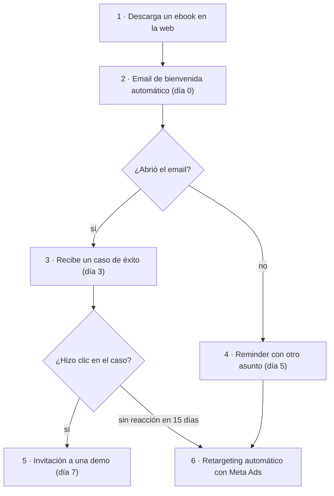

# 26 · Marketing en acción: del concepto a la campaña

> **Fuente en el material:** *Tecnología e Innovación – día jueves MRI – Marketing* (Ing. Mario Barrios; *"Marketing en acción. Del concepto a la campaña: guía estratégica para emprendedores que quieren crecer"*), diapositivas 1–30. Algunas diapositivas llevan la firma de Mg. Ezequiel Pietracupa.
> **Prerrequisitos:** [20 Propuesta de valor, clientes y competencia](20-propuesta-de-valor-clientes-y-competencia.md), [18 KPI](18-kpi.md) (CAC y LTV), [24 Análisis de mercado](24-analisis-de-mercado-y-competencia.md).
> **Tiempo estimado:** 80 min.
> **Resto de la materia · Tema 26** (Jueves MRI · Barrios). Clase descargada el 2026-10-09.
> 🔥 **Para el trabajo final:** la diapositiva 22 dice que *"la sección de Marketing de tu defensa final debe contener estos 5 puntos desarrollados con datos de tu proyecto"*. Está en la [sección VII.2](#vii2-el-plan-de-marketing-en-el-plan-de-negocios).

---

## 🎯 Objetivos de aprendizaje

1. Diferenciar **marketing** de **publicidad**.
2. Explicar las **4 P** y las **3 P** adicionales de servicios (**7 P**).
3. Describir el **ecosistema digital** y el **embudo de conversión** (awareness → fidelización).
4. Comparar **B2B y B2C** y elegir acciones para cada uno.
5. Elegir un **canal** (Meta, Google, LinkedIn, TikTok, orgánicos, email) según cliente, presupuesto, etapa del funnel y modelo.
6. Escribir un anuncio con **AIDA** y elegir el **tipo de campaña**.
7. Planificar el **presupuesto de validación** en tres fases y calcular **CAC, LTV/CAC y ROAS**.
8. Interpretar las **métricas clave** y armar la **sección de marketing** del plan de negocios.
9. Explicar el rol de la **IA y la automatización**, las **tendencias 2026** e **inbound vs. outbound**.

---

## 🗺️ Esquema del tema

- **I. Repaso estratégico**
  1. Qué es el marketing (y qué no)
  2. Las 4 P del marketing mix
  3. Las 7 P: cuando el producto es un servicio
- **II. Marketing digital**
  1. El ecosistema (6 rasgos)
  2. El embudo de conversión (funnel)
- **III. B2B vs. B2C**
  1. Dos lógicas diferentes
  2. Acciones según el modelo
- **IV. Canales y plataformas**
  1. Cómo elegir el canal
  2. Meta Ads · 3. Google Ads · 4. LinkedIn Ads · 5. TikTok Ads
  6. Canales orgánicos y email marketing
- **V. Copywriting y contenido**
  1. AIDA
  2. Tipos de campaña
- **VI. Presupuesto y validación**
  1. Las tres fases del presupuesto para validar el MVP
  2. CAC y LTV/CAC
  3. Segmentación
- **VII. Métricas clave y plan de marketing**
  1. Las 8 métricas
  2. El plan de marketing en el plan de negocios (5 puntos)
- **VIII. IA y automatización**
  1. IA aplicada al marketing
  2. Marketing automation
  3. Tendencias 2026
  4. Inbound vs. outbound
- **IX. Actividad integradora y los 10 principios**

---

## 🧠 Mapa visual



---

## 📖 Desarrollo

## I. Repaso estratégico

### I.1 Qué es el marketing (y qué no)

> 📌 *"**Marketing no es publicidad.** Marketing es el proceso de **identificar necesidades** del mercado, **crear valor** para satisfacerlas y **comunicarlo** de forma efectiva para generar **ventas, posicionamiento y relaciones duraderas**."*

| **Marketing** | **Publicidad** |
|---|---|
| Estrategia integral | Herramienta táctica |
| Analiza el mercado | Crea los anuncios |
| Segmenta públicos | Elige los canales |
| Define el precio | Define la creatividad |
| Métricas globales | Performance puntual |

El proceso completo: **Investigar → Diseñar → Comunicar → Vender → Fidelizar**.

> 📌 *"El marketing no es el arte de encontrar maneras inteligentes de deshacerse de lo que uno produce. Es el arte de **crear valor genuino** para los clientes."* — **Philip Kotler** (economista estadounidense, nacido en 1931, considerado el padre del marketing).

> 📌 *"No es solo publicidad. El marketing comienza **antes del producto** y continúa **después de la venta**."*

> 📝 **Citar y explayarse:** Para la cátedra, *"marketing no es publicidad"*: es *"el proceso de identificar necesidades del mercado, crear valor para satisfacerlas y comunicarlo de forma efectiva"*. La publicidad es solo una herramienta táctica dentro de ese proceso: crea los anuncios y elige los canales, mientras que el marketing decide a quién venderle, qué ofrecer y a qué precio. Por eso el marketing *"comienza antes del producto"*: si una startup diseña una app y recién después pregunta a quién vendérsela, se salteó la parte más importante. Y *"continúa después de la venta"*: fidelizar a un cliente que ya compró suele costar mucho menos que conseguir uno nuevo.

### I.2 Las 4 P del marketing mix

> 📌 *"Las **variables controlables** sobre las que todo emprendedor toma decisiones estratégicas."*

| P | Pregunta | Qué incluye (cátedra) | Clave (cátedra) |
|---|---|---|---|
| **Producto** | ¿Qué ofrecés al mercado? | Características, diseño, calidad, marca, empaque, diferenciación. | *¿Qué problema resuelve tu producto?* |
| **Precio** | ¿Cuánto vale tu propuesta? | Estrategias: freemium, suscripción, remate, premium, por uso. | *El precio comunica **posicionamiento** y determina **viabilidad financiera**.* |
| **Plaza** | ¿Cómo llega al cliente? | Canal directo, marketplace, distribuidor, digital, físico. | *Para startups: ¿online o presencial? ¿B2B directo o con intermediarios?* |
| **Promoción** | ¿Cómo te das a conocer? | Publicidad, redes, contenido, eventos, relaciones públicas. | *Incluye estrategias **pagas** y **orgánicas** (inbound).* |

### I.3 Las 7 P: cuando el producto es un servicio

> 📌 *"Las 4 P originales (**McCarthy, 1960**) fueron extendidas por **Booms & Bitner (1981)** para cubrir la naturaleza **intangible** de los servicios. Muy relevante para startups SaaS, biotecnología y Agtech."*

| P adicional | Qué es (cátedra) |
|---|---|
| **Personas** (*People*) | Quienes entregan el servicio **son parte del producto**. El equipo, el soporte y el trato al cliente son diferenciadores críticos en startups. |
| **Procesos** (*Process*) | **Cómo se entrega** el servicio: flujo de onboarding, tiempo de respuesta, consistencia. Los procesos definen la experiencia real del cliente. |
| **Evidencia física** (*Physical Evidence*) | Todo lo **tangible que respalda la confianza**: interfaz de la app, packaging, reportes, certificaciones, página web, presentaciones, incluso sucursales o puntos de venta. |

> 📌 *"Las 3 P adicionales son especialmente importantes en modelos SaaS, plataformas digitales y cualquier startup donde el cliente **'vive dentro' del producto**."*

> 💡 **Por qué hacen falta en servicios:** un servicio no se puede tocar antes de comprarlo. El cliente juzga su calidad por **quién lo atiende** (personas), **cómo funciona el proceso** (procesos) y **las señales visibles** que sí puede ver (evidencia física: una app prolija, un reporte claro, una certificación).

> 🔗 Las 7 P se conectan con el **Service Design** (frontstage/backstage) del tema [22](22-service-design-y-cultura-fail.md).

---

## II. Marketing digital

### II.1 El ecosistema del marketing digital

| Rasgo | Qué significa (cátedra) |
|---|---|
| **Multicanal** | Presencia simultánea en redes, buscadores, email y puntos de venta. El cliente elige cuándo y dónde interactuar. |
| **Automatización** | Acciones programadas: emails ante abandono de carrito, respuestas automáticas, nutrición de leads. Escalable desde el día uno. |
| **Data-driven** | Decisiones basadas en comportamiento real. Cada acción genera datos que permiten optimizar la inversión y personalizar mensajes. |
| **Personalización** | Mensaje diferente según segmento, etapa del embudo y comportamiento previo. Mejora las tasas de conversión drásticamente. |
| **Centrado en el cliente** | Se parte del **problema del cliente**, no del producto que ya existe. *"Las startups que parten del pain point ganan."* |
| **Marketing de experiencia** | Cada *touchpoint* con la marca debe ser memorable: onboarding, soporte, packaging, comunicación post-venta. |

### II.2 El embudo de conversión (funnel)

> 📌 *"Cada etapa tiene un **objetivo** diferente, una **métrica** diferente y una **táctica** diferente. Los emprendedores suelen invertir solo en la base (venta) e ignorar las etapas superiores."*

| Etapa | Qué pasa con el cliente (cátedra) | Objetivo (cátedra) |
|---|---|---|
| **Awareness** | El mercado descubre que existís. El cliente no te conoce aún. | Visibilidad y alcance masivo. |
| **Interés** | Sabe que existís y quiere saber más. Empieza a explorar tu propuesta. | Generar **tráfico calificado**. |
| **Consideración** | Te compara con otras opciones. Evalúa si tu solución resuelve su problema. | **Diferenciarte** y generar **confianza**. |
| **Conversión** | Toma la decisión de compra o acción deseada. | Facilitar y concretar la transacción. |
| **Fidelización** | Ya compró. | **Retenerlo**, generar recompra y convertirlo en **embajador** de la marca. |

> 💡 **Por qué es un embudo:** en cada etapa se cae gente. Si 10.000 personas ven un anuncio, quizás 200 hacen clic, 40 dejan sus datos y 8 compran. Si solo invertís en "cerrar ventas", el embudo se vacía arriba y no tenés a quién venderle.

---

## III. B2B vs. B2C

### III.1 Dos lógicas completamente diferentes

| | **B2C** (Business to Consumer) | **B2B** (Business to Business) |
|---|---|---|
| Comprador | Consumidor final (1 persona) | Empresa / tomador de decisión |
| Ciclo de compra | **Corto** (minutos a días) | **Largo** (semanas a meses) |
| Decisión basada en | **Emoción**, precio, conveniencia | **ROI**, riesgo, confianza, procesos |
| Ticket promedio | Bajo / medio | Medio / alto |
| Canal principal | Instagram, TikTok, Google | LinkedIn, email, eventos, demos |
| Táctica clave | Contenido masivo, influencers | **Account-based marketing (ABM)** |
| Mensaje central | Beneficio emocional y lifestyle | Ahorro de costo, eficiencia, retorno |

### III.2 Acciones concretas según el modelo

| B2C — acciones prioritarias | B2B — acciones prioritarias |
|---|---|
| Campañas en Meta e Instagram con creatividades visuales de alto impacto | LinkedIn Ads: segmentación por cargo, industria y empresa objetivo |
| TikTok para awareness masivo y contenido orgánico viral | Content marketing: artículos técnicos, whitepapers, casos de estudio |
| Google Shopping / Search para captura de demanda activa | Email outreach personalizado (secuencias automatizadas de prospecting) |
| Email marketing para retención y reactivación | Demos y webinars: el producto como herramienta de conversión |
| Influencer marketing y UGC (contenido generado por usuarios) | ABM: concentrar esfuerzo en cuentas clave |
| Optimización de landing page para maximizar conversión | SEO técnico y Google Search para captura de demanda especializada |

> ➕ **ABM (*account-based marketing*):** en lugar de hablarle a "un mercado", se elige una lista corta de **empresas concretas** (cuentas) y se diseña una campaña a medida para cada una (mensajes personalizados a las 3–5 personas que deciden en esa empresa).

> 🔗 La distinción B2C/B2B en la propuesta de valor está en el tema [20, III.2](20-propuesta-de-valor-clientes-y-competencia.md#iii2-b2c-vs-b2b).

---

## IV. Canales y plataformas

### IV.1 Cómo elegir el canal correcto

> 📌 *"El **canal equivocado** con el mejor mensaje es **presupuesto quemado**. El canal debe ir donde está el cliente en el momento correcto del funnel."*

| Pregunta | Criterio (cátedra) |
|---|---|
| **¿Dónde está mi cliente?** | No basta con saber edad o zona: hay que saber **qué plataforma usa, cuándo y con qué intención**. Instagram ≠ LinkedIn ≠ Google. |
| **¿Cuál es mi presupuesto?** | Con presupuesto bajo: canales **orgánicos** (SEO, contenido) + **una** plataforma paga concentrada. No dispersar. |
| **¿En qué etapa del funnel está?** | TikTok e Instagram funcionan para **awareness**. Google y LinkedIn funcionan mejor para **consideración y conversión**. |
| **¿B2B o B2C?** | B2C: Meta, TikTok, Google. B2B: **LinkedIn** es el canal por excelencia. El **email outreach** sigue siendo el más eficiente en costo. |

> 📌 **Regla de oro:** *"Elegí **UN** canal principal por etapa del negocio. **Dominalo antes de diversificar.**"*

### IV.2 Meta Ads (Facebook + Instagram)

| Qué se programa | Opciones (cátedra) |
|---|---|
| **Objetivo de campaña** | Reconocimiento (alcance, video views) · Tráfico (clics a web, app) · Interacción (mensajes, leads) · Conversiones (compras, registros) |
| **Segmentación de audiencia** | Demográfica (edad, género, ubicación) · Intereses (categorías y páginas seguidas) · Comportamientos (compras online, viajes) · Públicos similares (**Lookalike**) a tus clientes · **Remarketing** (personas que visitaron tu web) |
| **Configuración de la pauta** | Presupuesto diario o total · Puja: **CPC, CPM**, costo por resultado · Horario y fechas · Ubicaciones: feed, stories, reels, Messenger |
| **Creative (el anuncio)** | Formato: imagen, video, carrusel · Copy + titular + descripción (**AIDA**) · CTA: Comprar, Registrarse, Más información · **Prueba A/B** entre creatividades |

> 📌 *"El algoritmo de Meta **aprende**. Necesita **50 conversiones por semana** para optimizar. Dale tiempo antes de evaluar."*

> 💡 **Vocabulario:** **CPC** = costo por clic. **CPM** = costo por mil impresiones. **Lookalike** = Meta busca personas parecidas a tus clientes actuales. **Remarketing** = volver a mostrarle anuncios a quien ya te visitó.

### IV.3 Google Ads

| Tipo | Qué es (cátedra) |
|---|---|
| **Search Ads** | Anuncios en resultados de búsqueda. **Capturan demanda activa**: se activan con las palabras clave que el usuario escribió. El de **mayor intención de compra**. |
| **Display Ads** | Banners en millones de sitios web. Ideal para **remarketing y awareness**. Costo menor que Search. Se segmenta por audiencia e intereses. |
| **YouTube Ads** | Video antes o durante el contenido. Formatos: *skippable*, *non-skippable*, *bumper* (6 s). Alto impacto para reconocimiento de marca. |
| **Performance Max** | Campaña unificada que usa **IA de Google** para distribuir el presupuesto entre todos los canales (Search, Display, YouTube, Gmail, Maps). |

**Qué se programa en Google Search:**
- **Palabras clave:** términos exactos, de frase o de amplia coincidencia; investigar con Google Keyword Planner; incluir **palabras negativas** para no pagar clics irrelevantes.
- **Grupos de anuncios:** organizar keywords por tema; cada grupo tiene su anuncio. Cuanto más específico el grupo, **mayor relevancia y menor CPC**.
- **Copy del anuncio:** titulares 1, 2, 3 (30 caracteres c/u) + descripciones (90 caracteres c/u). La keyword del usuario debe aparecer en el titular para mejorar el **Quality Score**.
- **Extensiones:** sitelinks, llamadas, ubicación, precios. Agrandan el anuncio **sin costo adicional** y mejoran el CTR.

> 💡 **La diferencia de fondo entre Meta y Google:** en Google, la persona **ya está buscando** lo que vendés (demanda activa); en Meta, **interrumpís** a alguien que estaba mirando otra cosa (generás demanda). Por eso Search convierte mejor pero cuesta más por clic.

### IV.4 LinkedIn Ads — el canal B2B por excelencia

> 📌 *"LinkedIn tiene **1.000 millones** de usuarios en 200 países. El **80 % de los leads B2B** generados en redes sociales proviene de LinkedIn (fuente: HubSpot)."*

| Segmentación | Detalle (cátedra) |
|---|---|
| Por **cargo y seniority** | CEO, CTO, gerente de operaciones, analista. Se pueden excluir cargos junior para no gastar en audiencia sin poder de decisión. |
| Por **industria y empresa** | Por sector (agro, biotech, salud) y tamaño (startup, PyME, corporación). Se puede cargar una lista de empresas target. |
| Por **habilidades y grupos** | Usuarios con habilidades específicas (machine learning, precision agriculture) o grupos profesionales activos. |
| **Matched Audiences** | Remarketing de visitantes web o lista propia de contactos para lookalike o retargeting. |

**Formatos:** *Sponsored Content* (posts en el feed), *Message Ads* (mensajes directos), *Lead Gen Forms* (formularios nativos sin salir de LinkedIn), *Text Ads* (anuncios chicos en la barra lateral, bajo CPC).

### IV.5 TikTok Ads — donde está la próxima generación

> 📌 *"TikTok supera los **1.500 M** de usuarios activos mensuales. En Argentina, más del **65 %** tiene entre **18 y 35 años** (DataReportal 2024). Ideal para **B2C con productos visuales**."*

| Qué se programa | Formatos | Claves para crecer | Cuándo usarlo |
|---|---|---|---|
| Objetivo: alcance, tráfico, conversión | *In-Feed Ads* (video en el feed, 9–60 s) | El contenido **orgánico** puede superar al pago | Producto visual y atractivo |
| Audiencia: intereses, comportamientos | *TopView* (primer video al abrir la app) | **Autenticidad > producción profesional** | Audiencia joven (18–35) |
| Dispositivo, idioma, sistema operativo | *Branded Hashtag Challenge* | Los **primeros 3 segundos** son el gancho | B2C, consumo masivo, lifestyle |
| Exclusión de audiencias ya convertidas | *Branded Effects* (filtros AR) | Usar trends y sonidos populares; hashtags del nicho | Cuando buscás **viralidad orgánica** |
| Presupuesto inicial bajo (desde USD 20/día) | *Spark Ads* (amplificar contenido orgánico) | Frecuencia: mínimo **3–5 posts semanales** | |

### IV.6 Canales orgánicos y email marketing

| **SEO** (posicionamiento orgánico) | **Email marketing** | **Contenido en redes** (orgánico) |
|---|---|---|
| Objetivo a **mediano plazo** (3–12 meses) | **Canal propio**: nadie te puede bloquear la lista | Instagram: educativo + lifestyle + behind the scenes |
| Investigación de keywords con intención de compra | Tasa de apertura promedio **20–25 %** (vs. 2–5 % de redes) | LinkedIn: thought leadership, casos de éxito B2B |
| Contenido de valor: blog, guías, casos de uso | Secuencias: bienvenida, nurturing, re-engagement | YouTube: tutoriales, demos, webinars (largo plazo) |
| Linkbuilding: otros sitios que enlazan al tuyo | Herramientas gratuitas: Mailchimp (500 contactos), Brevo | TikTok: autenticidad y trends (B2C masivo) |
| Herramientas: Google Search Console, Ubersuggest, Semrush | Segmentá por **comportamiento**, no solo por demografía | **La consistencia supera a la frecuencia** |

> 📌 **Regla de presupuesto startup:** **60 %** al canal de mayor conversión + **30 %** a retención (email) + **10 %** a experimentación.

---

## V. Copywriting y contenido

### V.1 AIDA: escribir para convertir

> 📌 *"El **copy** es el texto con intención comercial. **No describe el producto: activa el deseo** del cliente. Es la diferencia entre un anuncio que se ignora y uno que genera ventas."*

| Letra | Etapa | Qué hacer (cátedra) |
|---|---|---|
| **A** | **Atención** | Capturar al usuario en los **primeros 3 segundos**. Usar una pregunta, un dato sorprendente o un **dolor real** del cliente. Sin atención no hay nada. |
| **I** | **Interés** | Mostrar por qué le importa **a esa persona**. Conectar con su necesidad real. **Evitar hablar de vos: hablar de su problema.** |
| **D** | **Deseo** | Convertir el interés en querer. Mostrar el **beneficio (no la característica)**; usar prueba social, testimonios y casos reales. |
| **A** | **Acción** | **CTA** claro, directo y urgente: *"Registrate gratis"*, *"Probalo 14 días"*, *"Pedí tu demo hoy"*. **Una sola acción por mensaje.** |

**Ejemplo de la cátedra (startup Agtech):**
- ❌ *"Tenemos una app de monitoreo de cultivos."* (habla del producto, describe una característica)
- ✅ *"¿Estás perdiendo rendimiento sin saberlo? Detectá problemas en tus cultivos antes de que sea tarde — desde tu celular."* (A = pregunta con un dolor; I = su problema; D = el beneficio, detectar a tiempo; A = la acción implícita de usarlo desde el celular)

> ⚠️ **Beneficio vs. característica:** "monitoreo satelital cada 5 días" es una **característica**; "te enterás de una plaga antes de perder la cosecha" es el **beneficio**. AIDA pide hablar del beneficio.

### V.2 Tipos de campañas y sus objetivos

| Tipo | Objetivo | Cuándo | Métricas | Mensaje |
|---|---|---|---|---|
| **Reconocimiento de marca** | Aumentar visibilidad y alcance | Al lanzar el producto o entrar a un nuevo mercado | Alcance, impresiones, frecuencia, video views | Emocional y de identidad de marca |
| **Tráfico** | Llevar usuarios a la web/app | Cuando tenés contenido valioso o landing page | Clics, CTR, CPC | CTA claro: *"Conocé más"*, *"Descargá gratis"* |
| **Generación de leads** | Capturar datos de potenciales clientes | B2B o productos de ticket alto con ciclo largo | CPL, tasa de conversión del formulario | Oferta de valor: ebook, demo, consulta gratuita |
| **Conversiones / ventas** | Lograr compras o registros | Cuando ya hay validación y el funnel está armado | CPA, ROAS, tasa de conversión, revenue | Urgencia, precio, garantía, prueba social |
| **Remarketing** | Recuperar usuarios que no convirtieron | **Siempre**: es el canal con **mejor ROAS** | CTR, CPA, ROAS, tasa de reactivación | Recordatorio + incentivo (descuento, demo, urgencia) |

> 🔗 Cada tipo de campaña corresponde a una **etapa del funnel** (II.2): reconocimiento = awareness; tráfico = interés; leads = consideración; conversiones = conversión; remarketing = recuperar a los que se cayeron del embudo.

---

## VI. Presupuesto y validación

### VI.1 Presupuesto de marketing para validar tu MVP

> 📌 *"La validación de mercado **no requiere grandes presupuestos**. Requiere **hipótesis claras**, **audiencia bien definida** y capacidad de **leer los datos rápido**."*

| | **Fase 1 · Validación de hipótesis** | **Fase 2 · Penetración inicial** | **Fase 3 · Crecimiento controlado** |
|---|---|---|---|
| Presupuesto | USD 50 a 200 | USD 300 a 800 | USD 800 a 2.500 |
| Duración | 7 a 14 días | 30 días | 90 días |
| Objetivo | Descubrir si hay **demanda real** | Conseguir los **primeros 20 a 50 clientes** | **Escalar lo que funciona, cortar lo que no** |
| Qué hacer | 1 campaña de tráfico o lead gen en Meta/Google; 2–3 creatividades distintas; audiencia muy específica (1 segmento) | Escalar la campaña que funcionó; sumar remarketing; probar **1 canal adicional** (si fue Meta, probar Google) | Redistribuir presupuesto según ROAS por canal; invertir en retención (email); construir audiencia orgánica |
| KPI | Costo por clic y tasa de conversión de la landing | CAC, tasa de conversión, primeros ingresos | Ratio LTV/CAC, ROAS consolidado |

> 🔗 Es el ciclo **construir–medir–aprender** del Lean Startup ([17](17-lean-startup-y-mvp.md)) aplicado al marketing: cada fase es un experimento barato que decide si se pasa a la siguiente.

### VI.2 CAC: la métrica que conecta marketing con finanzas

```
CAC = Inversión total en Marketing y Ventas ÷ Número de nuevos clientes adquiridos
```

**Ejemplo práctico (cátedra):** se invirtieron $50.000 en Meta Ads + $10.000 en diseño = **$60.000** en el mes y se consiguieron **12 clientes** nuevos → **CAC = 60.000 ÷ 12 = $5.000** por cliente. ¿Es bueno? Depende del precio de venta: si el ticket es **$8.000** → margen de $3.000 ✓; si el ticket es **$3.000** → se pierden $2.000 por cliente ✗.

**Ratio LTV/CAC — "la regla de los VCs":**
- **LTV** = valor de vida del cliente (cuánto te paga en total).
- LTV/CAC **mínimo aceptable: 3:1**. **1:1** → negocio no viable. **5:1** → excelente salud.
- Ejemplo: LTV = $30.000, CAC = $5.000 → ratio **6:1** ✓.

**CAC estimado por canal** (referencia mercado Latam, órdenes de magnitud):

| Canal | CAC | Comentario (cátedra) |
|---|---|---|
| Meta Ads (B2C) | Bajo | El más eficiente para B2C masivo. Depende mucho de la segmentación y el creative. |
| Google Search (B2C) | Medio | Mayor intención de compra. CPC más alto pero conversión mejor. |
| LinkedIn Ads (B2B) | Alto | Costo por lead más alto, pero la calidad del lead lo justifica en B2B. |
| Email outreach (B2B) | Muy bajo | El de menor CAC si tenés buena lista y proceso de calificación. |
| Orgánico / SEO | Muy bajo | Requiere tiempo (3–12 meses), pero el CAC **tiende a cero** una vez posicionado. |

> ⚠️ **Leé el ejemplo con criterio:** comparar el CAC con **un solo ticket** solo tiene sentido si el cliente compra **una vez**. Si el cliente compra todos los meses, hay que comparar el CAC con el **LTV** (todo lo que paga en su vida como cliente), que es justamente lo que hace la regla 3:1. Además, el "margen de $3.000" del ejemplo supone que vender no tiene otros costos: en la práctica, hay que restar también el costo del producto.

> 🔗 CAC, LTV y Payback del CAC ya aparecen como KPI SaaS en el tema [18](18-kpi.md).

### VI.3 Segmentación: no disperses el presupuesto

> 📌 *"Una segmentación **amplia** tiene más alcance pero **menor relevancia**. Una buena segmentación **reduce el CPC** y **mejora la conversión**. Menos audiencia, más precisión."*

| Tipo | Qué incluye (cátedra) | Plataformas |
|---|---|---|
| **Demográfica** | Edad y género, ubicación (país, ciudad, radio), idioma, nivel educativo / ingreso estimado | Meta, Google, LinkedIn, TikTok |
| **Conductual** | Comportamiento de compra online, frecuencia de uso de apps, dispositivos, etapa del proceso de compra | Meta, Google, TikTok |
| **Por intereses** | Páginas y categorías seguidas, temas de búsqueda frecuente, actividades y hobbies, sector profesional (LinkedIn) | Meta, LinkedIn, TikTok |
| **Personalizada / Lookalike** | Audiencias de remarketing web, listas de clientes cargadas, públicos similares (Lookalike 1–3 %), audiencias del CRM | **Mayor ROAS: recomendado siempre** |

> 📌 **Tip:** *"Comenzá con audiencias **pequeñas** (100K–300K personas). Si no convertís, ampliás. **Nunca al revés.**"*

---

## VII. Métricas clave y plan de marketing

### VII.1 ¿Cómo saber si tu marketing está funcionando?

> 📌 *"Las métricas responden **preguntas de negocio**. No alcanza con tener muchos clics: la clave es saber si estás logrando los objetivos definidos en el plan."*

| Métrica | Qué mide (cátedra) | Pregunta que responde | Benchmark (cátedra) |
|---|---|---|---|
| **Alcance** | Personas únicas que vieron el anuncio | ¿Estoy llegando a mi audiencia? | Depende del presupuesto y la segmentación |
| **CTR** | % que hizo clic sobre el total que lo vio | ¿Mi mensaje es relevante? | B2C: 1–2 % · B2B: 0,4–0,8 % |
| **CPC** | Costo por cada clic | ¿Es eficiente mi inversión? | Meta USD 0,5–2 · Google USD 1–5 · LinkedIn USD 5–12 |
| **CPL** | Costo por cada lead (dato de contacto) | ¿Me conviene este canal para generar leads? | B2C USD 2–10 · B2B USD 20–80 |
| **Tasa de conversión** | % de visitantes que completaron la acción objetivo | ¿Mi landing / funnel convierte bien? | E-commerce 1–3 % · SaaS trial 3–7 % |
| **CAC** | Costo total para adquirir 1 cliente nuevo | ¿Es viable el modelo de negocio? | Debe ser **< LTV / 3** |
| **ROAS** | Retorno por cada peso invertido en publicidad | ¿Genero más de lo que gasto? | Mínimo aceptable **3x (3:1)** |
| **LTV** | Valor total que genera un cliente en toda su relación | ¿Cuánto puedo invertir para adquirir 1 cliente? | LTV/CAC ideal **> 3** (VCs buscan **> 5**) |

> 🧩 **Ejemplo encadenado (➕ números propios):** un anuncio en Meta se muestra a **20.000** personas (alcance). Hacen clic **300** → CTR = 300 / 20.000 = **1,5 %**. Se gastaron USD 450 → CPC = 450 / 300 = **USD 1,5**. De los 300, compran **6** → conversión = 6 / 300 = **2 %**. CAC (solo pauta) = 450 / 6 = **USD 75**. Si cada compra deja USD 400 de ingresos → ROAS = 2.400 / 450 = **5,3x** ✓.

> ⚠️ **ROAS ≠ ROI.** El ROAS compara **ingresos** generados con lo gastado **en publicidad**; no descuenta el costo del producto ni otros gastos. Un ROAS de 3x puede ser una pérdida si el margen del producto es bajo.

### VII.2 El plan de marketing en el plan de negocios

> 🔥 📌 *"Esta sección de tu **defensa final** debe responder **5 preguntas** con **datos reales** de tu proyecto."*

| # | Punto | Qué tiene que tener (cátedra) |
|---|---|---|
| 1 | **Definir objetivos SMART** | ¿Qué querés lograr (ventas, leads, visibilidad)? Específicos, Medibles, Alcanzables, Relevantes y en Tiempo definido. *Ej.: conseguir 50 leads calificados en 30 días con un CAC máximo de $X.* |
| 2 | **Conocer al cliente (buyer persona)** | Descripción detallada del cliente ideal: edad, cargo, problema, motivaciones, objeciones, plataformas que usa. *"Sin esto, cualquier campaña es un tiro al aire."* |
| 3 | **Propuesta de valor diferenciada** | ¿Qué hacés mejor que los competidores? ¿Qué problema específico resolvés? Es la base de todo el mensaje. **Debe surgir del Value Proposition Canvas.** |
| 4 | **Canales y tácticas seleccionadas** | ¿Dónde está tu audiencia y qué canal usarás? **Justificá** la elección. 2–3 acciones concretas por canal, con **presupuesto estimado** y **métricas de éxito**. |
| 5 | **Medición e iteración** | ¿Cómo sabés si funcionó? Métricas clave (CAC, CTR, conversión). ¿Cuándo vas a revisar? ¿Qué criterio usás para escalar o cambiar de táctica? |

> 🔗 Cada punto se apoya en un tema anterior: SMART en [18](18-kpi.md#iii-framework-smart); buyer persona y Value Proposition Canvas en [20](20-propuesta-de-valor-clientes-y-competencia.md); canales en la sección IV de este tema; medición en VII.1.

---

## VIII. IA y automatización

### VIII.1 Inteligencia artificial aplicada al marketing

> 📌 *"La IA **no reemplaza la estrategia: amplifica** la capacidad de ejecutarla. Un emprendedor con IA puede hacer el trabajo de un equipo de marketing completo."*

| Uso | Herramientas (cátedra) | Qué hace |
|---|---|---|
| **Generación de contenido** | ChatGPT, Claude, Gemini | Copy de anuncios, emails, posts, blog, guiones de video, propuestas de valor. En minutos en lugar de horas. |
| **Imágenes y diseño** | Midjourney, DALL-E, Adobe Firefly, Canva AI | Creatividades para anuncios, ilustraciones, variaciones para tests A/B sin diseñador. |
| **Automatización de campañas** | Meta Advantage+, Google Performance Max, HubSpot | La IA de las plataformas optimiza presupuesto, audiencia y creative según el objetivo. |
| **Análisis y predicción** | Google Analytics 4, Looker, Power BI | Atribución multicanal, predicción de churn, segmentación automática, insights automáticos. |
| **Personalización a escala** | Klaviyo, Brevo, ActiveCampaign | Emails según comportamiento, triggers automáticos, contenido dinámico por segmento. |
| **Atención al cliente / bots** | ManyChat, Intercom, Tidio | Chatbots en WhatsApp, Instagram y web. Califican leads, responden FAQs y nutren prospectos 24/7. |

> 🔗 El "análisis y predicción" es **Business Intelligence** y **Data Mining** aplicados al marketing (temas [08](../parcial-1/08-business-intelligence.md) y [09](../parcial-1/09-data-mining.md)).

### VIII.2 Marketing automation: hacer más con menos

**Flujo automatizado de ejemplo (cátedra), startup B2B Agtech:**



**Herramientas gratuitas para empezar (cátedra):** Mailchimp (email automation gratis hasta 500 contactos), Brevo (email + SMS + WhatsApp, gratis hasta 300 emails/día), ManyChat (bots para Instagram y WhatsApp), n8n / Make (automatización entre herramientas).

> 📌 *"La automatización **no sustituye la estrategia**: sí libera tiempo para pensar mejor y escalar lo que funciona."*

### VIII.3 Tendencias del marketing digital 2026

| # | Tendencia | Qué dice la cátedra |
|---|---|---|
| 01 | **Video corto** como formato dominante | Reels, TikTok y YouTube Shorts concentran el **82 %** del tráfico de video online (Cisco). El formato < 60 s es el de mayor alcance orgánico. |
| 02 | **Búsqueda generativa (SGE)** | Google integra respuestas de IA en el buscador. El SEO evoluciona: el contenido debe **responder preguntas específicas** (*answer-first*). |
| 03 | **Privacidad y cookieless** | El fin de las *third-party cookies* obliga a construir **audiencias propias** (email, CRM). El **first-party data** será el activo más valioso. |
| 04 | **Hiperpersonalización con IA** | Mensajes individualizados a escala según comportamiento, historial e intención. *"Ya no es opcional: es expectativa."* |
| 05 | **Omnicanalidad real** | Consistencia de marca en todos los puntos de contacto: web, redes, WhatsApp, email, presencial. Cada canal refuerza al otro. |
| 06 | **Creator economy y micro-influencers** | Los micro-influencers (5K–50K seguidores) tienen **3–5x más engagement** que los macro. En nichos (Agtech, Biotech) son más efectivos y accesibles. |

> 🔗 La **hiperpersonalización** ya aparecía como impacto de la tecnología en el tema [02](../parcial-1/02-impactos-y-desafios.md); la privacidad conecta con la crisis de reputación de NEXA.

### VIII.4 Inbound vs. outbound: estrategias complementarias

| **Inbound** — "el cliente viene a vos" | **Outbound** — "vos vas al cliente" |
|---|---|
| SEO y blog de valor | Google Ads (Search) |
| Redes sociales orgánicas | Meta Ads / LinkedIn Ads |
| Lead magnets (ebooks, webinars) | Email outreach en frío |
| Email de nurturing a leads | Llamadas de prospecting |
| Video marketing / YouTube | Publicidad tradicional (OOH, radio) |

> 📌 **¿Cuál usar en una startup?** *"En etapa early: **outbound para validar rápido** + **inbound para construir a largo plazo**. A medida que escalás, el inbound **reduce el CAC**. La combinación es la estrategia ganadora."*

> 💡 **Por qué el inbound baja el CAC:** el contenido (un artículo, un video) se paga **una vez** y sigue trayendo clientes durante meses; un anuncio deja de traer clientes el día que dejás de pagarlo.

---

## IX. Actividad integradora y los 10 principios

### IX.1 Actividad grupal: ¡Campaña en acción!

Pasos (30 minutos de trabajo, 3 minutos de presentación por grupo):
1. Definí tu producto/servicio y el problema que resuelve.
2. ¿B2B o B2C? Describí tu buyer persona en 3 líneas.
3. Elegí **1** canal y justificá por qué (Meta / Google / LinkedIn / TikTok).
4. Definí el objetivo de campaña y la métrica de éxito.
5. Escribí el copy del anuncio usando **AIDA**.
6. Estimá el presupuesto y el **CAC esperado**.

**Criterios de evaluación de la presentación (cátedra):**

| Criterio | Pregunta | Peso |
|---|---|---|
| Claridad del objetivo | ¿Se entiende qué quiere lograr la campaña y cómo se va a medir? | 20 % |
| Definición del público | ¿El buyer persona está bien definido? ¿Justifica la elección del canal? | 20 % |
| Propuesta de valor | ¿El mensaje comunica el beneficio real? ¿Se diferencia de la competencia? | 20 % |
| Estrategia de canal | ¿Hay coherencia entre el público, el objetivo y el canal? | 15 % |
| Copy y AIDA | ¿El anuncio aplica correctamente AIDA? ¿El CTA es claro? | 15 % |
| Viabilidad del presupuesto | ¿El CAC estimado es coherente con el precio del producto/servicio? | 10 % |

### IX.2 Lo que no podés olvidar: los 10 principios del marketing para emprendedores

1. El marketing **empieza antes del producto**: conocé el dolor antes de diseñar la solución.
2. **Marketing ≠ publicidad.** La publicidad ejecuta lo que el marketing diseña.
3. Sin **buyer persona** definido, cualquier campaña es un tiro al aire.
4. Elegí **UN canal principal**. Dominalo antes de diversificar.
5. El canal correcto depende de si tu modelo es **B2B o B2C**.
6. **CAC sin LTV es un número vacío.** El negocio es viable cuando **LTV/CAC > 3**.
7. El **ROAS mínimo aceptable es 3x**. Por debajo, estás destruyendo caja.
8. Comenzá con **presupuesto bajo** para validar hipótesis; luego escalá lo que funciona.
9. La IA y la automatización **no reemplazan la estrategia: la amplifican**.
10. **Medí lo que importa**, no lo que es fácil de medir. Las métricas de vanidad no pagan sueldos.

> 💡 **"Métricas de vanidad":** números que crecen y se ven bien pero no dicen si el negocio funciona (likes, seguidores, visitas). Las que importan son las que conectan con plata: conversión, CAC, LTV, ROAS.

---

## ⚠️ Conceptos que se confunden

| Se confunde… | …con | Diferencia |
|---|---|---|
| Marketing | Publicidad | Marketing = estrategia integral (investigar, diseñar, comunicar, vender, fidelizar). Publicidad = herramienta táctica (crea anuncios). |
| 4 P | 7 P | Las 7 P suman **personas, procesos y evidencia física** para servicios (Booms & Bitner, 1981). |
| CTR | Tasa de conversión | CTR = clics / impresiones (¿el **mensaje** es relevante?). Conversión = acciones / visitantes (¿la **landing/funnel** convierte?). |
| CPC | CPL / CAC | CPC = costo por **clic**. CPL = costo por **dato de contacto**. CAC = costo por **cliente** que compró. |
| ROAS | ROI | ROAS = ingresos / gasto **en publicidad**. ROI considera **todos** los costos. |
| Inbound | Outbound | Inbound = el cliente te encuentra (SEO, contenido). Outbound = vas a buscarlo (ads, outreach, llamadas). |
| Google Search | Display | Search captura **demanda activa** (la persona busca). Display muestra banners para **awareness y remarketing**. |
| Beneficio | Característica | La característica describe el producto; el beneficio, lo que **gana el cliente**. AIDA pide beneficios. |
| Segmentación amplia | Buena segmentación | Amplia = más alcance, menos relevancia. La cátedra recomienda empezar **chico** (100K–300K) y ampliar. |
| B2C | B2B | B2C: ciclo corto, decisión emocional, Instagram/TikTok. B2B: ciclo largo, decisión por ROI, LinkedIn/email/demos. |

---

## 🔗 Conexiones

- **← [20 Propuesta de valor](20-propuesta-de-valor-clientes-y-competencia.md):** buyer persona, B2C/B2B y Value Proposition Canvas son el punto 2 y 3 del plan de marketing.
- **← [18 KPI](18-kpi.md):** SMART, CAC, LTV, churn.
- **← [17 Lean Startup](17-lean-startup-y-mvp.md):** el presupuesto en tres fases es validación de un MVP.
- **← [24 Análisis de mercado](24-analisis-de-mercado-y-competencia.md):** el mercado meta define a quién se dirige el marketing.
- **← [25 Matrices](25-matrices-para-la-toma-de-decisiones.md):** las 4 P como herramienta de decisión.
- **← [22 Service Design](22-service-design-y-cultura-fail.md):** las 7 P de servicios y los touchpoints.

---

## ✍️ Autoevaluación

**1. ¿Por qué "marketing no es publicidad"? Dé tres diferencias.**
<details><summary>Ver respuesta</summary>

El marketing es el proceso de identificar necesidades, crear valor y comunicarlo; la publicidad es una herramienta táctica dentro de él. Marketing: estrategia integral, analiza el mercado, segmenta públicos, define el precio, mide métricas globales. Publicidad: crea los anuncios, elige los canales, define la creatividad, mide performance puntual. El marketing empieza antes del producto y sigue después de la venta.
</details>

**2. Nombre las 4 P y las 3 P adicionales de servicios. ¿Quiénes las propusieron?**
<details><summary>Ver respuesta</summary>

**Producto, Precio, Plaza, Promoción** (McCarthy, 1960). **Personas, Procesos, Evidencia física** (Booms & Bitner, 1981), para la naturaleza intangible de los servicios.
</details>

**3. Describa las cinco etapas del funnel y el objetivo de cada una.**
<details><summary>Ver respuesta</summary>

**Awareness:** que el mercado descubra que existís (visibilidad, alcance). **Interés:** que quiera saber más (tráfico calificado). **Consideración:** que te compare y confíe (diferenciarte, generar confianza). **Conversión:** que compre (facilitar la transacción). **Fidelización:** que vuelva y te recomiende (retención, recompra, embajadores).
</details>

**4. ¿Qué canal elegiría para una startup B2B de software para hospitales con poco presupuesto? Justifique con los criterios de la cátedra.**
<details><summary>Ver respuesta</summary>

Con presupuesto bajo: canales **orgánicos** (SEO, contenido técnico) + **una** plataforma paga concentrada. Al ser B2B, el canal por excelencia es **LinkedIn** (segmentación por cargo e industria: directores médicos, gerentes de compras de hospitales); el **email outreach** es el de menor CAC si hay buena lista. Regla de oro: elegir un canal principal y dominarlo antes de diversificar.
</details>

**5. Reescriba con AIDA: "Somos una empresa de software contable para PyMEs".**
<details><summary>Ver respuesta</summary>

Ejemplo: *"¿Cerrás el mes y todavía no sabés si ganaste plata? (A) Tu contador te manda los números 20 días tarde y ya no podés corregir nada (I). Con [Producto] ves tu resultado en tiempo real y más de 300 PyMEs ya bajaron un 40 % el tiempo de cierre (D). Probalo gratis 14 días (A)."* Habla del problema del cliente, muestra el beneficio con prueba social y tiene un único CTA.
</details>

**6. Explique las tres fases del presupuesto para validar un MVP.**
<details><summary>Ver respuesta</summary>

**Fase 1 – validación de hipótesis:** USD 50–200, 7–14 días; 1 campaña, 2–3 creatividades, 1 segmento; KPI: CPC y conversión de la landing. **Fase 2 – penetración inicial:** USD 300–800, 30 días; escalar lo que funcionó, sumar remarketing y un canal más; KPI: CAC, conversión, primeros ingresos. **Fase 3 – crecimiento controlado:** USD 800–2.500, 90 días; redistribuir según ROAS, invertir en retención, construir audiencia orgánica; KPI: LTV/CAC, ROAS consolidado.
</details>

**7. Se invirtieron $90.000 en un mes y se consiguieron 15 clientes. Cada cliente paga $4.000 por mes y se queda en promedio 12 meses. Calcule CAC, LTV (simplificado como ingresos) y LTV/CAC. ¿Es viable?**
<details><summary>Ver respuesta</summary>

CAC = 90.000 / 15 = **$6.000**. LTV = 4.000 × 12 = **$48.000**. LTV/CAC = 48.000 / 6.000 = **8:1** → muy por encima del mínimo de 3:1 (y del 5:1 que buscan los VCs): viable. (Con un ticket mensual de $4.000, comparar solo contra el primer pago, $4.000 < $6.000, daría la impresión falsa de pérdida.)
</details>

**8. Diferencie CTR, tasa de conversión, CPL, CAC y ROAS.**
<details><summary>Ver respuesta</summary>

**CTR:** % que hizo clic sobre los que vieron el anuncio (relevancia del mensaje). **Tasa de conversión:** % de visitantes que completaron la acción (eficacia de la landing/funnel). **CPL:** costo por cada dato de contacto. **CAC:** costo total para conseguir un cliente. **ROAS:** ingresos por cada peso invertido en publicidad (mínimo 3x).
</details>

**9. ¿Qué cinco puntos debe tener la sección de marketing del plan de negocios?**
<details><summary>Ver respuesta</summary>

1. Objetivos **SMART**. 2. **Buyer persona**. 3. **Propuesta de valor diferenciada** (desde el Value Proposition Canvas). 4. **Canales y tácticas** justificados, con presupuesto y métricas de éxito. 5. **Medición e iteración** (métricas, cuándo revisar, criterio para escalar o cambiar).
</details>

**10. ¿Inbound u outbound para una startup en etapa temprana?**
<details><summary>Ver respuesta</summary>

Los dos: **outbound para validar rápido** (ads, outreach) + **inbound para construir a largo plazo** (SEO, contenido). A medida que la empresa escala, el inbound **reduce el CAC** porque el contenido sigue atrayendo clientes sin pagar por cada clic.
</details>

---

[← 25 Matrices para la toma de decisiones](25-matrices-para-la-toma-de-decisiones.md) · [🏠 Índice](../README.md) · [Siguiente → 27 Análisis financiero y estrategias de salida](27-analisis-financiero-y-estrategias-de-salida.md)
