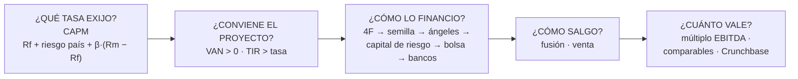
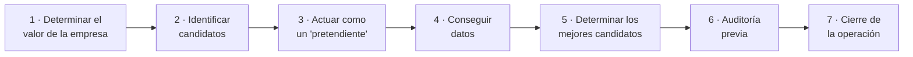

# 27 · Análisis financiero y estrategias de salida

> **Fuente en el material:** *Tecnología e Innovación – MRI Análisis Financiero y Estrategias de Salida* (Ing. Mario Barrios; agradecimiento al Mg. Ignacio Sartori por el armado de los contenidos), diapositivas 1–24. Muchas diapositivas son solo imagen y se leyeron desde el PDF.
> **Prerrequisitos:** [25 Matrices (VAN, TIR, Payback)](25-matrices-para-la-toma-de-decisiones.md#vi-evaluación-financiera-y-de-inversiones), [04 Empresas unicornio](../parcial-1/04-empresas-unicornio.md).
> **Tiempo estimado:** 70 min.
> **Resto de la materia · Tema 27** (MRI · Barrios). Clase descargada el 2026-10-09.

---

## 🎯 Objetivos de aprendizaje

1. Explicar y calcular el **VAN** con la definición de la cátedra (rendimiento de una alternativa de riesgo comparable).
2. Explicar la **TIR** y por qué su interpretación habitual es **problemática**.
3. Explicar el **CAPM** y calcular la tasa con la ecuación de la cátedra (con **riesgo país**).
4. Describir las **etapas de evolución** de una empresa, su **cadena de financiamiento** y las **etapas de la inversión**.
5. Explicar **por qué** se sale de un negocio, qué es una **estrategia de salida** y sus formas (**fusión** y **venta**).
6. Describir el proceso de **venta** y los métodos de **valuación** (múltiplo EBITDA, comparables, Crunchbase).

---

## 🗺️ Esquema del tema

- **I. Valor Actual Neto (VAN)**
- **II. Tasa Interna de Retorno (TIR)**
- **III. CAPM**
  1. Qué describe
  2. La ecuación y sus variables
  3. Ejemplo
- **IV. Etapas de una empresa y su financiamiento**
  1. Etapas de evolución y cadena de financiamiento
  2. Etapas de la inversión
- **V. Estrategias de salida**
  1. "Are you ready?": las estadísticas
  2. Por qué salir del negocio
  3. Qué es una estrategia de salida
  4. Fusiones (vertical y horizontal)
  5. Venta: el proceso
- **VI. Cuánto vale la empresa**
  1. Métodos de valuación
  2. Valor por múltiplo EBITDA
  3. Crunchbase: comparar contra inversiones recibidas

---

## 🧠 Mapa visual



---

## 📖 Desarrollo

## I. Valor Actual Neto (VAN)

> 📌 *"Dado el **rendimiento esperado (R)** de **inversiones alternativas de riesgo comparable** a la que se analiza, el VAN computa **cuánto más dinero, traído a hoy**, me da el proyecto analizado que si invirtiese en dicha actividad alternativa."*

```
VAN(FF₀, FF₁, …, FFₜ) = FF₀ + FF₁/(1+R) + FF₂/(1+R)² + … + FFₜ/(1+R)ᵀ
```
*FF = flujo de fondos de cada período (FF₀ es la inversión inicial, negativa); R = rendimiento de la alternativa de riesgo comparable.*

> 💡 **Qué está haciendo la fórmula, paso a paso:**
> 1. Cada flujo futuro se **divide por (1 + R) elevado al año** en que llega. Eso lo convierte a "pesos de hoy": $100 dentro de un año valen hoy $100 / 1,1 = $90,91 si la alternativa rinde 10 %, porque con $90,91 invertidos hoy al 10 % tendría $100 en un año.
> 2. Se **suman** todos los flujos ya traídos a hoy, incluida la inversión inicial (negativa).
> 3. El resultado es **cuánto más (o menos) dinero de hoy** te deja el proyecto **comparado con** poner la plata en la alternativa. Por eso VAN = 0 no significa "no gano nada": significa "gano exactamente lo mismo que en la alternativa".

**Regla:** VAN > 0 → el proyecto rinde más que la alternativa de riesgo comparable → **conviene**. VAN < 0 → conviene la alternativa.

**Ejemplo de la cátedra (R = 10 %):**
```
VAN(Proy A) = −1.000 + 100/1,1 + 900/1,1² + 100/1,1³ − 100/1,1⁴ − 400/1,1⁵
```

<details><summary>Ver cálculo paso a paso (➕ resolución propia)</summary>

| Año | Flujo | Factor 1/1,1ᵗ | Valor hoy |
|---:|---:|---:|---:|
| 0 | −1.000 | 1,0000 | −1.000,00 |
| 1 | +100 | 0,9091 | +90,91 |
| 2 | +900 | 0,8264 | +743,80 |
| 3 | +100 | 0,7513 | +75,13 |
| 4 | −100 | 0,6830 | −68,30 |
| 5 | −400 | 0,6209 | −248,37 |
| | | **VAN** | **−406,83** |

👉 El proyecto A **destruye valor**: deja $406,83 de hoy **menos** que invertir en la alternativa. Fijate que los flujos de los años 4 y 5 son **negativos** (el proyecto vuelve a pedir plata al final): ese tipo de flujo es el que vuelve problemática a la TIR (sección II).
</details>

> 🔗 La versión resumida del VAN y su gráfico de perfil (VAN contra tasa de descuento) está en el tema [25](25-matrices-para-la-toma-de-decisiones.md#vi2-van-y-tir).

---

## II. Tasa Interna de Retorno (TIR)

> 📌 *"Es aquella **tasa de descuento** que hace el **valor actual neto igual a cero**."*

```
0 = FF₀ + FF₁/(1+TIR) + FF₂/(1+TIR)² + … + FFₜ/(1+TIR)ᵀ
```

**Ejemplo de la cátedra (caso base):**
```
VAN(Caso Base) = −1.000 + 100/1,1 + 100/1,1² + 100/1,1³ + 100/1,1⁴ + 1.100/1,1⁵ = 0
```
→ Con 10 % el VAN da exactamente **0**, así que la **TIR = 10 %**.

> 💡 **Por qué da justo 10 %:** el proyecto es como prestar $1.000 y cobrar $100 por año de interés (10 %) durante 5 años, más los $1.000 de vuelta al final. Si rinde 10 % y la alternativa también rinde 10 %, el VAN es cero.

> 📌 *"Interpretación habitual (**y problemática**…): la TIR es la tasa de rendimiento **'promedio'** de los fondos invertidos en un proyecto."*

**¿Por qué es problemática esa interpretación?** (➕ contexto adicional, para entender la advertencia de la cátedra)
1. **Puede no existir.** En el proyecto A de la sección I, los flujos suman −400 y tienen signos que cambian (−, +, +, +, −, −): el VAN es negativo para **cualquier** tasa razonable, así que **no hay TIR**.
2. **Puede haber más de una.** Cuando los flujos cambian de signo más de una vez (invierto, cobro, vuelvo a invertir), la ecuación puede tener **varias** soluciones.
3. **Supone reinvertir a la propia TIR.** Leerla como "rendimiento promedio" asume que los flujos intermedios se reinvierten a esa misma tasa, lo cual muchas veces no es posible.
4. **No mide tamaño.** Un proyecto chico con TIR de 50 % puede crear menos valor (en pesos) que uno grande con TIR de 20 %. El VAN sí mide el monto.

> ⚠️ **Conclusión para el examen:** TIR = tasa que hace VAN = 0 (definición). Cuando VAN y TIR se contradicen, **manda el VAN**, porque mide cuánto valor se crea.

---

## III. CAPM

### III.1 Qué describe

> 📌 *"El modelo **CAPM** (*Capital Asset Pricing Model*) describe la relación entre el **riesgo sistemático** y el **rendimiento esperado** de los activos, particularmente las acciones. CAPM se usa ampliamente en todas las finanzas para **fijar precios de valores riesgosos** y generar **rendimientos esperados** para activos dado el riesgo de esos activos y el **costo de capital**."*

> 💡 **Para qué lo necesitás en este tema:** el VAN pide una tasa *R* "de inversiones alternativas de riesgo comparable". El CAPM es la forma de **calcular esa tasa**: cuánto tendría que rendir un proyecto para compensar su riesgo.

> ➕ **Riesgo sistemático:** el riesgo que **no se puede eliminar diversificando** (una recesión, una suba de tasas afecta a todo el mercado). El CAPM solo "paga" ese riesgo, porque el resto se puede evitar teniendo muchos activos distintos.

### III.2 La ecuación y sus variables

```
Rᵢⱼ = Rf + Riesgo país + βᵢ × (Rm − Rf)
```

| Variable | Nombre (cátedra) | Qué es |
|---|---|---|
| **Rf** | *Risk free* | Rendimiento de una inversión **sin riesgo** (➕ habitualmente, bonos del Tesoro de EE. UU.). |
| **Riesgo país** | *Country risk* | Prima extra por invertir en un país determinado (➕ en Argentina, el índice EMBI de JP Morgan, expresado en puntos básicos). |
| **β** | *Beta* | Cuánto se mueve el activo (o la industria) cuando se mueve el mercado. β = 1: igual que el mercado; β > 1: más volátil; β < 1: menos. |
| **Rm** | *Market risk* (rendimiento del mercado) | Rendimiento esperado del mercado en su conjunto; **(Rm − Rf)** es la **prima de riesgo de mercado**. |

> 💡 **Cómo leer la fórmula de izquierda a derecha:** *"lo que exijo = lo que gano sin riesgo + un extra por el país + un extra por el riesgo del negocio"*, donde el extra del negocio es la prima del mercado multiplicada por cuánto más (o menos) riesgoso es mi negocio que el promedio (β).

> ➕ **Contexto adicional:** el CAPM original (Sharpe, 1964) no tiene el término de riesgo país; agregarlo es la adaptación habitual para mercados emergentes.

### III.3 Ejemplo de la cátedra

```
Rᵢⱼ = 3,3 + 20 + 1,34 × (8,31 − 3)
```
Las flechas de la diapositiva indican de dónde sale cada dato: **Rf** de un ETF de renta fija (iShares), **β = 1,34** del ETF *iShares Nasdaq Biotechnology* (la industria biotecnológica) y **Rm = 8,31** del ETF *iShares S&P 500 Value* (el mercado). Fuente: profesor Ignacio Sartori.

<details><summary>Ver cálculo paso a paso (➕ resolución propia)</summary>

1. Prima de mercado: Rm − Rf = 8,31 − 3 = **5,31**.
2. Ajuste por riesgo del negocio: β × prima = 1,34 × 5,31 = **7,12**.
3. Suma: 3,3 + 20 + 7,12 = **30,42 %**.

👉 Un proyecto de **biotecnología en un país con riesgo país de 20 puntos** debería rendir al menos **≈ 30,4 % anual** para que valga la pena. Esa es la *R* que se usa en el VAN.

> ⚠️ En la diapositiva el *Rf* fuera del paréntesis es **3,3** y dentro del paréntesis es **3**. Seguramente es un redondeo; si te piden el cálculo, usá **el mismo Rf** en los dos lugares (con 3,3 en ambos: 3,3 + 20 + 1,34 × 5,01 = 30,01 %) o aclará el supuesto.
</details>

---

## IV. Etapas de una empresa y su financiamiento

### IV.1 Etapas de evolución de una empresa y cadena de financiamiento

El gráfico de la cátedra (basado en Cortés y Echecopar, 2009, y Cardullo, 1999) muestra la **curva de resultados/rentabilidad** de una empresa en el tiempo y quién la financia en cada etapa:

| Etapa | Qué pasa con la curva | Fuente de financiamiento |
|---|---|---|
| **Gestación** | La curva cae por debajo de cero: se gasta sin ingresar. Es el **valle de la muerte**. | **Las 4 F / crowdfunding** |
| **Inicio** | La curva toca fondo y sube hasta el **punto de equilibrio**. | **Fondos de capital semilla**, **inversionistas ángeles** (*capital semilla: financiamiento seminformal y más flexible*) |
| **Crecimiento** (temprano; expansión–consolidación) | La curva sube rápido. | **Fondos privados** (*capital de riesgo*) |
| **Consolidación** | La curva se aplana arriba. | **Fondos públicos** (*oferta pública: salida a bolsa*) y **banca tradicional** (*mercado de capitales: empresa consolidada*) |

> ➕ **Contexto adicional:**
> - **Las 4 F:** *founders, family, friends and fools* (fundadores, familia, amigos y "locos" que creen en el proyecto). Es la primera plata, antes de que haya algo que mostrar.
> - **Valle de la muerte:** el período en que la empresa gasta y todavía no vende lo suficiente; muchas mueren ahí porque se quedan sin caja antes del punto de equilibrio.
> - **Inversionista ángel:** persona que invierte su propio dinero en etapas tempranas, a cambio de una parte de la empresa.
> - **Capital de riesgo (*venture capital*):** fondos profesionales que invierten plata de terceros en startups con alto potencial de crecimiento.

> 💡 **La lógica de la cadena:** cuanto **más temprano**, **más riesgo** y **menos plata**, y el que invierte pide una porción más grande de la empresa. Los bancos aparecen **al final** porque prestan contra garantías y flujos estables, que una startup no tiene.

> 🔗 Es la misma curva que el ciclo de vida del producto (tema [24](24-analisis-de-mercado-y-competencia.md#ii-ciclo-de-vida-del-producto)) y que la curva del Payback (tema [25](25-matrices-para-la-toma-de-decisiones.md#vi3-payback-y-ebitda)), vista desde el financiamiento.

### IV.2 Etapas de la inversión

| Etapa | Qué pasa (cátedra) |
|---|---|
| **Inversión inicial** | **Pequeño monto** para estudiar si una idea merece una inversión más alta. |
| **Empezar a funcionar** | Empresas de **menos de 1 año**: dinero para el desarrollo de productos y el testeo de marketing. |
| **1.ª etapa – desarrollo temprano** | Los **prototipos** indican riesgo técnico mínimo. La empresa es capaz de establecer un **proceso manufacturero**. |
| **2.ª etapa – expansión** | **Despacha productos** a consumidores y obtiene **feedback del mercado**. |
| **3.ª etapa – rentable pero con escasa liquidez** | La **rápida expansión** genera **problemas de liquidez** (crece más rápido que la caja). |
| **4.ª etapa – crecimiento rápido hacia el punto de liquidez** | La empresa está en una posición **productiva y estable**, tal que el riesgo de los inversionistas externos es **reducido**. |
| **Etapa puente** | Ya hay **alguna idea de la forma de salida**, pero aún puede necesitar capital. |
| **Etapa de liquidez o salida** | **Comercialización o venta** de las acciones del capital de riesgo. |

> 💡 **"Rentable pero con escasa liquidez" (3.ª etapa), en concreto:** la empresa vende con ganancia, pero para vender más tiene que comprar stock, contratar y dar plazo a los clientes **antes** de cobrar. La ganancia está "en los papeles" y la caja no alcanza. Es una de las causas más comunes de quiebra de empresas que crecen.

> 💡 **La última etapa es la salida:** los inversores de riesgo no entran para quedarse; entran para **vender su parte más cara** de lo que la compraron. Por eso el emprendedor tiene que pensar la salida **desde el principio** (sección V).

---

## V. Estrategias de salida

### V.1 "Are you ready?": las estadísticas

| Resultado | % (cátedra) |
|---|---|
| Fracasaron a los **5 años** | **30 %** |
| Fracasaron a los **6 años** | **54,5 %** |
| Cierran como un **"éxito"** | **15,5 %** |

> 💡 **Lectura:** la gran mayoría de los emprendimientos no llega a una salida exitosa. Planificar la salida no es pesimismo: es definir **cómo y cuándo** capturar el valor creado, antes de que el negocio entre en declive.

### V.2 Por qué salir del negocio

| **Razones empresariales** (cátedra) | **Razones personales** (cátedra) |
|---|---|
| El negocio exige una **cantidad importante de capital** para crecer. | Queremos **hacer caja**. |
| **Nuevos competidores.** | Los **inversores nos presionan** para vender. |
| Mercado con **oportunidades limitadas**. | Hay **desacuerdos** con el equipo o los inversores. |
| El negocio **no funciona** lo suficiente. | Recibimos una **oferta atractiva**. |
| La **perspectiva de futuro** no es buena. | Estamos **agotados**. |
| Recibimos una **oferta atractiva**. | **Problemas personales** o de salud. |

> ⚠️ **"Recibimos una oferta atractiva"** aparece en **las dos** columnas: puede ser una razón de negocio (el precio supera lo que el negocio valdría solo) o personal (el fundador quiere cobrar).

### V.3 Qué es una estrategia de salida (*exit*)

> 📌 *"Es simplemente un **plan de acción** para lo que sucederá cuando llegue el día que desea **salir de su negocio**. Permite a los **inversores potenciales** entender cómo se quiere salir del negocio y cómo se **comercializará** la empresa. Es importante determinar cuándo es el **momento idóneo**: permite **maximizar el valor** que obtengamos del negocio."*

> 📝 **Citar y explayarse:** Para la cátedra, la estrategia de salida es *"un plan de acción para lo que sucederá cuando llegue el día que desea salir de su negocio"* y le permite a los inversores potenciales *"entender cómo se quiere salir del negocio y cómo se comercializará la empresa"*. Esto importa porque un inversor de capital de riesgo no gana con los dividendos de la startup sino con la **venta de su participación**: si el fundador no tiene claro si la empresa podría ser comprada por un competidor, fusionarse o salir a bolsa, el inversor no sabe cómo ni cuándo recuperaría su dinero. Además, la cátedra subraya que elegir el **momento idóneo** permite **maximizar el valor**: no es lo mismo vender en pleno crecimiento que cuando la empresa ya entró en declive y los compradores lo saben.

### V.4 Fusiones (vertical y horizontal)

> 📌 *"Una **fusión** consiste en el acuerdo de dos o más sociedades, **jurídicamente independientes**, por el que se comprometen a **juntar sus patrimonios** para formar una **nueva sociedad**."*

| Tipo | Qué une (➕ explicación) | Ejemplo (➕) |
|---|---|---|
| **Vertical** | Empresas de **distintas etapas** de la misma cadena (proveedor + fabricante, fabricante + distribuidor). | Un fabricante de software de gestión se fusiona con su principal distribuidor. |
| **Horizontal** | Empresas de la **misma etapa**, normalmente **competidoras**. | Dos apps de delivery de la misma ciudad se fusionan. |

> 🔗 Es la versión "salida" de las **estrategias de integración** del tema [21](21-estrategias-oceano-azul-y-canvas.md#i1-estrategias-de-integración): vertical = hacia atrás o hacia delante; horizontal = sobre competidores.

### V.5 Venta: el proceso

La cátedra lo presenta como una secuencia en dos líneas de tiempo:



| Paso | Qué significa (➕ explicación) |
|---|---|
| **Determinar el valor de la empresa** | Antes de hablar con nadie, saber cuánto vale (sección VI). Sin eso, el comprador fija el precio. |
| **Identificar candidatos** | Quién podría querer comprarla: competidores, proveedores, clientes grandes, fondos. |
| **Actuar como un "pretendiente"** | Acercarse al comprador como quien corteja: mostrar por qué la empresa le sirve **a él** (no "necesito vender"). |
| **Conseguir datos** | Información de los candidatos: su estrategia, su capacidad de pago, qué les falta. |
| **Determinar los mejores candidatos** | Quedarse con los que más valor le asignarían a la empresa. |
| **Auditoría previa** | ➕ *Due diligence*: el comprador revisa cuentas, contratos, deudas y riesgos antes de firmar. |
| **Cierre de la operación** | Firma y transferencia. |

---

## VI. Cuánto vale la empresa

### VI.1 Métodos de valuación

La diapositiva muestra la *"Table 5-1. Summary of General Valuation Methods"* (Kaplan y Warren, *Patterns of Entrepreneurship*):

| Familia | Parámetros de valuación |
|---|---|
| **Basados en ganancias** (*earning-based*) | Precio/ganancia (**P/E**), P/E ajustado por crecimiento (PEG) |
| **Basados en ingresos** (*revenue-based*) | Precio/ventas (*Price/Sales*) |
| **Basados en flujo de caja** (*cash flow-based*) | **EBITDA**, **Enterprise Value / EBITDA**, flujo de caja descontado (**DCF**), modelo de descuento de dividendos (DDM) |
| **Basados en patrimonio** (*equity-based*) | Caja por acción, valor libro por acción |
| **Suma de las partes** (*sum-of-parts*) | Precio de cada pieza |
| **Basados en rendimiento** (*yield-based*) | Rendimiento (*yield*) |
| **Basados en suscriptores** (*subscriber-based*) | Cuentas de clientes |

> 💡 **Por qué hay tantos:** cada uno sirve para un tipo de empresa. Una empresa con ganancias estables se valúa por P/E o EBITDA; una startup sin ganancias pero con ventas, por precio/ventas; una app sin ventas pero con usuarios, por **suscriptores** (cuánto vale cada cuenta). El **DCF** es el VAN de la sección I aplicado a toda la empresa.

> 🔗 La valuación por **suscriptores** o por expectativas es la que explica las valuaciones de los **unicornios** sin ganancias (tema [04](../parcial-1/04-empresas-unicornio.md)).

### VI.2 Valor por múltiplo EBITDA

Pasos (cátedra):
1. **Identificar empresas similares** al proyecto que **coticen en bolsa** y sean **comparables**: misma industria, mismo sector, tamaño y características.
2. **Calcular los multiplicadores**: los ratios de valoración en relación siempre con el **valor de la compañía** y algún **parámetro financiero u operativo** (por ejemplo, valor / EBITDA).
3. **Valorar** los resultados comparándolos con el resto de las compañías, obteniendo un **rango de valoración**: si está **sobrevalorada o infravalorada**.

> 🧩 **Ejemplo (➕ números propios):** tres empresas comparables cotizan a 7x, 8x y 10x su EBITDA (promedio 8,3x). Nuestra empresa tiene un EBITDA de USD 2 M.
> - Rango: 7 × 2 = **USD 14 M** a 10 × 2 = **USD 20 M**; valor central ≈ 8,3 × 2 = **USD 16,7 M**.
> - Si un comprador ofrece USD 12 M, la oferta está **por debajo** del rango de mercado.

> ⚠️ **Límite del método:** necesita **EBITDA positivo** y empresas comparables que coticen. Para una startup sin ganancias no sirve (EBITDA negativo × múltiplo = valor negativo). Para eso está la sección VI.3.

### VI.3 Crunchbase: comparar contra inversiones recibidas

> 📌 *"Por diversos motivos **no podemos comparar el EBITDA** o bien **no tenemos ventas** para lograr realizar comparaciones, debido a que analizamos un modelo o un **estadío temprano**. En esos casos es posible realizar la comparación contra **otras empresas/startups** y evaluar para comparar las **inversiones que se recibieron**."* (Herramienta: [crunchbase.com](https://www.crunchbase.com/home))

> 💡 **En concreto:** Crunchbase es una base de datos de startups y sus rondas de inversión. Si startups parecidas a la tuya (mismo sector, misma etapa, mismo país) levantaron USD 1 M a una valuación de USD 5 M, eso da una referencia de cuánto podría valer tu empresa en esa etapa, aunque todavía no tenga ventas.

---

## ⚠️ Conceptos que se confunden

| Se confunde… | …con | Diferencia |
|---|---|---|
| VAN = 0 | "No gano nada" | VAN = 0 significa que el proyecto rinde **lo mismo que la alternativa** de riesgo comparable (la tasa *R*). |
| TIR | Rendimiento promedio | La cátedra marca esa interpretación como **problemática**: la TIR puede no existir, haber varias o no reflejar el tamaño. |
| Tasa *R* del VAN | Tasa cualquiera | *R* es el rendimiento de una **alternativa de riesgo comparable**; se puede estimar con el **CAPM**. |
| Rf | Rm | Rf = rendimiento **sin riesgo**. Rm = rendimiento del **mercado**. (Rm − Rf) = prima de riesgo de mercado. |
| β | Riesgo país | β mide el riesgo del **negocio/industria** frente al mercado. El riesgo país es una prima por el **país** donde se invierte. |
| Fusión | Venta | Fusión = dos sociedades juntan patrimonios para formar **una nueva**. Venta = un comprador **adquiere** la empresa. |
| Fusión vertical | Fusión horizontal | Vertical = **distintas etapas** de la cadena. Horizontal = **misma etapa** (competidores). |
| Inversionista ángel | Capital de riesgo | Ángel = persona, su propio dinero, etapa **inicial**. Capital de riesgo = fondo profesional, etapa de **crecimiento**. |
| Rentable | Líquida | La 3.ª etapa de inversión es **rentable pero con escasa liquidez**: gana dinero pero no tiene caja. |
| Múltiplo EBITDA | Crunchbase | Múltiplo: necesita EBITDA y comparables que **coticen**. Crunchbase: compara contra **inversiones recibidas** por startups en etapa temprana. |

---

## 🔗 Conexiones

- **← [25 Matrices](25-matrices-para-la-toma-de-decisiones.md#vi-evaluación-financiera-y-de-inversiones):** VAN, TIR, Payback y EBITDA en versión resumida; DuPont.
- **← [04 Empresas unicornio](../parcial-1/04-empresas-unicornio.md):** valuación por expectativas; salida a bolsa como forma de liquidez.
- **← [21 Estrategias](21-estrategias-oceano-azul-y-canvas.md):** integración (fusiones) y estrategias defensivas (enajenación, liquidación) como salidas forzadas.
- **← [24 Análisis de mercado](24-analisis-de-mercado-y-competencia.md):** TAM, SAM y SOM para atraer inversores.
- **← [26 Marketing](26-marketing-en-accion.md):** CAC y LTV alimentan los flujos de fondos del VAN.
- **← [14 Innovación abierta](14-innovacion-abierta.md):** el corporate venture capital (CVC) y la compra de startups son, para la startup, una **salida**.

---

## ✍️ Autoevaluación

**1. Defina el VAN según la cátedra y explique qué significa VAN = 0.**
<details><summary>Ver respuesta</summary>

*"Dado el rendimiento esperado (R) de inversiones alternativas de riesgo comparable a la que se analiza, el VAN computa cuánto más dinero, traído a hoy, me da el proyecto analizado que si invirtiese en dicha actividad alternativa."* VAN = 0 significa que el proyecto rinde exactamente lo mismo que la alternativa: no crea ni destruye valor **respecto de ella**.
</details>

**2. Calcule el VAN de un proyecto que cuesta $1.000 hoy y devuelve $600 en el año 1 y $600 en el año 2, con R = 10 %. ¿Conviene?**
<details><summary>Ver respuesta</summary>

VAN = −1.000 + 600/1,1 + 600/1,21 = −1.000 + 545,45 + 495,87 = **+41,32**. Conviene: deja $41,32 de hoy más que la alternativa.
</details>

**3. ¿Qué es la TIR y por qué la cátedra dice que su interpretación habitual es problemática?**
<details><summary>Ver respuesta</summary>

Es la **tasa de descuento que hace el VAN igual a cero**. La interpretación como "rendimiento promedio de los fondos invertidos" es problemática porque la TIR puede no existir o haber varias (si los flujos cambian de signo más de una vez), supone reinvertir a esa misma tasa y no mide el tamaño del proyecto. Si VAN y TIR se contradicen, manda el VAN.
</details>

**4. Escriba la ecuación del CAPM de la cátedra y explique cada término.**
<details><summary>Ver respuesta</summary>

**Rᵢⱼ = Rf + Riesgo país + βᵢ × (Rm − Rf)**. Rf: rendimiento sin riesgo. Riesgo país: prima por invertir en ese país. β: sensibilidad del activo/industria frente al mercado. Rm: rendimiento del mercado; (Rm − Rf) es la prima de riesgo de mercado. El resultado es la tasa mínima que debería rendir la inversión, dado su riesgo.
</details>

**5. Con Rf = 4 %, riesgo país = 15 %, β = 1,2 y Rm = 10 %, calcule la tasa exigida.**
<details><summary>Ver respuesta</summary>

R = 4 + 15 + 1,2 × (10 − 4) = 4 + 15 + 7,2 = **26,2 %**.
</details>

**6. Relacione cada etapa de la empresa con su fuente de financiamiento.**
<details><summary>Ver respuesta</summary>

Gestación (valle de la muerte): **4 F / crowdfunding**. Inicio: **capital semilla** e **inversionistas ángeles**. Crecimiento: **fondos privados / capital de riesgo**. Consolidación: **oferta pública (bolsa)** y **banca tradicional**.
</details>

**7. ¿Qué significa la etapa "rentable pero con escasa liquidez"?**
<details><summary>Ver respuesta</summary>

Es la 3.ª etapa de la inversión: la **rápida expansión genera problemas de liquidez**. La empresa gana dinero, pero para crecer necesita pagar stock, sueldos y dar plazo a los clientes antes de cobrar, así que se queda sin caja aunque sea rentable.
</details>

**8. ¿Qué es una estrategia de salida y por qué le importa a un inversor?**
<details><summary>Ver respuesta</summary>

Es un **plan de acción para cuando llegue el día de salir del negocio**. Le permite al inversor entender **cómo se va a salir y cómo se comercializará la empresa**, es decir, cómo y cuándo va a recuperar su inversión. Elegir el momento idóneo permite **maximizar el valor**.
</details>

**9. Nombre tres razones empresariales y tres personales para salir de un negocio.**
<details><summary>Ver respuesta</summary>

Empresariales: el negocio exige mucho capital para crecer; nuevos competidores; mercado con oportunidades limitadas; el negocio no funciona lo suficiente; mala perspectiva de futuro; oferta atractiva. Personales: hacer caja; presión de los inversores; desacuerdos con el equipo o inversores; oferta atractiva; agotamiento; problemas personales o de salud.
</details>

**10. Diferencie fusión vertical y horizontal.**
<details><summary>Ver respuesta</summary>

Una fusión es el acuerdo de dos o más sociedades jurídicamente independientes para juntar sus patrimonios y formar una nueva. **Vertical:** empresas de distintas etapas de la misma cadena (proveedor y fabricante). **Horizontal:** empresas de la misma etapa, normalmente competidoras.
</details>

**11. Ordene los pasos de una venta.**
<details><summary>Ver respuesta</summary>

Determinar el valor de la empresa → identificar candidatos → actuar como un "pretendiente" → conseguir datos → determinar los mejores candidatos → auditoría previa → cierre de la operación.
</details>

**12. ¿Cómo se valúa una empresa por múltiplo EBITDA y cuándo hay que usar Crunchbase en su lugar?**
<details><summary>Ver respuesta</summary>

Se buscan empresas **comparables que coticen en bolsa** (misma industria, sector y tamaño), se calculan sus **multiplicadores** (valor / EBITDA) y se aplica ese rango al EBITDA propio para ver si la empresa está sobre o infravalorada. Cuando **no hay EBITDA comparable o no hay ventas** (estadío temprano), se compara contra las **inversiones que recibieron** startups similares, usando Crunchbase.
</details>

---

[← 26 Marketing en acción](26-marketing-en-accion.md) · [🏠 Índice](../README.md)
