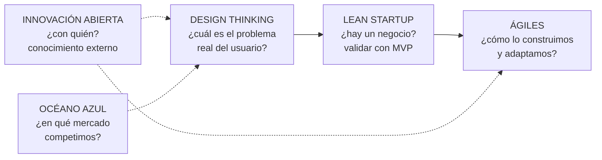

# 28 · Metodologías de innovación: en qué se diferencian

> **Fuente en el material:** *Tecnología e Innovación – MRI viernes – Metodologías de Innovación repaso 2026*, diapositivas 1–10. ⚠️ **Esta presentación no está en tu carpeta `material-de-clase/`:** el contenido se transcribió del repo de un compañero ([Valenpl/tecnologia-e-innovacion-uade](https://github.com/Valenpl/tecnologia-e-innovacion-uade), tema 27). Si conseguís el PPT, conviene cotejarlo.
> **Prerrequisitos:** [13 Design Thinking](../parcial-1/13-design-thinking.md), [14 Innovación abierta](14-innovacion-abierta.md), [17 Lean Startup](17-lean-startup-y-mvp.md), [21 Océano Azul](21-estrategias-oceano-azul-y-canvas.md), [23 Metodologías ágiles](23-metodologias-agiles-y-scrum.md).
> **Tiempo estimado:** 30 min.
> **Resto de la materia · Tema 28** (repaso MRI viernes · Barrios). Es un **tema integrador**: no agrega metodologías nuevas, las **compara**.

> 📌 **Metodologías de innovación:** *"Procesos estructurados para **transformar ideas en valor real**."*

---

## 🎯 Objetivos de aprendizaje

1. **Diferenciar** las cinco metodologías por su **foco principal** y para qué son **ideales**.
2. Dar el **concepto clave**, los **pilares** y el **proceso** de cada una.
3. Elegir la metodología adecuada para un **caso** concreto.
4. Explicar la idea de **Drucker**: la innovación como **disciplina**.

---

## 🗺️ Esquema del tema

- **I. Comparativa de enfoques** (tabla de la cátedra)
- **II. Cada metodología en detalle**
  1. Design Thinking
  2. Lean Startup
  3. Metodologías Ágiles
  4. Innovación Abierta
  5. Estrategia del Océano Azul
- **III. Cómo se combinan**
- **IV. Cierre: la innovación como disciplina (Drucker)**

---

## 🧠 Mapa visual

---

## 📖 Desarrollo

## I. Comparativa de enfoques (tabla de la cátedra) 🔥

| Metodología | **Foco principal** | **Ideal para…** |
|---|---|---|
| **Design Thinking** (enfoque humano) | **Entender las necesidades profundas del usuario.** | Descubrir problemas y diseñar soluciones empáticas. |
| **Lean Startup** (validación de mercado) | **Reducir la incertidumbre y validar el negocio.** | Lanzar nuevos productos, servicios o emprendimientos. |
| **Metodologías Ágiles** (agilidad operativa) | **Optimizar la ejecución y la adaptación al cambio.** | Desarrollo de software y gestión eficiente de proyectos. |
| **Innovación Abierta** (ecosistemas externos) | **Apalancar conocimiento externo e interno.** | Organizaciones que buscan acelerar I+D de forma colectiva. |
| **Estrategia Océano Azul** (creación de mercados) | **Crear nuevos mercados sin competencia.** | Transformación estratégica y diferenciación radical. |

> 💡 **Cómo memorizarla:** cada metodología responde a **una pregunta distinta**. Design Thinking: *¿qué necesita el usuario?* · Lean Startup: *¿hay un negocio?* · Ágiles: *¿cómo lo ejecutamos?* · Innovación Abierta: *¿con quién?* · Océano Azul: *¿dónde competimos?*

---

## II. Cada metodología en detalle

### II.1 Design Thinking · [tema 13](../parcial-1/13-design-thinking.md)

- **Concepto clave:** metodología **centrada en las personas** que busca entender las **necesidades reales de los usuarios** para resolver problemas complejos a través del diseño.
- **Pilares:** empatía profunda con el usuario; enfoque experimental y visual; colaboración multidisciplinaria.
- **Proceso:** **Empatizar** (comprender las necesidades del usuario) → **Definir** (identificar el problema central) → **Idear** (generar una amplia gama de soluciones) → **Prototipar** (modelos económicos y rápidos) → **Evaluar** (probar con usuarios reales).

### II.2 Lean Startup · [tema 17](17-lean-startup-y-mvp.md)

- **Concepto clave:** método para lanzar negocios y productos **bajo condiciones de extrema incertidumbre**, priorizando el **aprendizaje validado** sobre la planificación rígida.
- **Pilares:** ciclo **Construir–Medir–Aprender**; **Desarrollo de Clientes** (*Customer Development*); **pivotar o perseverar** basado en datos.
- **Proceso:** **MVP** (versión básica para iniciar el aprendizaje) → **Medición** (cómo responden los clientes reales) → **Aprender** (pivotar o perseverar).

### II.3 Metodologías Ágiles · [tema 23](23-metodologias-agiles-y-scrum.md)

- **Concepto clave:** conjunto de marcos de trabajo (como **Scrum** o **Kanban**) basados en el **desarrollo iterativo e incremental**, donde los requisitos y las soluciones **evolucionan con el tiempo**.
- **Pilares:** individuos e interacciones sobre procesos; producto funcional sobre documentación; respuesta rápida ante el cambio.
- **Proceso:** **Planificación del Sprint** (objetivos a corto plazo) → **Sprints** (1–4 semanas, desarrollo enfocado y sin interrupciones) → **Dailies** (sincronización del equipo) → **Revisión y Retrospectiva** (análisis del incremento y mejora continua).

> ⚠️ Este repaso dice sprints de **1–4 semanas**; la clase de Metodologías Ágiles (tema 23) dice **1–6 semanas**. Si te lo preguntan: **ciclos cortos y fijos, de pocas semanas**.

### II.4 Innovación Abierta · [tema 14](14-innovacion-abierta.md)

- **Concepto clave:** término acuñado por **Henry Chesbrough** que promueve que las empresas vayan **más allá de sus límites internos** y colaboren con profesionales, universidades o startups.
- **Pilares:** el conocimiento valioso está **distribuido globalmente**; no se necesita originar la investigación para beneficiarse de ella; integrar flujos internos y externos.
- **Proceso:** **Inbound** (traer tecnologías o ideas externas) → **Outbound** (comercializar activos internos no utilizados) → **Ecosistema de alianzas** (redes con startups y universidades).

### II.5 Estrategia del Océano Azul · [tema 21](21-estrategias-oceano-azul-y-canvas.md#vi-estrategia-del-océano-azul)

- **Concepto clave:** dejar de competir en mercados saturados (**océanos rojos**) creando **nuevos espacios de mercado** que hagan la competencia irrelevante.
- **Pilares:** **innovación en valor** (bajar costos y subir valor simultáneamente); creación de nueva demanda; diferenciación radical.
- **Proceso:** **Cuadro Estratégico** (diagnosticar la situación actual del mercado) → **Matriz ERAC**: **Eliminar** variables estándar, **Reducir** variables costosas, **Aumentar** beneficios clave, **Crear** nuevos atributos.

> 🔗 La **Matriz ERAC** es la **matriz de las cuatro acciones** del tema 21 (eliminar, reducir, incrementar, crear) con otro nombre.

> ➕ **Cuadro estratégico:** gráfico que pone en el eje horizontal los **factores en los que compite la industria** (precio, servicio, variedad…) y en el vertical **cuánto ofrece** cada competidor en cada factor. Sirve para ver que todos ofrecen "lo mismo" (océano rojo) y dónde se puede romper el patrón con ERAC.

---

## III. Cómo se combinan

No son excluyentes: suelen usarse **en secuencia** dentro de un mismo proyecto.

| Momento del proyecto | Metodología | Qué aporta |
|---|---|---|
| Elegir **dónde** competir | Océano Azul | Un mercado sin competencia directa. |
| Entender **el problema** | Design Thinking | El dolor real del usuario. |
| Validar **el negocio** | Lean Startup | Un MVP que prueba si alguien paga. |
| **Construir** la solución | Ágiles (Scrum) | Entregas iterativas y adaptación al cambio. |
| **Acelerar** con terceros | Innovación Abierta | Tecnología, talento o canales de afuera (inbound) y monetización de lo que sobra (outbound). |

> 🧩 **Ejemplo (➕, con el caso NEXA):** con **Design Thinking** entiende por qué los comercios chicos se van a ORBIT; con **Lean Startup** valida con un MVP una versión simple de NEXA Vision; con **Scrum** la desarrolla en sprints; con **Innovación Abierta** suma datos o algoritmos de una startup (inbound) y licencia su plataforma vieja (outbound); con **Océano Azul** busca un segmento donde no compita por precio con ORBIT.

---

## IV. Cierre: la innovación como disciplina

> 📌 **Peter Drucker**, considerado el padre del management moderno, publicó en 1985 en *Harvard Business Review* ***The Discipline of Innovation***: la innovación es un **trabajo organizado, enfocado y sistemático** que requiere tanto rigor como cualquier otra área de la empresa.
>
> *"La innovación **no es un evento fortuito**, es un **proceso disciplinado**."*

> 📝 **Citar y explayarse:** Las metodologías de innovación son *"procesos estructurados para transformar ideas en valor real"*, y cada una pone el foco en algo distinto. **Design Thinking** se centra en el **usuario**: entender sus necesidades profundas para descubrir el problema correcto. **Lean Startup** se centra en la **incertidumbre**: validar el negocio con un MVP y decidir con datos si pivotar o perseverar. Las **metodologías ágiles** se centran en la **ejecución**: desarrollo iterativo en sprints y adaptación al cambio. La **innovación abierta** se centra en el **ecosistema**: aprovechar conocimiento externo e interno mediante flujos inbound y outbound. El **Océano Azul** se centra en el **mercado**: crear espacios nuevos sin competencia con la matriz ERAC. Todas comparten la idea de Drucker: la innovación *"no es un evento fortuito, es un proceso disciplinado"*.

---

## ⚠️ Conceptos que se confunden

| Se confunde… | …con | Diferencia |
|---|---|---|
| Design Thinking | Lean Startup | DT busca **el problema correcto** (necesidad del usuario); Lean valida **el negocio** (¿alguien paga?). |
| Lean Startup | Ágiles | Lean decide **qué** construir según el aprendizaje del mercado; Ágiles organiza **cómo** construirlo en sprints. |
| Innovación Abierta | Océano Azul | IA trata de **con quién** innovar (ecosistema); Océano Azul, de **en qué mercado** competir. |
| Matriz ERAC | Matriz de las cuatro acciones | Son **la misma**: eliminar, reducir, aumentar/incrementar, crear. |
| Sprint (repaso: 1–4 semanas) | Sprint (clase de Ágiles: 1–6 semanas) | Misma idea: ciclo **corto y fijo**. |

---

## 🔗 Conexiones

Este tema **resume y compara** los temas [13](../parcial-1/13-design-thinking.md), [14](14-innovacion-abierta.md), [17](17-lean-startup-y-mvp.md), [21](21-estrategias-oceano-azul-y-canvas.md) y [23](23-metodologias-agiles-y-scrum.md). La frase de Drucker también cierra la sección de pensamiento divergente y convergente del tema [14](14-innovacion-abierta.md#x-pensamiento-divergente-y-convergente).

---

## ✍️ Autoevaluación

**1. ¿Cuál es el foco principal de cada metodología de innovación?**

Ver respuesta

Design Thinking: entender las necesidades profundas del usuario. Lean Startup: reducir la incertidumbre y validar el negocio. Ágiles: optimizar la ejecución y la adaptación al cambio. Innovación Abierta: apalancar conocimiento externo e interno. Océano Azul: crear nuevos mercados sin competencia.

**2. ¿Qué metodología conviene para lanzar un emprendimiento nuevo y cuál para gestionar el desarrollo de software?**

Ver respuesta

Lanzar un emprendimiento: **Lean Startup** (ideal para lanzar nuevos productos, servicios o emprendimientos). Desarrollo de software: **Metodologías Ágiles** (ideales para desarrollo de software y gestión eficiente de proyectos).

**3. Una corporación quiere acelerar su I+D trabajando con universidades y startups. ¿Qué metodología aplica y cuál es su proceso?**

Ver respuesta

**Innovación Abierta.** Proceso: **inbound** (traer tecnologías o ideas externas) → **outbound** (comercializar activos internos no utilizados) → **ecosistema de alianzas** (redes con startups y universidades).

**4. ¿Qué es la Matriz ERAC y a qué metodología pertenece?**

Ver respuesta

Pertenece a la **Estrategia del Océano Azul**: **Eliminar** variables estándar, **Reducir** variables costosas, **Aumentar** beneficios clave y **Crear** nuevos atributos. Es la matriz de las cuatro acciones; se aplica después del **cuadro estratégico**.

**5. Nombre los pilares de Lean Startup y de Design Thinking.**

Ver respuesta

**Lean Startup:** ciclo Construir–Medir–Aprender; Desarrollo de Clientes; pivotar o perseverar basado en datos. **Design Thinking:** empatía profunda con el usuario; enfoque experimental y visual; colaboración multidisciplinaria.

**6. ¿Qué planteó Peter Drucker sobre la innovación?**

Ver respuesta

En *The Discipline of Innovation* (HBR, 1985) planteó que la innovación es un trabajo organizado, enfocado y sistemático: *"no es un evento fortuito, es un proceso disciplinado"*.

---

[← 27 Análisis financiero y estrategias de salida](27-analisis-financiero-y-estrategias-de-salida.md) · [🏠 Índice](../README.md)
